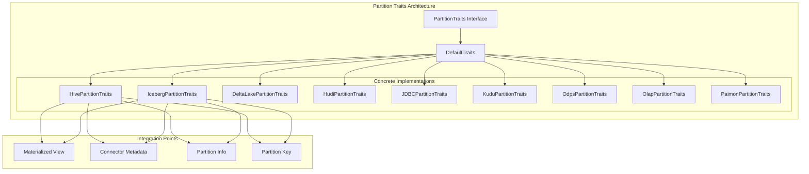
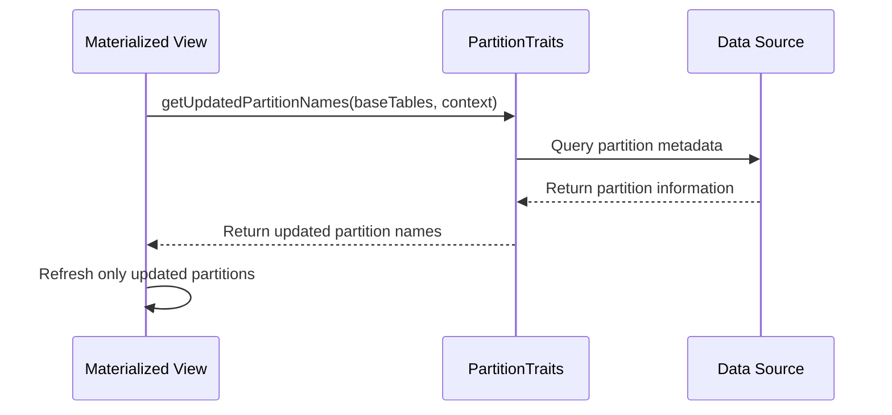
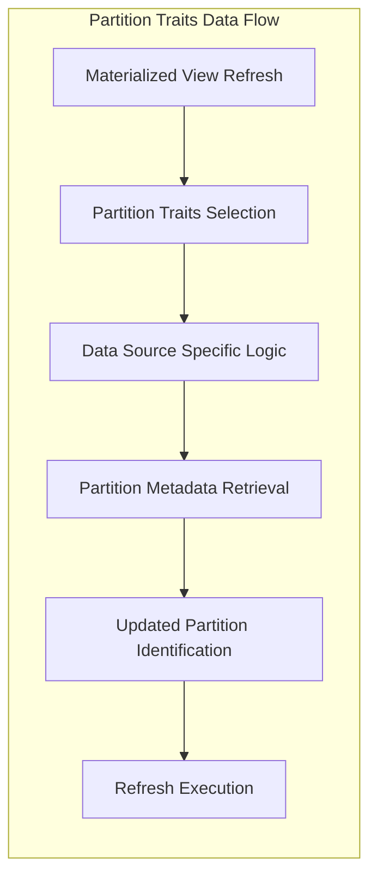

# Partition Traits Module Documentation

## Overview

The `partition_traits` module is a critical component of StarRocks' connector framework that provides a unified abstraction layer for handling partition operations across different data sources. This module implements the Strategy pattern to encapsulate partition-specific behaviors for various external table types, enabling consistent partition management regardless of the underlying data source.

## Purpose and Core Functionality

The primary purpose of the partition_traits module is to:

1. **Abstract Partition Operations**: Provide a common interface for partition-related operations across different data sources (Hive, Iceberg, Delta Lake, Hudi, etc.)
2. **Enable PCT Refresh**: Support Partition Change Tracking (PCT) refresh for materialized views by identifying updated partitions
3. **Handle Partition Key Management**: Create and manage partition keys specific to each data source type
4. **Facilitate Metadata Operations**: Support partition metadata retrieval and transformation

## Architecture Overview

## Key Components

### 1. Base Abstraction Layer
- **DefaultTraits**: Provides default implementations for common partition operations
- **PartitionTraits Interface**: Defines the contract for all partition-specific behaviors

### 2. Data Source Specific Implementations
Each implementation handles the unique characteristics of its respective data source:

- **HivePartitionTraits**: Manages Hive table partitions with full PCT refresh support
- **IcebergPartitionTraits**: Handles Iceberg table partitions with snapshot-based tracking
- **DeltaLakePartitionTraits**: Manages Delta Lake partitions (limited PCT support)
- **HudiPartitionTraits**: Handles Hudi table partitions
- **JDBCPartitionTraits**: Manages partitions for JDBC-connected databases
- **KuduPartitionTraits**: Handles Kudu table partitions
- **OdpsPartitionTraits**: Manages ODPS (MaxCompute) partitions
- **OlapPartitionTraits**: Handles internal OLAP table partitions
- **PaimonPartitionTraits**: Manages Paimon table partitions

## Core Functionality

### Partition Change Tracking (PCT) Refresh

### Partition Key Management

Each traits implementation provides:
- **createEmptyKey()**: Creates an empty partition key specific to the data source
- **createPartitionKey()**: Constructs partition keys from values and column definitions
- **getPartitionNames()**: Retrieves available partition names

### Metadata Operations

- **getPartitions()**: Retrieves detailed partition information
- **maxPartitionRefreshTs()**: Gets the latest partition modification timestamp
- **getTableLastUpdateTime()**: Determines when the table was last updated

## Data Flow

## Integration with Other Modules

The partition_traits module integrates with several other StarRocks modules:

- **[connector_framework](connector_framework.md)**: Provides the overall connector infrastructure
- **[catalog](catalog.md)**: Manages table and partition metadata
- **[materialized_views](materialized_views.md)**: Enables efficient MV refresh strategies
- **[query_execution](query_execution.md)**: Supports partition pruning and optimization

## Sub-modules

The partition_traits module contains several specialized sub-modules:

### [delta_lake_partition_traits](delta_lake_partition_traits.md)
Handles partition operations for Delta Lake tables, including support for time-based partitioning and snapshot isolation.

### [hive_partition_traits](hive_partition_traits.md)
Manages Hive table partitions with comprehensive PCT refresh support and Metastore integration.

### [iceberg_partition_traits](iceberg_partition_traits.md)
Provides advanced partition management for Iceberg tables, including snapshot-based tracking and schema evolution support.

### [jdbc_partition_traits](jdbc_partition_traits.md)
Handles partition operations for JDBC-connected databases with range partition support.

### [olap_partition_traits](olap_partition_traits.md)
Manages internal OLAP table partitions with version-based change tracking.

### [paimon_partition_traits](paimon_partition_traits.md)
Provides partition management for Paimon tables with last-modified-time tracking.

### Additional Trait Implementations

The module also includes implementations for other data sources:

- **HudiPartitionTraits**: Manages Hudi table partitions with limited PCT refresh support
- **KuduPartitionTraits**: Handles Kudu table partitions
- **OdpsPartitionTraits**: Manages ODPS (MaxCompute) table partitions

## Configuration and Usage

The partition traits are automatically selected based on the table type during query planning and materialized view refresh operations. Each implementation can be configured through:

- Connector-specific configuration parameters
- Session variables for partition refresh behavior
- Catalog-level settings for partition management

## Performance Considerations

- **PCT Refresh Efficiency**: Only updated partitions are refreshed, significantly reducing refresh time
- **Metadata Caching**: Partition metadata is cached to reduce repeated data source queries
- **Parallel Processing**: Multiple partitions can be processed concurrently
- **Incremental Updates**: Supports incremental partition updates for large tables

## Error Handling

The module implements robust error handling for:
- Data source connectivity issues
- Partition metadata inconsistencies
- Schema evolution conflicts
- Permission and access control problems

## Future Enhancements

Planned improvements include:
- Enhanced PCT refresh support for more data sources
- Improved partition pruning algorithms
- Better integration with cloud storage systems
- Support for complex partitioning schemes
- Enhanced monitoring and diagnostics