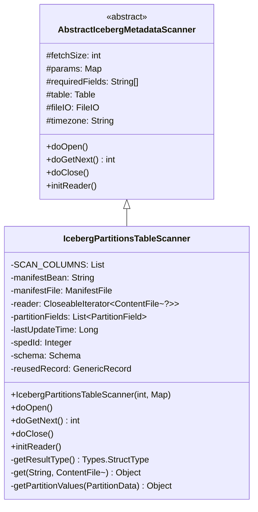
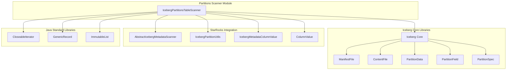
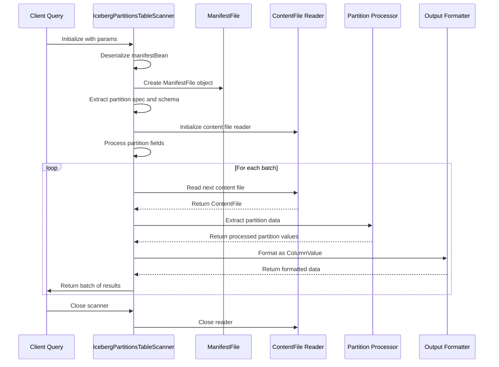
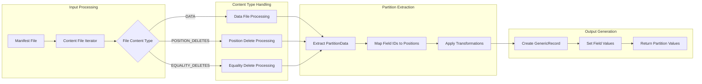
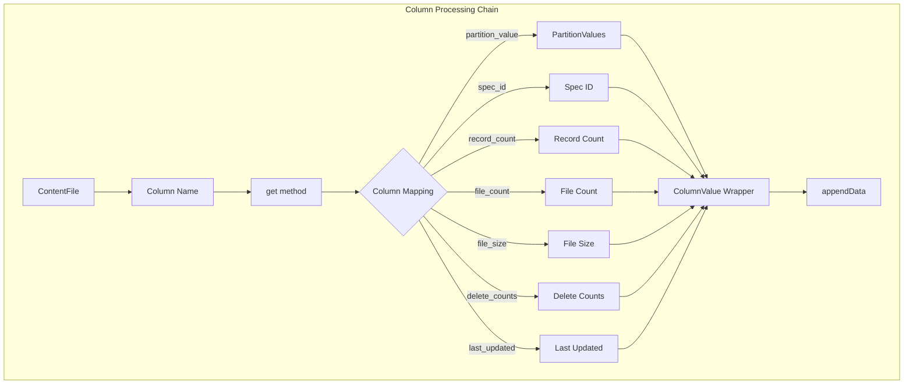

# Partitions Scanner Module Documentation

## Overview

The partitions_scanner module is a specialized component within the StarRocks Iceberg connector ecosystem, designed to scan and process partition metadata from Iceberg tables. This module provides functionality to read partition information from Iceberg manifest files and convert it into a structured format suitable for query processing and metadata operations.

## Purpose and Core Functionality

The primary purpose of the partitions_scanner module is to:

1. **Extract partition metadata** from Iceberg manifest files
2. **Process partition data** across different file content types (data files, position deletes, equality deletes)
3. **Transform partition information** into a standardized format for StarRocks query engine
4. **Support metadata table queries** for Iceberg partition information

The module serves as a bridge between Iceberg's native partition format and StarRocks' query processing requirements, enabling efficient partition pruning and metadata-based optimizations.

## Architecture and Component Structure

### Core Component: IcebergPartitionsTableScanner

The module is built around the `IcebergPartitionsTableScanner` class, which extends `AbstractIcebergMetadataScanner` and implements the core scanning functionality.

### Key Dependencies and Integration Points

## Data Flow and Processing Pipeline

### Scanning Process Flow

### Partition Data Processing

## Component Relationships and Interactions

### Integration with Iceberg Ecosystem

The partitions_scanner module integrates with several key components of the Iceberg connector framework:

1. **IcebergPartitionUtils**: Provides utility functions for partition field extraction and processing
2. **AbstractIcebergMetadataScanner**: Base class providing common scanning functionality
3. **IcebergMetadataColumnValue**: Handles conversion of Iceberg data types to StarRocks column values

### Column Processing and Type Mapping

## Key Features and Capabilities

### 1. Multi-Content Type Support
The scanner handles different types of Iceberg files:
- **Data files**: Regular data content with partition information
- **Position delete files**: Delete operations with positional information
- **Equality delete files**: Delete operations with equality conditions

### 2. Partition Transformation Support
Supports various Iceberg partition transformations:
- Identity transformations
- Timestamp-based transformations (with timezone handling)
- Custom partition field mappings

### 3. Batch Processing
Implements efficient batch processing with configurable fetch sizes for optimal memory usage and performance.

### 4. Schema Evolution Handling
Adapts to schema changes by dynamically processing partition specs and field mappings.

## Configuration and Parameters

### Required Parameters
- `split_info`: Base64-encoded manifest file information
- `fetch_size`: Number of records to process in each batch

### Optional Parameters
- Timezone settings for timestamp transformations
- Field selection for specific partition columns

## Error Handling and Edge Cases

### Exception Handling
- **IOException**: Handled during reader operations and resource cleanup
- **IllegalArgumentException**: Thrown for unrecognized column names
- **NullPointerException**: Protected through null checks in data processing

### Edge Case Management
- **Missing partition fields**: Handled by setting null values
- **Schema mismatches**: Resolved through dynamic field mapping
- **Empty manifests**: Gracefully handled with empty iterator results

## Performance Considerations

### Memory Management
- **Reused GenericRecord**: Minimizes object allocation
- **Batch processing**: Configurable fetch size for memory optimization
- **Resource cleanup**: Proper closing of iterators and readers

### Processing Optimization
- **Selective column reading**: Only reads required columns from manifest files
- **Case-insensitive matching**: Improves query compatibility
- **Efficient field mapping**: HashMap-based field ID to position mapping

## Integration with StarRocks Query Engine

The partitions_scanner module serves as a critical component in StarRocks' Iceberg integration, enabling:

1. **Partition pruning**: Efficient elimination of unnecessary partitions during query planning
2. **Metadata queries**: Support for system tables and information schema queries
3. **Query optimization**: Providing partition statistics for cost-based optimization

## Dependencies on Other Modules

The partitions_scanner module relies on several other StarRocks components:

- **[iceberg_metadata_reader](iceberg_metadata_reader.md)**: Parent module providing base scanning functionality
- **[java_extensions](java_extensions.md)**: Framework for Java-based extensions and connectors
- **[connectors](connectors.md)**: Core connector infrastructure and utilities

## Future Enhancements

Potential areas for improvement include:

1. **Parallel processing**: Multi-threaded partition scanning for large tables
2. **Caching mechanisms**: Intelligent caching of partition metadata
3. **Advanced filtering**: Pushdown of partition predicates to the scanner level
4. **Metrics collection**: Enhanced monitoring and performance metrics

## Conclusion

The partitions_scanner module represents a specialized but essential component in StarRocks' Iceberg connector architecture. By providing efficient partition metadata extraction and processing capabilities, it enables the query engine to make intelligent decisions about data access patterns, ultimately improving query performance and resource utilization. The module's design emphasizes flexibility, performance, and robustness, making it well-suited for production environments with diverse Iceberg table configurations.