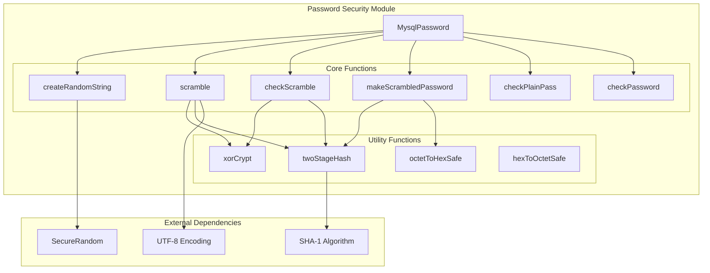
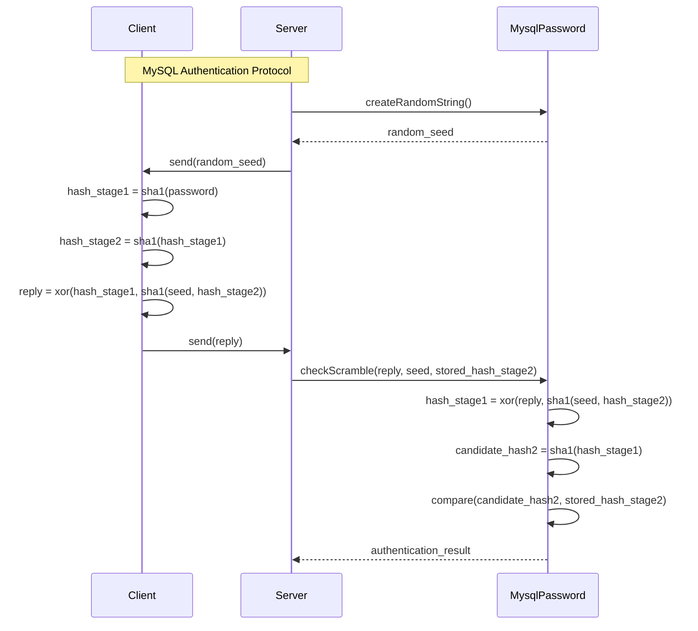
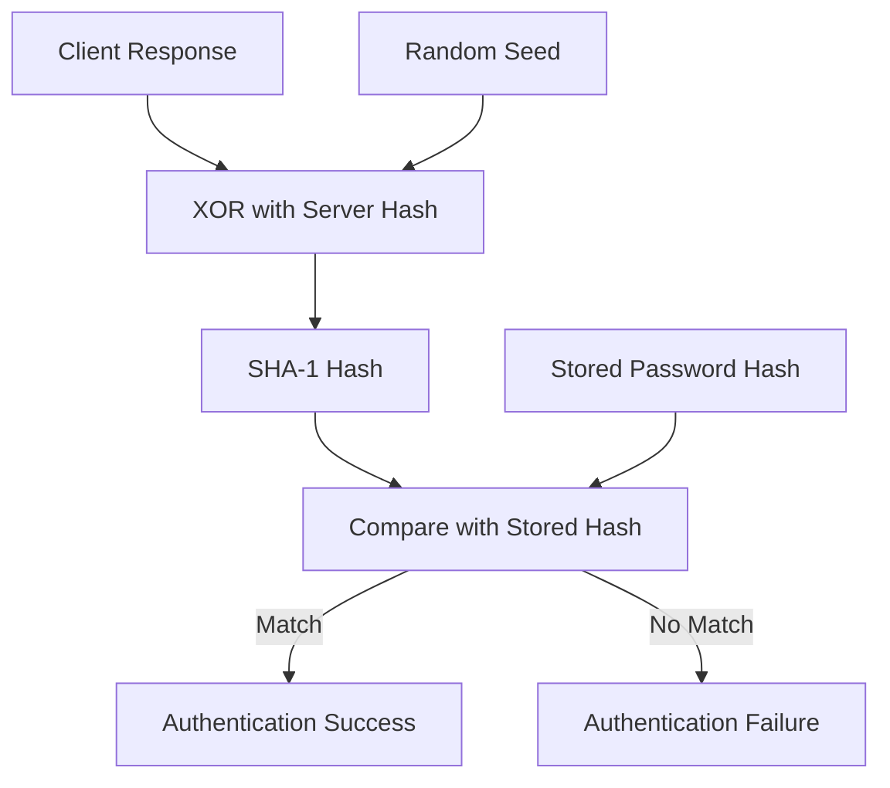

# Password Security Module Documentation

## Introduction

The password_security module provides secure password handling and authentication functionality for StarRocks, implementing MySQL-compatible password encryption and verification mechanisms. This module ensures that passwords are never stored or transmitted in plain text, using industry-standard cryptographic techniques to protect user credentials.

## Module Overview

The password_security module is part of the MySQL protocol implementation within StarRocks, providing essential password security features including:

- Password hashing and scrambling using SHA-1 algorithm
- MySQL-compatible authentication protocol implementation
- Secure random challenge generation for authentication
- Password validation and verification
- Hexadecimal encoding/decoding for password storage

## Core Architecture

### Component Structure



### Authentication Flow



## Core Components

### MysqlPassword Class

The `MysqlPassword` class is the main component that implements all password security functionality. It provides static methods for password operations and maintains constants used throughout the authentication process.

#### Key Constants

- `EMPTY_PASSWORD`: Empty byte array representing no password
- `SCRAMBLE_LENGTH`: Length of the random challenge string (20 bytes)
- `SCRAMBLE_LENGTH_HEX_LENGTH`: Length of hex-encoded password (41 characters)
- `PVERSION41_CHAR`: MySQL password version identifier ('*')

#### Core Methods

##### Password Creation and Hashing

```java
// Creates a scrambled password from plain text for storage
public static byte[] makeScrambledPassword(String plainPasswd)

// Performs two-stage SHA-1 hashing (internal method)
private static byte[] twoStageHash(String password)
```

##### Authentication Methods

```java
// Generates random challenge string for authentication
public static byte[] createRandomString()

// Creates scrambled response from password and seed
public static byte[] scramble(byte[] seed, String password)

// Verifies scrambled response against stored password hash
public static boolean checkScramble(byte[] scramble, byte[] message, byte[] hashStage2)

// Validates plain password against stored scrambled password
public static boolean checkPlainPass(byte[] scrambledPass, String plainPass)
```

##### Validation Methods

```java
// Validates password format and converts to proper format
public static byte[] checkPassword(String passwdString)

// Compares two scrambled passwords for equality
public static boolean checkScrambledPlainPass(byte[] savedScrambledPass, byte[] scrambledPlainPass)
```

## Security Implementation

### Password Hashing Algorithm

The module implements a two-stage SHA-1 hashing algorithm compatible with MySQL:

1. **Stage 1**: `hash_stage1 = SHA1(password)`
2. **Stage 2**: `hash_stage2 = SHA1(hash_stage1)`

The final stored password is the hex-encoded representation of `hash_stage2` prefixed with '*'.

### Authentication Protocol

The authentication uses a challenge-response mechanism:

1. Server generates a random 20-byte challenge string
2. Client computes response using password and challenge
3. Server verifies response without ever seeing the plain password

### Cryptographic Operations

#### XOR Encryption
```java
private static byte[] xorCrypt(byte[] s1, byte[] s2)
```

Performs byte-wise XOR operation used in the authentication protocol to combine hash values securely.

#### Hexadecimal Conversion
```java
private static void octetToHexSafe(byte[] to, int toOff, byte[] from)
private static void hexToOctetSafe(byte[] to, byte[] from, int fromOff)
```

Converts between binary and hexadecimal representations for password storage and transmission.

## Data Flow

### Password Storage Flow


### Authentication Verification Flow



## Integration Points

### MySQL Protocol Integration

The password_security module integrates with the broader MySQL protocol implementation:

- **Authentication Handler**: Uses `MysqlPassword` for credential verification
- **Protocol Encoding**: Integrates with `MysqlCodec` for secure transmission
- **Privilege System**: Works with `Password` class in the privilege module

### Error Handling

The module integrates with StarRocks error reporting:

- Uses `ErrorReportException` for password validation errors
- Reports `ERR_PASSWD_LENGTH` for invalid password formats
- Provides detailed error messages for debugging

## Security Considerations

### Cryptographic Strength

- Uses SHA-1 algorithm (MySQL compatibility requirement)
- Implements secure random number generation with `SecureRandom`
- Never stores or transmits passwords in plain text

### Password Storage

- Passwords are stored as hex-encoded hashes with version prefix
- Original passwords cannot be recovered from stored hashes
- Empty passwords are handled as special cases

### Authentication Security

- Challenge-response mechanism prevents replay attacks
- Random challenge ensures unique authentication sessions
- Server never sees plain password during authentication

## Dependencies

### External Libraries

- **Java Security**: `MessageDigest` for SHA-1 hashing
- **SecureRandom**: Cryptographically secure random number generation
- **Google Guava**: Utility functions for string handling

### Internal Dependencies

- **Error Handling**: `ErrorReportException`, `ErrorCode`
- **Logging**: Apache Log4j for security event logging
- **String Utilities**: `Strings` from Google Guava

## Usage Examples

### Creating a Scrambled Password

```java
String plainPassword = "user_password";
byte[] scrambledPassword = MysqlPassword.makeScrambledPassword(plainPassword);
// Store scrambledPassword in database
```

### Verifying Authentication

```java
byte[] clientResponse = // received from client
byte[] randomSeed = // generated challenge
byte[] storedPasswordHash = // from database

boolean isAuthenticated = MysqlPassword.checkScramble(
    clientResponse, randomSeed, storedPasswordHash
);
```

### Validating Password Format

```java
String passwordString = "*5AD8F553EC1D4E9AA0E92C69960B9C2B9B3B0E1E";
try {
    byte[] validatedPassword = MysqlPassword.checkPassword(passwordString);
    // Password format is valid
} catch (ErrorReportException e) {
    // Handle invalid password format
}
```

## Performance Characteristics

### Time Complexity

- Password hashing: O(n) where n is password length
- Authentication verification: O(1) - constant time operations
- Random string generation: O(1) - fixed 20-byte generation

### Memory Usage

- Minimal memory footprint for password operations
- Temporary byte arrays for cryptographic operations
- No persistent state maintained

## Error Handling

### Validation Errors

- `ERR_PASSWD_LENGTH`: Invalid password length or format
- `NoSuchAlgorithmException`: SHA-1 algorithm not available
- `NullPointerException`: Null password inputs

### Security Error Handling

- Graceful degradation when cryptographic operations fail
- Detailed logging for security audit trails
- Safe handling of malformed input data

## References

- [MySQL Protocol Documentation](mysql_protocol.md) - For broader MySQL protocol integration
- [Authentication System](authentication_authorization.md) - For authentication framework details
- [Frontend Server](frontend_server.md) - For server-side integration context

## Conclusion

The password_security module provides a robust, MySQL-compatible password security implementation that ensures secure authentication without exposing plain text passwords. Its challenge-response mechanism and cryptographic hashing provide strong security guarantees while maintaining compatibility with existing MySQL client libraries and tools.