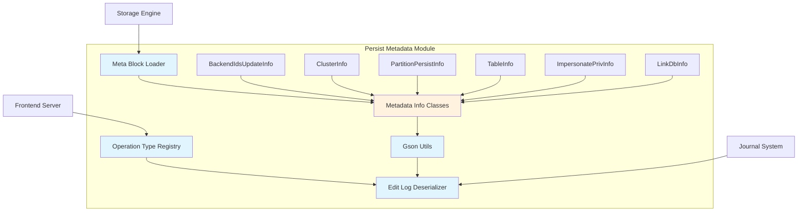
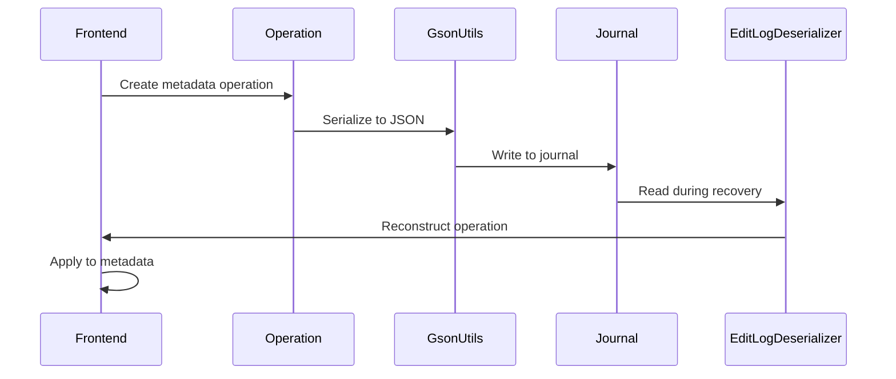

# Persist Metadata Module Documentation

## Overview

The `persist_metadata` module is a critical component of the StarRocks database system responsible for managing the persistence of metadata operations. This module ensures that all metadata changes are properly serialized, stored, and can be recovered during system restarts or failures. It forms the backbone of StarRocks' metadata durability and consistency guarantees.

## Purpose and Core Functionality

The primary purpose of the persist_metadata module is to:

1. **Serialize Metadata Operations**: Convert complex metadata objects into storable formats
2. **Manage Operation Types**: Define and categorize all possible metadata operations
3. **Handle Deserialization**: Restore metadata objects from persistent storage
4. **Ensure Data Consistency**: Provide transactional guarantees for metadata changes
5. **Support Recovery**: Enable system recovery through replay of persisted operations

## Architecture Overview



## Core Components

### 1. Operation Type Management
The module defines a comprehensive set of operation types that cover all metadata-changing operations in StarRocks. These operations range from basic CRUD operations to complex schema changes and privilege management.

### 2. Serialization Framework
Utilizes Google's Gson library with custom adapters to handle complex object hierarchies, polymorphic types, and special data structures like Guava collections.

### 3. Deserialization Engine
The `EditLogDeserializer` serves as the central component for reconstructing metadata objects from their serialized forms, supporting both legacy and modern formats.

### 4. Metadata Information Classes
Specialized classes that encapsulate specific types of metadata changes, providing structured data containers for different operation categories.

## Sub-modules

### [metadata_info_classes](metadata_info_classes.md)
Contains specialized data structures for different types of metadata operations:
- **BackendIdsUpdateInfo**: Manages backend node identification updates
- **ClusterInfo**: Handles cluster-level configuration changes
- **PartitionPersistInfo**: Manages partition metadata persistence
- **TableInfo**: Handles table-level operations (rename, schema changes)
- **ImpersonatePrivInfo**: Manages privilege impersonation data
- **LinkDbInfo**: Handles database linking operations (deprecated)

**See**: [metadata_info_classes.md](metadata_info_classes.md) for detailed documentation

### [operation_type_registry](operation_type_registry.md)
Defines and manages all operation types in the system:
- Comprehensive operation type constants
- Categorization by functionality (DDL, DML, privilege, etc.)
- Version management and compatibility handling
- Ignorable operation classification for error recovery

**See**: [operation_type_registry.md](operation_type_registry.md) for detailed documentation

### [serialization_framework](serialization_framework.md)
Provides advanced serialization capabilities:
- **GsonUtils**: Central utility with custom type adapters
- Runtime type adaptation for polymorphic objects
- Special handling for complex data structures
- Thread-safe serialization with preprocessing hooks

**See**: [serialization_framework.md](serialization_framework.md) for detailed documentation

### [deserialization_engine](deserialization_engine.md)
Handles reconstruction of metadata objects:
- **EditLogDeserializer**: Main deserialization coordinator
- Operation type to class mapping
- Legacy format support
- Error handling and recovery mechanisms

**See**: [deserialization_engine.md](deserialization_engine.md) for detailed documentation

### [meta_block_loader](meta_block_loader.md)
Interface for loading metadata blocks during system initialization:
- **SRMetaBlockLoader**: Core interface for metadata loading
- Integration with storage engine initialization
- Exception handling for metadata corruption

**See**: [meta_block_loader.md](meta_block_loader.md) for detailed documentation

## Data Flow



## Integration Points

### Frontend Server Integration
The module integrates closely with the [frontend_server](../frontend_server.md) module, particularly:
- [Catalog Management](../frontend_server.md#catalog-management)
- [Transaction Processing](../frontend_server.md#transaction-processing)
- [Authentication and Authorization](../frontend_server.md#authentication-authorization)

### Storage Engine Integration
Works with the [storage_engine](../storage_engine.md) module for:
- Metadata persistence during write operations
- Recovery coordination after failures
- Consistency validation

### Journal System Integration
Coordinates with the [journal system](../frontend_server.md#journal) for:
- Operation logging
- Replay mechanisms
- Checkpoint creation

## Key Features

### 1. Comprehensive Operation Coverage
Supports over 200 different operation types covering all aspects of StarRocks metadata management.

### 2. Backward Compatibility
Maintains compatibility with older versions through dual-format support and migration mechanisms.

### 3. Error Resilience
Includes ignorable operation classification to handle corrupted or unknown operations during recovery.

### 4. Performance Optimization
Utilizes efficient serialization techniques and caching mechanisms for optimal performance.

### 5. Thread Safety
Provides thread-safe serialization with built-in synchronization mechanisms.

## Usage Patterns

### Basic Serialization
```java
// Serialize metadata object
String json = GsonUtils.GSON.toJson(metadataObject);

// Deserialize metadata object
MyClass obj = GsonUtils.GSON.fromJson(json, MyClass.class);
```

### Operation Type Registration
```java
// Register new operation type
public static final short OP_MY_NEW_OPERATION = 10000;

// Map to deserialization class
OPTYPE_TO_DESER_CLASS.put(OP_MY_NEW_OPERATION, MyOperationClass.class);
```

### Custom Type Adapters
```java
// Register custom adapter for complex types
GSON_BUILDER.registerTypeAdapterFactory(MY_TYPE_ADAPTER_FACTORY);
```

## Error Handling

The module implements comprehensive error handling strategies:

1. **Unknown Operations**: Configurable handling of unrecognized operation types
2. **Corruption Detection**: Validation during deserialization
3. **Recovery Mechanisms**: Graceful degradation for partial failures
4. **Logging**: Detailed logging for debugging and auditing

## Performance Considerations

- **Serialization Overhead**: Optimized adapters for complex types
- **Memory Usage**: Efficient handling of large metadata objects
- **Disk I/O**: Batch processing for journal operations
- **CPU Utilization**: Thread-safe operations with minimal contention

## Security Considerations

- **Data Integrity**: Checksums and validation during serialization/deserialization
- **Access Control**: Integration with privilege system for metadata operations
- **Audit Trail**: Comprehensive logging of all metadata changes
- **Encryption**: Support for encrypted storage of sensitive metadata

## Future Enhancements

Potential areas for improvement include:
- Enhanced compression for large metadata objects
- Streaming serialization for very large operations
- Incremental metadata updates
- Cross-region replication support
- Advanced caching mechanisms

## Related Documentation

- [Frontend Server Module](../frontend_server.md)
- [Storage Engine Module](../storage_engine.md)
- [Journal System Documentation](../frontend_server.md#journal)
- [Transaction Management](../frontend_server.md#transaction)
- [Authentication and Authorization](../frontend_server.md#authentication-authorization)