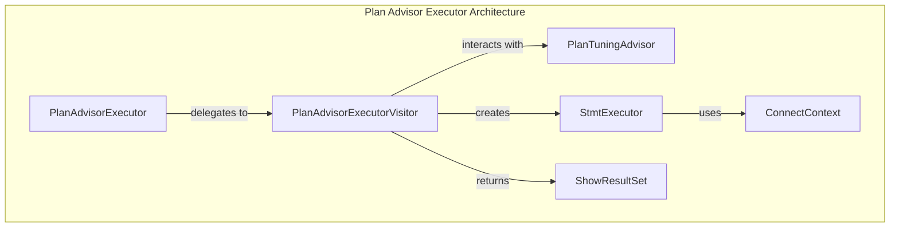
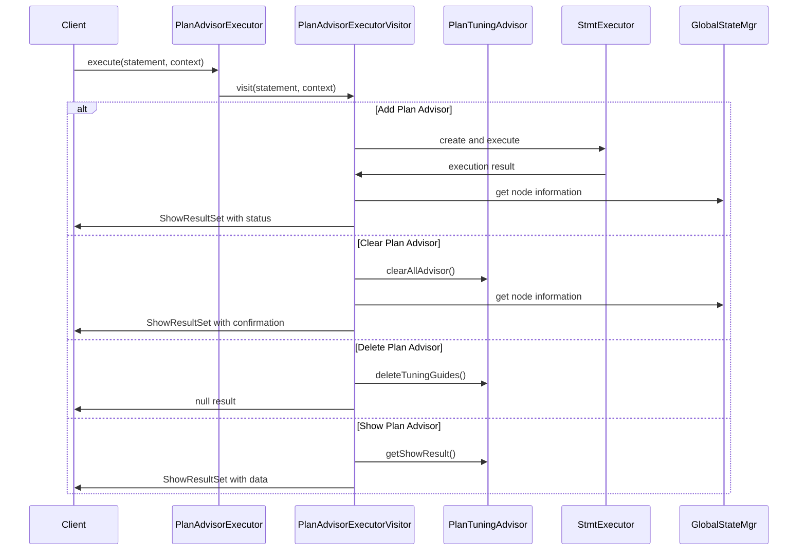
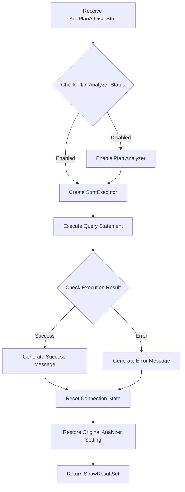
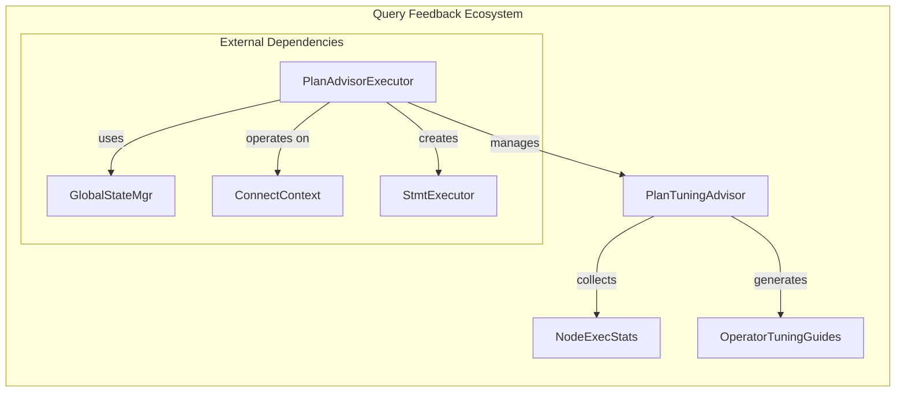

# Plan Advisor Executor Module

## Introduction

The Plan Advisor Executor module is a specialized component within StarRocks' query feedback system that manages the execution of plan advisor statements. It provides a centralized interface for adding, clearing, deleting, and showing query tuning recommendations generated by the system's plan analysis capabilities. This module serves as the command executor for the plan advisor feature, enabling database administrators and users to interact with automated query optimization recommendations.

## Module Overview

The Plan Advisor Executor acts as the bridge between SQL statements related to plan advisory functionality and the underlying PlanTuningAdvisor system. It processes various plan advisor commands and provides feedback on their execution status, making it an essential component for query performance optimization workflows in StarRocks.

## Core Architecture

### Component Structure

### Key Components

#### PlanAdvisorExecutor
The main entry point class that provides static methods for executing plan advisor statements. It uses the singleton pattern with a dedicated visitor instance to process different types of plan advisor commands.

#### PlanAdvisorExecutorVisitor
A specialized visitor implementation that handles specific plan advisor statement types:
- `AddPlanAdvisorStmt` - Adds queries to the plan advisor
- `ClearPlanAdvisorStmt` - Clears all plan advisor entries
- `DelPlanAdvisorStmt` - Deletes specific advisor entries
- `ShowPlanAdvisorStmt` - Displays plan advisor information

## Data Flow Architecture

## Statement Processing Flow

### Add Plan Advisor Statement Processing

### Result Set Metadata Structure

The module defines two types of result set metadata:

1. **Simple Message Metadata** (`COLUMN_META`):
   - Single column: "message" (STRING type)
   - Used for operation status messages

2. **Detailed Advisor Metadata** (`SHOW_RESULT_COLUMN_META`):
   - query_id: STRING - Unique identifier for the query
   - query: STRING - The SQL query text
   - query_time: STRING - Execution time information
   - tuning_guides: STRING - Optimization recommendations
   - avg_tuned_query_time: STRING - Average optimized execution time
   - optimized_query_count: STRING - Number of optimizations applied
   - is_useful: STRING - Whether the recommendation is useful
   - fe_node: STRING - Frontend node identifier

## Integration with Query Feedback System

## Error Handling and State Management

The module implements comprehensive error handling and state management:

1. **Session State Preservation**: The original plan analyzer setting is preserved and restored after operation
2. **Connection State Reset**: Connection state is reset after each operation to ensure clean subsequent operations
3. **Exception Handling**: Runtime exceptions are caught and re-thrown with appropriate context
4. **Error Message Formatting**: Detailed error messages include frontend node information for debugging

## Dependencies and Interactions

### Direct Dependencies
- **PlanTuningAdvisor**: Core advisor system for storing and managing tuning recommendations
- **StmtExecutor**: For executing query statements during add operations
- **GlobalStateMgr**: For accessing frontend node information and system state
- **ConnectContext**: For session management and variable control

### Related Modules
- [query_feedback](query_feedback.md): Parent module containing plan advisor functionality
- [frontend_server](frontend_server.md): Provides GlobalStateMgr and node management
- [sql_parser_optimizer](sql_parser_optimizer.md): Handles SQL statement parsing and AST processing

## Usage Patterns

### Administrative Operations
Database administrators use the plan advisor executor to:
1. Add problematic queries for analysis
2. Review generated tuning recommendations
3. Clear outdated advisor entries
4. Manage advisor lifecycle

### Automated Integration
The module integrates with StarRocks' automated query analysis pipeline to:
1. Capture slow or problematic queries
2. Generate optimization recommendations
3. Track recommendation effectiveness
4. Provide feedback for continuous improvement

## Performance Considerations

1. **Minimal Overhead**: The executor adds minimal overhead to query processing
2. **State Management**: Efficient session state management prevents memory leaks
3. **Result Caching**: Advisor results are cached in PlanTuningAdvisor for quick access
4. **Concurrent Access**: Thread-safe operations support concurrent administrative commands

## Security and Access Control

The plan advisor executor respects existing StarRocks security mechanisms:
- Session variable changes are temporary and scoped to the operation
- Advisor data access is controlled through standard privilege systems
- Node information exposure is limited to administrative contexts

This module serves as a critical component in StarRocks' query optimization infrastructure, providing the necessary interface for managing automated query tuning recommendations and enabling database administrators to leverage the system's built-in performance analysis capabilities.