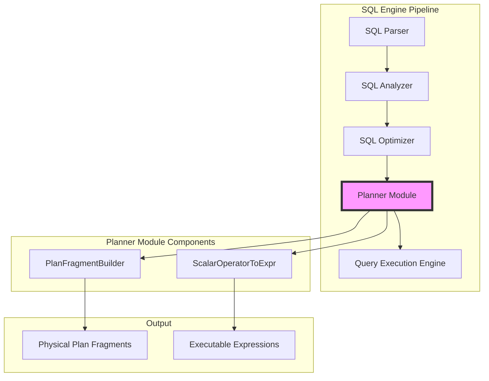
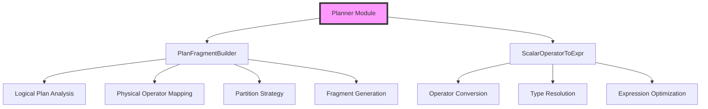
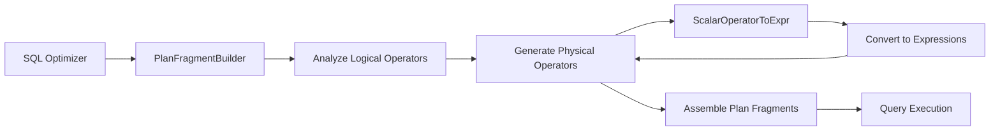
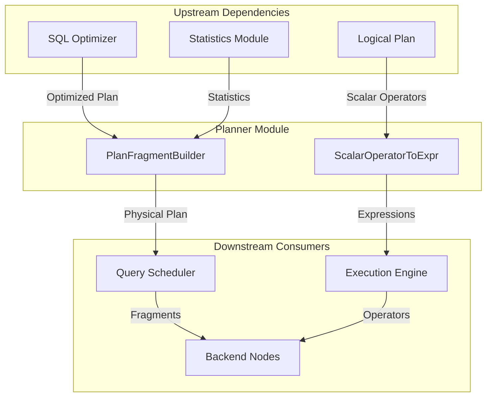
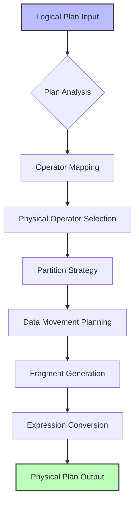

# Planner Module Documentation

## Introduction

The planner module is a critical component of the StarRocks SQL engine that transforms optimized logical query plans into executable physical execution plans. It serves as the bridge between the SQL optimizer and the query execution engine, converting abstract logical operators into concrete physical operations that can be distributed and executed across the cluster.

The planner module is responsible for:
- Converting logical query plans to physical execution plans
- Generating executable plan fragments
- Managing scalar operator to expression transformations
- Coordinating with the query execution framework

## Architecture Overview

### Component Hierarchy

## Core Components

### PlanFragmentBuilder

The `PlanFragmentBuilder` is the primary component responsible for converting optimized logical plans into physical execution plans. It takes the output from the SQL optimizer and generates plan fragments that can be distributed to backend nodes for execution.

**Key Responsibilities:**
- Transform logical operators to physical operators
- Generate distributed execution plans
- Create plan fragments with proper partitioning
- Optimize data movement strategies

**Integration Points:**
- Receives optimized logical plans from the optimizer module
- Coordinates with the query scheduler for fragment distribution
- Interfaces with execution nodes for physical operator selection

### ScalarOperatorToExpr

The `ScalarOperatorToExpr` component handles the conversion of scalar operators from the logical plan representation to executable expressions that can be evaluated during query execution.

**Key Responsibilities:**
- Convert scalar operators to executable expressions
- Handle type conversions and validations
- Generate expression trees for runtime evaluation
- Optimize expression evaluation paths

**Integration Points:**
- Works with the expression system in the backend
- Interfaces with the type system for type resolution
- Coordinates with runtime execution frameworks

## Data Flow Architecture

The planner module follows a sequential process to transform logical plans into physical execution plans:

**Process Flow:**
1. **SQL Optimizer** sends optimized logical plan to **PlanFragmentBuilder**
2. **PlanFragmentBuilder** analyzes logical operators and generates physical operators
3. **PlanFragmentBuilder** sends scalar operators to **ScalarOperatorToExpr**
4. **ScalarOperatorToExpr** converts operators to executable expressions
5. **ScalarOperatorToExpr** returns executable expressions to **PlanFragmentBuilder**
6. **PlanFragmentBuilder** assembles plan fragments
7. **PlanFragmentBuilder** sends physical execution plan to **Query Execution**

## Component Interactions

This diagram illustrates how the planner module interfaces with both upstream and downstream components in the SQL engine pipeline.

## Integration with SQL Engine

The planner module sits at a crucial junction in the SQL engine pipeline, connecting the optimization phase with the execution phase. Its integration points include:

### Upstream Integration
- **SQL Optimizer**: Receives optimized logical plans containing logical operators and cost estimates
- **Logical Plan**: Consumes logical operator trees with optimization metadata
- **Statistics Module**: Uses table and column statistics for physical plan decisions

### Downstream Integration
- **Query Scheduler**: Provides physical plan fragments for distribution
- **Execution Engine**: Supplies executable expressions and operators
- **Backend Nodes**: Generates node-specific execution instructions

## Plan Transformation Process

This process flow shows how the planner transforms logical plans through multiple stages to produce executable physical plans.

## Key Features

### Distributed Planning
The planner module generates distributed execution plans that can be executed across multiple backend nodes. It considers data distribution, network topology, and resource availability when creating plan fragments.

### Expression Optimization
Scalar expressions are optimized during the conversion process, including constant folding, common subexpression elimination, and type-specific optimizations.

### Adaptive Planning
The planner can generate multiple plan alternatives and select the most appropriate one based on runtime conditions and available statistics.

### Resource Awareness
Plan generation takes into account available system resources, including memory, CPU, and network bandwidth to create efficient execution strategies.

## Dependencies

### Internal Dependencies
- **SQL Optimizer Module**: Provides optimized logical plans and cost estimates
- **Statistics Module**: Supplies table and column statistics for plan decisions
- **Type System**: Handles type resolution and conversion
- **Expression Framework**: Supports expression evaluation and optimization

### External Dependencies
- **Query Execution Framework**: Consumes generated physical plans
- **Backend Services**: Executes distributed plan fragments
- **Storage Layer**: Provides data layout and access information

## Performance Considerations

### Plan Optimization
The planner applies various optimization techniques during physical plan generation:
- Operator reordering for better performance
- Partition pruning to minimize data movement
- Join algorithm selection based on data characteristics
- Aggregation strategy optimization

### Memory Management
Plan generation considers memory constraints and generates plans that work within available memory limits while maximizing performance.

### Scalability
The planner is designed to handle complex queries with large numbers of operators and generate efficient distributed execution plans.

## Error Handling

The planner module includes comprehensive error handling for:
- Invalid logical plans from the optimizer
- Unsupported operator combinations
- Resource constraint violations
- Type compatibility issues
- Expression evaluation errors

## Monitoring and Observability

The planner provides metrics and logging for:
- Plan generation time
- Plan complexity metrics
- Optimization decisions
- Resource usage estimates
- Plan execution statistics

## Future Enhancements

Potential areas for improvement include:
- Machine learning-based plan selection
- Adaptive query execution support
- Enhanced cost modeling
- Support for new execution strategies
- Integration with emerging hardware technologies

## Related Documentation

- [SQL Optimizer Module](optimizer.md) - Upstream module that provides optimized logical plans
- [Query Execution Module](query_execution.md) - Downstream module that executes generated physical plans
- [Statistics Module](statistics.md) - Provides statistical information used in plan generation
- [Expression System](expression_system.md) - Handles expression evaluation and optimization