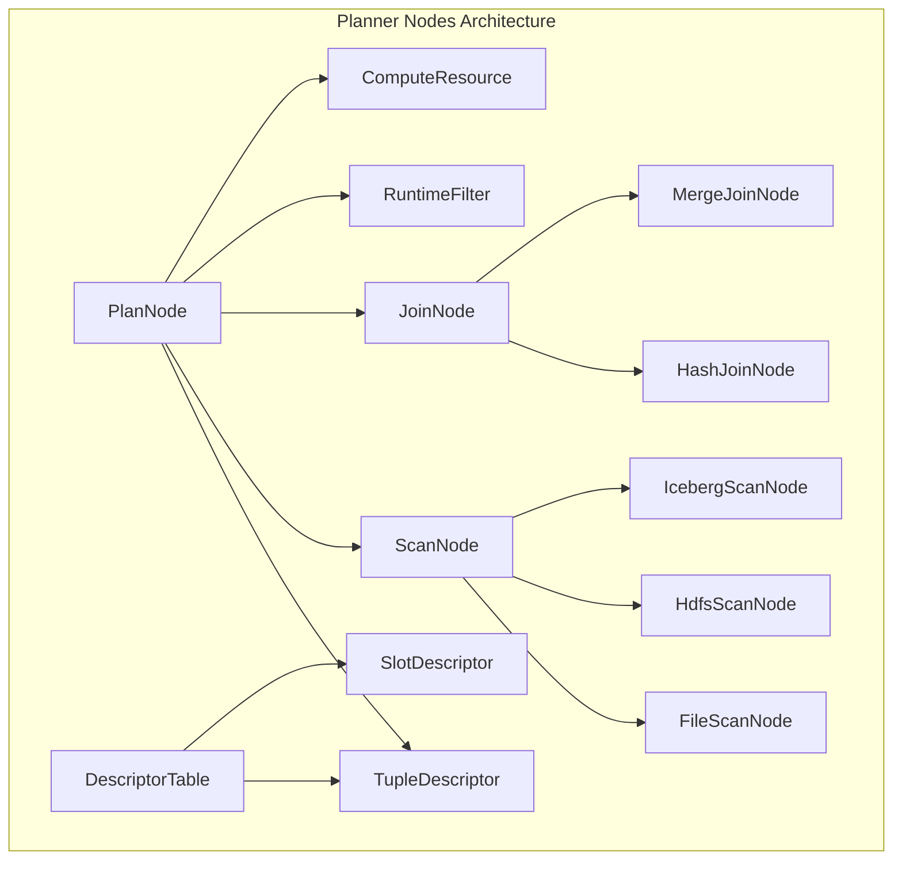

# Planner Nodes Module Documentation

## Overview

The `planner_nodes` module is a core component of StarRocks' query planning and execution system. It provides the foundational abstractions and implementations for representing query execution plans as a tree of nodes, where each node represents a specific operation in the query execution pipeline.

## Purpose and Core Functionality

The planner_nodes module serves as the bridge between the SQL optimizer and the physical execution engine. It transforms logical query plans into physical execution plans that can be distributed across the cluster and executed efficiently. The module handles:

- **Plan Representation**: Defines the hierarchical structure of query execution plans
- **Node Types**: Implements various physical operators like scans, joins, aggregations
- **Runtime Optimization**: Supports dynamic optimization through runtime filters and adaptive execution
- **Resource Management**: Coordinates with compute resources and manages scan ranges
- **Data Distribution**: Handles data partitioning and shuffling strategies

## Architecture Overview

## Core Components

### 1. PlanNode Hierarchy
The base abstraction for all physical operators in the execution plan:
- Manages tuple descriptors and slot references
- Handles predicate pushdown and runtime filter application
- Coordinates with compute resources for distributed execution

### 2. DescriptorTable
Central repository for managing tuple and slot descriptors:
- Assigns unique IDs to all descriptors
- Tracks referenced tables and partitions
- Manages memory layout computation for tuples

### 3. ScanNode Family
Base class for all data scanning operations:
- **FileScanNode**: Handles file-based data loading and scanning
- **ScanNode**: Abstract base for table scanning operations
- Supports various file formats (CSV, JSON, Parquet, ORC)

### 4. JoinNode Family
Implements distributed join operations:
- **JoinNode**: Abstract base for all join operations
- Supports multiple distribution modes (broadcast, partitioned, colocate)
- Implements runtime filter generation and pushdown

## Sub-modules

### Scan Operations
Handles data scanning from various sources including files, tables, and external systems. The scan operations module provides the foundation for reading data efficiently across different storage formats and sources.

**Key Components:**
- **ScanNode**: Abstract base class for all scan operations, providing common functionality for data access
- **FileScanNode**: Specialized node for file-based data loading with support for multiple formats (CSV, JSON, Parquet, ORC)
- **ParamCreateContext**: Internal context for parameter creation during scan initialization

**Features:**
- Vectorized file loading for improved performance
- Flexible column mapping and schema evolution
- Multi-format support with format-specific optimizations
- Runtime filter application during scanning

See [scan_operations.md](scan_operations.md) for detailed documentation.

### Join Operations
Implements distributed join algorithms with various optimization strategies. The join operations module is responsible for efficiently combining data from multiple sources according to join conditions.

**Key Components:**
- **JoinNode**: Abstract base class providing common join functionality
- **DistributionMode**: Enum defining various data distribution strategies (BROADCAST, PARTITIONED, COLOCATE, etc.)
- **RuntimeFilter Integration**: Dynamic filter generation and pushdown capabilities

**Features:**
- Multiple join algorithms (hash join, merge join, nested loop)
- Adaptive distribution mode selection based on data characteristics
- Runtime filter optimization to reduce data shuffling
- Support for all SQL join types (INNER, LEFT/RIGHT/FULL OUTER, SEMI, ANTI)

See [join_operations.md](join_operations.md) for detailed documentation.

### Descriptor Management
Manages metadata descriptors for tuples, slots, and tables. The descriptor management module provides the metadata infrastructure needed for query planning and execution.

**Key Components:**
- **DescriptorTable**: Central repository for managing all descriptors
- **ReferencedPartitionInfo**: Tracks partition information for optimized access
- **TupleDescriptor**: Describes the structure of tuples in the execution plan
- **SlotDescriptor**: Manages individual column/slot metadata

**Features:**
- Unique ID assignment for all descriptors
- Memory layout optimization for tuples
- Partition tracking for pruning optimizations
- Thrift serialization for distributed execution

See [descriptor_management.md](descriptor_management.md) for detailed documentation.

## Key Features

### Runtime Filter Optimization
- Dynamic filter generation during join execution
- Predicate pushdown to reduce data scanning
- Bloom filter and min/max filter support

### Adaptive Execution
- Dynamic partition pruning
- Runtime statistics collection
- Query plan adaptation based on data characteristics

### Resource Management
- Compute resource allocation and management
- Scan range distribution across cluster nodes
- Memory-aware execution planning

## Integration Points

### With Storage Engine
- Coordinates with [storage_engine.md](storage_engine.md) for data access
- Leverages [persistent_index.md](persistent_index.md) for efficient lookups
- Integrates with [rowset_management.md](rowset_management.md) for data organization

### With Query Execution
- Works with [query_execution.md](query_execution.md) for distributed execution
- Coordinates with [query_scheduler.md](query_scheduler.md) for task scheduling
- Integrates with [query_feedback.md](query_feedback.md) for performance optimization

### With SQL Parser/Optimizer
- Receives optimized plans from [sql_parser_optimizer.md](sql_parser_optimizer.md)
- Provides physical plan representation to execution engine
- Supports cost-based optimization decisions

## Performance Considerations

### Scan Optimization
- Column pruning to reduce I/O
- Partition pruning for selective queries
- Dictionary encoding for string columns
- Vectorized execution for batch processing

### Join Optimization
- Broadcast vs. partitioned join selection
- Runtime filter generation and application
- Colocate join for local execution
- Skew handling for data imbalance

### Memory Management
- Tuple memory layout optimization
- Runtime filter memory budgeting
- Scan range size optimization

## Configuration and Tuning

Key configuration parameters that affect planner node behavior:
- `enable_vectorized_file_load`: Enables vectorized file loading
- `min_bytes_per_broker_scanner`: Controls scan parallelism
- `global_runtime_filter_build_max_size`: Limits runtime filter size
- `hdfs_read_buffer_size_kb`: Optimizes HDFS read performance

## Future Enhancements

- Enhanced adaptive execution with machine learning
- Improved runtime filter optimization
- Better support for complex data types
- Advanced join algorithms for specific workloads