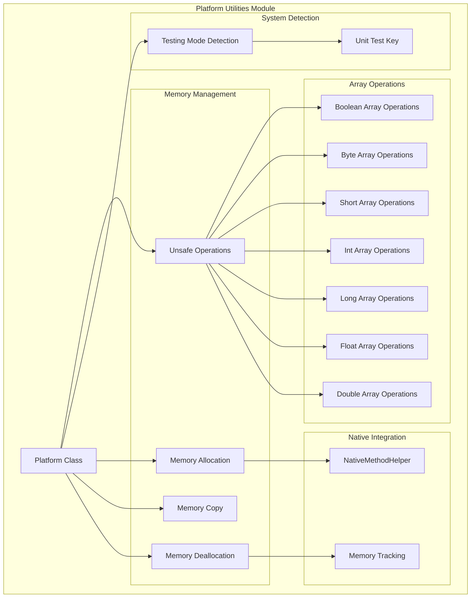
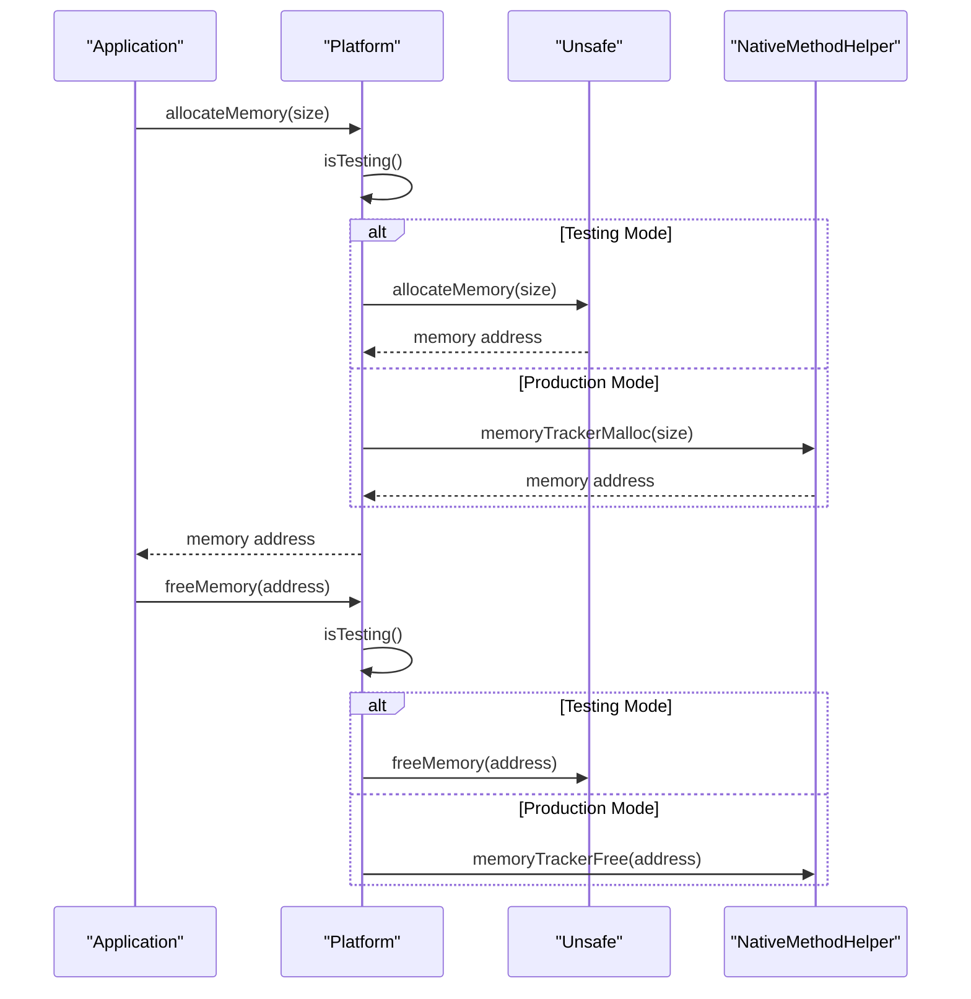
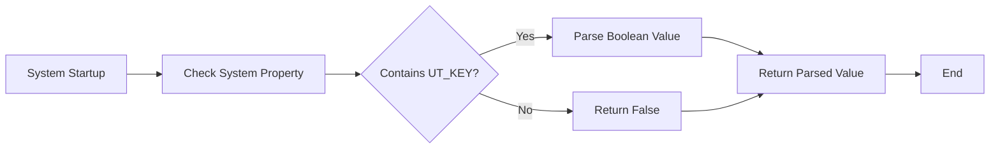
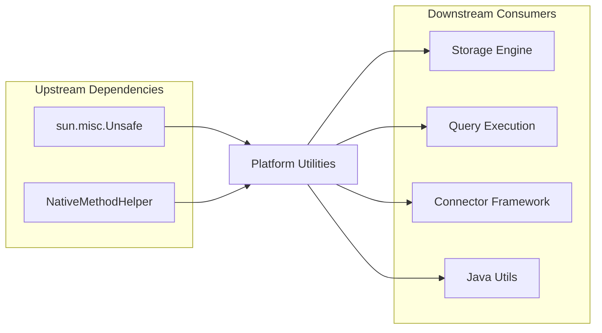

# Platform Utilities Module Documentation

## Overview

The Platform Utilities module provides low-level system utilities and platform-specific operations for StarRocks. It serves as a foundational layer that abstracts platform differences and provides efficient memory management, system detection, and testing utilities. This module is essential for cross-platform compatibility and performance optimization across different operating systems and architectures.

## Purpose and Core Functionality

The Platform Utilities module is designed to:

1. **Provide Cross-Platform Compatibility**: Abstract platform-specific operations to ensure consistent behavior across different operating systems
2. **Enable Efficient Memory Management**: Offer low-level memory operations with performance tracking and safety mechanisms
3. **Support Testing Infrastructure**: Provide utilities for unit testing and development environments
4. **Optimize System Performance**: Utilize unsafe operations for high-performance memory manipulation when appropriate

## Architecture

### Core Components

The module is built around the `Platform` class, which serves as the central utility provider:

```java
java-extensions.java-utils.src.main.java.com.starrocks.utils.Platform.Platform
```

### Architecture Diagram



## Component Relationships

### Memory Management Flow



### System Detection Process



## Key Features

### 1. Memory Management

The module provides sophisticated memory management capabilities:

- **Allocation with Tracking**: Memory allocation in production mode includes tracking through `NativeMethodHelper`
- **Safe Deallocation**: Ensures proper memory cleanup with tracking integration
- **Reallocation Support**: Provides memory reallocation with data preservation
- **Bulk Operations**: Supports memory copying and setting operations

### 2. Array Operations

Efficient array manipulation through unsafe operations:

- **Primitive Array Access**: Direct access to all primitive array types
- **Offset Management**: Pre-calculated array base offsets for performance
- **Type-Safe Operations**: Type-specific get/put operations for each primitive

### 3. Testing Infrastructure

Built-in support for testing environments:

- **Mode Detection**: Automatic detection of testing mode via system properties
- **Memory Behavior**: Different memory management behavior for testing vs. production
- **Unit Test Key**: Configurable test mode activation

## Integration with Other Modules

### Dependencies

The Platform Utilities module integrates with several other StarRocks modules:



### Related Modules

- **[java_utils](java_utils.md)**: Provides the `NativeMethodHelper` for memory tracking
- **[storage_engine](storage_engine.md)**: Uses platform utilities for low-level storage operations
- **[query_execution](query_execution.md)**: Leverages platform utilities for performance optimization
- **[connectors](connectors.md)**: Utilizes platform utilities for cross-platform connector operations

## Usage Patterns

### Memory Allocation Pattern

```java
// Allocate memory with automatic tracking
long address = Platform.allocateMemory(size);

// Use the memory...

// Free memory with proper cleanup
Platform.freeMemory(address);
```

### Array Manipulation Pattern

```java
// Direct array access using unsafe operations
int[] array = new int[100];
int value = Platform.getInt(array, Platform.INT_ARRAY_OFFSET + (index * 4));
Platform.putInt(array, Platform.INT_ARRAY_OFFSET + (index * 4), newValue);
```

### Testing Mode Pattern

```java
// Check if running in testing mode
if (Platform.isTesting()) {
    // Use testing-specific behavior
} else {
    // Use production behavior
}
```

## Performance Considerations

### Optimization Strategies

1. **Unsafe Operations**: Utilizes `sun.misc.Unsafe` for high-performance memory operations
2. **Offset Caching**: Pre-calculates array base offsets to avoid repeated calculations
3. **Bulk Copy Optimization**: Implements chunked memory copying for large operations
4. **Memory Tracking**: Production mode includes memory tracking for leak detection

### Safety Mechanisms

1. **Testing Mode**: Provides safe memory management during unit testing
2. **Overlap Detection**: Handles memory copy operations with overlap detection
3. **Size Validation**: Implicit size validation through native method helpers
4. **Exception Handling**: Graceful fallback when unsafe operations are unavailable

## Configuration

### System Properties

- **`starrocks.fe.test`**: Controls testing mode behavior
  - Set to `true` to enable testing mode
  - Affects memory allocation behavior

### Environment Variables

The module adapts to different runtime environments automatically:

- **Development Environment**: Enables testing mode features
- **Production Environment**: Enables memory tracking and optimization
- **Unit Testing**: Provides safe memory management for test isolation

## Error Handling

### Exception Scenarios

1. **Unsafe Unavailability**: Graceful degradation when `Unsafe` is not available
2. **Memory Allocation Failure**: Proper error propagation through native methods
3. **Invalid Memory Access**: Handled at the native method helper level

### Recovery Mechanisms

- **Fallback Operations**: Alternative implementations when unsafe operations fail
- **Resource Cleanup**: Automatic cleanup in error scenarios
- **State Preservation**: Maintains system state during error recovery

## Future Enhancements

### Planned Improvements

1. **Platform-Specific Optimizations**: Additional optimizations for specific platforms
2. **Memory Pool Management**: Integration with memory pool allocators
3. **Performance Monitoring**: Enhanced performance metrics and monitoring
4. **Security Enhancements**: Additional security checks for unsafe operations

### Extension Points

- **Custom Memory Allocators**: Plugin architecture for custom allocation strategies
- **Platform Adapters**: Extensible platform detection and adaptation
- **Performance Profilers**: Integration points for performance analysis tools

## Conclusion

The Platform Utilities module serves as a critical foundation for StarRocks, providing essential low-level operations that enable high performance and cross-platform compatibility. Its careful balance between performance optimization and safety makes it an indispensable component of the StarRocks architecture.