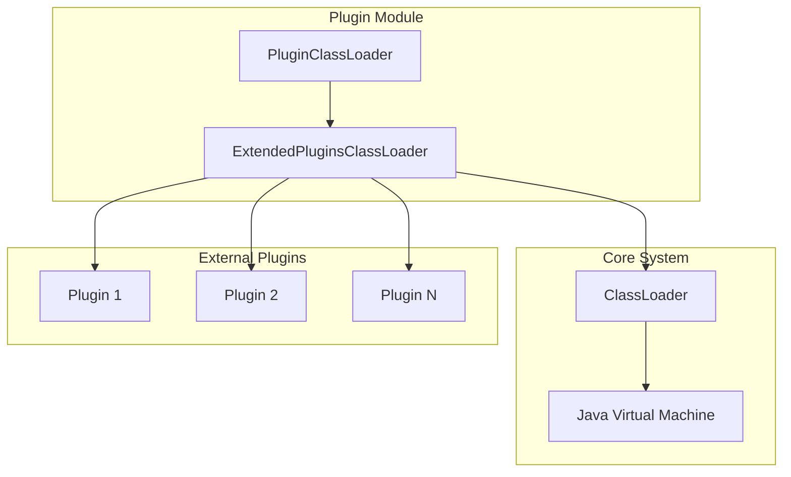
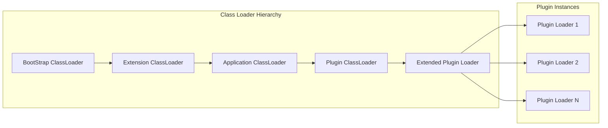
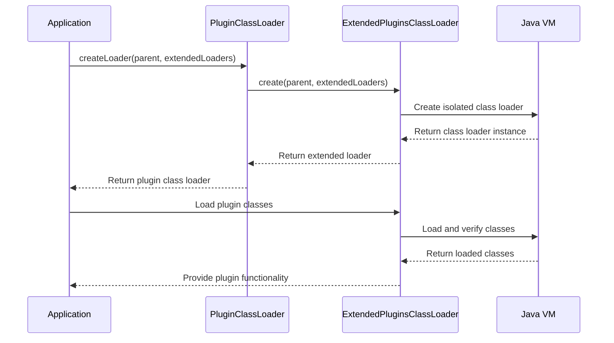
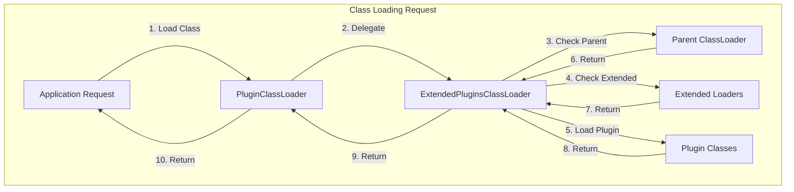
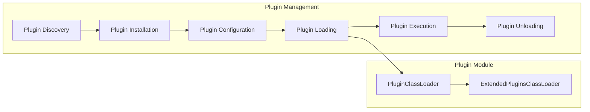

# Plugin Module Documentation

## Overview

The Plugin module provides a dynamic plugin system for StarRocks, enabling runtime extension of functionality through external plugins. This module serves as the foundation for loading, managing, and isolating plugin components within the StarRocks ecosystem.

## Purpose and Core Functionality

The Plugin module implements a class loading mechanism that allows StarRocks to dynamically load and manage external plugins while maintaining system stability and security. The primary functionality includes:

- **Dynamic Plugin Loading**: Runtime loading of external plugin JARs and their dependencies
- **Class Isolation**: Isolating plugin classes from the core system to prevent conflicts
- **Extended Class Loading**: Supporting multiple class loaders for complex plugin dependencies
- **Plugin Lifecycle Management**: Managing the creation and cleanup of plugin class loaders

## Architecture

### Component Structure



### Class Loading Architecture



## Core Components

### PluginClassLoader

The `PluginClassLoader` class serves as the main entry point for plugin class loading functionality. It provides a factory method for creating extended plugin class loaders with proper isolation and dependency management.

**Key Features:**
- Factory pattern implementation for creating plugin class loaders
- Integration with extended plugin loading mechanism
- Support for parent class loader delegation
- Multiple extended loader support for complex plugin dependencies

**Dependencies:**
- `ExtendedPluginsClassLoader`: Handles the actual class loading logic
- Java ClassLoader system: Provides the underlying class loading mechanism

## Data Flow

### Plugin Loading Process



### Class Loading Delegation



## Integration with StarRocks System

### Module Dependencies

The Plugin module integrates with several other StarRocks modules:

- **[Frontend Server](frontend_server.md)**: Provides the runtime environment for plugin execution
- **[Authentication & Authorization](frontend_server.md#authentication_authorization)**: Manages plugin security and access control
- **[Server Lifecycle](frontend_server.md#server_lifecycle)**: Handles plugin initialization during server startup

### Plugin Management Workflow



## Security and Isolation

### Class Isolation Mechanism

The plugin system implements multiple layers of isolation:

1. **ClassLoader Isolation**: Each plugin gets its own class loader instance
2. **Package Isolation**: Plugin packages are isolated from core system packages
3. **Dependency Isolation**: Plugin dependencies don't conflict with system dependencies
4. **Resource Isolation**: Plugin resources are managed separately

### Security Considerations

- **Sandbox Environment**: Plugins run in a controlled environment
- **Permission Management**: Plugin permissions are managed through the security manager
- **Code Verification**: Plugin code is verified before loading
- **Resource Limits**: Plugin resource usage can be limited and monitored

## Usage Patterns

### Basic Plugin Loading

```java
// Create a plugin class loader
ClassLoader parentLoader = getClass().getClassLoader();
List<ClassLoader> extendedLoaders = Arrays.asList(customLoader1, customLoader2);
ClassLoader pluginLoader = PluginClassLoader.createLoader(parentLoader, extendedLoaders);

// Load plugin classes
Class<?> pluginClass = pluginLoader.loadClass("com.example.Plugin");
```

### Advanced Plugin Management

The plugin system supports:
- **Hot Loading**: Loading plugins without restarting the server
- **Version Management**: Managing multiple versions of the same plugin
- **Dependency Resolution**: Resolving complex plugin dependencies
- **Plugin Communication**: Enabling communication between plugins

## Performance Considerations

### Class Loading Performance

- **Caching**: Loaded classes are cached to improve performance
- **Lazy Loading**: Classes are loaded on-demand to reduce memory usage
- **Parallel Loading**: Multiple plugins can be loaded in parallel
- **Resource Cleanup**: Proper cleanup of plugin resources to prevent memory leaks

### Memory Management

- **ClassLoader Lifecycle**: Proper management of class loader lifecycle
- **Garbage Collection**: Ensuring plugin classes can be garbage collected
- **Memory Monitoring**: Monitoring plugin memory usage
- **Resource Limits**: Implementing resource limits for plugins

## Error Handling

### Common Error Scenarios

1. **ClassNotFoundException**: Plugin class not found in the classpath
2. **ClassCastException**: Incompatible class versions between plugin and system
3. **LinkageError**: Class loading conflicts between plugins
4. **SecurityException**: Plugin attempting to access restricted resources

### Error Recovery

- **Graceful Degradation**: System continues to function even if plugin loading fails
- **Error Reporting**: Detailed error reporting for plugin issues
- **Rollback Mechanism**: Ability to rollback plugin changes
- **Fallback Options**: Fallback options when plugins fail to load

## Future Enhancements

### Planned Features

- **Plugin Marketplace**: Centralized plugin repository
- **Plugin Validation**: Automated plugin validation and testing
- **Dynamic Updates**: Support for plugin updates without downtime
- **Plugin Analytics**: Monitoring and analytics for plugin usage

### Extension Points

- **Custom Class Loaders**: Support for custom class loading strategies
- **Plugin Hooks**: Extensible plugin lifecycle hooks
- **Integration APIs**: APIs for deeper system integration
- **Plugin Templates**: Templates for common plugin types

## References

- [Frontend Server Module](frontend_server.md) - Server infrastructure for plugin execution
- [Authentication & Authorization](frontend_server.md#authentication_authorization) - Security framework for plugins
- [Java ClassLoader Documentation](https://docs.oracle.com/javase/8/docs/api/java/lang/ClassLoader.html) - Java class loading mechanism
- [Java Plugin Framework Best Practices](https://docs.oracle.com/javase/tutorial/ext/) - Java extension mechanism