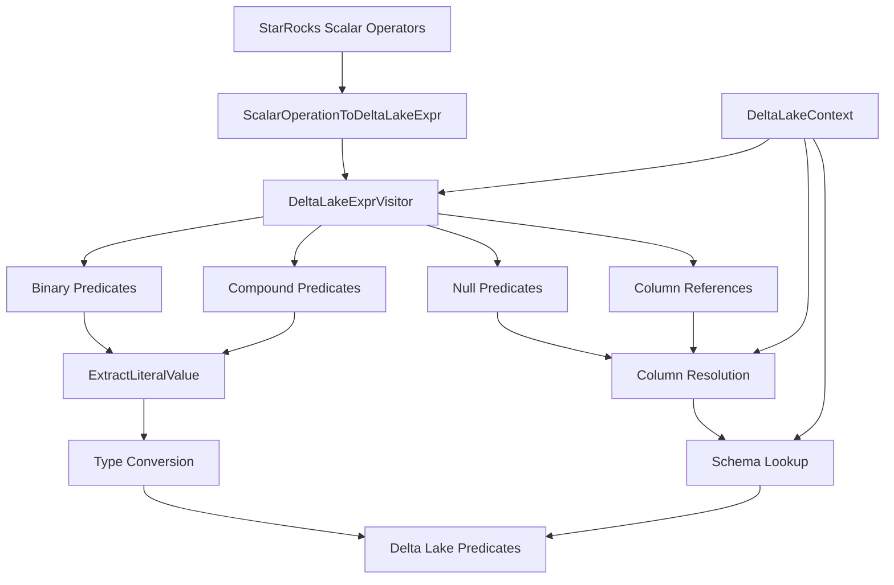
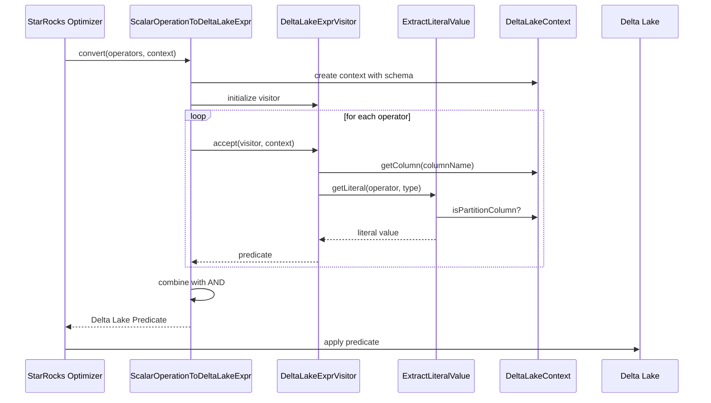
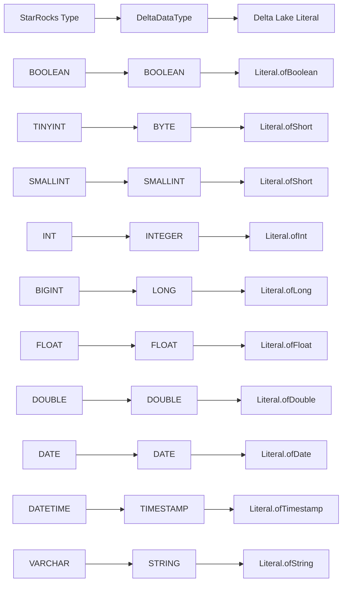
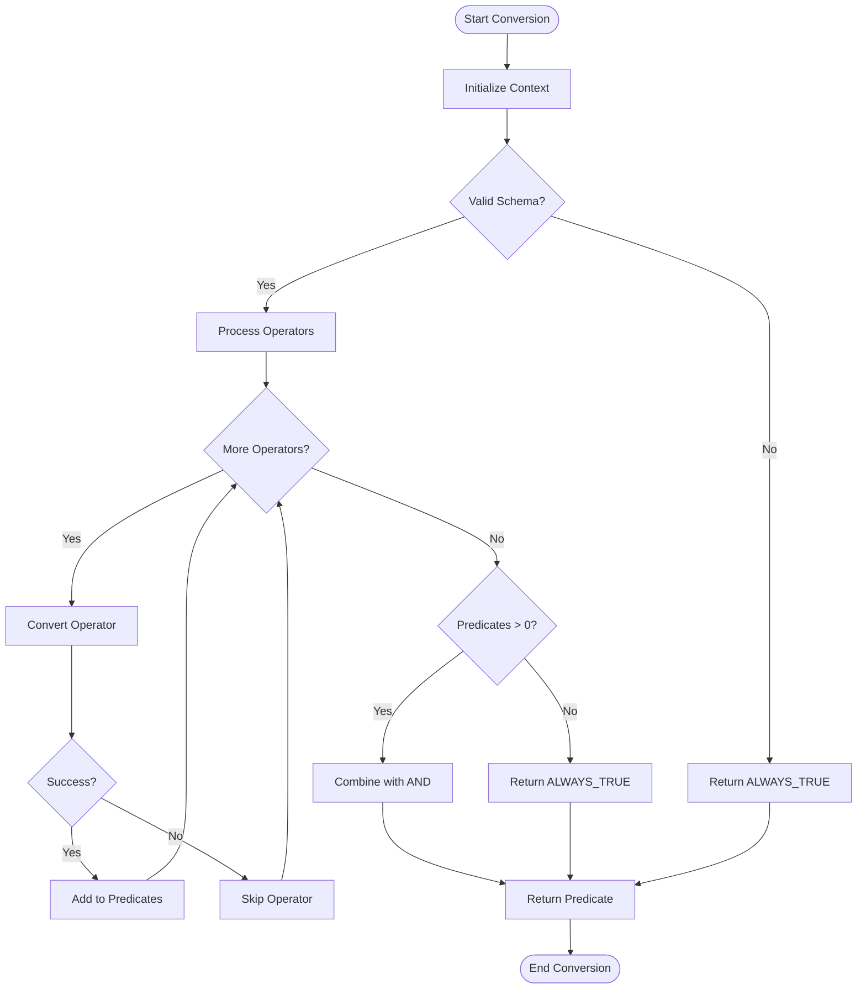
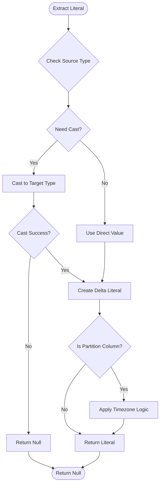

# Predicate Conversion Module Documentation

## Introduction

The predicate_conversion module is a critical component within the StarRocks connector framework, specifically designed to handle the translation of SQL predicates between StarRocks' internal representation and Delta Lake's predicate format. This module enables efficient query pushdown optimization when querying Delta Lake tables from StarRocks, ensuring that filtering operations are performed at the storage layer rather than in the query engine.

## Module Overview

The predicate_conversion module serves as a bridge between StarRocks' SQL optimizer and Delta Lake's predicate evaluation system. It converts StarRocks scalar operators into Delta Lake expressions, enabling predicate pushdown for improved query performance and reduced data transfer overhead.

## Core Architecture

### Primary Components

#### ScalarOperationToDeltaLakeExpr
The main converter class that orchestrates the predicate transformation process. It provides the primary interface for converting lists of StarRocks scalar operators into Delta Lake predicate expressions.

**Key Responsibilities:**
- Coordinate predicate conversion workflow
- Handle compound predicate combinations using AND/OR logic
- Manage conversion context and schema information
- Provide fallback to always-true predicates when conversion fails

#### DeltaLakeContext
A context object that maintains the state and configuration needed for predicate conversion, including schema information and partition column details.

**Key Features:**
- Schema structure management for type resolution
- Partition column identification and handling
- Column reference resolution within the Delta Lake schema

#### DeltaLakeExprVisitor
The core visitor pattern implementation that traverses StarRocks scalar operator trees and converts them to Delta Lake predicates.

**Supported Operations:**
- Binary predicates (LT, LE, GT, GE, EQ, NE)
- Compound predicates (AND, OR, NOT)
- IS NULL/IS NOT NULL predicates
- Column reference handling
- Literal value extraction and type conversion

#### ExtractLiteralValue
A specialized visitor for extracting and converting literal values from StarRocks constant operators to Delta Lake literals.

**Type Support:**
- Boolean, Byte, Short, Integer, Long
- Float, Double
- Date, DateTime/Timestamp
- String (VARCHAR, CHAR)
- Type casting and validation

## Data Flow Architecture

## Component Interaction Diagram

## Type System Integration

### Type Mapping Strategy

The module implements a comprehensive type mapping system that handles conversions between StarRocks primitive types and Delta Lake data types:

### Partition Column Handling

Special handling for partition columns includes:
- Timezone-aware timestamp conversion
- Partition-specific literal serialization
- Type validation for partition pruning optimization

## Process Flow

### Predicate Conversion Process

### Literal Value Extraction

## Integration with Connector Framework

The predicate_conversion module integrates with the broader connector ecosystem:

### Dependencies
- **Delta Lake Connector**: Provides schema information and partition metadata
- **SQL Optimizer**: Supplies scalar operator trees for conversion
- **Type System**: Handles type mapping and validation

### Related Modules
- [delta_lake_connector](delta_lake_connector.md): Parent connector implementation
- [sql_parser_optimizer](sql_parser_optimizer.md): Source of scalar operators
- [storage_engine](storage_engine.md): Target for predicate pushdown

## Performance Considerations

### Optimization Strategies
1. **Early Pruning**: Failed predicate conversions are skipped to avoid overhead
2. **Type Caching**: Schema information is cached in context to reduce lookups
3. **Batch Processing**: Multiple predicates are processed in a single pass
4. **Lazy Evaluation**: Complex operations are deferred until necessary

### Limitations
- Complex nested types are not fully supported
- Some compound predicate combinations may not be convertible
- Timezone handling is limited to partition columns
- Decimal types require special handling

## Error Handling

The module implements graceful degradation:
- **Conversion Failures**: Return null to skip non-convertible predicates
- **Type Mismatches**: Attempt casting before giving up
- **Schema Issues**: Fall back to always-true predicates
- **Unsupported Operations**: Log and skip gracefully

## Future Enhancements

### Planned Improvements
1. **Enhanced Type Support**: Expand decimal and complex type handling
2. **Nested Predicate Support**: Improve struct and array predicate conversion
3. **Performance Optimization**: Add predicate caching and batch optimization
4. **Extended Function Support**: Support for more SQL functions and operators

### Extensibility Points
- Visitor pattern allows easy addition of new operator types
- Type mapping system is configurable for future type additions
- Context system can be extended with additional metadata

## Conclusion

The predicate_conversion module is a sophisticated component that enables seamless integration between StarRocks' query optimization engine and Delta Lake's predicate evaluation system. Through careful type mapping, comprehensive operator support, and robust error handling, it provides a reliable bridge for predicate pushdown optimization, significantly improving query performance when working with Delta Lake tables in StarRocks.