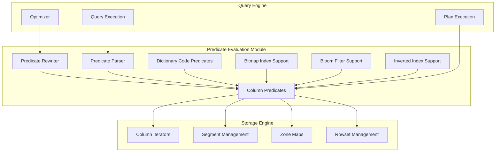
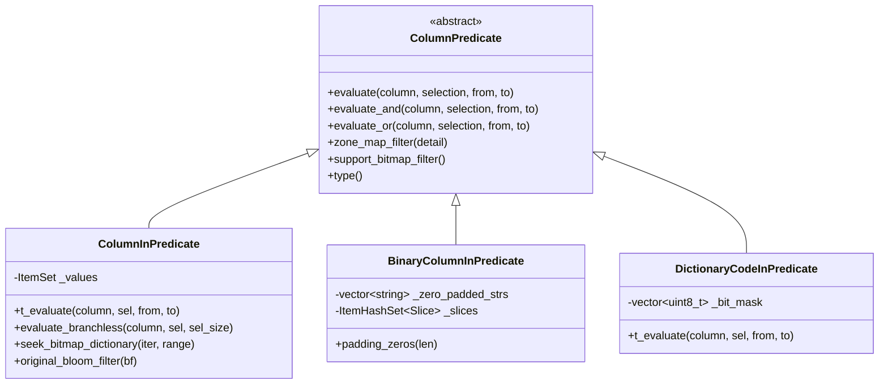
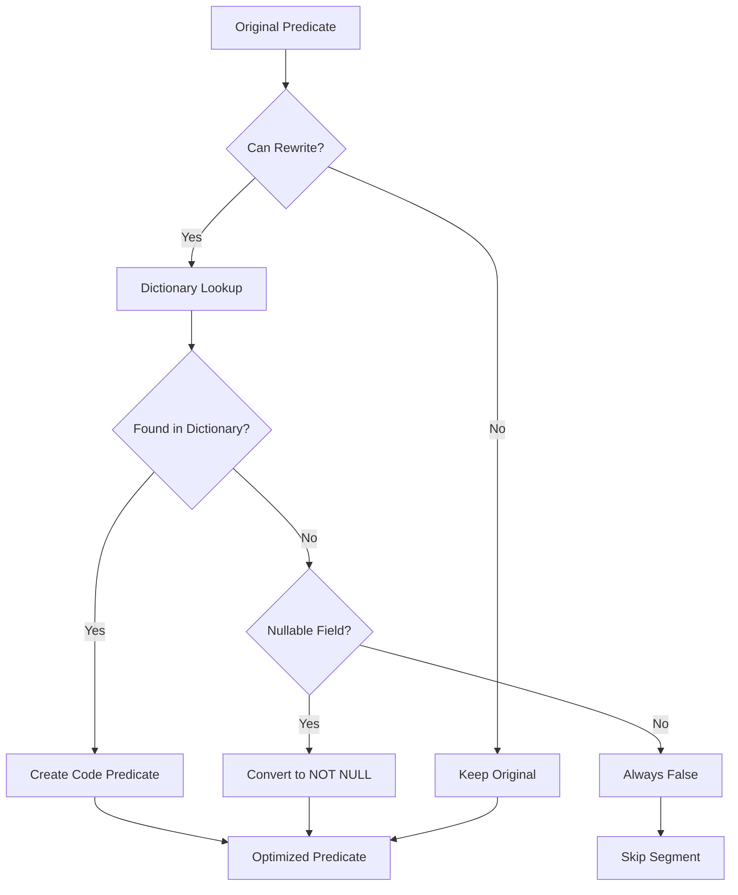
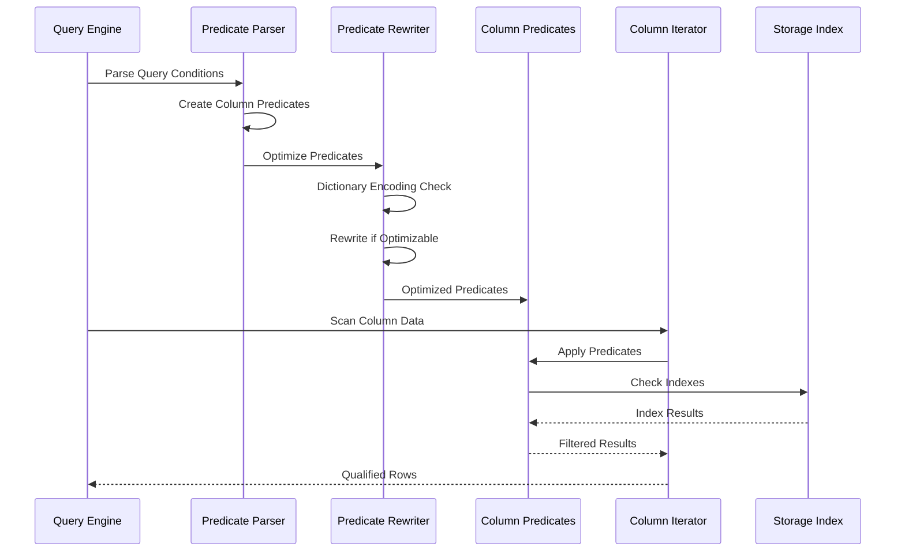
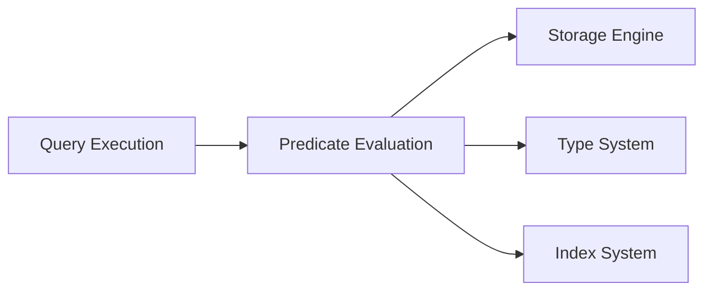

# Predicate Evaluation Module

## Overview

The predicate evaluation module is a core component of StarRocks' storage engine, responsible for efficiently evaluating predicates (filter conditions) on columnar data. This module provides the foundation for query filtering, enabling StarRocks to process WHERE clauses and other filter conditions with high performance through vectorized execution and various optimization techniques.

## Purpose and Core Functionality

The predicate evaluation module serves as the primary filtering engine within StarRocks' storage layer. Its main responsibilities include:

- **Predicate Execution**: Evaluating various types of predicates (equality, comparison, IN/NOT IN, NULL checks) against columnar data
- **Vectorized Processing**: Leveraging SIMD instructions and batch processing for optimal performance
- **Index Integration**: Supporting multiple index types including bitmap indexes, bloom filters, and inverted indexes
- **Predicate Optimization**: Rewriting and optimizing predicates for better execution efficiency
- **Type Support**: Handling diverse data types from primitive types to complex data structures

## Architecture and Component Relationships

## Core Components

### 1. Column Predicates (`column_in_predicate.cpp`, `column_not_in_predicate.cpp`, `column_null_predicate.cpp`, `column_predicate_cmp.cpp`)

The foundation of the predicate evaluation system, providing implementations for different predicate types:

#### In-Predicate (`BinaryColumnInPredicate`)
- **Purpose**: Evaluates `column IN (value1, value2, ...)` conditions
- **Key Features**:
  - Template-based implementation for type safety and performance
  - Support for both regular and binary column types
  - Optimized for small sets (1-3 values) using ArraySet
  - HashSet-based implementation for larger value sets
  - Vectorized evaluation with branchless operations
  - Bitmap index and inverted index support

#### Not-In-Predicate (`ColumnNotInPredicate`)
- **Purpose**: Evaluates `column NOT IN (value1, value2, ...)` conditions
- **Key Features**:
  - Complementary implementation to IN predicates
  - HashSet-based value storage for efficient lookups
  - Support for inverted index operations
  - Zone map filtering capabilities

#### Comparison Predicates (`BinaryColumnGtPredicate`)
- **Purpose**: Evaluates comparison operators (>, >=, <, <=, =, !=)
- **Key Features**:
  - Template-based design for type-specific optimizations
  - Support for both primitive and binary data types
  - Zone map integration for early pruning
  - Bitmap dictionary support for string columns

#### Null Predicates (`ColumnNotNullPredicate`)
- **Purpose**: Evaluates `IS NULL` and `IS NOT NULL` conditions
- **Key Features**:
  - Optimized null checking with vectorized operations
  - Bitmap index support for null values
  - Integration with zone map metadata

### 2. Predicate Rewriter (`column_predicate_rewriter.cpp`)

The predicate rewriter optimizes predicates for better execution performance:

#### RewritePredicateTreeVisitor
- **Purpose**: Traverses and rewrites predicate trees for optimization
- **Key Features**:
  - Dictionary encoding optimization for string columns
  - Predicate conversion to dictionary codes
  - Support for compound predicates (AND/OR)
  - Global dictionary optimization for low-cardinality columns

### 3. Predicate Parser (`predicate_parser.cpp`)

Converts external predicate representations to internal column predicates:

#### CanPushDownVisitor
- **Purpose**: Determines if predicates can be pushed down to storage layer
- **Key Features**:
  - Schema-aware predicate validation
  - Support for different table types (Primary Keys, Aggregate tables)
  - Connector-specific predicate handling

### 4. Dictionary Code Predicates (`column_predicate_dict_conjuct.cpp`)

Specialized predicates for dictionary-encoded columns:

#### DictConjuctPredicateOperator
- **Purpose**: Optimizes predicates on dictionary-encoded columns
- **Key Features**:
  - Code-based evaluation instead of value comparison
  - Global dictionary optimization
  - Vectorized execution support

## Data Flow and Processing

## Integration with Storage Engine

The predicate evaluation module integrates deeply with StarRocks' storage engine:

### Zone Map Integration
- **Purpose**: Early pruning of segments based on min/max statistics
- **Implementation**: Each predicate implements `zone_map_filter()` method
- **Benefit**: Avoids reading segments that cannot contain matching rows

### Bitmap Index Support
- **Purpose**: Efficient evaluation of equality and range predicates
- **Implementation**: `seek_bitmap_dictionary()` method for index traversal
- **Use Case**: High-cardinality columns with bitmap indexes

### Bloom Filter Integration
- **Purpose**: Probabilistic filtering for equality predicates
- **Implementation**: `original_bloom_filter()` method for bloom filter testing
- **Benefit**: Reduces I/O by filtering out non-matching rows

### Inverted Index Support
- **Purpose**: Text search and complex predicate evaluation
- **Implementation**: `seek_inverted_index()` method for text queries
- **Use Case**: String columns with inverted indexes

## Performance Optimizations

### 1. Vectorized Execution
- Batch processing of multiple rows simultaneously
- SIMD instruction utilization where possible
- Branchless evaluation algorithms

### 2. Type-Specific Optimizations
- Template-based implementations for compile-time optimization
- Specialized code paths for different data types
- Optimized data structures (ArraySet for small sets, HashSet for large sets)

### 3. Index Utilization
- Multi-level filtering with zone maps, bitmap indexes, and bloom filters
- Early termination when possible
- Cost-based predicate ordering

### 4. Dictionary Encoding
- Automatic detection of dictionary-encoded columns
- Conversion of string predicates to integer code comparisons
- Significant performance improvement for low-cardinality string columns

## Dependencies and Interactions

### Related Modules
- **[Storage Engine](storage_engine.md)**: Provides column iterators and index access
- **[Query Execution](query_execution.md)**: Supplies predicates from SQL queries
- **[SQL Parser/Optimizer](sql_parser_optimizer.md)**: Generates optimized predicate trees

### Key Dependencies

## Configuration and Tuning

### Runtime Parameters
- Dictionary encoding thresholds
- Predicate rewrite enablement flags
- Vectorized execution settings

### Performance Considerations
- Predicate selectivity estimation
- Index selection based on predicate types
- Memory usage optimization for large IN lists

## Future Enhancements

### Planned Improvements
- Enhanced support for complex data types (JSON, ARRAY, MAP)
- Machine learning-based predicate optimization
- Adaptive predicate execution based on runtime statistics
- GPU-accelerated predicate evaluation for large datasets

### Extensibility
- Plugin architecture for custom predicate types
- Dynamic predicate compilation for complex expressions
- Integration with external indexing systems

## Conclusion

The predicate evaluation module is a critical performance component in StarRocks, providing efficient filtering capabilities that enable fast query processing. Through its sophisticated optimization techniques, vectorized execution, and deep integration with the storage engine, it forms the foundation for StarRocks' high-performance analytical processing capabilities.