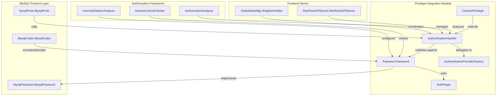
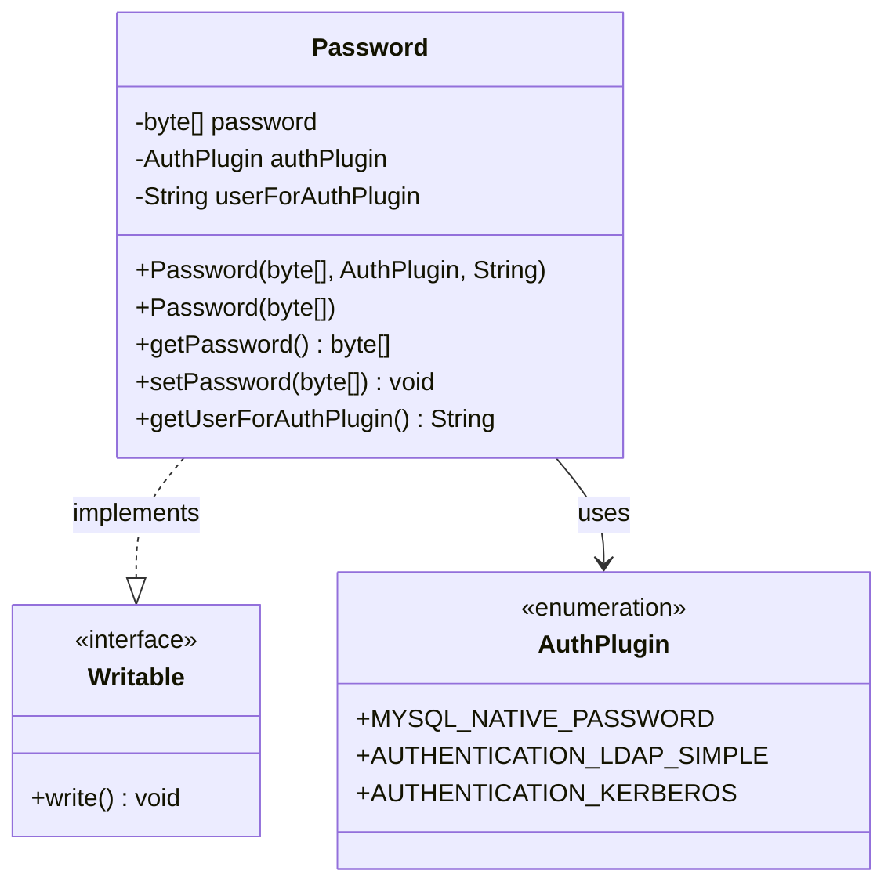
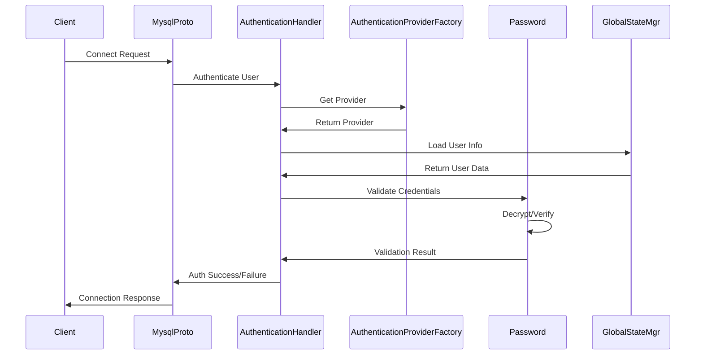

# Privilege Integration Module Documentation

## Introduction

The privilege_integration module is a core component of StarRocks' security framework, responsible for managing user authentication and authorization within the MySQL protocol layer. This module provides the foundational infrastructure for password management, authentication plugin integration, and privilege validation, ensuring secure access control across the StarRocks system.

## Architecture Overview

The privilege_integration module serves as a critical bridge between the MySQL protocol compatibility layer and StarRocks' internal security mechanisms. It implements MySQL-compatible authentication protocols while integrating with StarRocks' broader authorization framework.



## Core Components

### Password Management

The `Password.Password` class is the central component for password storage and management within the privilege integration module:



#### Key Features:

- **Encrypted Password Storage**: Passwords are stored as encrypted byte arrays, ensuring sensitive data is never stored in plain text
- **Authentication Plugin Support**: Integration with various authentication plugins (MySQL native, LDAP, Kerberos)
- **Serialization Support**: Implements `Writable` interface for persistence across system restarts
- **GSON Compatibility**: Uses `@SerializedName` annotations for JSON serialization/deserialization

### Authentication Flow



## Integration Points

### MySQL Protocol Compatibility

The privilege integration module seamlessly integrates with StarRocks' MySQL protocol implementation:

- **MysqlProto.MysqlProto**: Handles MySQL authentication protocol messages
- **MysqlCodec.MysqlCodec**: Encodes/decodes authentication data
- **MysqlPassword.MysqlPassword**: MySQL-compatible password hashing algorithms

### Authorization Framework

The module connects to the broader authorization system:

- **AccessControlChecker**: Validates user privileges after authentication
- **AuthorizationAnalyzer**: Analyzes authorization statements
- **UserAuthOptionAnalyzer**: Processes user authentication options

### Frontend Server Integration

- **StarRocksFEServer.StarRocksFEServer**: Manages authentication at the server level
- **GlobalStateMgr.SingletonHolder**: Coordinates authentication state across the cluster

## Data Flow

```mermaid
flowchart LR
    subgraph "Input Flow"
        A[Client Connection] --> B[MySQL Protocol Parser]
        B --> C[Authentication Request]
        C --> D[Credential Extraction]
    end
    
    subgraph "Processing Flow"
        D --> E[Password Validation]
        E --> F[Plugin Selection]
        F --> G[Authentication Provider]
        G --> H[Privilege Check]
    end
    
    subgraph "Output Flow"
        H --> I[Session Creation]
        I --> J[Connection Established]
        J --> K[Client Response]
    end
    
    D -.->|"encrypted bytes"| E
    E -.->|"validation result"| F
    F -.->|"plugin type"| G
```



## Security Features

### Password Security

- **Encryption at Rest**: Passwords are encrypted before storage
- **Secure Transmission**: Authentication data is handled securely through the MySQL protocol
- **Plugin Isolation**: Different authentication plugins provide varying security levels

### Access Control Integration

- **Role-Based Access**: Integration with StarRocks' role-based access control system
- **Column-Level Privileges**: Support for fine-grained column-level access control
- **Session Management**: Secure session establishment and management

## Dependencies

### Internal Dependencies

- **authentication_authorization**: Core authentication and authorization framework
- **mysql_protocol**: MySQL protocol implementation for compatibility
- **frontend_server**: Server-level coordination and state management

### External Dependencies

- **GSON**: For JSON serialization of password objects
- **Java Security Libraries**: For cryptographic operations

## Configuration and Usage

### Authentication Plugin Configuration

The module supports multiple authentication plugins:

```java
// MySQL Native Authentication
AuthPlugin mysqlNative = AuthPlugin.MYSQL_NATIVE_PASSWORD;

// LDAP Authentication
AuthPlugin ldapAuth = AuthPlugin.AUTHENTICATION_LDAP_SIMPLE;

// Kerberos Authentication
AuthPlugin kerberosAuth = AuthPlugin.AUTHENTICATION_KERBEROS;
```

### Password Creation and Validation

```java
// Create password with plugin
Password password = new Password(encryptedBytes, authPlugin, userForPlugin);

// Simple password creation
Password simplePassword = new Password(encryptedBytes);

// Validate and retrieve
byte[] storedPassword = password.getPassword();
String authUser = password.getUserForAuthPlugin();
```

## Error Handling

The module implements comprehensive error handling for various authentication scenarios:

- **Invalid Credentials**: Proper error reporting for authentication failures
- **Plugin Unavailable**: Graceful handling of missing authentication plugins
- **Network Issues**: Robust error handling for network-related authentication problems

## Performance Considerations

- **Caching**: Authentication results are cached to reduce repeated validation overhead
- **Lazy Loading**: User authentication data is loaded on-demand
- **Connection Pooling**: Efficient connection management for authentication requests

## Monitoring and Observability

The module integrates with StarRocks' monitoring framework:

- **Authentication Metrics**: Tracks authentication success/failure rates
- **Performance Monitoring**: Monitors authentication latency and throughput
- **Security Auditing**: Logs authentication events for security analysis

## Future Enhancements

- **Multi-Factor Authentication**: Support for additional authentication factors
- **OAuth Integration**: Enhanced OAuth and OpenID Connect support
- **Certificate-Based Authentication**: X.509 certificate authentication support
- **Biometric Authentication**: Integration with biometric authentication systems

## Related Documentation

- [MySQL Protocol Module](mysql_protocol.md) - MySQL protocol implementation details
- [Authentication Authorization Module](authentication_authorization.md) - Core authentication framework
- [Frontend Server Module](frontend_server.md) - Server lifecycle and state management
- [Connector Framework](connectors.md) - External system integration patterns

## References

- MySQL Authentication Protocol Documentation
- StarRocks Security Architecture Guide
- Java Security Best Practices
- OAuth 2.0 and OpenID Connect Specifications