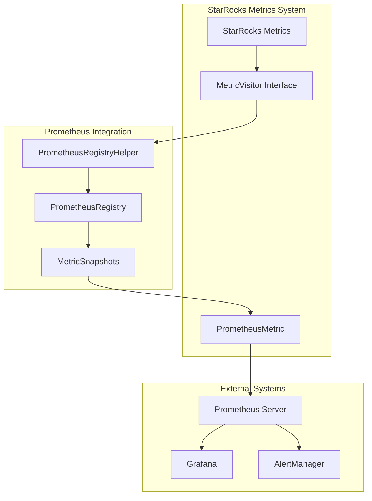
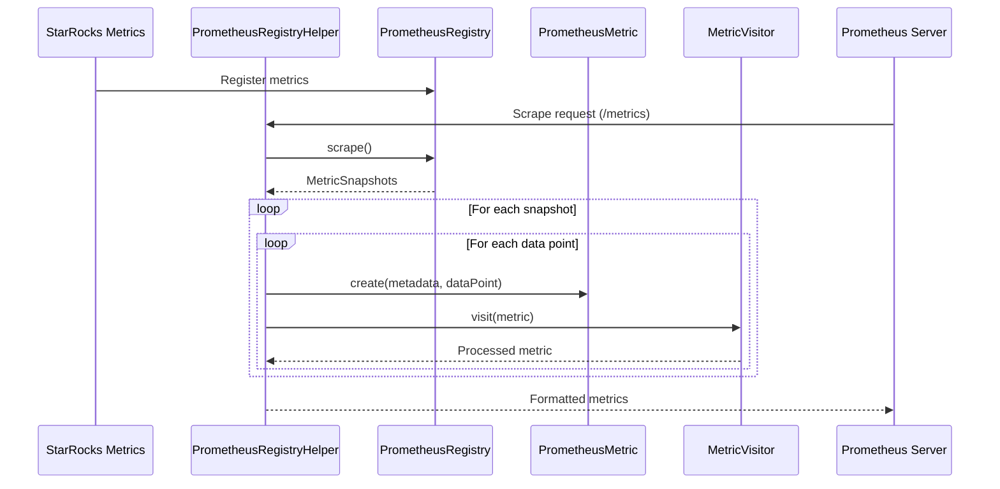
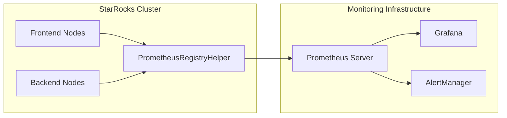

# Prometheus Integration Module

## Introduction

The Prometheus Integration module provides seamless integration between StarRocks' internal metrics system and Prometheus monitoring infrastructure. This module acts as a bridge that converts StarRocks metrics into Prometheus-compatible format, enabling comprehensive monitoring and observability of StarRocks clusters through Prometheus and Grafana dashboards.

## Architecture Overview



## Core Components

### PrometheusRegistryHelper

The `PrometheusRegistryHelper` is the central component of this module, providing a utility class that facilitates the conversion and export of metrics from StarRocks to Prometheus format.

**Key Responsibilities:**
- Scrapes metrics from PrometheusRegistry
- Converts Prometheus metric snapshots to StarRocks-compatible format
- Handles metric visitor pattern implementation
- Provides error handling and logging for metric conversion failures

**Core Method:**
```java
visitPrometheusRegistry(PrometheusRegistry registry, MetricVisitor visitor)
```

This method:
1. Scrapes all metrics from the provided PrometheusRegistry
2. Iterates through each metric snapshot and data point
3. Converts each data point to a PrometheusMetric object
4. Applies the visitor pattern to process each metric
5. Handles conversion exceptions gracefully with debug-level logging

## Data Flow



## Integration Points

### MetricVisitor Interface
The module implements the visitor pattern through the `MetricVisitor` interface, allowing flexible processing of converted metrics. This design enables:
- Custom metric processing logic
- Multiple output formats
- Extensible metric handling

### Error Handling
The module implements robust error handling:
- Runtime exceptions during metric conversion are caught and logged
- Debug-level logging prevents metric endpoint pollution
- Failed conversions don't interrupt the overall scraping process
- Error messages include context for troubleshooting

## Dependencies

### Internal Dependencies
- **metrics module**: Provides the base metric infrastructure and visitor patterns
  - [base_metrics.md](base_metrics.md) - Core metric types and interfaces
  - [resource_group_metrics.md](resource_group_metrics.md) - Resource group specific metrics
  - [warehouse_metrics.md](warehouse_metrics.md) - Warehouse monitoring metrics

### External Dependencies
- **Prometheus Java Client**: Uses `io.prometheus.metrics.model` for metric representation
  - `PrometheusRegistry`: Central registry for Prometheus metrics
  - `MetricSnapshots`: Container for scraped metric data
  - `DataPointSnapshot`: Individual metric data points

## Configuration and Usage

### Metric Collection Process
1. StarRocks internal metrics are registered with PrometheusRegistry
2. Prometheus server makes HTTP requests to the metrics endpoint
3. PrometheusRegistryHelper scrapes the registry and converts metrics
4. Converted metrics are formatted for Prometheus consumption
5. Metrics are exposed via HTTP endpoint for Prometheus scraping

### Integration with Monitoring Stack


## Best Practices

### Performance Considerations
- Metric scraping is designed to be lightweight and non-blocking
- Error handling prevents individual metric failures from affecting the entire scrape
- Debug-level logging minimizes performance impact on production systems

### Monitoring Recommendations
1. **Scrape Interval**: Configure appropriate scrape intervals based on metric volatility
2. **Metric Cardinality**: Monitor and control metric cardinality to prevent storage issues
3. **Alert Configuration**: Set up alerts for critical StarRocks metrics
4. **Dashboard Creation**: Create comprehensive Grafana dashboards for cluster monitoring

## Extension Points

The module provides several extension opportunities:

### Custom Metric Visitors
Implement the `MetricVisitor` interface to create custom metric processing logic:
- Filter specific metrics
- Transform metric formats
- Export to alternative monitoring systems

### Additional Metric Sources
The architecture supports adding new metric sources:
- Custom StarRocks metrics
- Third-party integrations
- Business-specific metrics

## Troubleshooting

### Common Issues
1. **Missing Metrics**: Check PrometheusRegistry registration
2. **Conversion Errors**: Review debug logs for specific error messages
3. **Performance Issues**: Monitor scrape duration and metric count

### Debug Information
- Enable debug logging for detailed conversion information
- Check Prometheus server scrape logs
- Verify network connectivity between Prometheus and StarRocks

## Related Documentation
- [Metrics Module Overview](metrics.md) - General metrics architecture
- [Resource Group Metrics](resource_group_metrics.md) - Resource-specific monitoring
- [Warehouse Metrics](warehouse_metrics.md) - Warehouse-level metrics
- [HTTP Layer](http_layer.md) - HTTP server integration for metrics endpoint