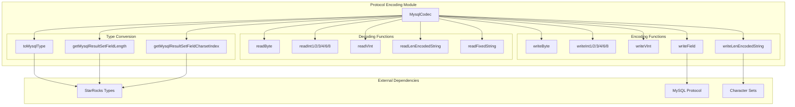
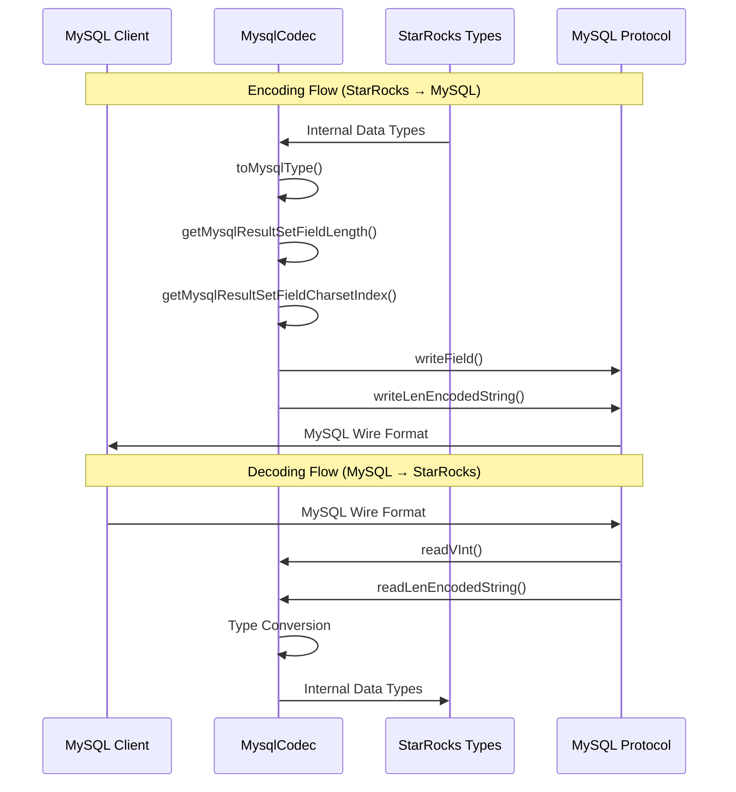
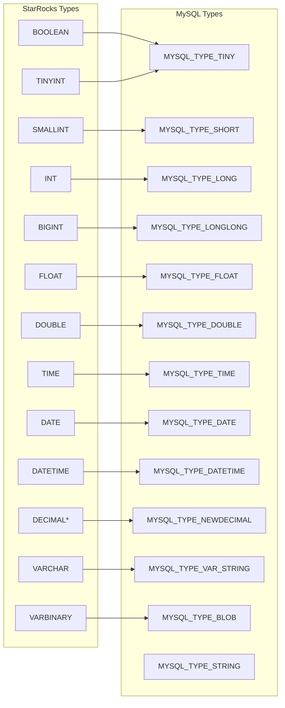
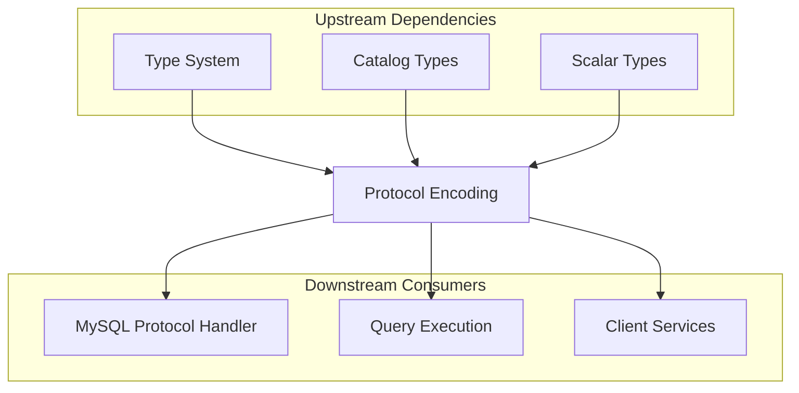

# Protocol Encoding Module

## Overview

The protocol_encoding module is a critical component of StarRocks' MySQL protocol implementation, responsible for encoding and decoding data according to the MySQL wire protocol specification. This module serves as the bridge between StarRocks' internal data representations and the MySQL protocol format, enabling seamless communication with MySQL clients and tools.

## Purpose and Core Functionality

The primary purpose of the protocol_encoding module is to provide comprehensive MySQL protocol compatibility by handling:

- **Binary Data Encoding/Decoding**: Conversion between StarRocks data types and MySQL wire protocol format
- **Protocol Message Formatting**: Proper formatting of MySQL protocol messages including column definitions, result sets, and command responses
- **Character Set Handling**: Management of character encodings (UTF-8, binary) as per MySQL protocol requirements
- **Type System Mapping**: Mapping between StarRocks internal types and MySQL column types

## Architecture

### Component Structure



### Data Flow Architecture



## Core Components

### MysqlCodec Class

The `MysqlCodec` class is the central component that provides static methods for MySQL protocol encoding and decoding operations.

#### Key Methods

**Reading Methods:**
- `readByte()`: Reads a single byte from buffer
- `readInt1/2/3/4/6/8()`: Reads fixed-length integers (1-8 bytes)
- `readVInt()`: Reads variable-length integers using MySQL's length-encoded format
- `readLenEncodedString()`: Reads length-encoded strings
- `readFixedString()`: Reads fixed-length strings
- `readEofString()`: Reads strings until end of buffer
- `readNulTerminateString()`: Reads null-terminated strings

**Writing Methods:**
- `writeByte()`: Writes a single byte
- `writeInt1/2/3/4/6/8()`: Writes fixed-length integers
- `writeVInt()`: Writes variable-length integers
- `writeLenEncodedString()`: Writes length-encoded strings
- `writeField()`: Writes column definition fields according to MySQL protocol

**Type Conversion Methods:**
- `toMysqlType()`: Maps StarRocks primitive types to MySQL column types
- `getMysqlResultSetFieldLength()`: Calculates field display lengths for MySQL protocol
- `getMysqlResultSetFieldCharsetIndex()`: Determines character set indices for fields

## Type System Integration

### MySQL Type Mapping



### Character Set Handling

The module implements intelligent character set selection based on data types:

- **UTF-8 (charset 33)**: Used for character data types (CHAR, VARCHAR), complex types (ARRAY, MAP, STRUCT), and special types (HLL, BITMAP, LARGEINT, JSON)
- **Binary (charset 63)**: Used for binary data types and numeric types

## Protocol Implementation Details

### Length-Encoded Integer Format

MySQL protocol uses a variable-length integer encoding:
- Values < 251: Single byte
- Values 251-65535: Prefix byte 252 + 2-byte integer
- Values 65536-16777215: Prefix byte 253 + 3-byte integer
- Values ≥ 16777216: Prefix byte 254 + 8-byte integer
- NULL values: Single byte 251

### Column Definition Format

The `writeField()` method implements the MySQL Protocol::ColumnDefinition41 format:

```
Catalog ("def") - Length encoded
Schema - Length encoded  
Table - Length encoded
Original Table - Length encoded
Name - Length encoded
Original Name - Length encoded
Fixed fields (0x0c) - Length encoded
Character set - 2 bytes
Column length - 4 bytes
Column type - 1 byte
Flags - 2 bytes
Decimals - 1 byte
Filler - 2 bytes
[Optional] Default value - Length encoded
```

## Integration with StarRocks System

### Module Dependencies



### Related Modules

- **[mysql_protocol](mysql_protocol.md)**: Parent module containing authentication, password security, and privilege integration
- **[type_system](type_system.md)**: Provides the type definitions and conversion utilities
- **[query_execution](query_execution.md)**: Consumes encoded data for result set transmission

## Performance Considerations

### Optimization Strategies

1. **Buffer Management**: Uses `ByteBuffer` for efficient I/O operations
2. **String Encoding**: Leverages `StandardCharsets.UTF_8` for consistent character encoding
3. **Type Caching**: Field metadata calculations are performed once per column
4. **Zero-Copy Operations**: Direct buffer manipulation where possible

### Memory Efficiency

- Reuses `ByteArrayOutputStream` for multiple write operations
- Implements efficient string-to-byte conversion
- Minimizes object allocation in hot paths

## Error Handling

The module implements several error handling mechanisms:

- **Null Pointer Exceptions**: Thrown for invalid NULL value handling in `readVInt()`
- **Buffer Underflow**: Handled by `ByteBuffer` operations
- **Type Validation**: Ensures proper type mapping between StarRocks and MySQL types

## Usage Examples

### Encoding a Result Set Field

```java
// Write column definition for a VARCHAR column
MysqlCodec.writeField(outputStream, 
    "database",           // database name
    "table",              // table name  
    "column_name",        // column name
    ScalarType.createVarchar(100), // column type
    false,                // send default value
    ""                    // default value
);
```

### Decoding a Length-Encoded String

```java
// Read length-encoded string from buffer
byte[] stringData = MysqlCodec.readLenEncodedString(buffer);
String value = new String(stringData, StandardCharsets.UTF_8);
```

## Future Enhancements

Potential areas for improvement:

1. **Protocol Version Support**: Enhanced support for different MySQL protocol versions
2. **Performance Optimization**: SIMD optimizations for bulk operations
3. **Extended Type Support**: Support for new StarRocks types as they are introduced
4. **Protocol Extensions**: Support for MySQL protocol extensions and custom packets

## Conclusion

The protocol_encoding module is a foundational component that enables StarRocks to communicate effectively with MySQL clients and tools. Its comprehensive implementation of the MySQL wire protocol ensures compatibility while maintaining performance and reliability. The module's clean API design and robust type handling make it an essential part of StarRocks' MySQL protocol stack.