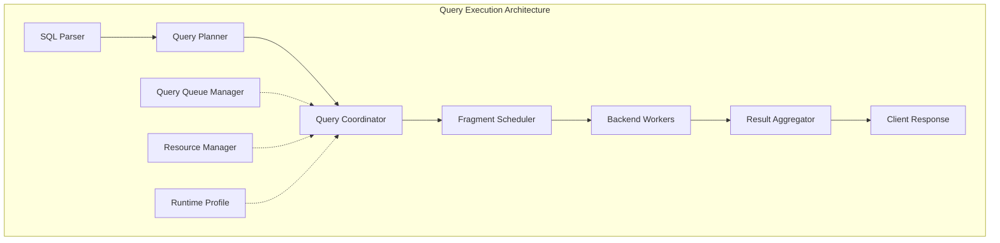
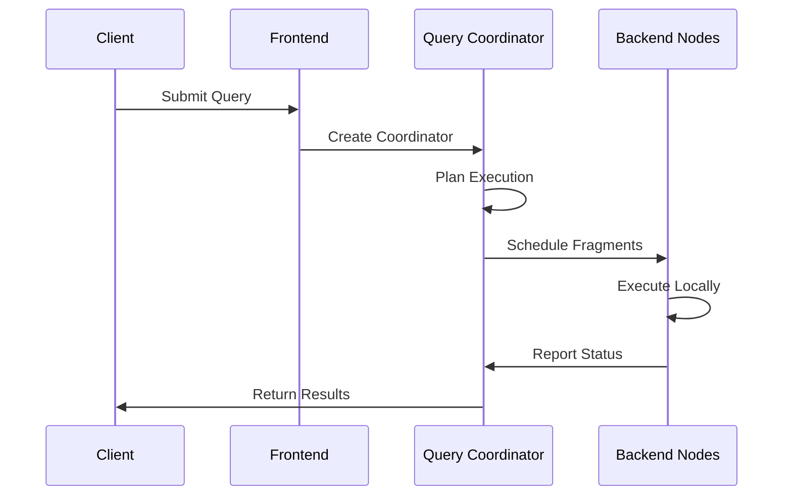

# Query Execution Module

## Overview

The query_execution module is the core execution engine of StarRocks, responsible for coordinating and executing SQL queries across the distributed system. It manages the entire query lifecycle from planning to result delivery, handling both simple queries and complex distributed operations.

## Architecture

### Core Components

The query_execution module consists of several key subsystems:

#### 1. Query Coordination
- **DefaultCoordinator**: Main coordinator for query execution
- **ConnectContext**: Session management and connection handling
- **Query Queue Manager**: Resource allocation and query scheduling

#### 2. Backend Selection & Scheduling
- **ColocatedBackendSelector**: Optimizes data locality for query execution
- **SimpleScheduler**: Basic backend selection algorithms
- **Worker Provider**: Manages compute resource allocation

#### 3. Session & Variable Management
- **GlobalVariable**: System-wide configuration variables
- **SessionVariableConstants**: Session-level configuration constants
- **VariableVarConverters**: Converts between different variable formats

#### 4. Query Monitoring & Statistics
- **QueryDetailQueue**: Tracks query execution details
- **QueryStatisticsItem**: Collects and aggregates query statistics
- **ShowMaterializedViewStatus**: Monitors materialized view refresh status

#### 5. Result Management
- **ShowResultSetMetaData**: Manages result set metadata
- **TranslateExecutor**: Handles SQL dialect translation

## Key Features

### Distributed Query Execution
The module orchestrates query execution across multiple backend nodes, ensuring optimal resource utilization and data locality. It supports both pipeline and non-pipeline execution modes.

### Resource Management
Implements sophisticated resource allocation through query queuing, memory management, and compute resource scheduling. The system can dynamically adjust resources based on workload demands.

### Session Management
Provides comprehensive session handling with support for multiple concurrent connections, session variables, and user authentication/authorization integration.

### Performance Monitoring
Built-in profiling and monitoring capabilities track query performance, resource usage, and execution statistics for optimization and troubleshooting.

## Integration Points

The query_execution module integrates with:
- [sql_parser_optimizer](sql_parser_optimizer.md) - For query parsing and optimization
- [storage_engine](storage_engine.md) - For data access and storage operations
- [frontend_server](frontend_server.md) - For client connection management
- [backend_server](backend_server.md) - For distributed execution coordination

## Sub-modules

### [Query Coordination](query_coordination.md)
Manages the distribution of query fragments across available compute resources, considering data locality, resource availability, and load balancing. This includes pipeline execution, aggregation operations, and various scan operations.

### [Backend Selection](backend_selection.md)
Handles user sessions, authentication, authorization, and session-specific configurations including variables and connection state. Provides sophisticated backend selection algorithms for optimal query execution.

### [Session Management](session_management.md)
Coordinates resource allocation across the cluster, implementing query queues, memory limits, and compute resource management. Manages global and session variables, SQL modes, and connection contexts.

### [Query Monitoring](query_monitoring.md)
Provides real-time monitoring of query execution, performance metrics collection, and diagnostic information for troubleshooting. Tracks query details, manages query queues, and monitors materialized view status.

### [Result Management](result_management.md)
Handles query result processing, SQL translation, role management, and result set metadata. Manages the final stages of query execution including result formatting and delivery to clients.

## Data Flow

## Configuration

The module supports extensive configuration through global variables and session variables, allowing fine-tuned control over:
- Query timeout settings
- Resource allocation policies
- Execution strategies
- Monitoring and profiling options

## Error Handling

Comprehensive error handling ensures graceful degradation and proper error reporting across all execution phases, with detailed error messages and suggested remediation steps.