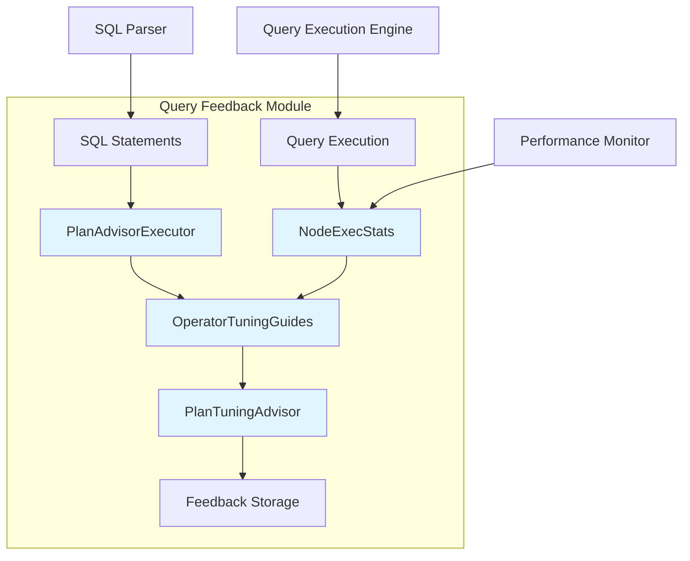
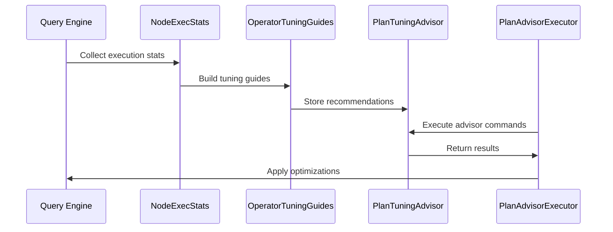

# Query Feedback Module Documentation

## Overview

The query_feedback module is a sophisticated query performance optimization system within StarRocks that provides intelligent query tuning recommendations and performance analysis capabilities. This module collects execution statistics, analyzes query performance patterns, and provides actionable tuning guides to optimize query execution plans.

## Purpose and Core Functionality

The query_feedback module serves as an intelligent advisor system that:

- **Collects Execution Statistics**: Gathers detailed performance metrics from query execution nodes
- **Analyzes Performance Patterns**: Identifies bottlenecks and optimization opportunities
- **Provides Tuning Recommendations**: Generates actionable advice for query optimization
- **Tracks Optimization Effectiveness**: Monitors the impact of applied optimizations
- **Manages Advisor Lifecycle**: Handles the creation, storage, and cleanup of tuning guides

## Architecture Overview



## Core Components

### 1. NodeExecStats
Captures detailed execution statistics for individual query nodes, including row processing metrics and filter effectiveness.

**Key Metrics Tracked:**
- Push/pull row counts
- Predicate filter effectiveness
- Index filter performance
- Runtime filter efficiency

### 2. OperatorTuningGuides
Manages collections of tuning recommendations for query operators, tracking optimization history and effectiveness.

**Core Features:**
- Multi-operator tuning guide management
- Optimization effectiveness tracking
- Historical performance analysis
- Cache-based optimization record storage

### 3. PlanAdvisorExecutor
Provides the command interface for plan advisor operations, handling SQL statements related to query feedback management.

**Supported Operations:**
- Add queries to advisor
- Clear advisor data
- Delete specific tuning guides
- Show advisor recommendations

## Data Flow Architecture



## Integration Points

### Query Execution Engine
- Integrates with [query_execution.md](query_execution.md) for performance data collection
- Leverages execution statistics from pipeline operators
- Coordinates with runtime filter systems

### SQL Parser and Optimizer
- Works with [sql_parser_optimizer.md](sql_parser_optimizer.md) for plan analysis
- Integrates with cost-based optimization decisions
- Provides feedback for plan improvement

### Frontend Server
- Utilizes [frontend_server.md](frontend_server.md) for session management
- Integrates with query coordination systems
- Leverages metadata management capabilities

## Sub-modules

The query_feedback module consists of several specialized sub-modules:

### [Node Execution Statistics](node_exec_stats.md)
Detailed documentation for execution statistics collection and analysis. This sub-module handles the collection of performance metrics from query execution nodes, including row processing counts, filter effectiveness, and resource utilization statistics.

### [Operator Tuning Guides](operator_tuning_guides.md)
Comprehensive guide to tuning recommendation management and optimization tracking. This component manages collections of tuning recommendations, tracks optimization effectiveness, and provides historical performance analysis capabilities.

### [Plan Advisor Executor](plan_advisor_executor.md)
Complete reference for plan advisor command execution and SQL interface. This sub-module provides the command-line interface for plan advisor operations, handling SQL statements related to query feedback management and optimization recommendations.

## Performance Considerations

### Memory Management
- Uses bounded caches for optimization records (max 50 entries)
- Implements efficient data structures for statistics storage
- Provides cleanup mechanisms for outdated recommendations

### Scalability
- Distributed advisor storage across frontend nodes
- Efficient serialization for cross-node communication
- Optimized data structures for large-scale query analysis

### Effectiveness Tracking
- Monitors optimization success rates
- Calculates average tuned query time improvements
- Provides usefulness metrics for tuning guides

## Usage Patterns

### Basic Advisor Operations
```sql
-- Add query to advisor
ADD PLAN ADVISOR SELECT * FROM large_table WHERE condition;

-- Show current recommendations
SHOW PLAN ADVISOR;

-- Clear all advisor data
CLEAR PLAN ADVISOR;

-- Delete specific tuning guide
DELETE PLAN ADVISOR 'advisor-id';
```

### Programmatic Access
The module provides APIs for:
- Automated tuning guide generation
- Performance analysis integration
- Custom optimization strategies
- Third-party tool integration

## Configuration and Tuning

### Session Variables
- `enable_plan_analyzer`: Controls plan analysis activation
- Integration with query execution parameters
- Configurable optimization thresholds

### Advisor Management
- Automatic cleanup of outdated recommendations
- Configurable cache sizes for optimization records
- Flexible tuning guide lifecycle management

## Future Enhancements

### Planned Features
- Machine learning-based optimization recommendations
- Historical performance trend analysis
- Automated optimization application
- Integration with cloud-based optimization services

### Extensibility
- Plugin architecture for custom tuning strategies
- API for third-party optimization tools
- Integration with external performance monitoring systems

## Related Documentation

- [Query Execution](query_execution.md) - Core execution engine integration
- [SQL Parser and Optimizer](sql_parser_optimizer.md) - Plan analysis and optimization
- [Frontend Server](frontend_server.md) - Session and coordination management
- [Storage Engine](storage_engine.md) - Performance data sources