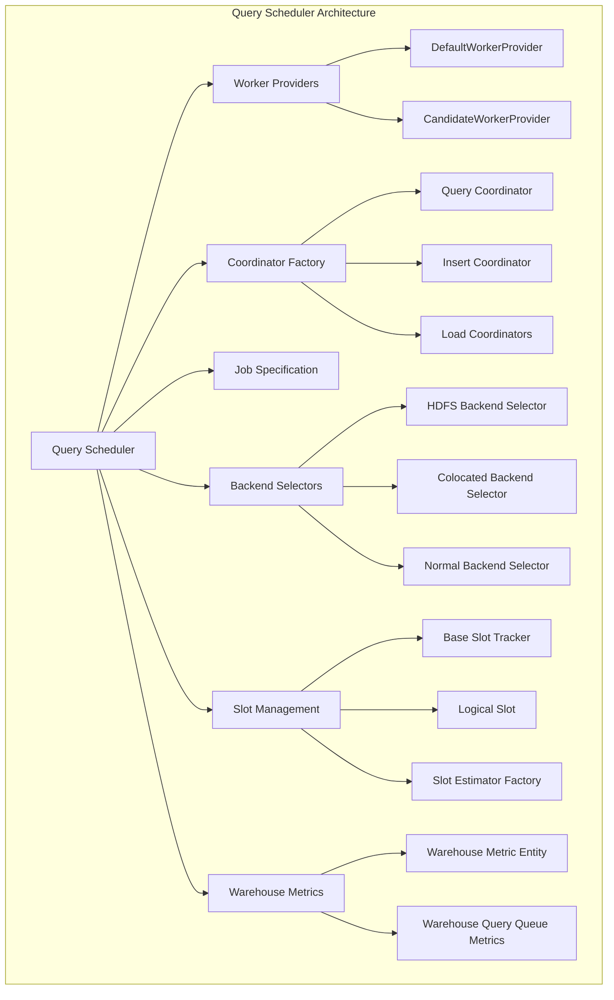
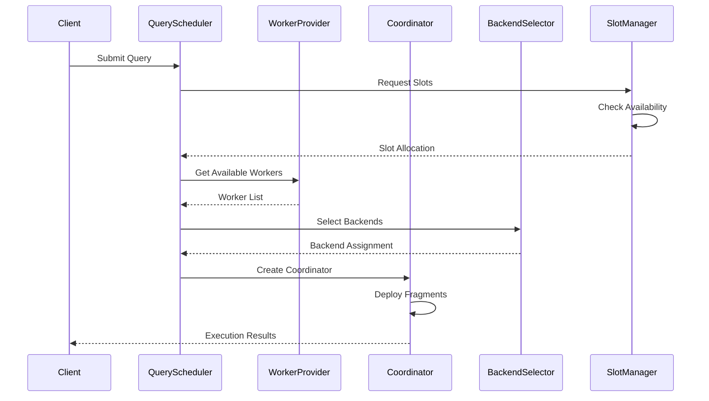

# Query Scheduler Module

## Overview

The Query Scheduler module is a critical component of StarRocks' query execution engine, responsible for coordinating and managing the execution of query fragments across the distributed cluster. It handles worker node selection, resource allocation, query queuing, and the overall orchestration of query execution.

## Purpose and Core Functionality

The Query Scheduler serves as the central coordination point for query execution in StarRocks, providing:

- **Worker Management**: Selection and allocation of compute nodes and backends for query execution
- **Resource Coordination**: Management of query slots and resource allocation across the cluster
- **Query Queuing**: Intelligent queuing mechanisms to handle resource constraints
- **Fragment Scheduling**: Coordination of query fragment execution across distributed nodes
- **Load Balancing**: Distribution of workload across available compute resources
- **Fault Tolerance**: Handling of node failures and query recovery

## Architecture Overview

## Core Components

### 1. Worker Provider System

The Worker Provider system manages the selection and allocation of compute nodes and backends for query execution.

#### Key Components:
- **WorkerProvider Interface**: Defines the contract for worker selection
- **DefaultWorkerProvider**: Standard implementation for worker selection in shared-nothing mode
- **CandidateWorkerProvider**: Specialized provider for HDFS operations using historical node information

#### Features:
- **Node Selection**: Intelligent selection of compute nodes vs backends based on configuration
- **Resource Awareness**: Consideration of warehouse and worker group constraints
- **Availability Checking**: Validation of node health and blacklist status
- **Load Balancing**: Round-robin selection with resource-aware distribution

For detailed documentation, see [Worker Provider System](worker_provider_system.md)

### 2. Coordinator Factory System

The Coordinator Factory creates appropriate coordinators for different types of operations.

#### Coordinator Types:
- **Query Coordinator**: Handles SELECT query execution
- **Insert Coordinator**: Manages INSERT operations
- **Load Coordinators**: Various load operation coordinators (Broker, Stream, Sync Stream)
- **Export Coordinator**: Handles data export operations
- **Dictionary Cache Coordinator**: Manages dictionary cache refresh operations

#### Scheduling Options:
- **Standard Execution**: Full deployment and execution
- **Deployment-Free**: Execution without fragment deployment
- **Query Deploy Executor**: Background deployment for connector scan ranges

For detailed documentation, see [Coordinator System](coordinator_system.md)

### 3. Backend Selection System

The Backend Selection system determines optimal backend nodes for different types of scan operations.

#### Selector Types:
- **HDFS Backend Selector**: For HDFS and cloud storage operations
- **Colocated Backend Selector**: For colocated join operations
- **Normal Backend Selector**: Standard backend selection
- **Replicated Backend Selector**: For replicated join operations
- **Bucket Aware Backend Selector**: For bucket-aware operations

#### Selection Criteria:
- **Scan Node Type**: Different strategies for different storage systems
- **Colocation Requirements**: Coordinated selection for colocated operations
- **Replication Factors**: Consideration of data replication
- **Incremental Scan Ranges**: Support for incremental data processing

For detailed documentation, see [Backend Selection System](backend_selection_system.md)

### 4. Slot Management System

The Slot Management system provides resource allocation and query queuing capabilities.

#### Core Components:
- **BaseSlotTracker**: Tracks slot status and manages lifecycle
- **LogicalSlot**: Represents resource requirements for queries
- **Slot Estimator Factory**: Estimates required slots based on query characteristics

#### Features:
- **Resource Allocation**: Management of physical slots across the cluster
- **Query Queuing**: Intelligent queuing based on resource availability
- **Timeout Management**: Automatic cleanup of expired slots
- **Metrics Collection**: Comprehensive monitoring of slot usage

For detailed documentation, see [Slot Management System](slot_management_system.md)

### 5. Warehouse Metrics System

The Warehouse Metrics system provides monitoring and observability for query execution.

#### Components:
- **WarehouseMetricEntity**: Collects and exposes warehouse-level metrics
- **WarehouseQueryQueueMetrics**: Provides detailed queue metrics

#### Metrics:
- Queue pending and running lengths
- Maximum queue capacity and pending times
- Required and available slots
- Query wait times and resource utilization

For detailed documentation, see [Warehouse Metrics System](warehouse_metrics_system.md)

## Data Flow Architecture

## Integration Points

### Storage Engine Integration
The Query Scheduler integrates closely with the [storage_engine](storage_engine.md) module for:
- Data locality awareness
- Storage node health monitoring
- Incremental scan range management

### Query Execution Integration
Coordination with the [query_execution](query_execution.md) module for:
- Fragment execution management
- Runtime filter coordination
- Pipeline execution support

### Frontend Server Integration
Integration with the [frontend_server](frontend_server.md) for:
- Session management
- Resource group coordination
- Query state tracking

## Configuration and Tuning

### Key Configuration Parameters:
- **Worker Selection Policy**: Control over compute node vs backend preferences
- **Slot Allocation Strategy**: Memory-based vs parallelism-based estimation
- **Queue Management**: Timeout settings and capacity limits
- **Scheduling Policies**: Fragment scheduling and deployment options

### Performance Considerations:
- **Resource Estimation**: Accurate slot estimation prevents over/under-allocation
- **Worker Selection**: Intelligent selection reduces data movement
- **Queue Management**: Proper queue configuration prevents resource contention
- **Metrics Collection**: Monitoring enables performance optimization

## Error Handling and Recovery

### Failure Scenarios:
- **Worker Unavailability**: Automatic fallback to available workers
- **Resource Exhaustion**: Queue-based handling with timeout management
- **Node Failures**: Coordination with cluster management for recovery
- **Query Cancellation**: Proper cleanup and resource release

### Recovery Mechanisms:
- **Slot Timeout**: Automatic cleanup of stuck resources
- **Worker Blacklisting**: Avoidance of problematic nodes
- **Query Retry**: Support for query retry on transient failures
- **Resource Reclamation**: Proper cleanup of allocated resources

## Monitoring and Observability

### Key Metrics:
- Query queue lengths and wait times
- Worker utilization and availability
- Slot allocation and release patterns
- Fragment execution success rates

### Monitoring Endpoints:
- Warehouse-level metrics exposure
- Query queue status reporting
- Worker health and availability status
- Resource utilization tracking

This comprehensive monitoring enables proactive management of the query execution environment and helps identify performance bottlenecks or resource constraints.