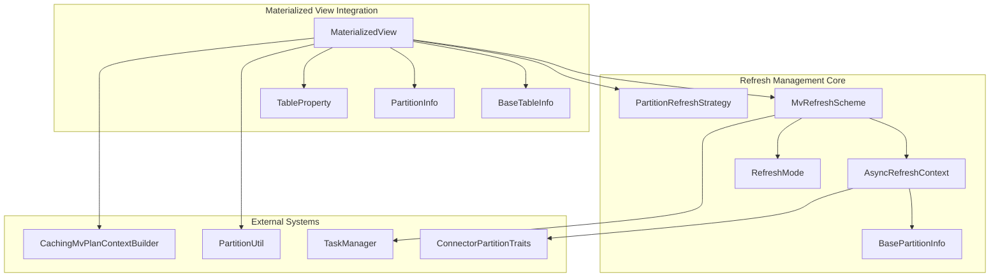
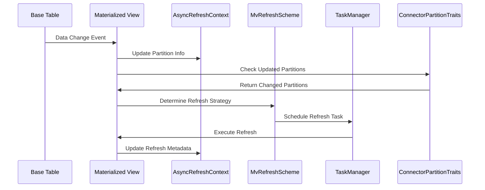
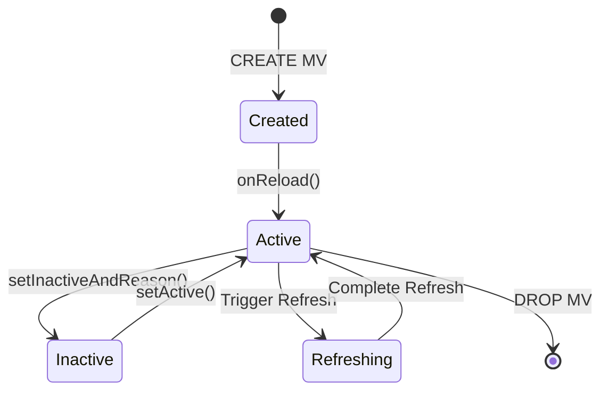
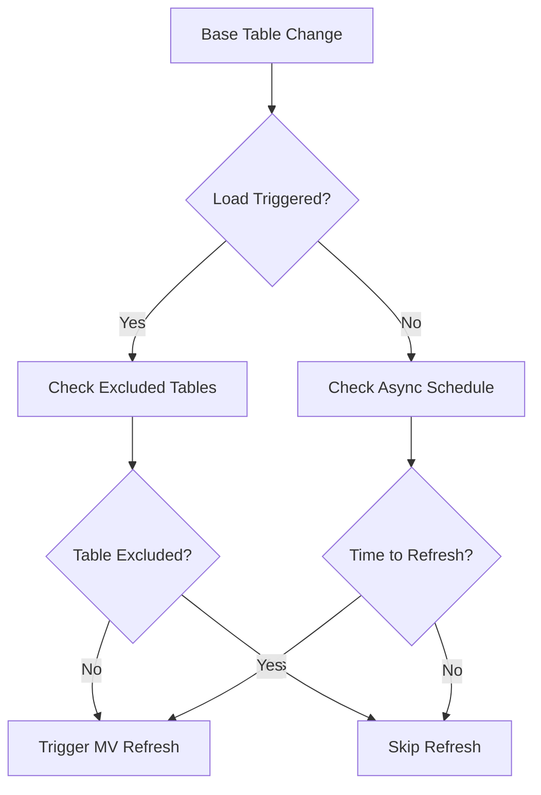
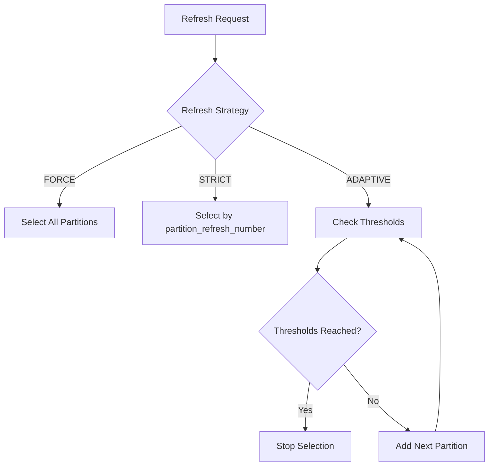

# Refresh Management Module Documentation

## Overview

The refresh_management module is a core component of StarRocks' materialized view system, responsible for managing the refresh lifecycle of materialized views. This module provides sophisticated refresh strategies, partition tracking, and staleness management to ensure materialized views remain current and queryable while optimizing refresh performance.

## Purpose and Core Functionality

The refresh_management module serves as the central orchestrator for materialized view refresh operations, providing:

- **Refresh Strategy Management**: Configurable refresh modes (AUTO, PCT, FULL, INCREMENTAL) with adaptive partition selection
- **Partition Change Tracking**: Intelligent tracking of base table partition changes to minimize refresh scope
- **Staleness Control**: Configurable staleness thresholds for query rewrite optimization
- **Async Refresh Coordination**: Background refresh scheduling with configurable intervals
- **Multi-Table Refresh**: Support for materialized views spanning multiple base tables

## Architecture and Component Relationships

### Core Components

### Data Flow Architecture

## Component Details

### RefreshMode Enum

Controls the overall refresh behavior of materialized views:

- **AUTO**: Automatically determines optimal refresh mode based on MV properties and data changes
- **PCT** (Partition Change Tracking): Only refreshes partitions that have changed since last refresh
- **FULL**: Refreshes all partitions regardless of changes
- **INCREMENTAL**: Refreshes only incremental changed rows since last refresh

### PartitionRefreshStrategy Enum

Defines the strategy for selecting candidate partitions during refresh:

- **FORCE**: Always refreshes all partitions regardless of last refresh time
- **STRICT**: Selects fixed number of candidate partitions based on `partition_refresh_number`
- **ADAPTIVE**: Selects partitions based on thresholds (`mv_max_rows_per_refresh`, `mv_max_bytes_per_refresh`)

### AsyncRefreshContext Class

Maintains comprehensive refresh metadata including:

- **Base Table Version Maps**: Tracks partition versions for both OLAP and external base tables
- **Partition Mapping**: Maintains relationships between MV partitions and base table partitions
- **TVR Version Tracking**: Time-versioned range tracking for complex refresh scenarios
- **Scheduling Configuration**: Start time, step intervals, and time units for periodic refresh

### MvRefreshScheme Class

Encapsulates the complete refresh configuration:

- **Refresh Timing**: IMMEDIATE vs DEFERRED refresh moments
- **Refresh Type**: SYNC, ASYNC, or INCREMENTAL refresh types
- **Async Context**: Associated AsyncRefreshContext for ASYNC refreshes
- **Last Refresh Time**: Timestamp tracking for staleness calculations

### BasePartitionInfo Class

Stores essential partition metadata:

- **Identity**: Partition ID and version information
- **Temporal Data**: Last refresh time and file modification timestamps
- **Statistics**: File count and size information for refresh decisions

## Integration with StarRocks Ecosystem

### Materialized View Lifecycle

### Partition Change Detection

The module integrates with [connector_partition_traits.md](connector_partition_traits.md) to detect changes across different table types:

- **OLAP Tables**: Version-based change detection
- **External Tables**: File modification time and metadata-based detection
- **Hierarchical MVs**: Cascading refresh through MV dependencies

### Query Rewrite Integration

Works with [caching_mv_plan_context_builder.md](caching_mv_plan_context_builder.md) to:

- Determine MV eligibility for query rewrite based on staleness
- Invalidate cached plans when refresh occurs
- Provide refresh status for rewrite decisions

## Refresh Process Flow

### Automatic Refresh Triggering

### Partition Selection Logic

## Configuration and Properties

### Key Properties

- `mv_refresh_mode`: Controls the RefreshMode (AUTO/PCT/FULL/INCREMENTAL)
- `partition_refresh_strategy`: Controls partition selection strategy (FORCE/STRICT/ADAPTIVE)
- `partition_refresh_number`: Number of partitions to refresh in STRICT mode
- `mv_max_rows_per_refresh`: Row threshold for ADAPTIVE mode
- `mv_max_bytes_per_refresh`: Byte threshold for ADAPTIVE mode
- `mv_rewrite_staleness_second`: Staleness threshold for query rewrite

### Table Property Integration

The module integrates with [table_property.md](table_property.md) to provide:

- **Excluded Trigger Tables**: Tables that should not trigger automatic refresh
- **Excluded Refresh Tables**: Tables that should be skipped during refresh
- **Partition Retention**: Conditions for retaining partitions during refresh

## Error Handling and Recovery

### Inactive State Management

Materialized views can become inactive due to:

- Base table schema changes
- Base table deletion
- Refresh failures
- Partition expression analysis failures

The module provides automatic recovery mechanisms through `fixRelationship()` and manual reactivation via `setActive()`.

### Metadata Consistency

Maintains consistency through:

- **Version Tracking**: Ensures partition version consistency across refresh cycles
- **TVR (Time-Versioned Range) Management**: Handles complex multi-table refresh scenarios
- **Cache Invalidation**: Coordinates with plan cache for query rewrite consistency

## Performance Optimizations

### Intelligent Partition Selection

- **Change Detection**: Only refreshes partitions with detected changes
- **Threshold-Based Selection**: Prevents oversized refresh operations
- **Incremental Processing**: Minimizes data processing for incremental refreshes

### Memory Management

- **Concurrent Maps**: Uses thread-safe data structures for metadata management
- **Lazy Initialization**: Defers expensive operations until required
- **Cache Management**: Integrates with system-wide caching strategies

## Monitoring and Observability

### Metrics Integration

Works with [materialized_view_metrics_registry.md](materialized_view_metrics_registry.md) to provide:

- Refresh frequency metrics
- Partition refresh statistics
- Staleness monitoring
- Error rate tracking

### Logging and Debugging

Comprehensive logging for:

- Refresh trigger events
- Partition selection decisions
- Staleness calculations
- Error conditions and recovery attempts

## Dependencies and Related Modules

### Direct Dependencies

- [materialized_view.md](materialized_view.md): Core MV implementation
- [base_table_info.md](base_table_info.md): Base table metadata management
- [partition_info.md](partition_info.md): Partition configuration and management
- [table_property.md](table_property.md): Property configuration system

### Integration Dependencies

- [connector_partition_traits.md](connector_partition_traits.md): External table integration
- [task_manager.md](task_manager.md): Refresh task scheduling
- [caching_mv_plan_context_builder.md](caching_mv_plan_context_builder.md): Query rewrite integration
- [materialized_view_metrics_registry.md](materialized_view_metrics_registry.md): Metrics collection

## Best Practices and Usage Guidelines

### Refresh Strategy Selection

1. **PCT Mode**: Best for large MVs with frequent partial updates
2. **FULL Mode**: Suitable for small MVs or when complete refresh is acceptable
3. **INCREMENTAL Mode**: Optimal for append-only scenarios with defined incremental logic
4. **AUTO Mode**: Recommended for most scenarios with mixed update patterns

### Partition Strategy Configuration

1. **STRICT Strategy**: Use with predictable partition sizes and refresh windows
2. **ADAPTIVE Strategy**: Ideal for variable partition sizes or time-based refreshes
3. **FORCE Strategy**: Use sparingly, primarily for complete data reconciliation

### Performance Tuning

- Set appropriate `mv_max_rows_per_refresh` and `mv_max_bytes_per_refresh` thresholds
- Configure `mv_rewrite_staleness_second` based on query freshness requirements
- Use `excluded_trigger_tables` to prevent unnecessary refresh triggers
- Monitor refresh metrics to optimize scheduling intervals

This comprehensive refresh management system ensures StarRocks materialized views remain current while minimizing refresh overhead and maximizing query performance through intelligent staleness management.