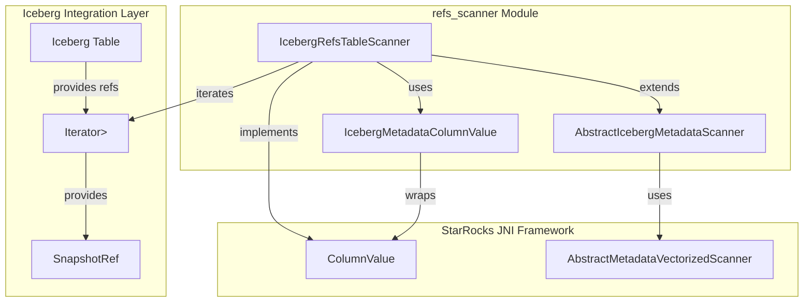
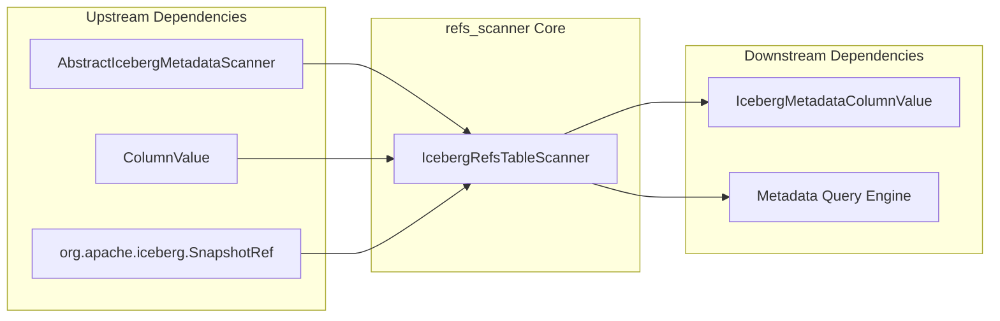
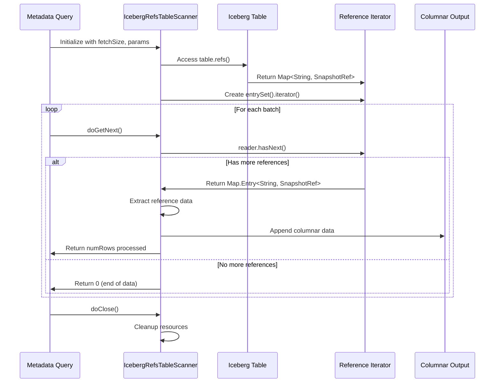
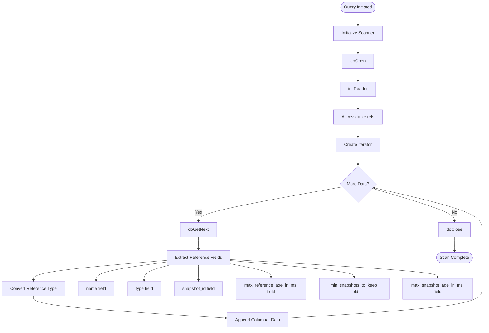

# refs_scanner Module Documentation

## Overview

The `refs_scanner` module is a specialized component within the StarRocks Iceberg metadata reader system that provides functionality for scanning and extracting reference information from Apache Iceberg tables. This module implements the `IcebergRefsTableScanner` class, which is responsible for reading Iceberg table references (branches and tags) and converting them into a structured format suitable for query processing.

## Purpose and Core Functionality

The primary purpose of the refs_scanner module is to:

1. **Extract Reference Metadata**: Scan Iceberg tables to retrieve reference information including branches and tags
2. **Format Reference Data**: Convert Iceberg `SnapshotRef` objects into queryable columnar data
3. **Support Metadata Queries**: Enable SQL queries against Iceberg reference metadata through StarRocks' metadata scanning framework
4. **Provide Reference Insights**: Expose reference properties such as snapshot IDs, reference types, retention policies, and aging information

## Architecture and Component Relationships

### Module Architecture

### Component Dependencies

## Core Components

### IcebergRefsTableScanner

The `IcebergRefsTableScanner` class is the main component of this module, extending `AbstractIcebergMetadataScanner` to provide specialized functionality for reading Iceberg reference metadata.

#### Key Methods:

- **`doOpen()`**: Initializes the scanner (currently empty implementation)
- **`doGetNext()`**: Retrieves the next batch of reference data, processing up to `fetchSize` records
- **`doClose()`**: Cleans up resources by nullifying the reader
- **`initReader()`**: Initializes the iterator over Iceberg table references
- **`get(String, String, SnapshotRef)`**: Extracts specific field values from reference objects

#### Supported Reference Fields:

| Field Name | Data Type | Description |
|------------|-----------|-------------|
| `name` | String | The reference name (branch or tag name) |
| `type` | String | Reference type: "BRANCH" or "TAG" |
| `snapshot_id` | Long | The snapshot ID associated with the reference |
| `max_reference_age_in_ms` | Long | Maximum age of the reference in milliseconds |
| `min_snapshots_to_keep` | Integer | Minimum number of snapshots to retain |
| `max_snapshot_age_in_ms` | Long | Maximum age of snapshots in milliseconds |

## Data Flow Architecture

## Integration with StarRocks Ecosystem

### Metadata Scanning Framework Integration

The refs_scanner module integrates with StarRocks' broader metadata scanning framework through the `AbstractIcebergMetadataScanner` base class, which provides:

- **Vectorized Processing**: Support for batch processing of metadata records
- **Columnar Output**: Integration with StarRocks' columnar data format
- **Timezone Handling**: Proper timezone conversion for temporal data
- **Field Selection**: Support for selective field extraction based on query requirements

### Related Modules

The refs_scanner module works in conjunction with several other StarRocks modules:

- **[iceberg_metadata_reader](iceberg_metadata_reader.md)**: Parent module containing all Iceberg metadata scanners
- **[connectors](connectors.md)**: Provides the Iceberg connector infrastructure
- **[java_extensions](java_extensions.md)**: Hosts the Java extension framework for external data sources
- **[query_execution](query_execution.md)**: Integrates metadata scanning results into query execution pipeline

## Process Flow

## Usage Scenarios

The refs_scanner module is typically used in the following scenarios:

1. **Metadata Discovery**: Querying available references in Iceberg tables
2. **Reference Management**: Analyzing branch and tag configurations
3. **Data Lineage**: Understanding snapshot relationships across references
4. **Retention Policy Analysis**: Examining snapshot retention settings
5. **Reference Age Monitoring**: Tracking reference lifecycle information

## Error Handling

The module implements robust error handling for:

- **Invalid Field Names**: Throws `IllegalArgumentException` for unrecognized column names
- **Null Values**: Properly handles null reference data using `appendData(i, null)`
- **Iterator Management**: Safely manages iterator lifecycle with proper cleanup

## Performance Considerations

- **Batch Processing**: Processes data in configurable batch sizes for optimal memory usage
- **Iterator-based**: Uses memory-efficient iterators for large reference sets
- **Field Selection**: Only processes required fields based on query projection
- **Lazy Initialization**: Defers reader initialization until needed

## Future Enhancements

Potential areas for future development include:

1. **Reference Filtering**: Support for predicate pushdown on reference fields
2. **Parallel Scanning**: Multi-threaded processing for large reference sets
3. **Caching Integration**: Reference metadata caching for improved performance
4. **Extended Metadata**: Additional reference properties as Iceberg evolves
5. **Reference Statistics**: Built-in reference usage and statistics tracking