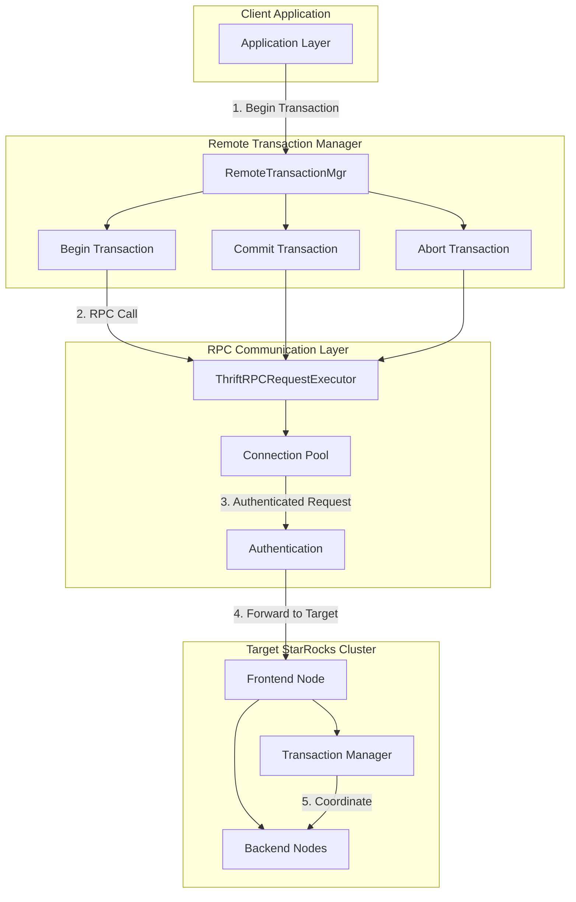
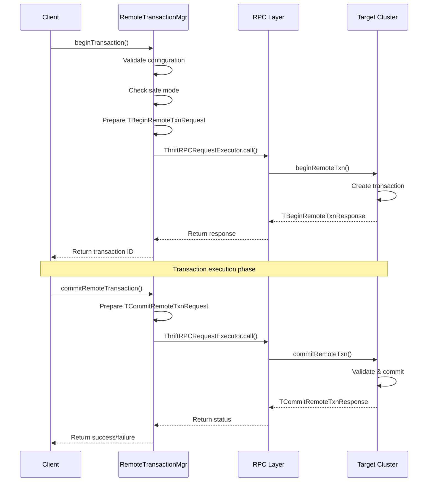
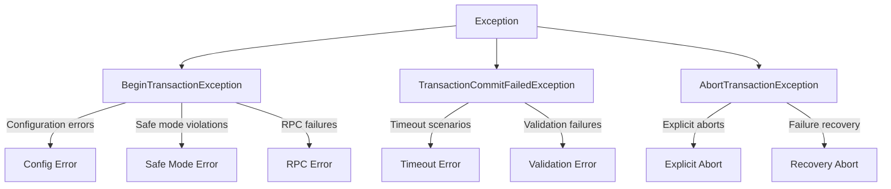

# Remote Transaction Operations Module

## Introduction

The Remote Transaction Operations module provides the core functionality for managing distributed transactions across multiple StarRocks clusters. It enables cross-cluster transaction coordination, allowing operations to span multiple StarRocks instances while maintaining ACID properties and data consistency.

This module is essential for federated query processing, cross-cluster data loading, and distributed analytics scenarios where transactions need to be coordinated across multiple StarRocks deployments.

## Architecture Overview

The Remote Transaction Operations module implements a distributed transaction coordinator that manages the lifecycle of transactions spanning multiple StarRocks clusters. The architecture follows a two-phase commit protocol pattern to ensure consistency across distributed systems.



## Core Components

### RemoteTransactionMgr

The `RemoteTransactionMgr` class serves as the primary entry point for all remote transaction operations. It provides static methods for beginning, committing, and aborting transactions across StarRocks clusters.

**Key Responsibilities:**
- Transaction lifecycle management across distributed clusters
- RPC communication coordination
- Error handling and retry logic
- Timeout management
- Authentication and security validation

**Core Methods:**

#### beginTransaction()
```java
public static long beginTransaction(long dbId, List<Long> tableIdList, String label,
                                    TransactionState.LoadJobSourceType sourceType,
                                    long timeoutSecond, String host, int port, 
                                    TAuthenticateParams authenticateParams)
```

Initiates a new transaction on a remote StarRocks cluster with the following process:

1. **Validation Phase:**
   - Checks if load jobs are disabled via configuration
   - Verifies cluster is not in safe mode
   - Validates timeout parameters based on source type

2. **Request Preparation:**
   - Creates `TBeginRemoteTxnRequest` with transaction parameters
   - Sets database ID, table IDs, label, source type, and timeout
   - Includes authentication parameters

3. **RPC Execution:**
   - Uses `ThriftRPCRequestExecutor` for communication
   - Leverages connection pooling for efficiency
   - Handles network failures and retries

4. **Response Processing:**
   - Validates response status codes
   - Extracts transaction ID from successful responses
   - Logs transaction initiation for audit trails

#### commitRemoteTransaction()
```java
public static boolean commitRemoteTransaction(long dbId, long transactionId,
                                              String host, int port, 
                                              List<TTabletCommitInfo> tabletCommitInfos)
```

Commits a previously initiated remote transaction:

1. **Request Assembly:**
   - Creates `TCommitRemoteTxnRequest` with transaction details
   - Includes tablet commit information for data consistency
   - Sets appropriate timeout values

2. **Distributed Coordination:**
   - Communicates with remote cluster's transaction manager
   - Handles timeout scenarios gracefully
   - Implements proper error propagation

3. **Result Handling:**
   - Returns boolean success status
   - Distinguishes between timeout and failure conditions
   - Provides detailed error information for debugging

#### abortRemoteTransaction()
```java
public static void abortRemoteTransaction(long dbId, long transactionId, String host, int port, 
                                          String errorMsg, List<TTabletCommitInfo> tabletCommitInfos,
                                          List<TTabletFailInfo> tabletFailInfos)
```

Aborts a remote transaction and handles cleanup:

1. **Error Context:**
   - Captures error messages for audit logging
   - Includes failed tablet information
   - Maintains commit information for partial states

2. **Cleanup Coordination:**
   - Notifies remote cluster of transaction abortion
   - Ensures resource cleanup across distributed nodes
   - Handles partial failure scenarios

## Data Flow Architecture



## Integration with System Components

### Transaction State Management
The Remote Transaction Operations module integrates with the broader [transaction](transaction.md) system through:

- **TransactionState Integration:** Uses `TransactionState.LoadJobSourceType` to determine transaction characteristics
- **Timeout Validation:** Leverages `GlobalTransactionMgr.checkValidTimeoutSecond()` for consistent timeout handling
- **Error Handling:** Integrates with transaction-specific exception types (`BeginTransactionException`, `TransactionCommitFailedException`, `AbortTransactionException`)

### RPC Communication Framework
Built on top of the [rpc_layer](frontend_server.md#rpc_layer) infrastructure:

- **Thrift Protocol:** Uses Apache Thrift for cross-language communication
- **Connection Pooling:** Leverages `ThriftConnectionPool.frontendPool` for efficient connection management
- **Request Execution:** Integrates with `ThriftRPCRequestExecutor` for reliable RPC execution
- **Authentication:** Supports `TAuthenticateParams` for secure cluster-to-cluster communication

### Configuration Management
Integrates with [common_config](frontend_server.md#common_config) for operational parameters:

- **Load Job Control:** Respects `Config.disable_load_job` for system-wide load control
- **Safe Mode Handling:** Checks `GlobalStateMgr.getCurrentState().isSafeMode()` for cluster state
- **Timeout Configuration:** Uses `Config.max_stream_load_timeout_second`, `Config.min_load_timeout_second`, and `Config.external_table_commit_timeout_ms`
- **RPC Settings:** Leverages `Config.thrift_rpc_timeout_ms` for network timeout management

## Error Handling and Recovery

### Exception Hierarchy
The module implements a comprehensive exception handling strategy:



### Retry and Recovery Mechanisms
- **Network Failures:** Automatic retry for transient network issues
- **Timeout Handling:** Graceful timeout management with proper status propagation
- **Partial Failures:** Coordinated cleanup for partially failed transactions
- **Audit Logging:** Comprehensive logging for troubleshooting and monitoring

## Security and Authentication

### Cross-Cluster Security
- **Authentication Parameters:** Supports `TAuthenticateParams` for secure communication
- **Cluster Identity:** Validates cluster identity and permissions
- **Audit Trail:** Maintains comprehensive audit logs for all remote operations

### Access Control
- **Load Job Restrictions:** Respects system-wide load job disable settings
- **Safe Mode Protection:** Prevents operations during cluster maintenance
- **Timeout Validation:** Enforces timeout constraints based on operation type

## Performance Considerations

### Connection Management
- **Connection Pooling:** Reuses connections through `ThriftConnectionPool`
- **Timeout Optimization:** Configurable timeouts for different operation types
- **Resource Cleanup:** Proper resource management and cleanup

### Scalability Features
- **Stateless Design:** No persistent state in RemoteTransactionMgr
- **Concurrent Operations:** Supports multiple concurrent remote transactions
- **Load Balancing:** Can distribute operations across multiple frontend nodes

## Monitoring and Observability

### Logging Strategy
- **Transaction Lifecycle:** Logs all major transaction events
- **Error Details:** Comprehensive error logging with context
- **Performance Metrics:** Transaction timing and success rates

### Integration with Monitoring
- **Status Codes:** Uses `TStatusCode` for standardized error reporting
- **Error Messages:** Detailed error messages for troubleshooting
- **Audit Trail:** Complete audit trail for compliance and debugging

## Usage Examples

### Basic Remote Transaction
```java
// Begin transaction
long txnId = RemoteTransactionMgr.beginTransaction(
    dbId, 
    tableIds, 
    "remote-load-label",
    TransactionState.LoadJobSourceType.FRONTEND,
    3600, // 1 hour timeout
    "remote-host", 
    9030,
    authParams
);

// Execute data loading operations...

// Commit transaction
boolean committed = RemoteTransactionMgr.commitRemoteTransaction(
    dbId, 
    txnId, 
    "remote-host", 
    9030, 
    tabletCommitInfos
);

// Or abort if needed
if (!committed) {
    RemoteTransactionMgr.abortRemoteTransaction(
        dbId, 
        txnId, 
        "remote-host", 
        9030, 
        "Operation failed",
        tabletCommitInfos,
        tabletFailInfos
    );
}
```

## Future Enhancements

### Planned Improvements
- **Distributed Consensus:** Enhanced coordination protocols
- **Performance Optimization:** Reduced latency for remote operations
- **Enhanced Monitoring:** Better metrics and alerting
- **Multi-Region Support:** Improved support for geographically distributed clusters

### Integration Roadmap
- **Cloud Storage Integration:** Enhanced support for cloud-based deployments
- **Federated Query Optimization:** Better integration with query planning
- **Cross-Cluster Replication:** Support for active-active configurations