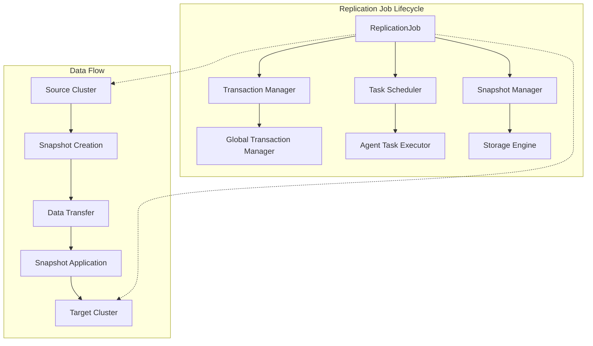
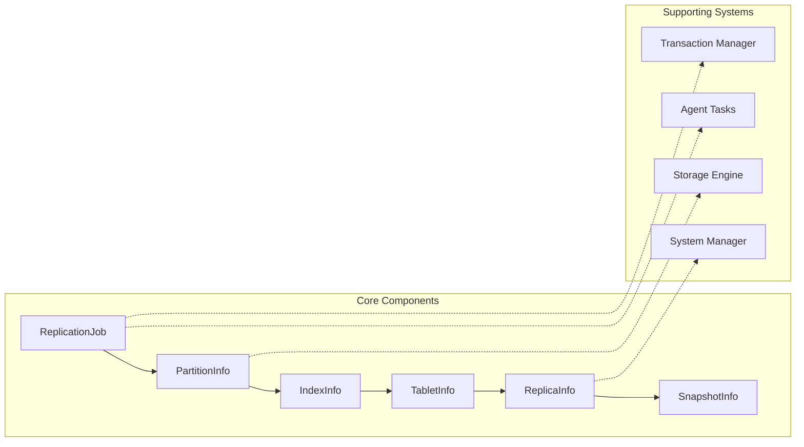
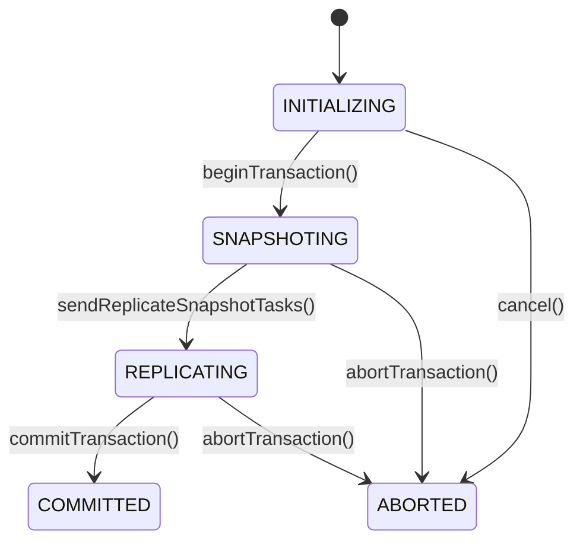
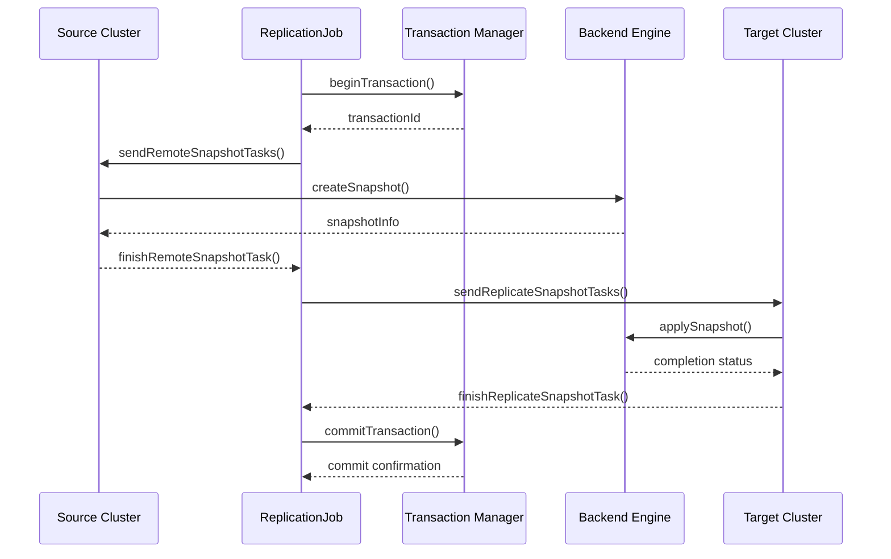
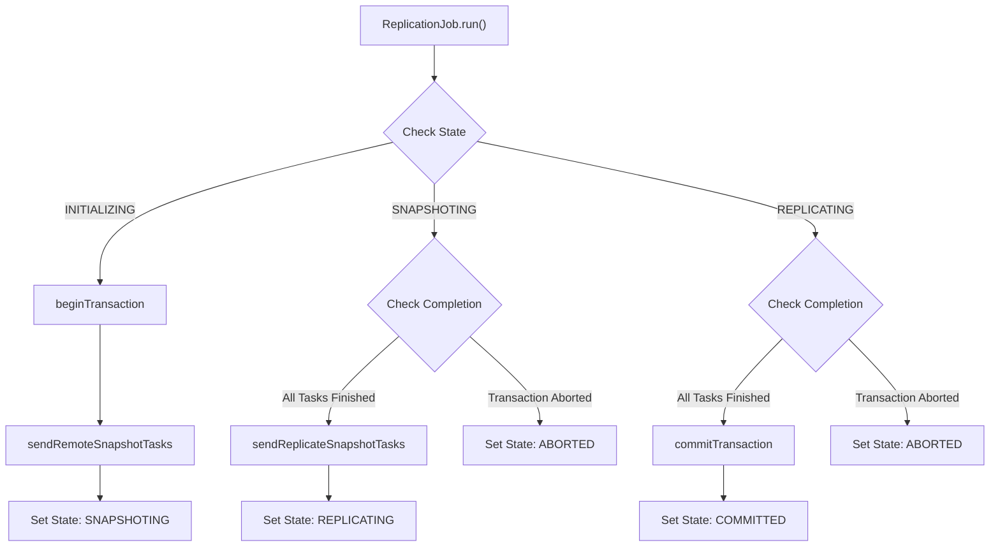
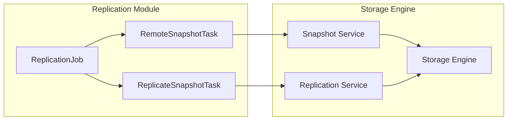

# Replication Module Documentation

## Overview

The replication module in StarRocks provides robust data replication capabilities for maintaining consistency across distributed OLAP tables. It implements a sophisticated multi-stage replication process that ensures data integrity while supporting both regular OLAP tables and cloud-native lake tables.

## Purpose and Core Functionality

The replication module serves as the backbone for StarRocks' data consistency mechanisms, enabling:

- **Cross-cluster data synchronization** for disaster recovery and multi-region deployments
- **Data migration** between different StarRocks clusters
- **Backup and restore operations** with transactional consistency
- **Schema evolution support** during replication processes
- **Incremental replication** to minimize network overhead and replication time

## Architecture

### High-Level Architecture

### Component Relationships

## Core Components

### ReplicationJob

The `ReplicationJob` class is the central orchestrator of the replication process. It manages the entire lifecycle of a replication operation from initialization to completion.

**Key Responsibilities:**
- Job state management and transitions
- Transaction coordination with the Global Transaction Manager
- Task scheduling and monitoring
- Error handling and recovery
- Progress tracking and reporting

**State Machine:**

### PartitionInfo

`PartitionInfo` encapsulates metadata and state information for individual partitions during replication.

**Key Attributes:**
- `partitionId`: Unique identifier for the partition
- `version`: Current version of the target partition
- `dataVersion`: Data version for consistency checking
- `srcVersion`: Source partition version
- `srcVersionEpoch`: Version epoch for conflict resolution
- `indexInfos`: Mapping of index IDs to their replication information

### IndexInfo

`IndexInfo` manages replication metadata for materialized indexes within partitions.

**Key Attributes:**
- `indexId`: Materialized index identifier
- `schemaHash`: Schema hash for validation
- `srcSchemaHash`: Source schema hash for compatibility checking
- `tabletInfos`: Tablet-level replication information

### TabletInfo

`TabletInfo` handles tablet-level replication coordination.

**Key Attributes:**
- `tabletId`: Target tablet identifier
- `srcTabletId`: Source tablet identifier
- `replicaInfos`: Replica-level replication details

### ReplicaInfo

`ReplicaInfo` manages individual replica replication with backend coordination.

**Key Attributes:**
- `backendId`: Target backend identifier
- `srcBackendInfos`: List of source backend information
- `srcSnapshotInfo`: Snapshot information for data transfer

### SnapshotInfo

`SnapshotInfo` encapsulates snapshot metadata for data transfer operations.

**Key Attributes:**
- `backendInfo`: Backend where snapshot is stored
- `snapshotPath`: File system path to snapshot data
- `incrementalSnapshot`: Flag indicating incremental vs full snapshot

## Data Flow Architecture

### Replication Process Flow

### Task Execution Flow

## Integration with Other Modules

### Transaction System Integration

The replication module integrates deeply with StarRocks' transaction system to ensure ACID properties:

- **Atomicity**: All replication operations are wrapped in transactions
- **Consistency**: Version checking ensures data consistency across clusters
- **Isolation**: Table-level locks prevent concurrent modifications during replication
- **Durability**: Transaction logs ensure replication state persistence

### Storage Engine Integration

### System Management Integration

The module coordinates with system management components for:
- Backend discovery and health monitoring
- Resource allocation and load balancing
- Failure detection and recovery
- Configuration management

## Key Features

### Incremental Replication

The module supports incremental replication to minimize data transfer:
- Version-based change detection
- Incremental snapshot creation
- Efficient delta application

### Schema Evolution Support

Handles schema changes during replication:
- Schema hash validation
- Automatic schema adaptation
- Version compatibility checking

### Error Recovery

Comprehensive error handling and recovery mechanisms:
- Transaction rollback on failures
- Task retry with exponential backoff
- State recovery after system crashes
- Detailed error reporting and logging

### Performance Optimization

Multiple optimization strategies:
- Parallel task execution
- Batch processing for multiple tablets
- Efficient snapshot management
- Network bandwidth optimization

## Configuration and Monitoring

### Key Configuration Parameters

- `replication_transaction_timeout_sec`: Transaction timeout for replication operations
- `history_job_keep_max_second`: Retention period for completed replication jobs

### Monitoring and Metrics

The module provides comprehensive monitoring through:
- Job progress tracking
- Task execution statistics
- Error rate monitoring
- Performance metrics collection

## Security Considerations

### Data Encryption

- Snapshot data encryption during transfer
- Secure token-based authentication
- Encrypted communication channels

### Access Control

- Database-level permission checking
- Table-level access validation
- Backend authorization verification

## Dependencies

The replication module depends on several other StarRocks modules:

- **[Transaction Management](transaction.md)**: For ACID transaction support
- **[Storage Engine](storage_engine.md)**: For snapshot creation and application
- **[System Management](system_management.md)**: For backend coordination
- **[Catalog Management](catalog.md)**: For metadata operations
- **[Agent Task System](agent_tasks.md)**: For distributed task execution

## Best Practices

### Performance Optimization

1. **Batch Size Tuning**: Adjust replication batch sizes based on network capacity
2. **Parallel Execution**: Configure appropriate parallelism levels for your cluster size
3. **Incremental Replication**: Use incremental replication for large tables with frequent updates
4. **Resource Allocation**: Ensure adequate backend resources for replication tasks

### Reliability

1. **Monitoring**: Set up comprehensive monitoring for replication jobs
2. **Error Handling**: Implement proper error handling and alerting
3. **Backup Strategy**: Maintain regular backups independent of replication
4. **Testing**: Regularly test replication processes in non-production environments

### Operational Considerations

1. **Network Bandwidth**: Ensure sufficient network capacity for replication traffic
2. **Storage Space**: Maintain adequate storage for snapshots and temporary data
3. **Timing**: Schedule replication during low-traffic periods when possible
4. **Documentation**: Maintain detailed documentation of replication configurations

## Troubleshooting

### Common Issues

1. **Transaction Timeouts**: Increase `replication_transaction_timeout_sec` for large tables
2. **Snapshot Failures**: Check backend storage capacity and permissions
3. **Network Issues**: Verify network connectivity between source and target clusters
4. **Version Conflicts**: Ensure compatible StarRocks versions across clusters

### Diagnostic Tools

- Replication job status monitoring
- Transaction state inspection
- Backend health checking
- Network connectivity testing
- Log analysis for error patterns

## Future Enhancements

The replication module is designed for extensibility with planned enhancements including:

- **Cross-version replication** support
- **Selective replication** of specific partitions or columns
- **Real-time replication** with lower latency
- **Compression optimization** for network efficiency
- **Multi-master replication** scenarios
- **Cloud-native optimizations** for object storage integration