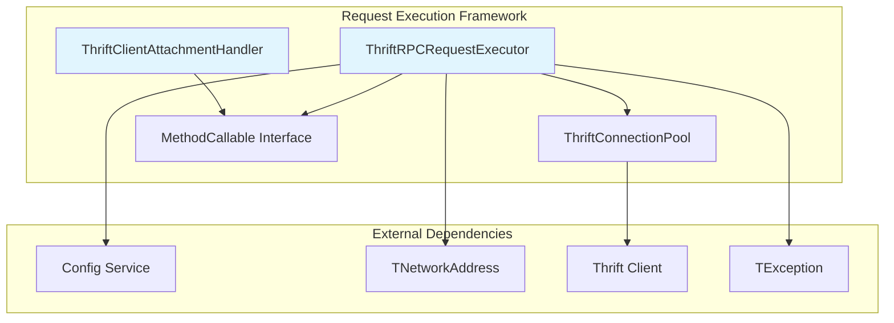
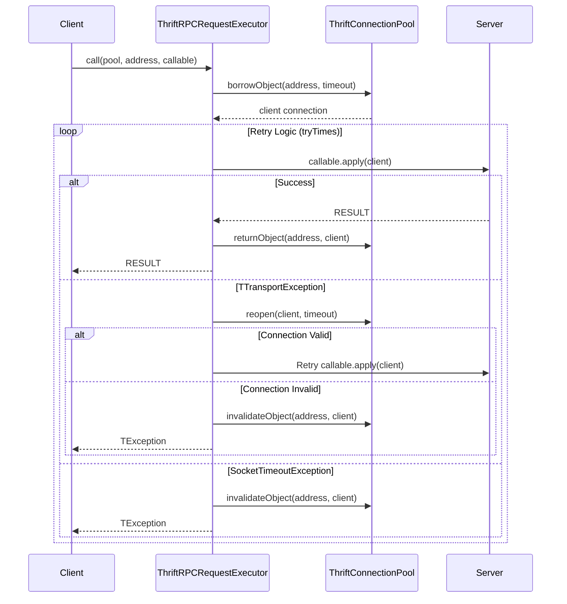
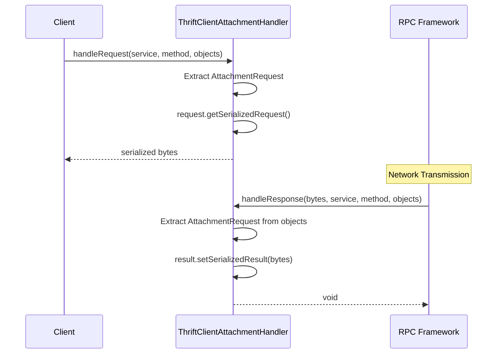
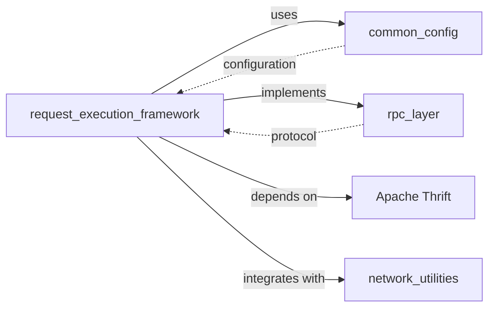

# Request Execution Framework Module

## Introduction

The Request Execution Framework is a critical component of StarRocks' RPC (Remote Procedure Call) infrastructure that handles the execution of thrift-based RPC requests between frontend and backend services. This module provides robust request execution capabilities with connection pooling, retry mechanisms, and attachment handling for efficient inter-service communication.

## Core Functionality

The framework serves as the foundation for reliable RPC communication in the StarRocks distributed architecture, offering:

- **Thrift RPC Request Execution**: Core execution logic for thrift-based RPC calls
- **Connection Pool Management**: Efficient connection reuse and lifecycle management
- **Retry Mechanisms**: Configurable retry logic with timeout handling
- **Attachment Support**: Binary attachment handling for large data transfers
- **Error Handling**: Comprehensive error handling and connection validation

## Architecture

### Component Overview



### Key Components

#### 1. ThriftRPCRequestExecutor

The primary execution engine for thrift RPC requests, providing multiple execution patterns:

- **Standard Execution**: `call()` with configurable retry times
- **No-Retry Execution**: `callNoRetry()` for single attempt execution
- **Timeout-Aware Execution**: Custom timeout configuration per request

**Key Features:**
- Connection borrowing from pools
- Automatic retry on transport exceptions
- Connection validation and recovery
- Timeout exception handling
- Resource cleanup and pool management

#### 2. ThriftClientAttachmentHandler

Handles binary attachments for RPC requests, implementing the `ClientAttachmentHandler` interface:

- **Request Processing**: Serializes attachment requests
- **Response Processing**: Deserializes attachment responses
- **Protocol Integration**: Works with jprotobuf-pbrpc framework

## Data Flow

### RPC Request Execution Flow



### Attachment Handling Flow



## Configuration and Dependencies

### Configuration Integration

The framework integrates with StarRocks' configuration system:

- **thrift_rpc_retry_times**: Configurable retry attempts (default from Config.thrift_rpc_retry_times)
- **Connection Timeout**: Per-request timeout configuration
- **Pool Configuration**: Connection pool settings managed externally

### Dependencies



## Error Handling Strategy

### Exception Classification

1. **Connection Exceptions**: Handled with connection reopening and retry
2. **Timeout Exceptions**: No retry, connection invalidated
3. **Transport Exceptions**: Connection validation and conditional retry
4. **Application Exceptions**: Passed through to caller

### Recovery Mechanisms

- **Connection Reopening**: Automatic connection recovery on transport failures
- **Pool Invalidation**: Removal of broken connections from pool
- **Resource Cleanup**: Proper return/invalidate logic for borrowed connections

## Integration Points

### Frontend Server Integration

The framework is primarily used by the frontend server for:
- Backend service communication
- Query coordination
- Metadata operations
- Load balancing interactions

### RPC Layer Integration

Part of the broader RPC layer ecosystem:
- Connection management ([rpc_layer.md](rpc_layer.md))
- Protocol serialization ([rpc_layer.md](rpc_layer.md))
- Service discovery integration

## Performance Characteristics

### Connection Pool Benefits
- **Connection Reuse**: Reduces connection establishment overhead
- **Resource Management**: Bounded resource usage with pool limits
- **Load Distribution**: Balanced connection distribution across backends

### Retry Strategy Impact
- **Transient Failure Recovery**: Automatic recovery from temporary network issues
- **Timeout Protection**: Prevents indefinite hanging on slow responses
- **Resource Efficiency**: Avoids connection leaks through proper cleanup

## Usage Patterns

### Standard RPC Call
```java
// Standard execution with default retry
RESULT result = ThriftRPCRequestExecutor.call(
    connectionPool,
    networkAddress,
    client -> client.methodCall(parameters)
);
```

### No-Retry Execution
```java
// Single attempt execution
RESULT result = ThriftRPCRequestExecutor.callNoRetry(
    connectionPool,
    networkAddress,
    client -> client.methodCall(parameters)
);
```

### Custom Timeout Execution
```java
// Execution with custom timeout
RESULT result = ThriftRPCRequestExecutor.call(
    connectionPool,
    networkAddress,
    timeoutMs,
    client -> client.methodCall(parameters)
);
```

## Security Considerations

- **Connection Security**: Relies on underlying transport security (TLS/SSL)
- **Attachment Handling**: Binary data handling without content inspection
- **Resource Limits**: Pool-based resource bounding prevents exhaustion

## Monitoring and Observability

### Logging Integration
- **Request Logging**: Debug-level logging for retry attempts
- **Error Logging**: Warning-level logging for final failures
- **Connection Events**: Pool-level connection lifecycle events

### Metrics Integration
- **Connection Pool Metrics**: Borrow/return statistics
- **Retry Metrics**: Success/failure rates per retry attempt
- **Latency Metrics**: Request execution time tracking

## Future Enhancements

### Potential Improvements
- **Circuit Breaker Pattern**: Automatic failure detection and recovery
- **Adaptive Timeouts**: Dynamic timeout adjustment based on historical performance
- **Request Prioritization**: Priority-based request scheduling
- **Async Execution**: Non-blocking request execution support

### Scalability Considerations
- **Pool Partitioning**: Multiple pools for different service types
- **Load-Aware Routing**: Backend selection based on load metrics
- **Connection Multiplexing**: Shared connections for multiple concurrent requests