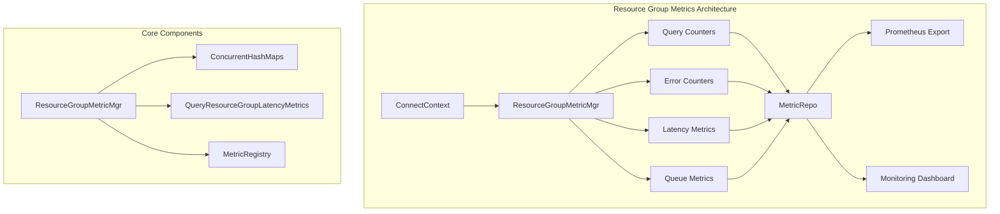
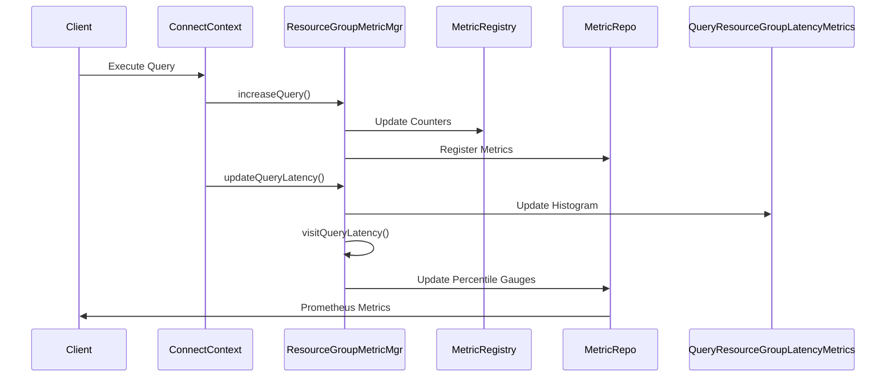
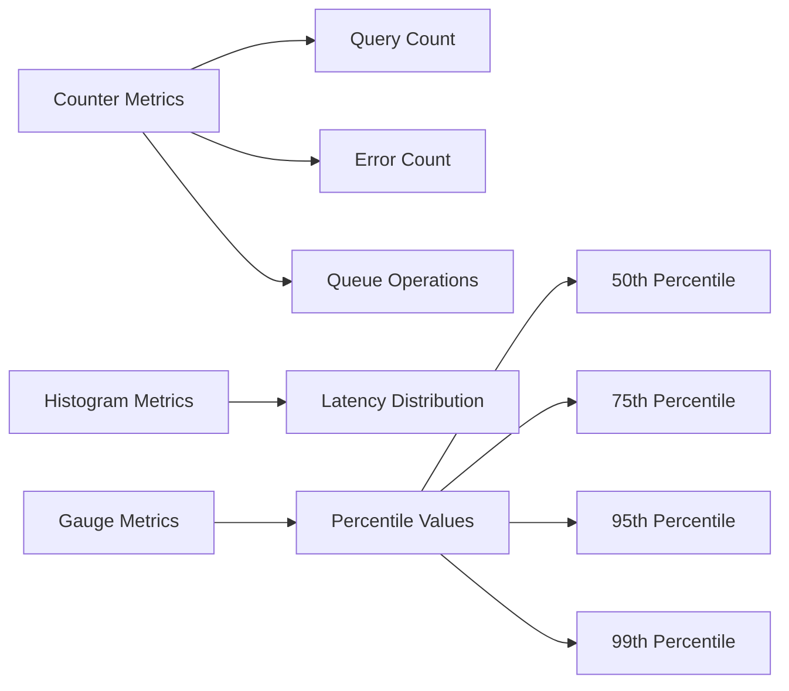

# Resource Group Metrics Module

## Introduction

The Resource Group Metrics module provides comprehensive monitoring and metrics collection for StarRocks' resource group functionality. It tracks query performance, resource utilization, and queue management statistics across different resource groups, enabling administrators to monitor resource allocation effectiveness and identify performance bottlenecks.

## Architecture Overview



## Core Components

### ResourceGroupMetricMgr

The central manager class that coordinates all resource group metrics collection and management. It provides thread-safe operations for updating various metrics including query counts, error rates, latency statistics, and queue management metrics.

**Key Responsibilities:**
- Query counter management
- Error tracking
- Latency histogram collection
- Queue metrics monitoring
- Metric registration and lifecycle management

### QueryResourceGroupLatencyMetrics

A specialized inner class that handles latency metrics collection and percentile calculations for resource group queries. It maintains histogram data and calculates various percentile values (50th, 75th, 95th, 98th, 99th, 99.9th).

**Features:**
- Real-time latency tracking
- Percentile-based performance analysis
- Histogram-based statistical calculations
- Automatic metric updates

## Data Flow



## Metrics Collection

### Query Metrics

The module collects the following query-related metrics:

- **Query Count**: Total number of queries per resource group
- **Error Count**: Number of failed queries per resource group  
- **Query Latency**: Response time distribution with percentiles
- **Queue Metrics**: Pending, total, and timeout queue statistics

### Metric Types



## Thread Safety

The module implements comprehensive thread safety mechanisms:

- **ConcurrentHashMap**: All metric maps use thread-safe collections
- **Synchronized Blocks**: Critical sections for metric creation
- **Atomic Operations**: Counter increments are atomic
- **Immutable Labels**: Metric labels are immutable after creation

## Integration Points

### Session Variable Integration

The module integrates with StarRocks session variables to determine resource group assignment:

- `enableResourceGroup`: Controls resource group functionality
- `enablePipelineEngine`: Required for resource group metrics
- Resource group selection based on context

### Metric Repository Integration

All metrics are registered with the central MetricRepo for:
- Prometheus export
- Monitoring dashboard integration
- Alert system integration
- Historical data retention

## Configuration

### Resource Group Assignment

Resource groups are determined by the following logic:

1. Check if resource groups and pipeline engine are enabled
2. Retrieve resource group from ConnectContext
3. Use DEFAULT_RESOURCE_GROUP_NAME if no group assigned
4. Use DISABLE_RESOURCE_GROUP_NAME if functionality is disabled

### Metric Labels

Each metric includes labels for:
- Resource group name
- Metric type (for latency percentiles)
- Descriptive information

## Performance Considerations

### Memory Management

- Lazy metric creation to minimize memory usage
- Automatic cleanup of unused metrics
- Efficient histogram implementation

### CPU Optimization

- Minimal overhead during query execution
- Batch metric updates where possible
- Optimized percentile calculations

## Monitoring and Alerting

### Key Metrics to Monitor

1. **Query Rate**: Queries per second per resource group
2. **Error Rate**: Failed query percentage
3. **Latency Percentiles**: P50, P95, P99 response times
4. **Queue Depth**: Number of pending queries
5. **Queue Timeout Rate**: Queries timing out in queue

### Alert Conditions

- High error rates (>5%)
- Latency degradation (P99 > threshold)
- Queue buildup (pending queries > limit)
- Queue timeout spikes

## Dependencies

This module depends on several StarRocks components:

- [ConnectContext](query_execution.md): Query execution context
- [ResourceGroup](frontend_server.md): Resource group definitions
- [MetricRepo](metrics.md): Central metrics repository
- [SessionVariable](query_execution.md): Session configuration

## Usage Examples

### Basic Metric Collection

```java
// During query execution
ConnectContext ctx = getConnectContext();
ResourceGroupMetricMgr.increaseQuery(ctx, 1);

// On query completion
long elapsedMs = System.currentTimeMillis() - startTime;
ResourceGroupMetricMgr.updateQueryLatency(ctx, elapsedMs);

// On query error
ResourceGroupMetricMgr.increaseQueryErr(ctx, 1);
```

### Queue Management

```java
// When query enters queue
ResourceGroupMetricMgr.increaseQueuedQuery(ctx, 1);

// When query leaves queue
ResourceGroupMetricMgr.increaseQueuedQuery(ctx, -1);

// On queue timeout
ResourceGroupMetricMgr.increaseTimeoutQueuedQuery(ctx, 1);
```

## Future Enhancements

### Planned Features

1. **Resource Utilization Metrics**: CPU, memory usage per group
2. **Concurrency Tracking**: Active query limits and usage
3. **Historical Trending**: Time-series data retention
4. **Advanced Analytics**: Machine learning-based anomaly detection

### Performance Improvements

1. **Batch Processing**: Aggregate metric updates
2. **Asynchronous Collection**: Non-blocking metric updates
3. **Memory Optimization**: Compressed metric storage
4. **Distributed Collection**: Multi-node metric aggregation

## Troubleshooting

### Common Issues

1. **Missing Metrics**: Check resource group configuration
2. **Incorrect Group Assignment**: Verify session variables
3. **High Memory Usage**: Monitor metric map sizes
4. **Performance Impact**: Adjust metric collection frequency

### Debug Information

Enable debug logging for:
- Metric creation events
- Resource group assignment
- Latency calculation details
- Queue state changes

## References

- [Resource Group Management](frontend_server.md)
- [Query Execution](query_execution.md)
- [Metrics System](metrics.md)
- [Session Management](query_execution.md)