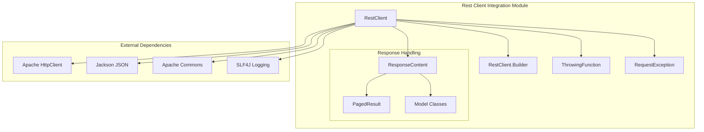
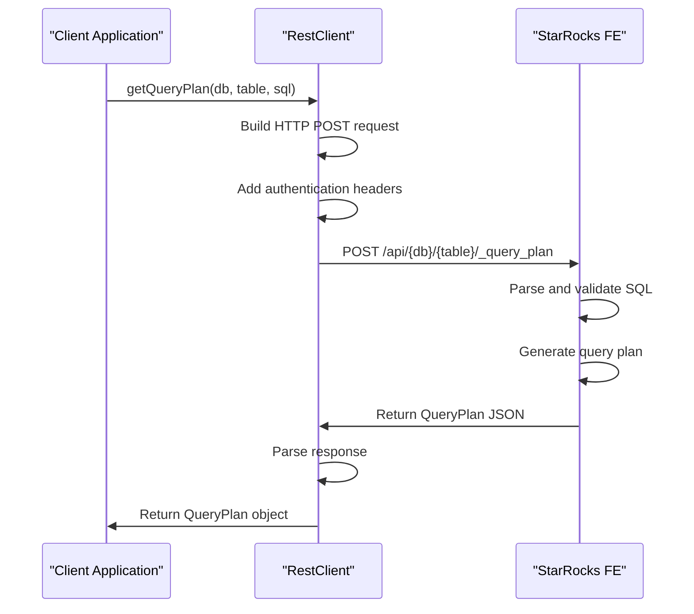
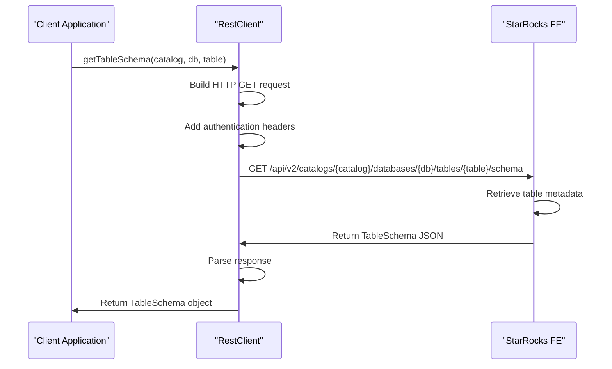
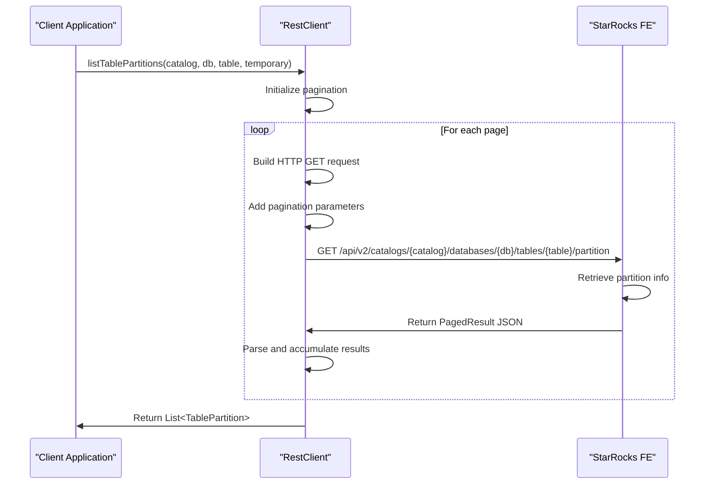
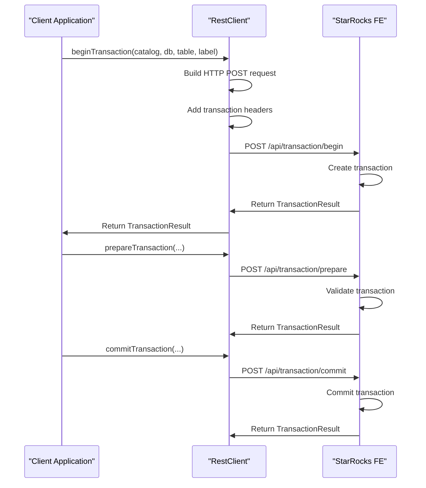
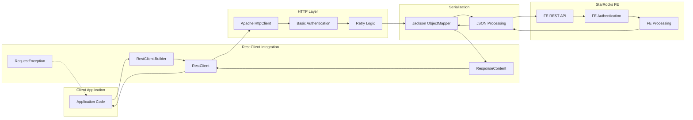
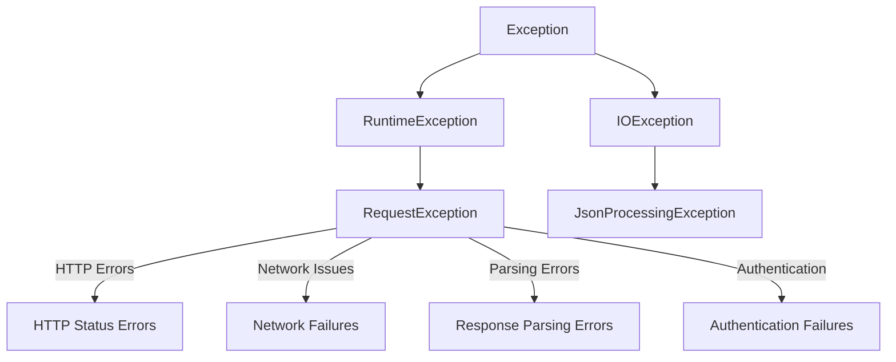

# Rest Client Integration Module

## Introduction

The Rest Client Integration module provides a comprehensive HTTP client solution for interacting with StarRocks Frontend (FE) REST APIs. This module serves as a bridge between external applications and StarRocks clusters, enabling programmatic access to query planning, table metadata, partition information, and transaction management functionality.

## Module Overview

The rest_client_integration module is part of the format-sdk and provides a high-level, user-friendly interface for communicating with StarRocks FE services. It abstracts the complexity of HTTP communication, authentication, error handling, and response parsing while providing robust retry mechanisms and connection pooling capabilities.

## Core Architecture

### Component Structure



### Key Components

#### 1. RestClient Class
The main client class that provides methods for interacting with StarRocks FE APIs:

- **Authentication**: Supports username/password authentication using HTTP Basic Auth
- **Connection Management**: Configurable connection and socket timeouts
- **Retry Logic**: Built-in retry mechanism with configurable retry count
- **Endpoint Management**: Support for multiple FE endpoints with automatic failover

#### 2. RestClient.Builder
A fluent builder pattern implementation for creating RestClient instances:

- **Endpoint Configuration**: Support for single or multiple FE endpoints
- **Authentication Setup**: Username and password configuration
- **Timeout Configuration**: Connection and socket timeout settings
- **Retry Configuration**: Configurable retry count for failed requests

#### 3. ResponseContent<T>
Generic response wrapper for handling API responses:

- **Status Code Handling**: Success/failure determination based on response code
- **Paged Results**: Support for paginated API responses
- **Type Safety**: Generic type support for different response types

#### 4. ThrowingFunction<T, R, E>
Functional interface for handling response parsing with exception propagation:

- **Exception Handling**: Allows checked exceptions in functional contexts
- **Response Parsing**: Type-safe response entity parsing
- **Error Propagation**: Proper exception chaining and propagation

## API Functionality

### Query Planning



### Table Schema Retrieval



### Partition Management



### Transaction Management



## Data Flow Architecture



## Error Handling Strategy

### Exception Hierarchy



### Retry Mechanism

The module implements a sophisticated retry mechanism:

1. **Configurable Retry Count**: Default 3 retries, customizable via builder
2. **Random Endpoint Selection**: Automatic load balancing across multiple FE endpoints
3. **Exception-Based Retries**: Retries on network failures and temporary errors
4. **Logging**: Comprehensive logging for debugging retry attempts

## Configuration Options

### Connection Configuration

| Parameter | Default | Description |
|-----------|---------|-------------|
| connectTimeoutMillis | 30000 | HTTP connection timeout in milliseconds |
| socketTimeoutMillis | 30000 | HTTP socket timeout in milliseconds |
| retries | 3 | Number of retry attempts for failed requests |

### Authentication Configuration

| Parameter | Required | Description |
|-----------|----------|-------------|
| username | Yes | StarRocks cluster username |
| password | Yes | StarRocks cluster password |
| feHttpEndpoints | Yes | One or more FE HTTP endpoints |

## Integration Points

### Related Modules

- **[format_conversion_engine](format_conversion_engine.md)**: Provides data format conversion capabilities that work with query plans retrieved via RestClient
- **[java_api_layer](java_api_layer.md)**: Higher-level Java APIs that may use RestClient for backend communication
- **[configuration_management](configuration_management.md)**: Configuration system that may provide settings for RestClient instances

### External Dependencies

- **Apache HttpClient 4.x**: HTTP communication layer
- **Jackson Databind**: JSON serialization/deserialization
- **Apache Commons Lang3**: Utility functions
- **Apache Commons Collections4**: Collection utilities
- **SLF4J**: Logging facade

## Usage Examples

### Basic Client Creation

```java
RestClient client = RestClient.newBuilder()
    .feHttpEndpoints("http://127.0.0.1:8030")
    .username("root")
    .password("password")
    .build();
```

### Query Plan Retrieval

```java
QueryPlan plan = client.getQueryPlan("database", "table", "SELECT * FROM table WHERE id > 100");
```

### Transaction Management

```java
// Begin transaction
TransactionResult beginResult = client.beginTransaction("catalog", "db", "table", "label123");

// Prepare transaction with tablet information
List<TabletCommitInfo> successTablets = // ... success tablets
List<TabletFailInfo> failureTablets = // ... failure tablets
TransactionResult prepareResult = client.prepareTransaction("catalog", "db", "label123", successTablets, failureTablets);

// Commit transaction
TransactionResult commitResult = client.commitTransaction("catalog", "db", "label123");
```

## Performance Considerations

### Connection Pooling

The RestClient creates new HTTP connections for each request. For high-throughput scenarios, consider:

- Implementing connection pooling at the application level
- Reusing RestClient instances across multiple requests
- Configuring appropriate timeout values based on network conditions

### Endpoint Selection

- Multiple FE endpoints are automatically load-balanced using random selection
- Failed endpoints are retried with other available endpoints
- Endpoint health is not proactively monitored

### Serialization Overhead

- JSON serialization/deserialization happens for each request/response
- Consider the size of response data when designing queries
- Use pagination for large result sets

## Security Features

### Authentication

- HTTP Basic Authentication using username/password credentials
- Credentials are sent with every request
- No token-based authentication support

### Transport Security

- Supports both HTTP and HTTPS endpoints
- No certificate validation configuration exposed
- SSL/TLS configuration relies on system defaults

## Monitoring and Observability

### Logging

- SLF4J-based logging with configurable levels
- Request/response logging at DEBUG level
- Error logging with full exception details

### Metrics

- No built-in metrics collection
- Integration points available for custom metrics
- Request timing and success/failure rates can be tracked externally

## Limitations and Considerations

### Current Limitations

1. **No Connection Pooling**: Each request creates a new HTTP connection
2. **Basic Authentication Only**: No support for token-based authentication
3. **No Circuit Breaker**: No automatic failure detection and recovery
4. **Limited Retry Logic**: Simple retry without exponential backoff
5. **No Request Caching**: No built-in caching mechanism for repeated requests

### Future Enhancements

Potential areas for improvement:

- Connection pooling for better performance
- Token-based authentication support
- Circuit breaker pattern implementation
- Advanced retry strategies with exponential backoff
- Request/response caching mechanisms
- Metrics and monitoring integration
- Async/reactive API support

## Best Practices

### Client Lifecycle Management

- Create RestClient instances once and reuse them
- Properly close clients using try-with-resources or explicit close()
- Consider connection pooling for high-throughput applications

### Error Handling

- Always handle RequestException appropriately
- Implement retry logic at the application level if needed
- Log errors with sufficient context for debugging

### Configuration

- Use appropriate timeout values based on network conditions
- Configure multiple FE endpoints for high availability
- Set reasonable retry counts to avoid excessive retries

### Security

- Use HTTPS endpoints in production environments
- Secure credential storage and management
- Implement proper access controls at the application level

This documentation provides a comprehensive overview of the Rest Client Integration module, its architecture, functionality, and usage patterns. The module serves as a critical component for enabling external applications to interact with StarRocks clusters through a well-designed, robust HTTP client interface.