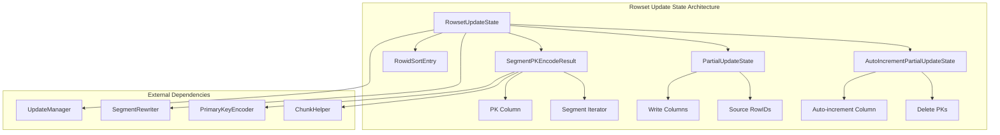
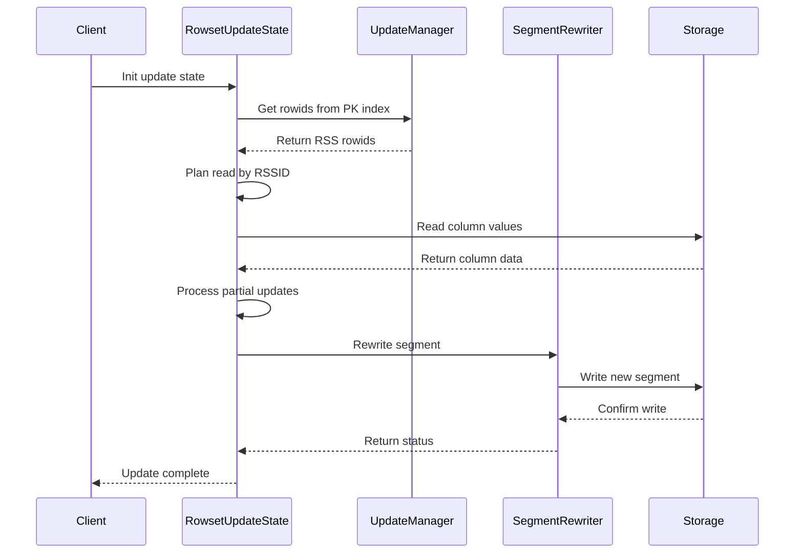
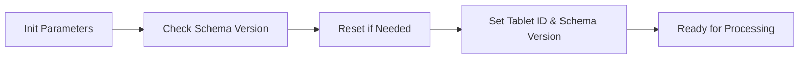
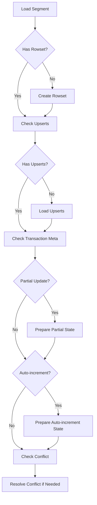
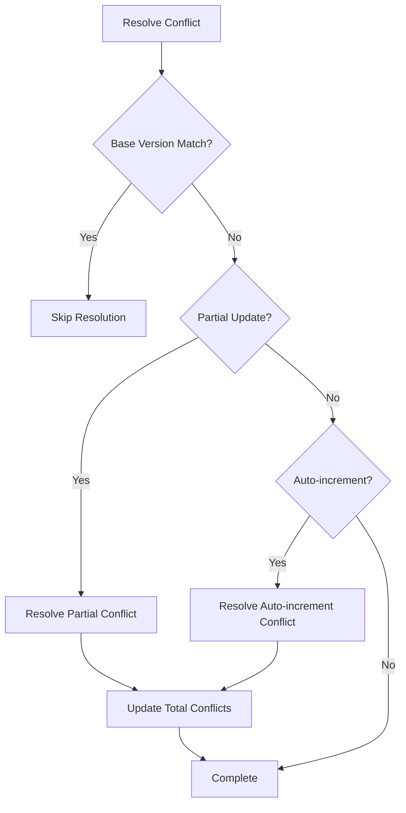
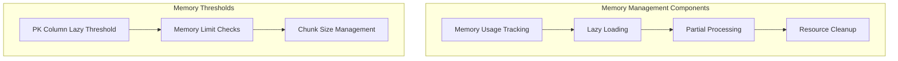
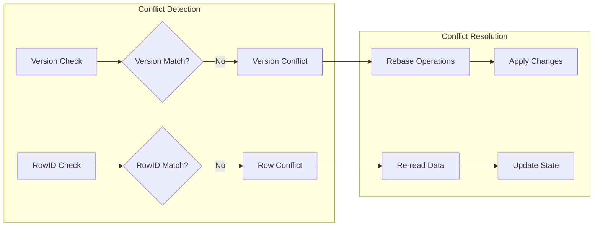
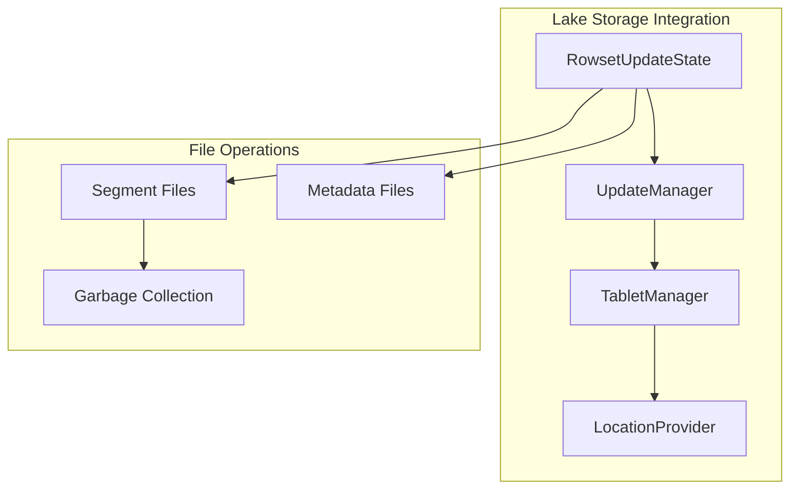

# Rowset Update State Module Documentation

## Introduction

The `rowset_update_state` module is a critical component of StarRocks' lake storage architecture that manages the state and lifecycle of rowset updates. It handles partial updates, auto-increment operations, conflict resolution, and segment rewriting for the lake storage format. This module ensures data consistency and correctness during update operations in the lake storage environment.

## Core Purpose

The module serves as the central coordinator for:
- **Partial Update Management**: Handling column-level updates without rewriting entire segments
- **Auto-increment Column Handling**: Managing auto-increment column updates with conflict detection
- **Conflict Resolution**: Resolving update conflicts when multiple transactions affect the same data
- **Segment Rewriting**: Efficiently rewriting segments with updated data while maintaining data integrity
- **Memory Management**: Optimizing memory usage during large update operations

## Architecture Overview



## Key Components

### RowsetUpdateState
The main class that orchestrates all update operations. It manages the lifecycle of updates, coordinates partial updates, handles conflicts, and interfaces with the storage layer.

**Key Responsibilities:**
- Initialize and manage update state parameters
- Load and process segments for updates
- Handle partial update states and auto-increment operations
- Resolve conflicts between concurrent transactions
- Manage memory usage and cleanup

### SegmentPKEncodeResult
Handles the encoding and processing of primary key data from segments. It provides lazy loading capabilities to optimize memory usage for large datasets.

**Key Features:**
- Lazy loading of primary key columns based on memory thresholds
- Efficient iteration over segment data
- Memory usage tracking and optimization

### RowidSortEntry
A utility structure for sorting and organizing row identifiers by RSSID (RowSet Segment ID). This enables efficient grouping and processing of rows during update operations.

**Structure:**
```cpp
struct RowidSortEntry {
    uint32_t rowid;  // Row identifier within segment
    uint32_t idx;    // Original index for reordering
    bool operator<(const RowidSortEntry& rhs) const { return rowid < rhs.rowid; }
};
```

## Data Flow Architecture



## Update Processing Flow

### 1. Initialization Phase


### 2. Segment Loading Phase


### 3. Conflict Resolution Phase


## Memory Management Strategy

The module implements sophisticated memory management to handle large datasets efficiently:



**Key Memory Optimizations:**
- **Lazy Loading**: Primary key columns are loaded incrementally based on memory usage thresholds
- **Partial Processing**: Only necessary columns are processed during partial updates
- **Resource Tracking**: All memory allocations are tracked and properly released
- **Chunk-based Processing**: Data is processed in manageable chunks to prevent memory exhaustion

## Conflict Resolution Mechanism

The module handles two types of conflicts:

### 1. Version Conflicts
When a transaction's base version doesn't match the latest version, indicating concurrent modifications.

### 2. Row-level Conflicts
When multiple transactions modify the same rows, detected through RSSID comparison.



## Integration with Lake Storage

The module integrates seamlessly with the lake storage architecture:



## Dependencies

### Internal Dependencies
- **[lake_storage](lake_storage.md)**: Core lake storage functionality
- **[rowset_management](rowset_management.md)**: Segment and rowset management
- **[primary_index](persistent_index.md)**: Primary key indexing and lookup
- **[data_structures](data_structures.md)**: Core data structures and utilities

### External Dependencies
- **FileSystem**: For reading and writing segment files
- **PrimaryKeyEncoder**: For encoding and decoding primary keys
- **ChunkHelper**: For column and schema operations
- **SegmentRewriter**: For rewriting segments with updated data

## Performance Considerations

### Optimization Strategies
1. **Lazy Loading**: Reduces memory footprint for large segments
2. **Batch Processing**: Processes multiple rows together for better cache utilization
3. **Index-based Lookups**: Uses primary key indexes for fast row identification
4. **Selective Column Processing**: Only processes columns that need updates

### Monitoring and Metrics
The module provides comprehensive tracing and metrics:
- Segment loading latency
- Conflict resolution time
- Memory usage tracking
- Partial update statistics

## Error Handling

The module implements robust error handling with:
- **Status-based Return Codes**: All operations return detailed status information
- **Exception Safety**: RAII patterns ensure resource cleanup
- **Memory Limit Checks**: Prevents out-of-memory conditions
- **File Operation Validation**: Ensures data integrity during file operations

## Usage Examples

### Basic Update Flow
```cpp
RowsetUpdateState state;
RowsetUpdateStateParams params;

// Initialize state
state.init(params);

// Load segment for update
auto status = state.load_segment(segment_id, params, base_version, 
                                need_resolve_conflict, need_lock);

// Process updates and rewrite segment
if (status.ok()) {
    status = state.rewrite_segment(segment_id, txn_id, params, 
                                  &replace_segments, &orphan_files);
}
```

### Conflict Resolution
```cpp
// Automatic conflict resolution during segment loading
status = state.load_segment(segment_id, params, base_version, 
                           true /*need_resolve_conflict*/, need_lock);

// Manual conflict resolution
status = state._resolve_conflict(segment_id, params, base_version);
```

## Future Enhancements

Potential areas for improvement:
1. **Parallel Processing**: Multi-threaded segment processing
2. **Advanced Caching**: Intelligent caching of frequently accessed data
3. **Compression**: Compression of update state data
4. **Streaming Updates**: Support for streaming update operations
5. **Advanced Conflict Resolution**: More sophisticated conflict resolution strategies

## Conclusion

The `rowset_update_state` module is a sophisticated component that enables efficient and reliable update operations in StarRocks' lake storage environment. Its design emphasizes memory efficiency, conflict resolution, and seamless integration with the broader storage architecture. The module's comprehensive approach to handling partial updates, auto-increment operations, and conflict resolution makes it a critical component for maintaining data consistency and performance in lake storage deployments.