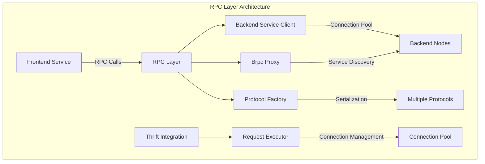
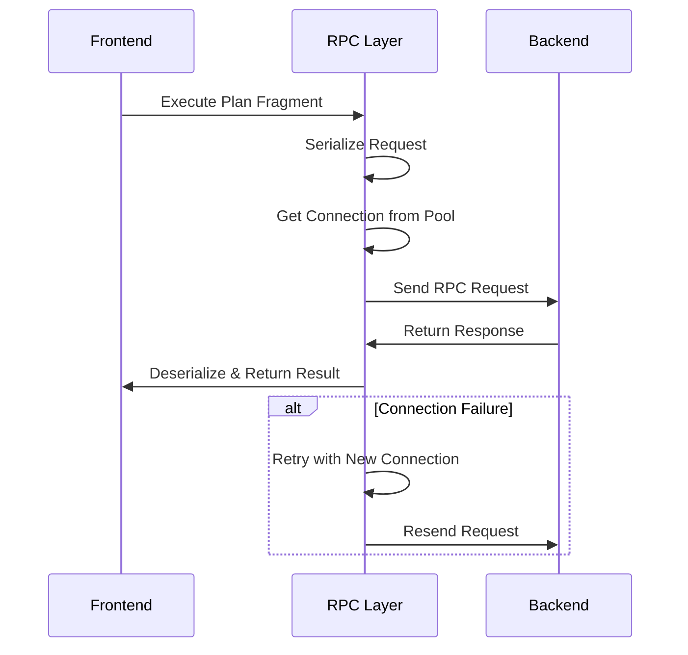

# RPC Layer Module Documentation

## Overview

The RPC (Remote Procedure Call) Layer module serves as the communication backbone of the StarRocks distributed database system. It provides reliable, high-performance inter-service communication between Frontend (FE) and Backend (BE) nodes, enabling distributed query execution, data coordination, and system management operations.

## Purpose and Core Functionality

The RPC Layer is responsible for:

- **Inter-node Communication**: Facilitating seamless communication between FE and BE nodes in the cluster
- **Query Execution Coordination**: Managing the distribution and execution of query fragments across backend nodes
- **Data Transfer**: Handling efficient data movement between services during query processing
- **Service Discovery**: Managing service endpoint resolution and connection pooling
- **Protocol Flexibility**: Supporting multiple serialization protocols (Binary, Compact, JSON, Simple JSON)
- **Fault Tolerance**: Implementing retry mechanisms and connection resilience
- **Performance Monitoring**: Providing metrics and monitoring capabilities for RPC operations

## Architecture Overview

## Core Components

### 1. Backend Service Client (`BackendServiceClient`)
The primary client interface for communicating with backend services. It provides asynchronous methods for:
- Plan fragment execution
- Query cancellation
- Data fetching
- Profile reporting
- MV maintenance tasks
- Command execution

### 2. Brpc Proxy (`BrpcProxy`)
Manages RPC client instances and connection pools for both backend services and lake services. Key features:
- Connection pooling with configurable parameters
- Service caching to avoid repeated proxy creation
- DNS resolution support for FQDN addresses
- Thread-safe concurrent access

### 3. Protocol Configuration (`ConfigurableSerDesFactory` & `ConfigurableTProtocolFactory`)
Provides flexible serialization/deserialization with support for:
- Binary protocol (default)
- Compact protocol
- JSON protocol
- Simple JSON protocol
- Configurable message size limits and recursion depth

### 4. Request Execution (`ThriftRPCRequestExecutor`)
Handles Thrift-based RPC request execution with:
- Connection pooling integration
- Retry mechanisms with configurable attempts
- Timeout management
- Connection validation and recovery

### 5. Attachment Handling (`ThriftClientAttachmentHandler`)
Manages request/response attachments for efficient data transfer:
- Request serialization handling
- Response deserialization
- Binary attachment support

## Sub-modules

The RPC Layer is organized into several specialized sub-modules:

### [Backend Service Management](backend_service_management.md)
Manages communication with backend services including plan execution, data fetching, and query coordination. This sub-module handles the primary interface for FE-BE communication, providing asynchronous methods for plan fragment execution, query cancellation, data retrieval, and maintenance operations.

### [Protocol and Serialization](protocol_serialization.md)
Handles multiple serialization protocols and configurable protocol factories for flexible data exchange. Supports Binary, Compact, JSON, and Simple JSON protocols with configurable message size limits and recursion depth controls.

### [Connection Management](connection_management.md)
Provides connection pooling, service discovery, and connection lifecycle management. Implements efficient connection reuse, DNS resolution support, and thread-safe concurrent access to service proxies.

### [Request Execution Framework](request_execution_framework.md)
Implements the core request execution logic with retry mechanisms and error handling. Provides robust execution framework with connection validation, timeout management, and comprehensive error recovery strategies.

## Data Flow

## Integration Points

The RPC Layer integrates with several other system modules:

- **[Query Execution](query_execution.md)**: Coordinates query fragment execution across backend nodes
- **[Frontend Server](frontend_server.md)**: Provides the communication interface for FE operations
- **[Backend Server](backend_server.md)**: Handles backend service requests and responses
- **[Storage Engine](storage_engine.md)**: Facilitates data operations and storage management

## Configuration

Key configuration parameters include:

- `brpc_connection_pool_size`: Maximum connections in the pool
- `brpc_send_plan_fragment_timeout_ms`: Timeout for plan fragment execution
- `thrift_max_message_size`: Maximum message size for Thrift protocol
- `thrift_rpc_retry_times`: Number of retry attempts for failed RPC calls

## Performance Characteristics

- **Connection Pooling**: Reduces connection establishment overhead
- **Asynchronous Operations**: Non-blocking request processing
- **Protocol Optimization**: Multiple protocol options for different use cases
- **Retry Mechanisms**: Automatic retry for transient failures
- **Service Caching**: Avoids repeated service proxy creation

## Error Handling

The RPC Layer implements comprehensive error handling:

- Connection failure detection and recovery
- Request timeout management
- Service unavailability handling
- Retry logic with exponential backoff
- Detailed logging for debugging and monitoring

This documentation provides a comprehensive overview of the RPC Layer's architecture and functionality. For detailed information about specific sub-modules, refer to their individual documentation files.