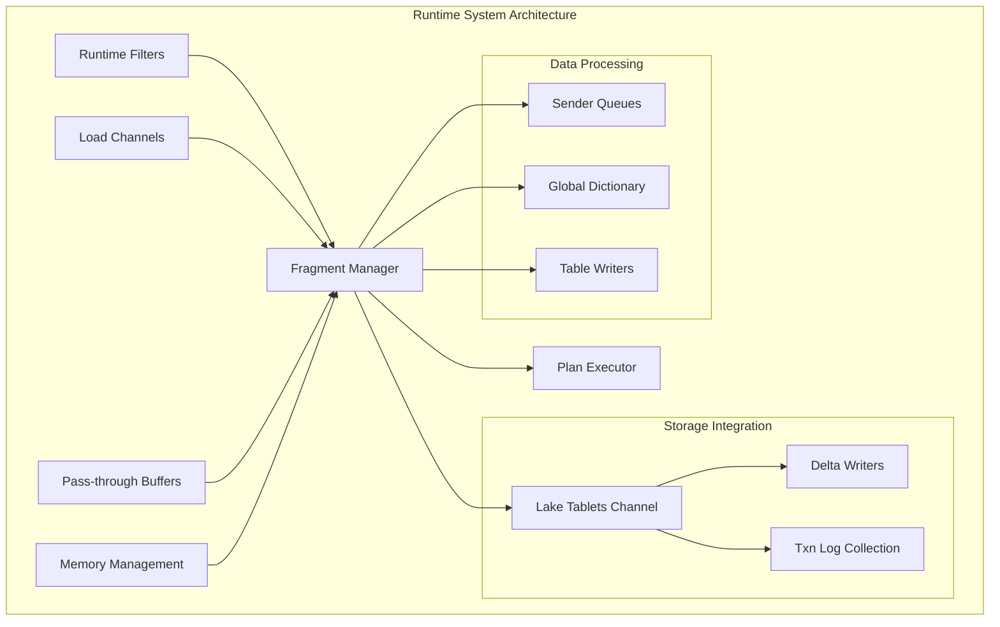
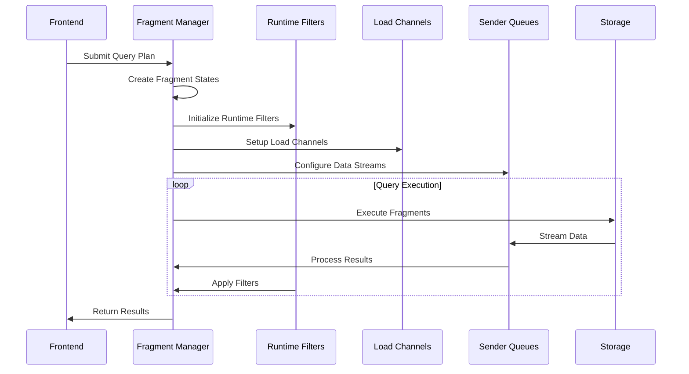

# Runtime System Module Documentation

## Overview

The runtime_system module is a core component of StarRocks' backend execution engine, responsible for managing query execution lifecycle, memory management, data streaming, and runtime coordination. This module provides the foundational infrastructure that enables efficient distributed query processing across the StarRocks cluster.

## Architecture

## Core Components

### 1. Fragment Management
The fragment manager orchestrates distributed query execution by coordinating plan fragments across backend nodes. It handles fragment lifecycle, status reporting, and runtime filter distribution.

**Key Components:**
- `RuntimeProfile`: Performance monitoring and profiling
- `FragmentExecState`: Individual fragment execution state management
- Plan fragment preparation and execution coordination

### 2. Runtime Filter System
Provides efficient predicate pushdown and bloom filter-based optimization for join operations across distributed nodes.

**Key Components:**
- `RuntimeFilterCache`: Caching mechanism for runtime filters
- `RuntimeFilterWorker`: Background worker for filter processing
- `RuntimeFilterPort`: Local filter reception and distribution

### 3. Load Channel Management
Manages data ingestion pipelines for streaming loads and batch operations, ensuring data consistency and fault tolerance.

**Key Components:**
- `ChannelOpenTask`: Asynchronous channel initialization
- `LoadChannel`: Individual load operation management
- Memory tracking and backpressure handling

### 4. Data Streaming Infrastructure
Provides high-performance data transfer mechanisms between query execution stages.

**Key Components:**
- `PassThroughSenderChannel`: Zero-copy data transfer
- `SenderQueue`: Ordered chunk delivery with flow control
- Compression and serialization optimization

### 5. Storage Integration
Coordinates with the storage engine for data writes, transaction management, and consistency guarantees.

**Key Components:**
- `TxnLogCollector`: Transaction log aggregation
- Lake storage integration for cloud-native deployments
- Delta writer coordination

## Sub-modules

### [Fragment Management](fragment_management.md)
Detailed documentation for query fragment lifecycle management, execution coordination, and performance profiling. Covers fragment state management, execution scheduling, and coordination with the query execution engine.

### [Runtime Filter System](runtime_filter_system.md)
Comprehensive guide to runtime filter architecture, implementation, and optimization strategies. Explains bloom filter-based predicate pushdown, distributed filter coordination, and performance optimization techniques.

### [Load Channel System](load_channel_system.md)
Documentation for data ingestion pipelines, load coordination, and memory management. Details asynchronous load processing, channel lifecycle management, and integration with storage engines for data persistence.

### [Data Streaming](data_streaming.md)
Details on inter-fragment data transfer, pass-through optimization, and flow control mechanisms. Covers zero-copy data transfer, chunk serialization, and backpressure handling for efficient data movement.

### [Storage Runtime Integration](storage_runtime_integration.md)
Integration patterns with storage engines, transaction management, and consistency protocols. Explains tablet channel coordination, transaction log collection, and support for various storage backends including lake storage.

## Data Flow

## Performance Characteristics

- **Fragment Management**: Sub-millisecond fragment coordination with scalable thread pool
- **Runtime Filters**: Microsecond-level filter application with efficient bloom filter implementation
- **Data Streaming**: Zero-copy pass-through for local transfers, optimized serialization for remote transfers
- **Load Channels**: Configurable memory limits with automatic backpressure and spill-to-disk capabilities

## Integration Points

### With Query Execution Engine
- Plan fragment distribution and execution
- Runtime filter propagation during join operations
- Query result aggregation and delivery

### With Storage Engine
- Transaction coordination for data modifications
- Lake storage integration for cloud deployments
- Memory management for write operations

### With Memory Management
- Query-level memory tracking and limits
- Load operation memory accounting
- Runtime filter memory optimization

## Configuration

Key configuration parameters:
- `fragment_pool_thread_num`: Thread pool size for fragment execution
- `runtime_filter_queue_limit`: Queue size limits for runtime filters
- `load_process_max_memory_limit_percent`: Memory limits for load operations
- `max_queueing_memtable_per_tablet`: Backpressure thresholds

## Monitoring and Observability

The runtime system provides comprehensive metrics through:
- Runtime profiles for query execution analysis
- Load channel metrics for ingestion monitoring
- Runtime filter statistics for optimization insights
- Memory usage tracking across all components

## Error Handling and Recovery

- Automatic fragment retry on transient failures
- Runtime filter timeout and fallback mechanisms
- Load channel recovery and rollback procedures
- Memory limit enforcement with graceful degradation

## References

- [Query Execution Engine](../query_execution/query_execution.md)
- [Storage Engine](../storage_engine/storage_engine.md)
- [Memory Management](../memory_management/memory_management.md)
- [Distributed Coordination](../distributed_coordination/distributed_coordination.md)