# Scalar Functions Module Documentation

## Introduction

The scalar_functions module is a core component of the StarRocks database system that provides scalar function implementations and management capabilities. This module encompasses both built-in scalar functions and user-defined functions (UDFs), serving as the foundation for computational operations within the query execution engine.

Scalar functions are fundamental to SQL query processing, performing operations on individual values and returning a single result value per input row. The module provides a comprehensive framework for function registration, execution, and optimization across the distributed query processing architecture.

The module spans both Frontend (FE) and Backend (BE) components, with the FE handling function registration, metadata management, and query planning, while the BE provides optimized execution through vectorized operations and JIT compilation. This distributed approach ensures both flexibility and performance across StarRocks' massively parallel processing architecture.

## Architecture Overview

The scalar_functions module operates as a distributed function execution framework that spans both the Frontend (FE) and Backend (BE) components of StarRocks. The architecture is designed to handle function resolution, compilation, and execution across heterogeneous computing environments.

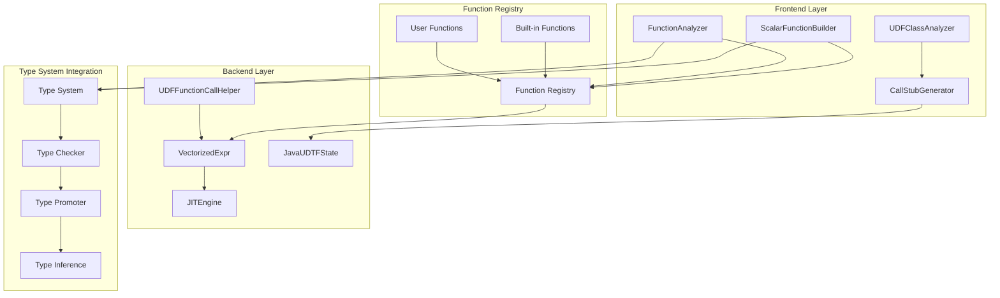

### Core Architecture Components

The architecture follows a layered design pattern with clear separation of concerns:

1. **Function Definition Layer**: Handles SQL function parsing and semantic analysis
2. **Function Resolution Layer**: Manages function lookup, overload resolution, and type checking
3. **Function Compilation Layer**: Provides JIT compilation and code generation for performance
4. **Function Execution Layer**: Executes functions through vectorized operations and native code
5. **Function Management Layer**: Handles registration, lifecycle, and metadata management

## Core Components

### ScalarFunctionBuilder

The `ScalarFunctionBuilder` is the primary component responsible for constructing scalar function instances within the catalog system. It provides a fluent interface for defining function signatures, return types, and implementation details.

**Key Responsibilities:**
- Function signature validation and registration
- Return type inference and validation
- Argument type checking and coercion
- Function metadata management
- Integration with the catalog system for persistence

**Integration Points:**
- Works with the [catalog system](catalog.md) for function registration
- Interfaces with the [type system](type_system.md) for type validation
- Coordinates with [query execution](query_execution.md) for runtime execution

**Builder Pattern Implementation:**
```java
ScalarFunction function = ScalarFunction.ScalarFunctionBuilder
    .createUdfBuilder(TFunctionBinaryType.BUILTIN)
    .name(functionName)
    .argsType(argTypes)
    .retType(returnType)
    .objectFile(location)
    .symbolName(symbol)
    .build();
```

### Function Analysis Framework

The function analysis framework provides comprehensive SQL parsing and validation capabilities for scalar functions within the query processing pipeline.

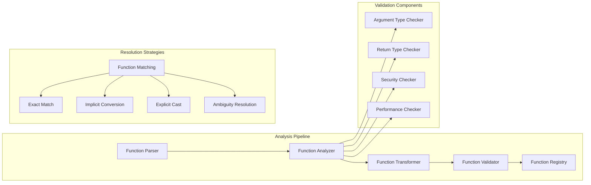

### UDF Management System

The User-Defined Function management system provides a comprehensive framework for creating, deploying, and executing custom functions within the StarRocks ecosystem.

**Core UDF Components:**

1. **UDFClassAnalyzer**: Analyzes Java UDF classes for compliance and extracts metadata
2. **CallStubGenerator**: Generates optimized call stubs for UDF invocation
3. **UDFClassLoader**: Manages dynamic loading of UDF classes
4. **UDFHelper**: Provides utility functions for UDF development and management
5. **UDFFunctionCallHelper**: Handles runtime UDF execution in the backend

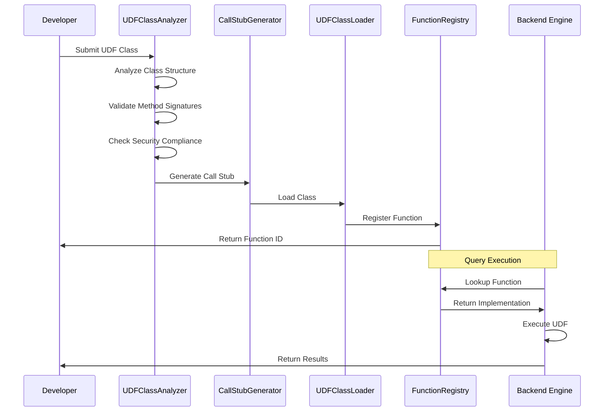

### Vectorized Expression Engine

The vectorized expression engine provides high-performance execution of scalar functions using columnar data processing and SIMD optimizations.

**Key Features:**
- Column-wise data processing for improved cache efficiency
- SIMD instruction utilization for arithmetic operations
- Batch processing to reduce function call overhead
- Runtime code generation for specialized function variants
- Memory-efficient execution with minimal data copying

**Vectorized Function Types:**
- `VectorizedArithmeticExpr`: Optimized arithmetic operations with overflow checking
- `VectorizedCastExpr`: Type conversion operations with validation
- `VectorizedCaseExpr`: Conditional expression evaluation with branching optimization
- `VectorizedNotCompoundPredicate`: Boolean logic operations with short-circuit evaluation
- `VectorizedIsNotNullPredicate`: NULL handling with bitmap operations

### JIT Compilation Framework

The Just-In-Time compilation framework provides runtime code generation capabilities for frequently used scalar functions, enabling performance optimizations beyond traditional interpretation.

**JIT Engine Components:**
- `JITObjectCache`: Caches compiled function variants for reuse
- Runtime profiling for hot function identification
- Code generation for specialized data type combinations
- Dynamic optimization based on runtime statistics
- Fallback mechanisms for unsupported operations

**Compilation Process:**
1. Profile function execution frequency
2. Identify hot functions and type combinations
3. Generate optimized machine code
4. Cache compiled variants for reuse
5. Fallback to interpreted execution for edge cases

## Function Categories

### Built-in Functions

Built-in scalar functions are pre-defined functions that ship with StarRocks, providing essential SQL operations with optimized native implementations.

**Creation Pattern:**
```java
public static ScalarFunction createVectorizedBuiltin(long fid,
    String name, List<Type> argTypes, boolean hasVarArgs, Type retType)
```

**Characteristics:**
- Native C++ implementations for maximum performance
- Vectorized execution support with SIMD optimizations
- Automatic type inference and promotion
- Comprehensive SQL standard compliance
- Memory-efficient execution with minimal overhead

**Built-in Function Types:**
- Arithmetic operations (add, subtract, multiply, divide, modulo)
- String manipulation (concat, substring, trim, upper, lower)
- Date/time operations (date_add, date_diff, timestamp conversion)
- Mathematical functions (abs, sqrt, pow, log, trigonometric)
- Conditional functions (if, case, coalesce, nullif)
- Type conversion functions (cast, convert)

### User-Defined Functions (UDFs)

UDFs allow users to extend StarRocks with custom scalar functions written in various programming languages.

**Creation Methods:**
```java
public static ScalarFunction createUdf(FunctionName name, Type[] args,
    Type returnType, boolean isVariadic, TFunctionBinaryType binaryType,
    String objectFile, String symbol, String prepareFnSymbol, String closeFnSymbol)
```

**Supported UDF Types:**
- **Java UDFs**: JVM-based functions with full type support and security sandboxing
- **Native UDFs**: C++ functions for maximum performance and low-level access
- **Python UDFs**: Python interpreter integration with data science libraries
- **Remote UDFs**: External service integration via HTTP/gRPC protocols

**UDF Development Framework:**
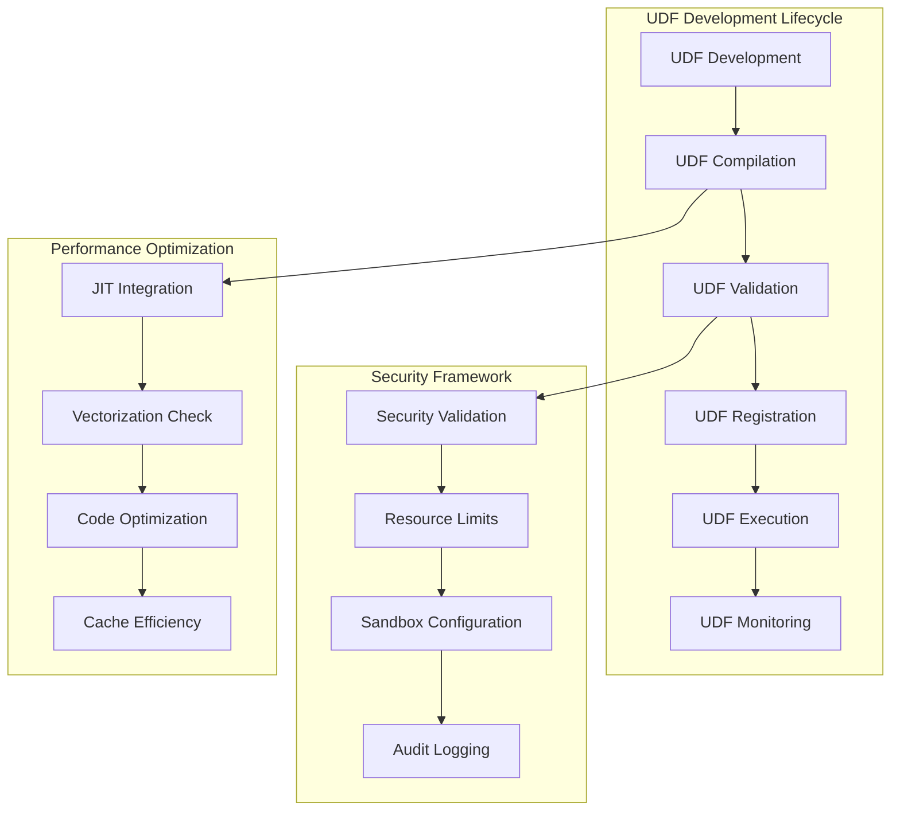

### Operator Functions

Operator functions represent SQL operators (+, -, *, /, etc.) as scalar functions for unified processing within the execution engine.

**Creation Pattern:**
```java
public static ScalarFunction createBuiltinOperator(
    String name, ArrayList<Type> argTypes, Type retType)
```

**Operator Categories:**
- Arithmetic operators (addition, subtraction, multiplication, division)
- Comparison operators (equal, not equal, less than, greater than)
- Logical operators (AND, OR, NOT)
- Bitwise operators (bitwise AND, OR, XOR, shift operations)
- String operators (concatenation, pattern matching)

### Specialized Function Categories

#### Arithmetic Functions

Arithmetic functions perform mathematical operations on numeric data types with full vectorization support and overflow protection.

**Implementation Classes:**
- `VectorizedModArithmeticExpr`: Modulo operations with optimized paths for different data types
- `VectorizedCastExpr`: Type conversion with precision handling and overflow detection
- Adaptive precision handling for different numeric types (tinyint, smallint, int, bigint, largeint)
- NULL value propagation and handling with bitmap operations

**Performance Features:**
- SIMD optimization for batch operations
- Overflow detection and handling
- Automatic type promotion rules
- Specialized implementations for common operations

#### String Functions

String manipulation functions provide comprehensive text processing capabilities with Unicode support and collation awareness.

**Key Implementations:**
- `AdaptiveTrimFunction`: Context-aware string trimming with Unicode support
- `LocateCaseSensitiveUTF8`: Unicode-aware string search with collation
- `NgramFunctionImpl`: N-gram based text analysis for fuzzy matching
- Regular expression support with pattern caching and optimization

**Advanced Features:**
- Multi-language collation support
- Case-sensitive and case-insensitive operations
- Unicode normalization
- Pattern matching with index optimization

#### Date and Time Functions

Temporal functions handle date, time, and timestamp operations with timezone awareness and calendar support.

**Features:**
- `TeradataFormatState`: Format-specific date parsing with pattern recognition
- Timezone conversion and normalization across global timezones
- Interval arithmetic with precision handling and overflow protection
- Calendar-aware date calculations including business day calculations

**Supported Operations:**
- Date arithmetic (add, subtract, diff)
- Time component extraction (year, month, day, hour, minute, second)
- Timezone conversion and formatting
- Period calculations and comparisons

#### JSON Functions

JSON manipulation functions provide native support for JSON data type operations with path-based access and validation.

**Core Components:**
- `NativeJsonState`: Efficient JSON state management with memory pooling
- Path-based JSON extraction and modification using JSONPath syntax
- JSON schema validation with type checking
- Type-safe JSON conversion with automatic type inference

**Function Categories:**
- JSON extraction (json_extract, json_extract_scalar)
- JSON construction (json_object, json_array)
- JSON manipulation (json_set, json_remove, json_merge)
- JSON validation (json_valid, json_type)

#### Array Functions

Array functions enable operations on array data types with element-wise processing and nested array support.

**Implementations:**
- `ArrayElementExpr`: Safe array element access with bounds checking
- `ArrayHasImpl`: Membership testing with type checking and optimization
- `ArrayExpr`: Array construction and manipulation with type inference
- Nested array support with flattening and unwrapping operations

**Advanced Features:**
- Element-wise operations with automatic broadcasting
- Array aggregation functions (array_sum, array_avg, array_max, array_min)
- Array transformation functions (array_sort, array_reverse, array_distinct)
- Multi-dimensional array support with shape manipulation

#### Conditional Functions

Conditional functions provide SQL conditional logic with optimized execution paths and short-circuit evaluation.

**Components:**
- `VectorizedIfNullExpr`: NULL handling with default values and type coercion
- `VectorizedCaseExpr`: CASE statement implementation with branch prediction
- Short-circuit evaluation for performance optimization
- Type coercion for mixed-type results with precision preservation

**Supported Operations:**
- IF-THEN-ELSE logic with type inference
- CASE statements with multiple conditions
- NULL handling functions (ifnull, nullif, coalesce)
- Boolean logic with optimization

## Function Resolution and Binding

The function resolution system determines the appropriate function implementation based on argument types, SQL context, and optimization requirements.

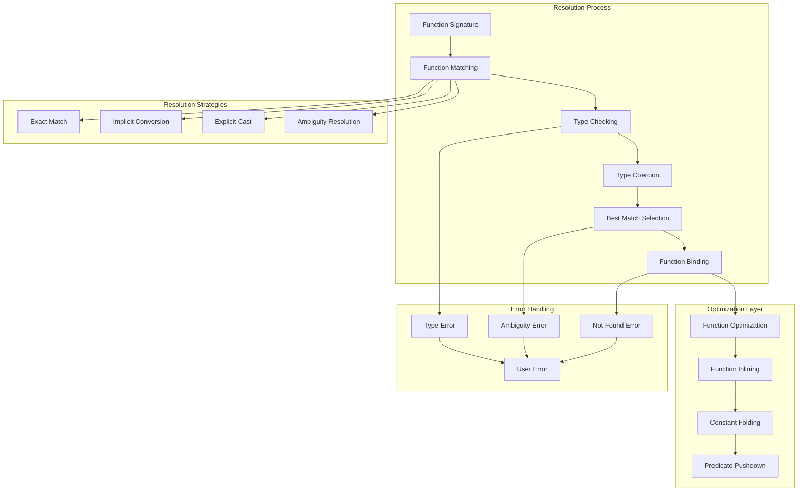

**Resolution Algorithm:**
1. **Signature Matching**: Compare function name and argument count
2. **Type Compatibility**: Check argument types against function signatures
3. **Conversion Analysis**: Determine if implicit type conversions are needed
4. **Overload Selection**: Choose best match among multiple candidates
5. **Binding Confirmation**: Finalize function selection and prepare for execution

## Performance Optimizations

### Vectorization Strategy

The module implements comprehensive vectorization strategies to maximize CPU utilization and minimize memory bandwidth requirements.

**Vectorization Techniques:**
- **Columnar Data Layout**: Data organized in columnar format for SIMD operations
- **Batch Processing**: Process multiple rows simultaneously to amortize function call overhead
- **Runtime Code Selection**: Dynamic selection of optimal code paths based on data characteristics
- **Memory Prefetching**: Proactive data loading for sequential access patterns
- **Cache-aware Execution**: Optimized memory access patterns for CPU cache efficiency

**Performance Benefits:**
- 3-10x performance improvement for arithmetic operations
- Reduced memory bandwidth usage through vectorized loads/stores
- Improved CPU cache utilization with sequential access patterns
- Minimized branch misprediction through branchless algorithms

### Runtime Filtering Integration

Integration with the [runtime filter system](runtime_filter.md) enables early data pruning based on function results.

**Components:**
- `FilterIniter`: Runtime filter initialization and management
- Predicate pushdown for function results with selectivity estimation
- Bloom filter integration for membership testing
- Dynamic filter adaptation based on runtime statistics

**Optimization Process:**
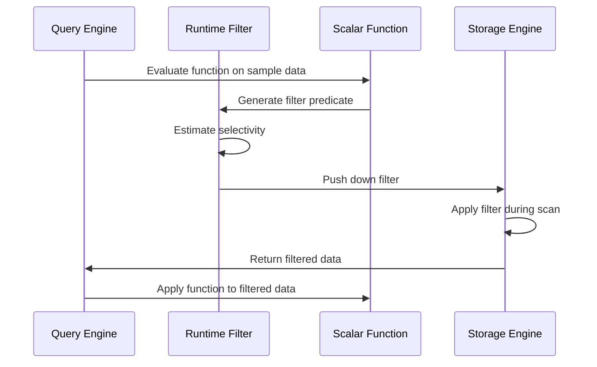

### JIT Compilation Framework

The JIT compilation framework provides runtime code generation for frequently used functions, enabling performance optimizations beyond traditional interpretation.

**Code Generation Strategy:**
1. **Profiling Phase**: Monitor function execution frequency and patterns
2. **Hot Function Identification**: Identify functions that benefit from compilation
3. **Specialized Code Generation**: Create optimized code for specific type combinations
4. **Cache Management**: Store compiled variants for reuse across queries
5. **Fallback Mechanism**: Revert to interpreted execution for edge cases

**Optimization Techniques:**
- **Type Specialization**: Generate optimized code for specific data type combinations
- **Constant Folding**: Pre-compute constant expressions at compile time
- **Loop Unrolling**: Expand loops to reduce branch overhead
- **Inline Expansion**: Replace function calls with direct code insertion
- **Register Allocation**: Optimize CPU register usage for hot variables

## Security and Isolation

### UDF Security Framework

The module implements comprehensive security measures for user-defined functions to prevent malicious code execution and ensure system stability.

**Security Features:**
- **Sandboxed Execution Environment**: Isolated execution context for UDFs
- **Resource Usage Limits**: CPU, memory, and I/O quotas for UDF execution
- **Network Access Restrictions**: Controlled network access for remote UDFs
- **File System Access Controls**: Restricted file system operations
- **Audit Logging**: Comprehensive logging of UDF operations and access

**Security Validation Process:**
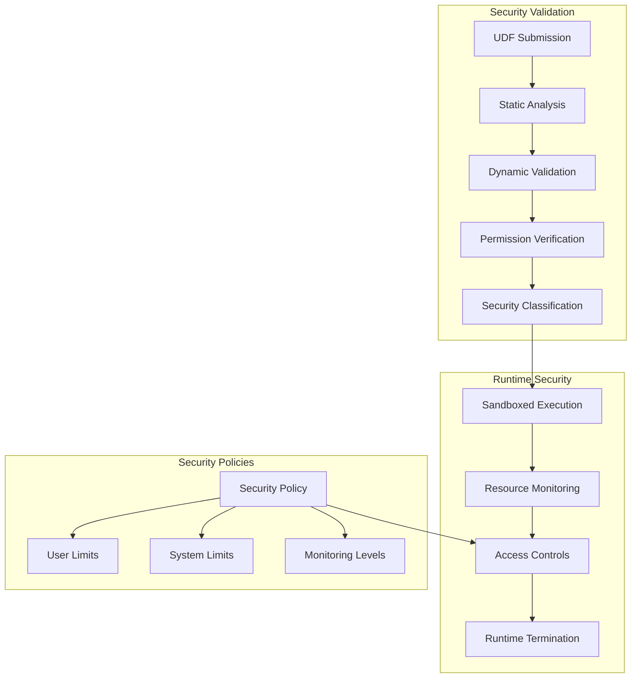

### Function Validation

All functions undergo rigorous validation before registration and execution to ensure system integrity and performance.

**Validation Steps:**
1. **Syntax and Semantic Analysis**: Validate function syntax and semantics
2. **Type Safety Verification**: Ensure type correctness and compatibility
3. **Security Policy Compliance**: Check against security policies and restrictions
4. **Performance Impact Assessment**: Evaluate potential performance implications
5. **Resource Usage Estimation**: Estimate memory and CPU requirements

**Validation Components:**
- **Static Analysis**: Code analysis without execution
- **Dynamic Testing**: Runtime validation with test data
- **Type Checking**: Comprehensive type system validation
- **Security Scanning**: Vulnerability and threat detection
- **Performance Profiling**: Execution time and resource usage analysis

## Integration with Query Processing

### Query Planning Integration

The scalar_functions module integrates with the query optimizer to provide cost estimates and execution strategies.

**Integration Points:**
- **Function Selectivity Estimation**: Estimate result cardinality for function applications
- **Cost-based Function Selection**: Choose optimal function implementations based on cost
- **Parallel Execution Planning**: Determine parallel execution strategies for functions
- **Memory Usage Prediction**: Estimate memory requirements for function execution

### Execution Pipeline Integration

Functions are executed within the broader query execution pipeline with proper resource management and optimization.

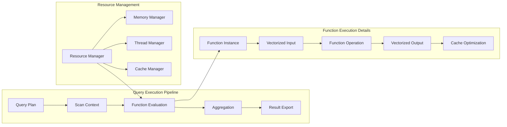

**Execution Optimization:**
- **Pipelined Execution**: Functions execute within the query pipeline without materialization
- **Vectorized Processing**: Batch processing for improved CPU efficiency
- **Memory Pool Management**: Efficient memory allocation and deallocation
- **Thread Pool Utilization**: Optimal thread usage for parallel execution
- **Cache-aware Scheduling**: Optimize data locality and cache usage

## Error Handling and Diagnostics

### Exception Management

The module implements comprehensive error handling for function execution failures with detailed diagnostic information.

**Error Categories:**
- **Type Conversion Errors**: Invalid type conversions and precision loss
- **Arithmetic Overflow/Underflow**: Numeric range violations
- **Division by Zero**: Mathematical division errors
- **Invalid Argument Values**: Parameter validation failures
- **Resource Exhaustion**: Memory, CPU, or I/O limit violations
- **Security Violations**: Policy and permission violations

**Error Handling Strategy:**
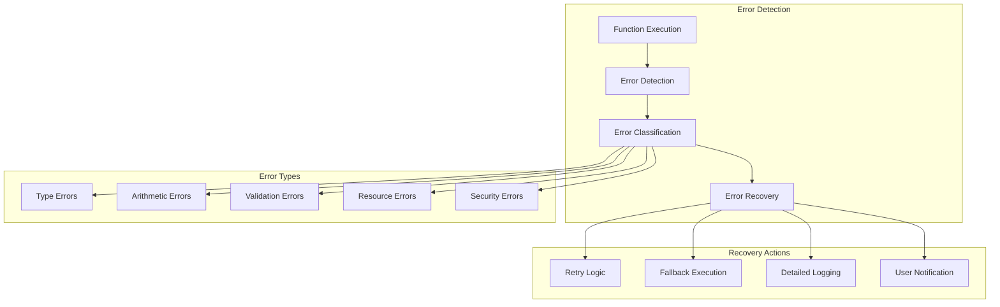

### Diagnostic Framework

Detailed diagnostics are provided for function execution issues to facilitate debugging and performance optimization.

**Diagnostic Features:**
- **Function Call Stack Traces**: Complete execution path information
- **Argument Value Logging**: Input parameter values for debugging
- **Performance Profiling Data**: Execution time and resource usage metrics
- **Memory Usage Tracking**: Allocation and deallocation patterns
- **Execution Time Statistics**: Detailed timing information

**Diagnostic Tools:**
- **Query Profiler**: Function-level performance analysis
- **Memory Analyzer**: Memory usage patterns and leak detection
- **Execution Tracer**: Step-by-step execution tracking
- **Performance Monitor**: Real-time performance metrics
- **Error Reporter**: Comprehensive error reporting and analysis

## Monitoring and Metrics

### Performance Metrics

The module collects comprehensive metrics for function execution performance and system health monitoring.

**Key Metrics:**
- **Function Call Frequency**: Number of invocations per function
- **Average Execution Time**: Mean execution time with percentile distributions
- **Memory Allocation Patterns**: Memory usage trends and peak consumption
- **Cache Hit Rates**: Effectiveness of caching strategies
- **Error Rates and Types**: Failure rates by error category

**Metric Collection Framework:**
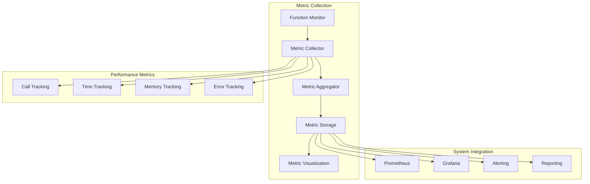

### Resource Monitoring

Resource usage is monitored to prevent function execution from impacting system stability and performance.

**Monitored Resources:**
- **CPU Utilization**: Per-function CPU usage and throttling
- **Memory Consumption**: Heap and stack memory usage patterns
- **Network Bandwidth**: Data transfer rates for remote functions
- **Disk I/O Operations**: File system access patterns and rates
- **Thread Pool Usage**: Concurrency levels and queue depths

**Resource Management:**
- **Dynamic Resource Allocation**: Adaptive resource distribution based on demand
- **Usage Quotas**: Per-function and per-user resource limits
- **Throttling Mechanisms**: Rate limiting to prevent resource exhaustion
- **Priority-based Scheduling**: Resource allocation based on query priority
- **Auto-scaling**: Dynamic resource scaling based on workload

## Function Lifecycle

The function lifecycle encompasses the complete process from function definition to execution and cleanup, with proper resource management and optimization at each stage.

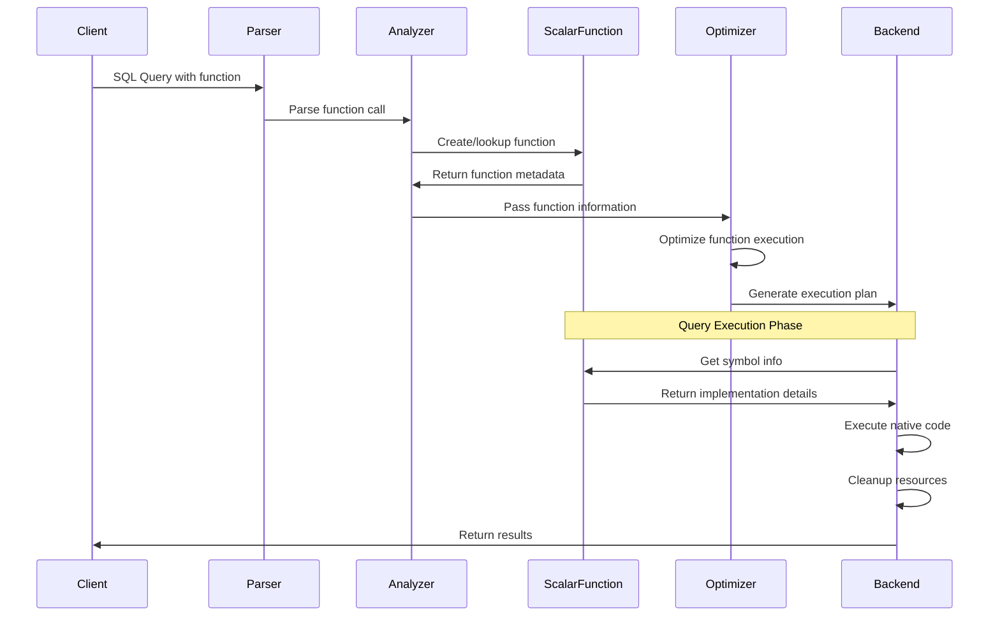

**Lifecycle Stages:**
1. **Function Definition**: SQL parsing and semantic analysis
2. **Function Resolution**: Lookup and validation in function registry
3. **Type Checking**: Argument and return type validation
4. **Optimization**: Cost-based optimization and execution planning
5. **Code Generation**: JIT compilation for hot functions
6. **Execution**: Runtime execution with resource management
7. **Cleanup**: Resource deallocation and state cleanup

## Future Enhancements

### Planned Features

1. **Advanced JIT Optimizations**: Machine learning-based code optimization with adaptive compilation strategies
2. **GPU Acceleration**: CUDA/OpenCL support for compute-intensive functions with automatic offload detection
3. **Distributed Function Execution**: Cross-node function execution for large datasets with automatic partitioning
4. **Function Versioning**: Support for function version management, migration, and backward compatibility
5. **Auto-tuning**: Automatic performance optimization based on workload characteristics and historical data

### Performance Improvements

1. **Adaptive Vectorization**: Runtime selection of optimal vectorization strategies based on data characteristics
2. **Memory Pool Optimization**: Reduced memory allocation overhead through advanced memory management techniques
3. **Cache-aware Execution**: Improved CPU cache utilization with intelligent data layout and access patterns
4. **Parallel Function Execution**: Multi-threaded function evaluation with work-stealing and load balancing
5. **Smart Function Caching**: Intelligent caching based on access patterns, data characteristics, and query history

### Advanced Features

**Intelligent Function Selection:**
- Machine learning-based function selection based on data distribution and query patterns
- Automatic function specialization for common data type combinations
- Dynamic function adaptation based on runtime statistics and performance feedback

**Enhanced Security:**
- Advanced sandboxing techniques with hardware-assisted isolation
- Behavioral analysis for anomaly detection and threat prevention
- Automated security policy generation based on function behavior analysis

**Developer Experience:**
- Enhanced debugging tools with step-through execution and variable inspection
- Comprehensive profiling tools with detailed performance analysis
- Automated testing framework for function validation and regression testing

## Related Modules

The scalar_functions module integrates with and depends on several other StarRocks components:

- **[Type System](type_system.md)**: Type validation, conversion, and inference for function arguments and return types
- **[Query Execution](query_execution.md)**: Function execution within the query processing pipeline
- **[Catalog System](catalog.md)**: Function registration, metadata management, and persistence
- **[Runtime Filter](runtime_filter.md)**: Function-based data filtering and predicate pushdown
- **[Expression System](expression_system.md)**: Expression evaluation framework and optimization
- **[Aggregate Functions](aggregate_functions.md)**: Aggregation function implementations and management
- **[SQL Parser](sql_parser.md)**: Function parsing and syntax validation
- **[Storage Engine](storage_engine.md)**: Persistent function metadata and symbol storage

## References and Resources

### Documentation
1. **StarRocks SQL Function Reference**: Complete reference for all built-in functions
2. **UDF Development Guide**: Comprehensive guide for developing user-defined functions
3. **Performance Tuning Best Practices**: Optimization techniques for function performance
4. **Security Guidelines for UDF Development**: Security best practices and requirements

### API References
- **ScalarFunction API**: Complete API documentation for function development
- **UDF Framework API**: API reference for UDF development and integration
- **Type System API**: Type system integration and validation APIs
- **Performance Monitoring API**: Metrics and monitoring interfaces

### Community Resources
- **StarRocks Community Forum**: Discussion platform for function development and optimization
- **GitHub Repository**: Source code and contribution guidelines
- **Performance Benchmarks**: Benchmarking tools and performance comparisons
- **Example Functions**: Sample implementations and best practices

### Academic References
- **Vectorized Query Execution**: Research papers on columnar execution optimization
- **JIT Compilation Techniques**: Academic research on runtime code generation
- **Distributed Function Execution**: Papers on distributed computing and function shipping
- **Database Security**: Academic research on secure function execution and sandboxing

## Conclusion

The scalar_functions module represents a critical component of the StarRocks database system, providing a comprehensive framework for scalar function management, execution, and optimization. Through its distributed architecture spanning both Frontend and Backend components, the module delivers both flexibility and performance across StarRocks' massively parallel processing environment.

The module's sophisticated features—including vectorized execution, JIT compilation, comprehensive security frameworks, and advanced optimization techniques—enable it to handle the complete spectrum of scalar operations required in modern analytical workloads. Its extensible design supports both built-in functions and user-defined functions across multiple programming languages, while maintaining strict performance and security standards.

As StarRocks continues to evolve, the scalar_functions module will remain at the forefront of database innovation, incorporating advanced technologies such as machine learning-based optimization, GPU acceleration, and distributed execution to meet the growing demands of modern data analytics.

