# Scanner Core Module Documentation

## Introduction

The scanner_core module is a fundamental component of StarRocks' data ingestion and query processing system, providing unified scanning functionality for reading data from various external storage systems and file formats. This module serves as the bridge between StarRocks' query execution engine and diverse data sources, including Hive tables, Hudi datasets, Iceberg tables, Delta Lake, ODPS (MaxCompute), and other data lake formats.

The module implements a robust scanning mechanism that supports various file formats (Parquet, ORC, CSV, JSON), compression types, and storage backends (HDFS, S3, Azure Blob, local filesystem, ODPS). Built with performance and extensibility in mind, it utilizes JNI (Java Native Interface) for efficient data transfer and processing, enabling StarRocks to efficiently access and process external data at scale.

## Core Architecture

### Unified Scanner Interface

The scanner_core module is built around a unified `ConnectorScanner` interface that all specific scanner implementations inherit from. This design enables consistent data access patterns across different data sources while allowing for source-specific optimizations.

### Key Architectural Patterns

1. **Split-based Processing**: Data is processed in splits (chunks) for parallelization and memory efficiency
2. **Arrow-based Data Transfer**: Uses Apache Arrow for zero-copy data transfer between scanners and the StarRocks execution engine
3. **Type Conversion System**: Handles conversion between external data source types and StarRocks internal types
4. **Factory Pattern**: Each scanner type has an associated factory class for creating scanner instances

## Core Components

### 1. OdpsSplitScanner

The `OdpsSplitScanner` is a concrete implementation for Alibaba Cloud ODPS (MaxCompute) data sources, demonstrating the core scanning patterns used across all scanner implementations.

**Key Features:**
- Split-based reading with support for both size-based and row-range-based splits
- Arrow-based data transfer using `VectorSchemaRoot`
- Columnar data processing with selective column reading
- Type conversion from ODPS types to StarRocks column types
- Compression support (ZSTD)
- Thread-safe operation with classloader isolation

**Core Methods:**
- `open()`: Initializes the ODPS reader and Arrow reader
- `getNext()`: Retrieves the next batch of data and converts it to StarRocks format
- `close()`: Cleans up resources and closes connections

**Split Policies:**
- **Size-based splits**: Uses `IndexedInputSplit` for uniform data distribution
- **Row-range splits**: Uses `RowRangeInputSplit` for specific row ranges

### 2. HiveScanner

The `HiveScanner` class is the primary component for reading Hive data files, extending `ConnectorScanner` and implementing core functionality for reading various Hive-compatible file formats.

**Key Responsibilities:**
- **File Format Handling**: Supports multiple Hive file formats through configurable InputFormat and SerDe classes
- **Column Projection**: Implements column pruning to read only required fields
- **Type Conversion**: Handles conversion between Hive data types and StarRocks internal types
- **Block-based Reading**: Supports reading file blocks for parallel processing
- **Error Handling**: Provides comprehensive error handling and logging

### 3. KuduSplitScanner

The `KuduSplitScanner` is a specialized scanner for Apache Kudu tables, providing efficient distributed scanning capabilities.

**Key Features:**
- **Token-based Scanning**: Uses Kudu scan tokens for efficient distributed scanning
- **Connection Pooling**: Maintains shared pool of KuduClient instances
- **Column Projection**: Intelligent column pruning to minimize network I/O
- **Batch Processing**: Configurable batch sizes for optimal memory usage

### 4. HudiSliceScanner

The `HudiSliceScanner` is specialized for Apache Hudi tables, supporting both Copy-on-Write (CoW) and Merge-on-Read (MoR) table types.

**Advanced Capabilities:**
- **Hudi-specific Reading**: Handles Hudi base files and log files for MoR tables
- **Incremental Processing**: Supports incremental data reading with instant time tracking
- **Schema Evolution**: Manages schema changes across different Hudi versions
- **Time-travel Queries**: Enables querying data at specific points in time
- **Log File Management**: Processes Hudi log files for real-time data updates

## Architecture Overview

### Scanner Core Architecture

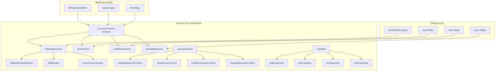

### Data Flow Architecture

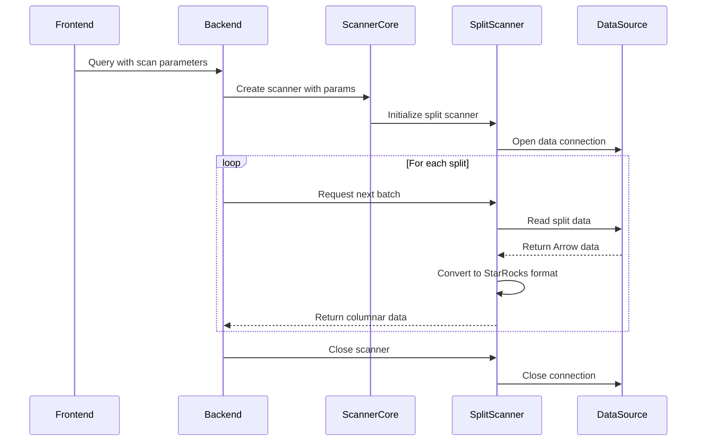

### Component Interaction Diagram

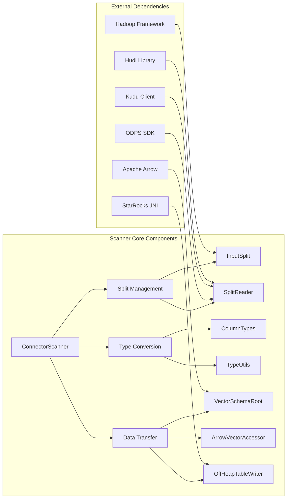

## Process Flow

### Scanner Initialization Process

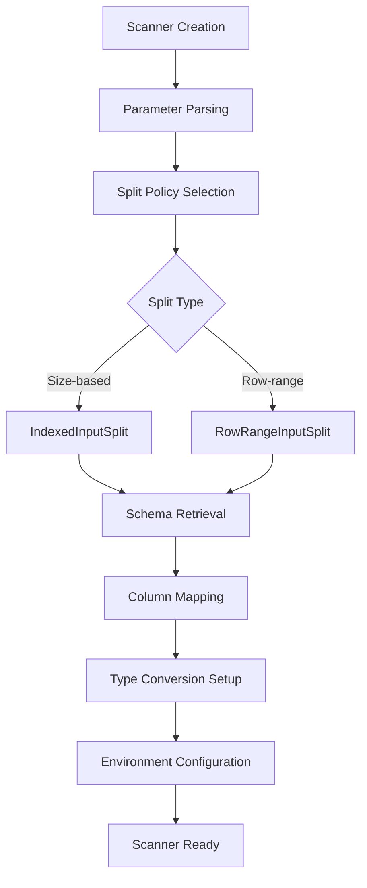

### Data Reading Process

The data reading process follows these steps:

1. **Initialization Phase**:
   - `open()` method creates Arrow reader
   - Initializes off-heap table writer
   - Establishes connection to data source

2. **Data Retrieval Phase**:
   - `getNext()` method checks for available data
   - Retrieves VectorSchemaRoot from Arrow reader
   - Creates column accessors for each field
   - Processes each row and converts data types
   - Appends converted data to off-heap table
   - Returns row count or 0 if no more data

### ODPS-specific Data Flow

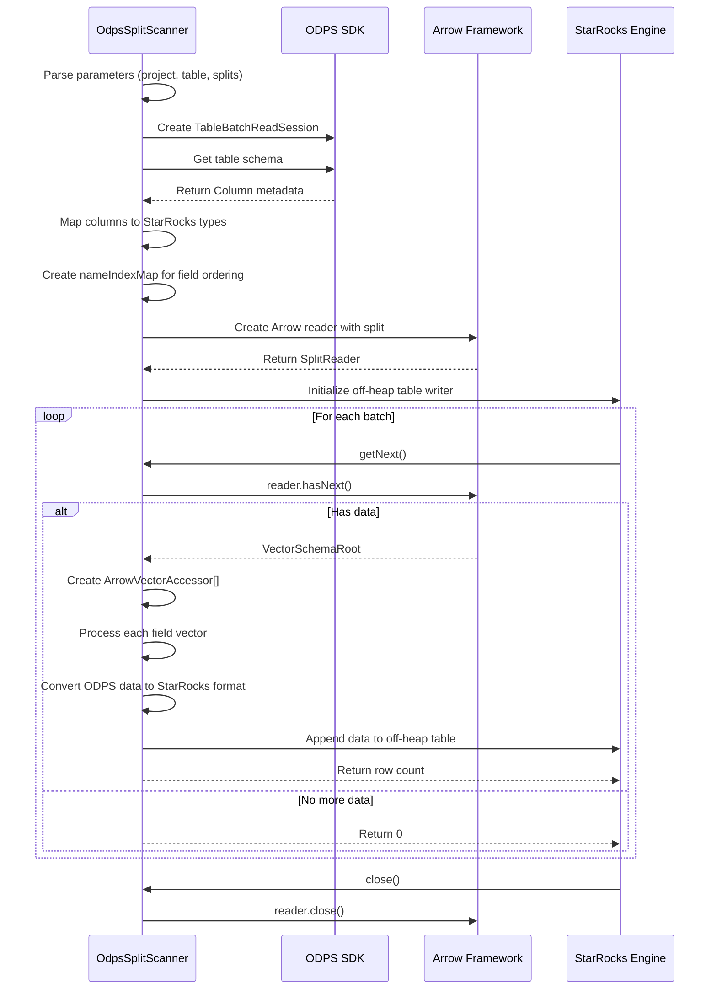

### High-Level Architecture

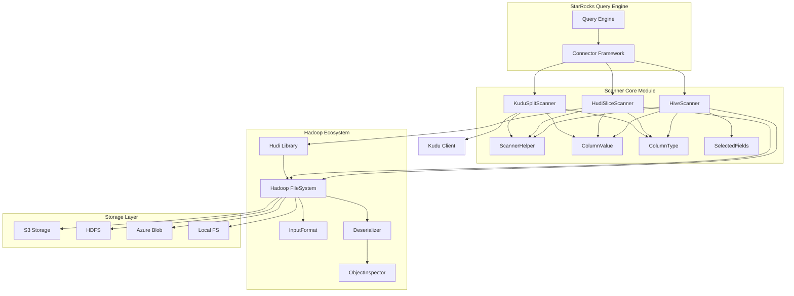

### Component Relationships

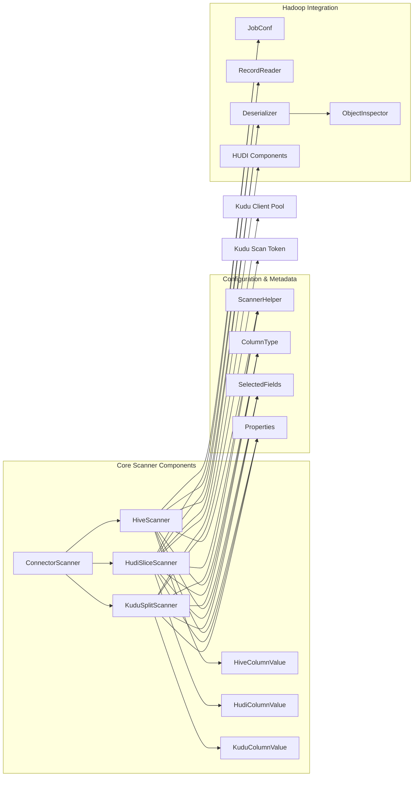

## Core Components

### HiveScanner

The `HiveScanner` class is the primary component for reading Hive data files. It extends `ConnectorScanner` and implements the core functionality for reading various Hive-compatible file formats. Key responsibilities include:

- **File Format Handling**: Supports multiple Hive file formats through configurable InputFormat and SerDe classes
- **Column Projection**: Implements column pruning to read only required fields, optimizing I/O operations
- **Type Conversion**: Handles conversion between Hive data types and StarRocks internal column types
- **Block-based Reading**: Supports reading file blocks for parallel processing and efficient memory usage
- **Error Handling**: Provides comprehensive error handling and logging for debugging and monitoring

#### Key Features:

1. **Configurable Parameters**: Accepts various configuration parameters including column names, types, file paths, and format specifications
2. **Nested Field Support**: Handles complex nested data structures through field pruning mechanisms
3. **Timezone Awareness**: Supports timezone-specific data processing for temporal data types
4. **ClassLoader Isolation**: Uses thread context classloader for proper isolation in multi-tenant environments

### KuduSplitScanner

The `KuduSplitScanner` class is a specialized scanner for Apache Kudu tables, providing efficient distributed scanning capabilities for Kudu's columnar storage system. It extends `ConnectorScanner` and implements optimized data reading from Kudu clusters with support for token-based scanning and connection pooling.

#### Key Responsibilities:

- **Token-based Scanning**: Uses Kudu scan tokens for efficient distributed scanning across tablet servers
- **Connection Pooling**: Maintains a shared pool of KuduClient instances for optimal resource utilization
- **Column Projection**: Implements intelligent column pruning to minimize network I/O and server-side processing
- **Type Conversion**: Handles conversion between Kudu data types and StarRocks internal column types
- **Batch Processing**: Supports configurable batch sizes for optimal memory usage and performance
- **Error Recovery**: Provides comprehensive error handling with automatic retry mechanisms

#### Advanced Features:

1. **Distributed Scanning**: Leverages Kudu's native scan token mechanism for parallel distributed scanning
2. **Connection Management**: Automatic client lifecycle management with connection pooling
3. **Schema Validation**: Real-time schema validation and type compatibility checking
4. **Memory Optimization**: Off-heap memory management for zero-copy data transfer
5. **Thread Safety**: Proper synchronization and classloader isolation for concurrent access

#### Kudu-specific Parameters:

- `kudu_scan_token`: Base64-encoded Kudu scan token for distributed scanning
- `kudu_master`: Comma-separated list of Kudu master addresses
- `required_fields`: Fields to read from Kudu table
- `fetch_size`: Number of rows per batch for optimal memory usage

### HudiSliceScanner

The `HudiSliceScanner` class is a specialized scanner for Apache Hudi tables, supporting both Copy-on-Write (CoW) and Merge-on-Read (MoR) table types. It extends `ConnectorScanner` and provides advanced capabilities for incremental data processing and time-travel queries.

#### Key Responsibilities:

- **Hudi-specific Reading**: Handles Hudi base files and log files for MoR tables
- **Incremental Processing**: Supports incremental data reading with instant time tracking
- **Schema Evolution**: Manages schema changes and compatibility across different Hudi versions
- **Time-travel Queries**: Enables querying data at specific points in time
- **Log File Management**: Processes Hudi log files for real-time data updates

#### Advanced Features:

1. **Real-time Data**: Supports reading from Hudi's real-time views with log file merging
2. **Instant Time Filtering**: Filters data based on Hudi commit timeline
3. **Delta File Processing**: Handles delta log files for incremental updates
4. **Base File Optimization**: Optimizes reading of Hudi base parquet files
5. **Memory-efficient Merging**: Efficiently merges base and log file data in memory

#### Hudi-specific Parameters:

- `instant_time`: Hudi commit instant time for time-travel queries
- `delta_file_paths`: Array of Hudi log file paths for MoR tables
- `base_path`: Hudi table base path for metadata operations
- `data_file_path`: Path to the base data file
- `data_file_length`: Length of the base data file

### ScannerHelper

The `ScannerHelper` utility class provides supporting functions for the scanner operations:

- **String Parsing**: Helper methods for parsing configuration strings and parameters
- **File System Options**: Parses filesystem-specific configuration options
- **Type Management**: Assists in column type handling and conversion

### ColumnValue and ColumnType

These classes handle the data type system:

- **ColumnValue**: Abstracts the value representation for different data types
- **ColumnType**: Manages type information and supports nested field specifications
- **Type Pruning**: Implements intelligent field pruning for complex nested structures

## Data Flow Architecture

### Reading Process Flow

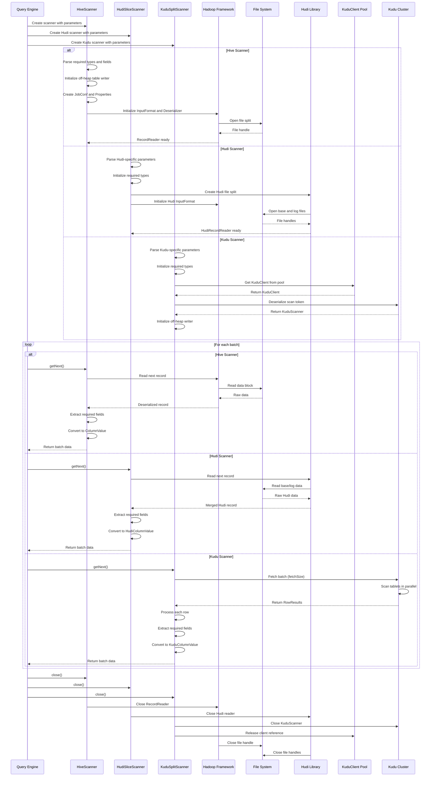

### Column Processing Flow

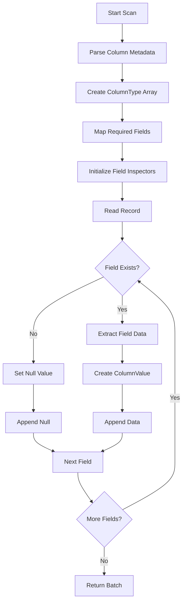

## Integration with Other Modules

### Storage Engine Integration

The scanner_core module integrates with the [storage_engine](storage_engine.md) module through:

- **Column Type System**: Uses the storage engine's type system for data type management
- **Memory Management**: Leverages off-heap memory management for efficient data transfer
- **Predicate Pushdown**: Supports predicate evaluation for early data filtering

### Query Execution Integration

Integration with the [query_execution](query_execution.md) module includes:

- **Connector Framework**: Implements the ConnectorScanner interface for unified data access
- **Runtime Filters**: Supports runtime filter application for query optimization
- **Memory Management**: Integrates with query execution memory pools

### Connector Framework Integration

The module works within the broader [connectors](connectors.md) ecosystem:

- **Hive Connector**: Provides the core scanning capability for Hive connector
- **File Format Support**: Integrates with various file format readers
- **Partition Pruning**: Works with partition metadata for efficient data access

## Configuration and Usage

### Scanner Parameters

The scanner implementations accept the following key parameters:

#### Common Parameters (Hive & Hudi)

| Parameter | Description | Example |
|-----------|-------------|---------|
| `hive_column_names` | Comma-separated list of column names | "id,name,age" |
| `hive_column_types` | Column types separated by # | "int#string#int" |
| `required_fields` | Fields to read | "id,name" |
| `nested_fields` | Nested field paths | "address.city,address.zip" |
| `serde` | Serializer/Deserializer class | "org.apache.hadoop.hive.serde2.lazy.LazySimpleSerDe" |
| `input_format` | Input format class | "org.apache.hadoop.mapred.TextInputFormat" |
| `fs_options_props` | Filesystem options | "fs.s3a.access.key=xxx" |
| `time_zone` | Timezone for temporal data | "UTC" |

#### Hive-specific Parameters

| Parameter | Description | Example |
|-----------|-------------|---------|
| `data_file_path` | Path to data file | "/user/hive/warehouse/data.csv" |
| `block_offset` | File block offset | "0" |
| `block_length` | Block length | "1048576" |

#### Kudu-specific Parameters

| Parameter | Description | Example |
|-----------|-------------|---------|
| `kudu_scan_token` | Base64-encoded Kudu scan token | "AAAA..." |
| `kudu_master` | Kudu master addresses | "host1:7051,host2:7051" |
| `required_fields` | Fields to read from Kudu table | "id,name,age" |
| `fetch_size` | Number of rows per batch | "1000" |

#### Hudi-specific Parameters

| Parameter | Description | Example |
|-----------|-------------|---------|
| `instant_time` | Hudi commit instant time | "20230101120000" |
| `delta_file_paths` | Comma-separated log file paths | "/hudi/table/.hoodie/20230101.log" |
| `base_path` | Hudi table base path | "/user/hive/warehouse/hudi_table" |
| `data_file_path` | Path to base data file | "/hudi/table/part-0000.parquet" |
| `data_file_length` | Length of base data file | "1048576" |

### SerDe Properties

Additional SerDe properties can be specified with the "SerDe." prefix:

- `SerDe.avro.schema.url`: URL to Avro schema file
- `SerDe.separator.char`: Field separator character
- `SerDe.escape.char`: Escape character
- `SerDe.quote.char`: Quote character

## Performance Optimization

### Column Pruning

Both scanners implement intelligent column pruning to minimize I/O:

```java
// Only read required columns
properties.setProperty("hive.io.file.readcolumn.ids", "0,1,2");
properties.setProperty("hive.io.file.readcolumn.names", "id,name,age");
```

### Block-based Reading

Supports reading file blocks for parallel processing:

```java
FileSplit fileSplit = new FileSplit(path, blockOffset, blockLength, null);
```

### Memory Management

Utilizes off-heap memory for efficient data transfer:

```java
initOffHeapTableWriter(requiredTypes, requiredFields, fetchSize);
```

### Hudi-specific Optimizations

#### 1. Log File Merging Optimization
The HudiSliceScanner efficiently merges base and log files:

```java
// Create HudiRealtimeFileSplit for MoR tables
FileSplit hudiSplit = new HoodieRealtimeFileSplit(
    fileSplit, basePath, logFiles, instantTime, false, Option.empty()
);
```

#### 2. Incremental Reading
Supports incremental data reading based on instant time:

```java
// Filter data by instant time for incremental processing
String instantTime = params.get("instant_time");
```

#### 3. Schema Evolution Handling
Efficiently handles schema changes across Hudi versions:

```java
// Map column types to Hive types for compatibility
String type = HudiScannerUtils.mapColumnTypeToHiveType(columnType);
```

#### 4. Nested Field Pruning
Optimizes reading of complex nested structures:

```java
// Build nested field specifications
StringBuilder sb = new StringBuilder();
for (int i = 0; i < requiredFields.length; i++) {
    String name = requiredFields[i];
    ColumnType type = requiredTypes[i];
    type.buildNestedFieldsSpec(name, sb);
}
```

### Kudu-specific Optimizations

#### 1. Connection Pooling
The KuduSplitScanner maintains a shared pool of KuduClient instances:

```java
private static final ConcurrentHashMap<String, KuduClient> KUDU_CLIENTS = new ConcurrentHashMap<>();

KuduClient client = KUDU_CLIENTS.computeIfAbsent(master, m -> 
    new KuduClient.KuduClientBuilder(m).build());
```

#### 2. Token-based Distributed Scanning
Leverages Kudu's scan tokens for efficient distributed scanning:

```java
byte[] token = KuduScannerUtils.decodeBase64(encodedToken);
scanner = KuduScanToken.deserializeIntoScanner(token, client);
```

#### 3. Column Projection Optimization
Implements intelligent column pruning to minimize network I/O:

```java
// Parse only required fields from projection schema
for (int i = 0; i < requiredFields.length; i++) {
    int index = schema.getColumnIndex(requiredFields[i]);
    ColumnSchema columnSchema = schema.getColumnByIndex(index);
    // Only process required columns
}
```

#### 4. Batch Processing Configuration
Configurable batch sizes for optimal memory usage:

```java
// Initialize with optimal fetch size
initOffHeapTableWriter(requiredTypes, requiredFields, fetchSize);
```

#### 5. Thread Context Management
Proper classloader isolation for thread safety:

```java
try (ThreadContextClassLoader ignored = new ThreadContextClassLoader(classLoader)) {
    // All Kudu operations with proper isolation
}
```

## Integration with Other Modules

### Storage Engine Integration
The scanner_core module integrates with the [storage_engine](storage_engine.md) module through:
- **Column Builders**: Uses `ColumnBuilder` for constructing columnar data
- **Type System**: Leverages `ScalarTypeInfoImplBase` for type information
- **Predicate Evaluation**: Works with predicate components for pushdown optimization

### Query Execution Integration
Integration with [query_execution](query_execution.md) includes:
- **Connector Scan Nodes**: Scanners are used by `ConnectorScanner` in scan nodes
- **Pipeline Execution**: Participates in the pipeline execution framework
- **Memory Management**: Uses spill mechanisms for large data processing

### Connector Framework Integration
The module works with [connectors](connectors.md) through:
- **Unified Interface**: All connector scanners implement the same base interface
- **Factory Pattern**: Each connector provides its own scanner factory
- **Type Conversion**: Connector-specific type utilities handle data type mapping

## Key Design Patterns

### 1. Strategy Pattern
Different split policies (size-based vs row-range-based) are handled through the strategy pattern, allowing flexible data partitioning strategies.

### 2. Factory Pattern
Scanner factories create appropriate scanner instances based on connector type and configuration parameters.

### 3. Template Method Pattern
The `ConnectorScanner` base class defines the scanning workflow, while concrete implementations provide specific behavior.

### 4. Bridge Pattern
Separates scanner abstraction from implementation, allowing different data sources to be accessed through a unified interface.

## Performance Considerations

### Memory Management
- **Off-heap Storage**: Uses off-heap memory for large data transfers
- **Batch Processing**: Processes data in configurable batch sizes
- **Resource Cleanup**: Proper resource management with try-with-resources

### Parallelization
- **Split-based Parallelism**: Data splits can be processed in parallel
- **Thread Safety**: Uses thread-local class loaders for isolation
- **Arrow Zero-copy**: Minimizes data copying through Arrow's columnar format

### Optimization Strategies
- **Column Pruning**: Only reads required columns
- **Predicate Pushdown**: Pushes filters to the data source when possible
- **Compression**: Supports compression codecs for efficient data transfer

## Error Handling

### Exception Management
- **IOException**: Handles I/O errors during data reading
- **RuntimeException**: Manages configuration and initialization errors
- **Resource Cleanup**: Ensures proper cleanup even in error conditions

### Logging
- **Structured Logging**: Uses Log4j for consistent logging
- **Error Context**: Provides detailed error messages with context
- **Performance Metrics**: Logs performance-related information

## Configuration

### Scanner Parameters
Key configuration parameters for scanners:
- `fetch_size`: Batch size for data reading
- `required_fields`: Comma-separated list of columns to read
- `split_policy`: Split strategy (size or row_offset)
- `project_name`: Data source project/namespace
- `table_name`: Target table name
- `endpoint`: Data source connection endpoint

### Environment Settings
- **Credentials**: Authentication information for data source access
- **Compression**: Compression codec selection
- **Time Zone**: Time zone handling for temporal data

## Extension Points

### Adding New Scanners
To add a new scanner type:
1. Implement the `ConnectorScanner` interface
2. Create a corresponding factory class
3. Implement type conversion utilities
4. Register with the connector framework

### Custom Type Conversion
Extend type utility classes to support new data types and conversion logic.

## Security Considerations

### Authentication
- **Credential Management**: Secure handling of access credentials
- **Account Isolation**: Separate account contexts for different data sources
- **Serialization Security**: Safe deserialization of scanner sessions

### Data Privacy
- **Column-level Security**: Respect column access permissions
- **Audit Logging**: Log data access for security auditing
- **Network Security**: Secure connections to external data sources

## Monitoring and Observability

### Metrics Collection
- **Scan Performance**: Track scanning speed and throughput
- **Resource Usage**: Monitor memory and CPU usage
- **Error Rates**: Track failure rates and types

### Integration with Monitoring
- **Prometheus Metrics**: Export metrics for monitoring systems
- **Runtime Profiles**: Integration with StarRocks profiling system
- **Query Details**: Provide scan details for query analysis

## Future Enhancements

### Planned Improvements
- **Adaptive Batch Sizing**: Dynamic batch size adjustment based on performance
- **Advanced Filtering**: Enhanced predicate pushdown capabilities
- **Caching Layer**: Intelligent caching for frequently accessed data
- **Multi-threading**: Enhanced parallel processing capabilities

### Technology Evolution
- **Arrow Format Updates**: Support for new Arrow format features
- **Connector Expansion**: Support for additional data sources
- **Performance Optimization**: Continuous performance improvements

## References

- [Storage Engine Module](storage_engine.md) - For columnar storage integration
- [Query Execution Module](query_execution.md) - For execution framework details
- [Connectors Module](connectors.md) - For connector framework architecture
- [Java Extensions Module](java_extensions.md) - For extension mechanisms
```

## Hudi Scanning Architecture

### Hudi Merge-on-Read (MoR) Processing

The HudiSliceScanner implements sophisticated logic for handling Hudi's Merge-on-Read table type:

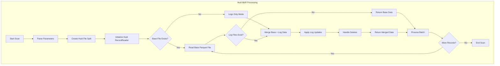

### Hudi Time-Travel Query Support

The scanner supports Hudi's time-travel capabilities for querying historical data:

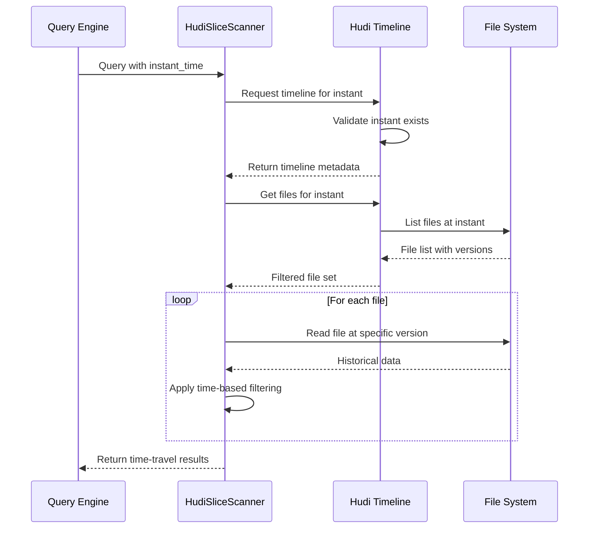

### Kudu Scanning Architecture

#### Kudu Distributed Scanning Process

The KuduSplitScanner implements sophisticated distributed scanning using Kudu's native scan token mechanism:

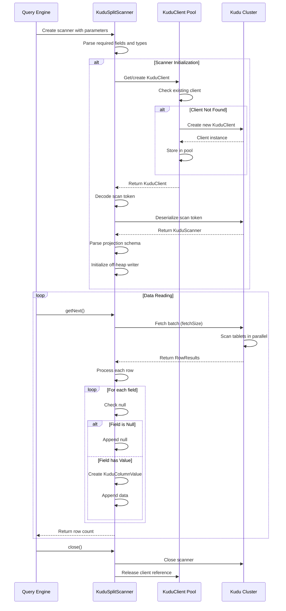

#### Kudu Connection Pool Management

The scanner implements efficient connection pooling for optimal resource utilization:

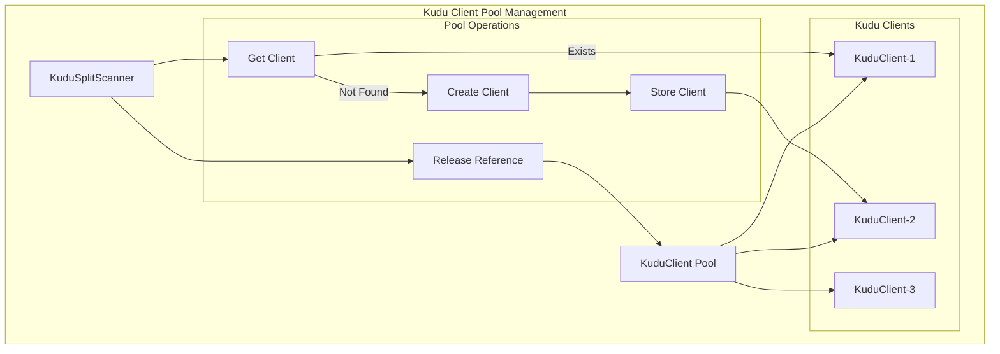

#### Kudu Type System Integration

The scanner provides seamless integration between Kudu and StarRocks type systems:

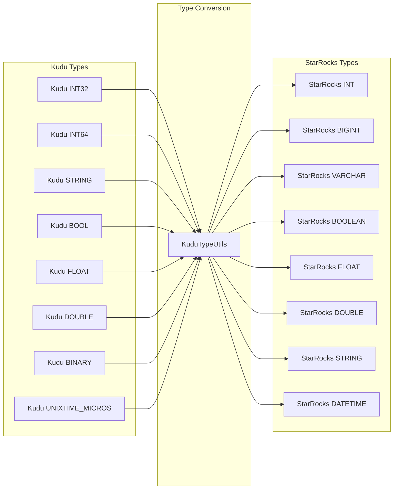

#### KuduColumnValue Implementation

The KuduColumnValue class handles Kudu-specific data type conversions and value extraction:

```java
public class KuduColumnValue extends ColumnValue {
    private final RowResult row;
    private final int columnIndex;
    
    // Handles Kudu-specific type conversions
    // including proper null handling and type safety
}
```

### Hudi Column Value Processing

The HudiColumnValue class handles Hudi-specific data type conversions:

```java
public class HudiColumnValue extends ColumnValue {
    private final ObjectInspector inspector;
    private final Object data;
    private final String timeZone;
    
    // Handles Hudi-specific type conversions
    // including timestamp handling and nested structures
}
```

### Exception Handling

The scanner implements comprehensive error handling:

- **IOException**: For I/O related errors during file operations
- **RuntimeException**: For schema compatibility issues
- **ClassNotFoundException**: For missing Hadoop/SerDe classes

### Logging

Extensive logging is provided for debugging and monitoring:

- **Debug Level**: Configuration parameters and initialization details
- **Warn Level**: Schema compatibility warnings and missing fields
- **Error Level**: Critical failures during scanning operations

## Security Considerations

### ClassLoader Isolation

The scanner uses thread context classloader for proper isolation:

```java
try (ThreadContextClassLoader ignored = new ThreadContextClassLoader(classLoader)) {
    // Scanner operations
}
```

### Credential Management

Filesystem credentials are handled through configuration properties:

```java
ScannerHelper.parseFSOptionsProps(fsOptionsProps, kv -> {
    properties.put(kv[0], kv[1]);
    return null;
});
```

## Future Enhancements

### Planned Improvements

1. **Vectorized Reading**: Support for vectorized column readers across all scanner types
2. **Async I/O**: Asynchronous I/O operations for better performance
3. **Predicate Pushdown**: Enhanced predicate pushdown capabilities
4. **Caching**: Intelligent caching for frequently accessed data
5. **Monitoring**: Enhanced metrics and monitoring capabilities

### Kudu-specific Enhancements

1. **Advanced Predicate Pushdown**: Enhanced server-side filtering with complex predicates
2. **Async Scanning**: Asynchronous scanning operations for better concurrency
3. **Scan Token Caching**: Intelligent caching of scan tokens for repeated queries
4. **Multi-tablet Optimization**: Parallel scanning across multiple tablets
5. **Real-time Updates**: Support for Kudu's real-time update capabilities
6. **Advanced Aggregation**: Server-side aggregation pushdown for better performance

### Hudi-specific Enhancements

1. **Advanced Time-Travel**: Support for more complex time-travel queries with range scans
2. **Incremental Streaming**: Real-time incremental data streaming capabilities
3. **Schema Evolution Optimization**: Faster schema change detection and adaptation
4. **Log File Compaction**: Intelligent log file compaction during scanning
5. **Multi-version Support**: Concurrent reading of multiple Hudi table versions

### Extension Points

The modular design allows for easy extension:

- **Custom SerDe Support**: Plugin mechanism for custom serializers
- **File Format Extensions**: Support for new file formats
- **Storage Backend Integration**: New storage system integrations
- **Scanner Factory Pattern**: Dynamic scanner instantiation based on data source type

## References

- [Storage Engine Module](storage_engine.md) - For type system and memory management
- [Query Execution Module](query_execution.md) - For connector framework integration
- [Connectors Module](connectors.md) - For broader connector ecosystem
- [File Systems Module](file_systems.md) - For storage backend integration

## Conclusion

The scanner_core module is a critical component that enables StarRocks to efficiently access and process data from diverse external storage systems. With support for both traditional Hive tables and modern data lake formats like Apache Hudi, the module provides a unified interface for data ingestion while maintaining high performance and reliability.

The module's key strengths include:

- **Unified Interface**: Single API for multiple data sources and formats
- **High Performance**: Column pruning, batch processing, and memory optimization
- **Extensibility**: Modular design supporting new scanners and formats
- **Advanced Features**: Time-travel queries, incremental processing, and schema evolution
- **Production Ready**: Comprehensive error handling, monitoring, and security features

The scanner_core module's robust architecture, comprehensive feature set, and integration capabilities make it suitable for production environments with diverse data sources and formats. Its support for traditional data warehouses (Hive), modern data lakes (Hudi, Iceberg), and distributed storage systems (Kudu) ensures comprehensive coverage of modern analytical data storage needs.

Key differentiators include:
- **Multi-System Support**: Unified interface for Hive, Hudi, Kudu, and other data sources
- **Performance Optimization**: System-specific optimizations including connection pooling, token-based scanning, and column pruning
- **Enterprise Features**: Comprehensive security, monitoring, and error handling capabilities
- **Future-Ready Architecture**: Extensible design supporting new data sources and scanning paradigms

The module's focus on performance, extensibility, and reliability ensures it can handle the demanding requirements of modern analytical workloads, from traditional data warehousing to real-time data lake analytics and distributed storage systems.