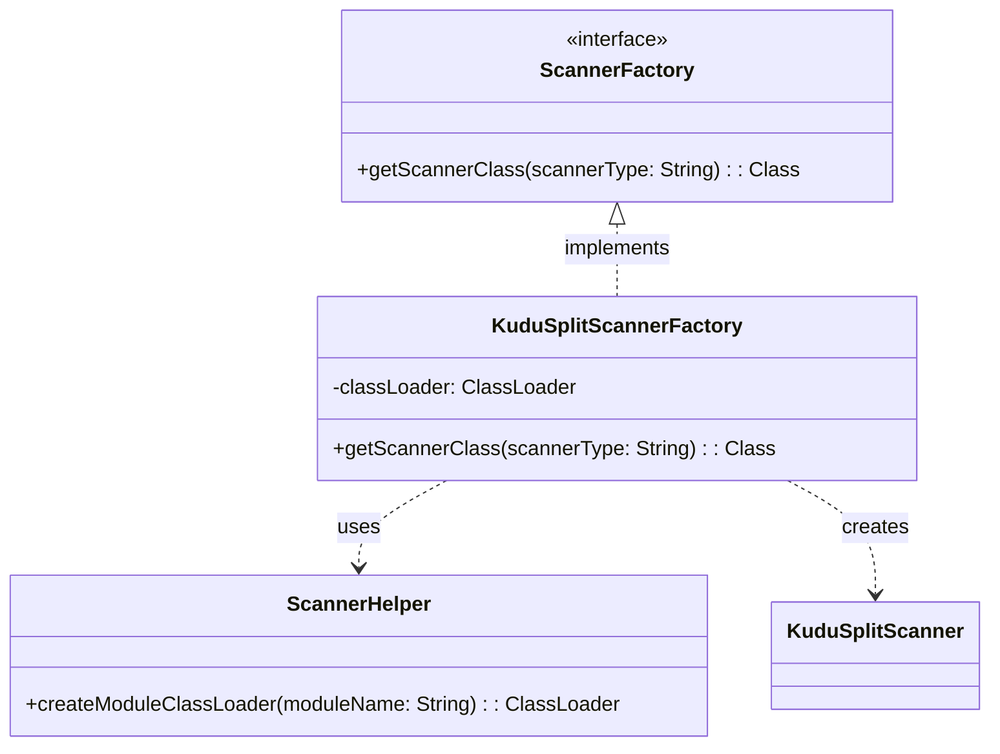
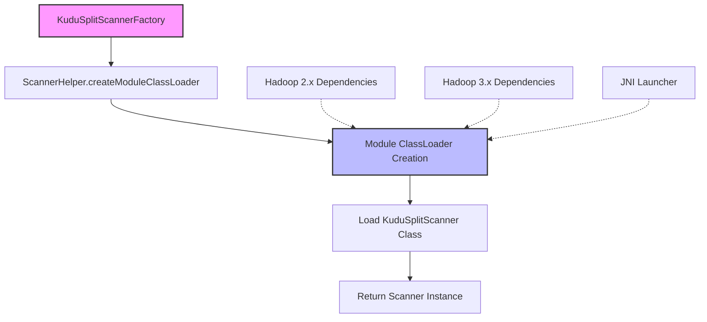
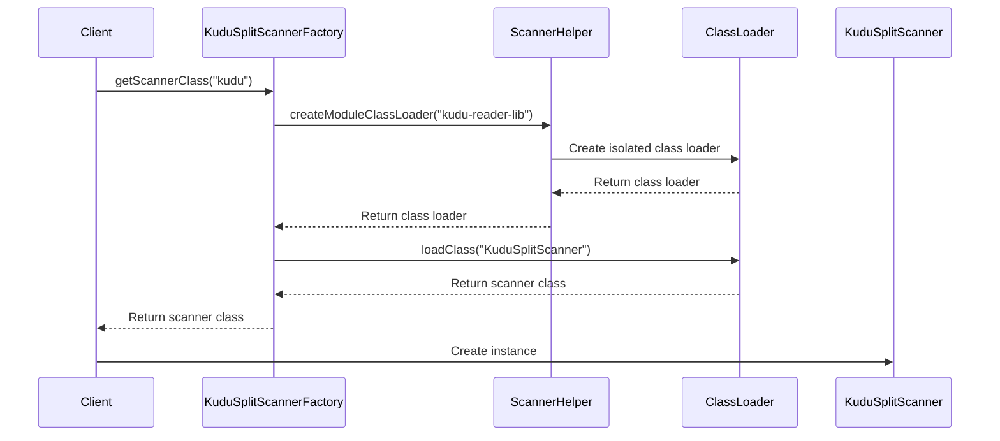

# Scanner Factory Module Documentation

## Introduction

The scanner_factory module is a critical component in StarRocks' data ingestion pipeline, specifically designed to create and manage scanner instances for reading data from external storage systems. This module implements a factory pattern to provide scanner instances for different data sources, with a particular focus on handling class loading isolation to resolve version conflicts between different Hadoop distributions.

## Module Overview

The scanner_factory module serves as the entry point for creating scanner instances that can read data from various external storage systems. It provides a unified interface for scanner creation while handling the complexities of class loading isolation, particularly important when dealing with different versions of Hadoop ecosystem components.

## Core Architecture

### Factory Pattern Implementation

The module implements the factory pattern through the `ScannerFactory` interface, which defines a contract for creating scanner instances. The `KuduSplitScannerFactory` is a concrete implementation that specializes in creating Kudu-specific scanners.



### Class Loading Architecture

The module employs a sophisticated class loading strategy to isolate different scanner implementations and resolve version conflicts:



## Key Components

### KuduSplitScannerFactory

The primary factory implementation that creates Kudu scanner instances. Key characteristics:

- **Purpose**: Creates scanner instances for reading data from Apache Kudu
- **Class Loading Strategy**: Uses isolated class loader to avoid Hadoop version conflicts
- **Module Isolation**: Each scanner type operates in its own class loader context

### ScannerFactory Interface

The base interface that defines the contract for all scanner factories:

- **Method**: `getScannerClass(String scannerType)`
- **Purpose**: Returns the appropriate scanner class based on the scanner type
- **Exception Handling**: Throws `ClassNotFoundException` when scanner class cannot be loaded

### ScannerHelper

Utility class that provides common functionality for scanner operations:

- **Class Loader Creation**: Creates module-specific class loaders
- **Dependency Management**: Handles module dependencies and isolation

## Data Flow



## Integration with Other Modules

### Dependencies

The scanner_factory module integrates with several other StarRocks modules:

- **[JNI Connector Framework](jni_connector.md)**: Provides the base `ScannerFactory` interface and `ScannerHelper` utilities
- **[Kudu Reader](kudu_reader.md)**: The actual scanner implementation that this factory creates
- **[Java Extensions](java_extensions.md)**: Part of the broader Java extensions ecosystem

### Related Scanner Factories

The scanner_factory pattern is used across multiple data source connectors:

- **Hive Scanner Factory**: Creates scanners for Hive tables
- **Hudi Scanner Factory**: Creates scanners for Hudi tables  
- **Iceberg Scanner Factory**: Creates scanners for Iceberg tables
- **ODPS Scanner Factory**: Creates scanners for ODPS tables

## Configuration and Usage

### Module Configuration

The scanner factory is configured through module-specific class loaders:

```java
// Module class loader configuration
static {
    classLoader = ScannerHelper.createModuleClassLoader("kudu-reader-lib");
}
```

### Error Handling

The factory implements robust error handling for class loading scenarios:

```java
try {
    return classLoader.loadClass("com.starrocks.kudu.reader.KuduSplitScanner");
} catch (ClassNotFoundException e) {
    e.printStackTrace();
    throw e;
}
```

## Performance Considerations

### Class Loading Optimization

- **Static Class Loader**: The class loader is created once and reused for all scanner instances
- **Module Isolation**: Each scanner type has its own isolated class loader to prevent conflicts
- **Lazy Loading**: Scanner classes are loaded on-demand when requested

### Memory Management

- **Class Loader Lifecycle**: Class loaders are managed by the ScannerHelper utility
- **Resource Cleanup**: Proper cleanup of class loader resources when modules are unloaded

## Security Considerations

### Class Loading Security

- **Isolated Class Loaders**: Prevents unauthorized access to scanner implementations
- **Module Boundaries**: Enforces strict boundaries between different scanner modules
- **Exception Handling**: Proper exception handling prevents information leakage

## Future Enhancements

### Planned Improvements

1. **Dynamic Module Loading**: Support for loading scanner modules dynamically at runtime
2. **Configuration Management**: Enhanced configuration options for scanner factories
3. **Performance Monitoring**: Metrics collection for scanner creation and usage
4. **Multi-Version Support**: Support for multiple versions of the same scanner type

### Extension Points

The factory pattern allows for easy extension to support new data sources:

1. Implement the `ScannerFactory` interface
2. Create the corresponding scanner implementation
3. Register the factory with the appropriate module class loader

## Conclusion

The scanner_factory module is a foundational component that enables StarRocks to read data from diverse external storage systems. Its implementation of the factory pattern, combined with sophisticated class loading isolation, provides a robust and extensible framework for data ingestion. The module's design effectively resolves version conflicts while maintaining clean separation of concerns across different data source connectors.