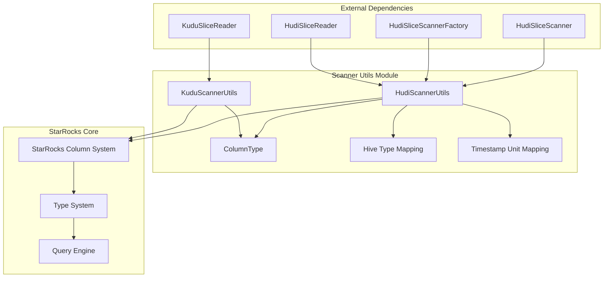
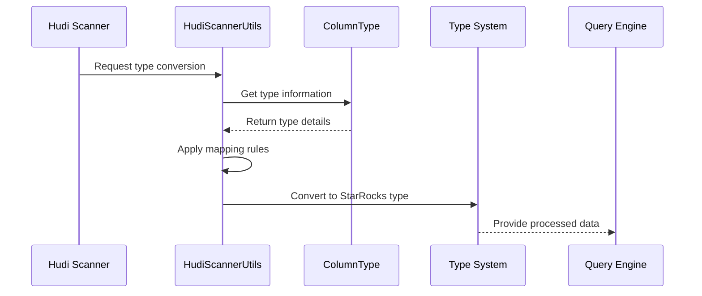
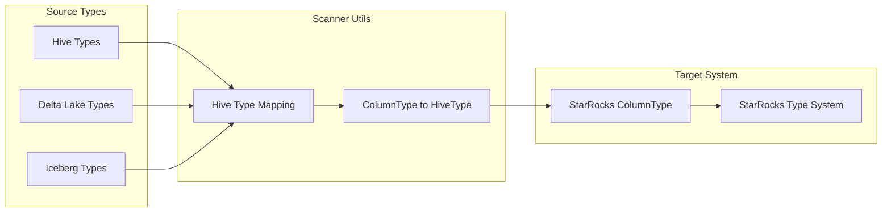
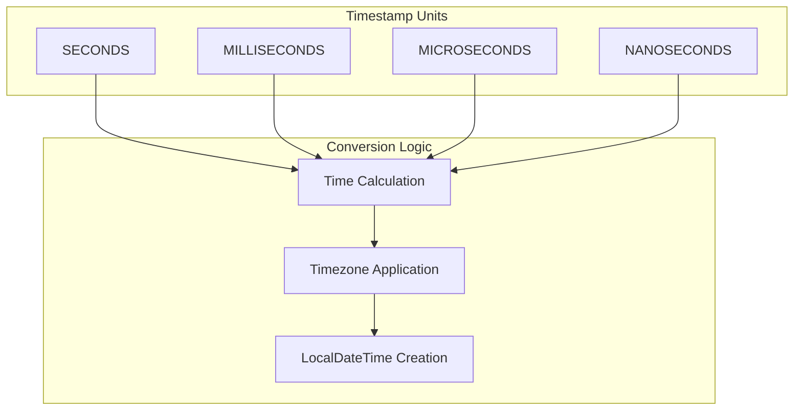
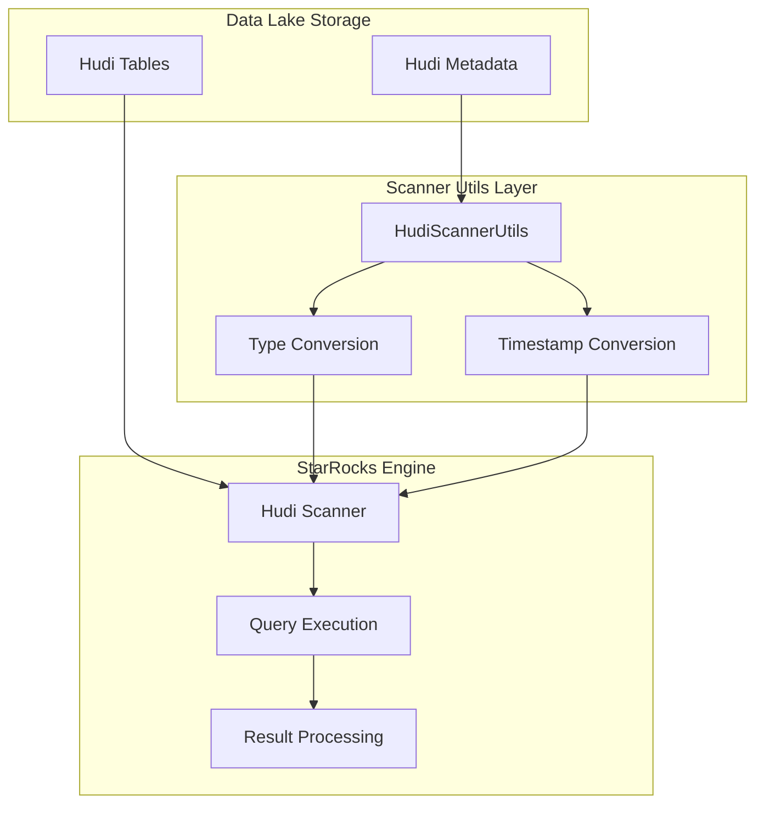

# Scanner Utils Module Documentation

## Overview

The scanner_utils module provides essential utility functions and type mapping capabilities for data scanning operations across multiple data sources within the StarRocks data lake analytics platform. This module serves as a bridge between various external data types (Hudi, Kudu, Iceberg, Paimon) and StarRocks' internal column type system, enabling seamless data integration and processing.

## Purpose and Core Functionality

The primary purpose of scanner_utils is to facilitate type conversion and data formatting when reading data from various external table formats. The module addresses critical challenges in data lake analytics:

1. **Type System Bridging**: Converts between external data source types (Hudi/Hive, Kudu, Iceberg, Paimon) and StarRocks column types
2. **Timestamp Precision Handling**: Manages different timestamp precisions (microseconds, milliseconds, nanoseconds) across data sources
3. **Complex Type Support**: Handles nested data structures like structs, arrays, and maps
4. **Time Zone Management**: Provides proper timestamp conversion with timezone awareness
5. **Data Format Standardization**: Ensures consistent data representation across different scanning operations

## Architecture and Component Relationships

### Module Architecture



### Data Flow Architecture



## Core Components

### KuduScannerUtils Class

**Location**: `java-extensions/kudu-reader/src/main/java/com/starrocks/kudu/reader/KuduScannerUtils.java`

The `KuduScannerUtils` class provides utility functions specifically designed for Kudu data source integration:

#### Key Features:
- **Date/Time Formatting**: Converts Java time objects to string representations compatible with Kudu
- **Base64 Decoding**: Provides URL-safe Base64 decoding functionality
- **UTC Time Zone Handling**: Standardizes time zone operations to UTC

#### Core Methods:

```java
public static String formatDateTime(LocalDateTime dateTime)
```
Converts `LocalDateTime` objects to string format "yyyy-MM-dd HH:mm:ss" for consistent datetime representation.

```java
public static String formatDate(LocalDate date)
```
Converts `LocalDate` objects to string format "yyyy-MM-dd" for date representation.

```java
public static byte[] decodeBase64(String encoded)
```
Decodes URL-safe Base64 encoded strings to byte arrays, essential for handling encoded data in Kudu operations.

### HudiScannerUtils Class

The `HudiScannerUtils` class is the central component providing static utility methods for Hudi data scanning operations.

#### Key Features:

1. **Type Mapping System**: Maintains mappings between Hudi/Hive types and StarRocks types
2. **Timestamp Conversion**: Handles multiple timestamp precisions with timezone support
3. **Complex Type Serialization**: Converts nested data structures to appropriate formats

#### Core Methods:

- `getTimestamp(long value, TimeUnit timeUnit, ZoneId zoneId)`: Converts timestamp values with proper precision and timezone
- `mapColumnTypeToHiveType(ColumnType type)`: Converts StarRocks column types to Hive-compatible types
- `isMaybeInt64Timestamp(ColumnType.TypeValue type)`: Identifies timestamp types that use int64 representation

## Type System Integration

### Type Mapping Architecture



### Timestamp Precision Handling

The module supports four different timestamp precisions:



## Integration with Data Lake Connectors

### Hudi Integration Flow



## Dependencies and Interactions

### Upstream Dependencies

The scanner_utils module depends on:

1. **ColumnType System**: StarRocks' internal type representation
2. **JNI Connector**: Java Native Interface for cross-language operations
3. **Time API**: Java 8 time API for timestamp handling

### Downstream Consumers

The module is consumed by:

1. **HudiSliceScanner**: Main scanner implementation for Hudi data
2. **HudiSliceScannerFactory**: Factory for creating scanner instances
3. **Query Execution Engine**: For type-aware query processing

## Configuration and Constants

### Type Mapping Constants

```java
// Hive type mapping for timestamp precisions
HIVE_TYPE_MAPPING.put("timestamp-micros", "timestamp");
HIVE_TYPE_MAPPING.put("timestamp-millis", "timestamp");

// Timestamp unit mapping for different precisions
TIMESTAMP_UNIT_MAPPING.put(ColumnType.TypeValue.DATETIME_MICROS, TimeUnit.MICROSECONDS);
TIMESTAMP_UNIT_MAPPING.put(ColumnType.TypeValue.DATETIME_MILLIS, TimeUnit.MILLISECONDS);
TIMESTAMP_UNIT_MAPPING.put(ColumnType.TypeValue.DATETIME, TimeUnit.MICROSECONDS);
```

### Precision Constants

```java
private static final long MILLI = 1000;
private static final long MICRO = 1_000_000;
private static final long NANO = 1_000_000_000;
```

## Error Handling and Validation

The module implements several validation mechanisms:

1. **Type Validation**: Ensures valid type conversions
2. **Precision Validation**: Validates timestamp precision compatibility
3. **Null Safety**: Handles null values in type mappings

## Performance Considerations

### Optimization Strategies

1. **Static Initialization**: Type mappings are initialized once at class loading
2. **StringBuilder Usage**: Efficient string concatenation for complex types
3. **Switch Statements**: Optimized timestamp unit handling

### Memory Management

- Static maps reduce memory allocation
- StringBuilder with initial capacity estimation
- Efficient data structure usage for type mappings

## Extension Points

The module provides extension capabilities for:

1. **Custom Type Mappings**: Additional Hive type mappings can be added
2. **Timestamp Units**: Support for new timestamp precision types
3. **Complex Types**: Extensible support for new nested data structures

## Related Documentation

For more information about related components, refer to:

- [hudi_reader.md](hudi_reader.md) - Hudi data reading implementation
- [connectors.md](connectors.md) - Data lake connector framework
- [type_system.md](type_system.md) - StarRocks type system documentation
- [query_execution.md](query_execution.md) - Query execution engine

## Usage Examples

### Basic Type Conversion

```java
ColumnType starrocksType = // ... get StarRocks type
String hiveType = HudiScannerUtils.mapColumnTypeToHiveType(starrocksType);
```

### Timestamp Conversion

```java
long timestampValue = // ... get timestamp value
TimeUnit unit = TimeUnit.MICROSECONDS;
ZoneId zoneId = ZoneId.of("UTC");
LocalDateTime result = HudiScannerUtils.getTimestamp(timestampValue, unit, zoneId);
```

### Type Validation

```java
ColumnType.TypeValue type = // ... get type value
boolean isTimestamp = HudiScannerUtils.isMaybeInt64Timestamp(type);
```

This documentation provides a comprehensive overview of the scanner_utils module, its architecture, and its role within the StarRocks data lake analytics platform. The module serves as a critical bridge between Hudi's native data formats and StarRocks' query processing capabilities, ensuring efficient and accurate data integration.