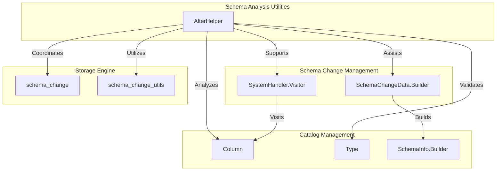
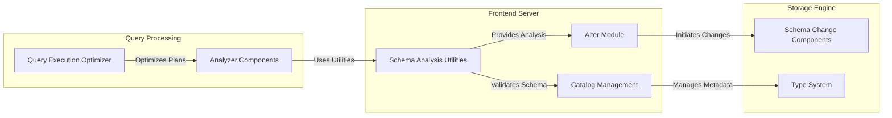
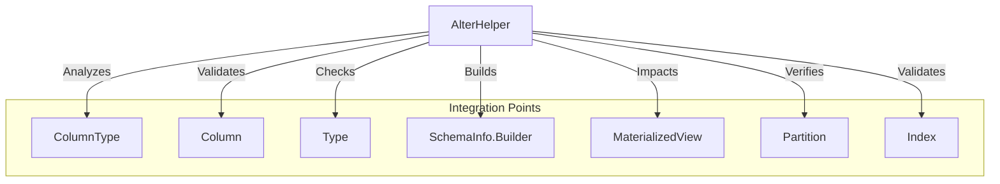
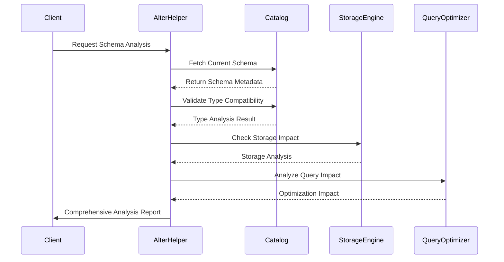
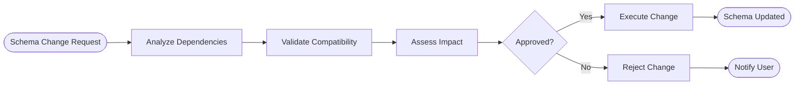
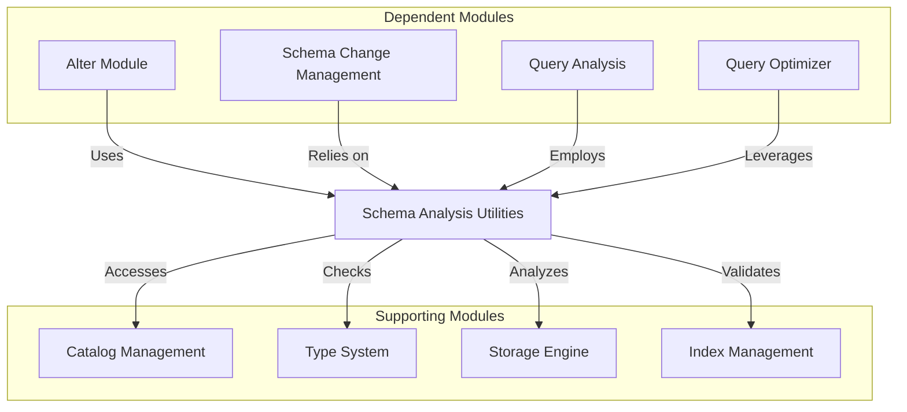
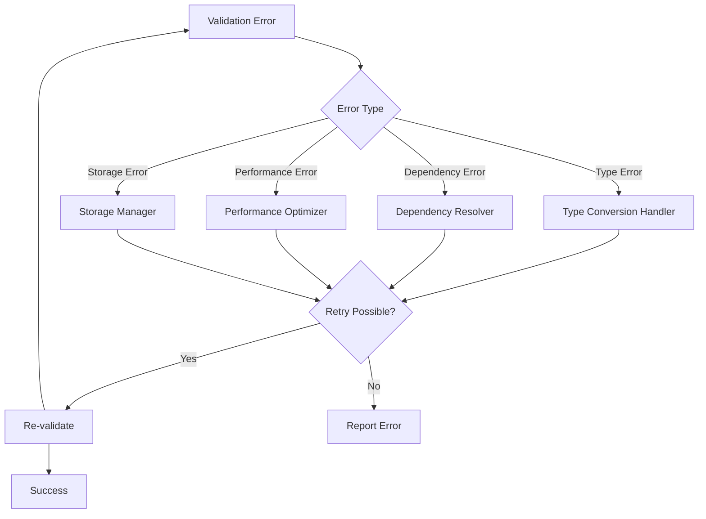

# Schema Analysis Utilities Module

## Introduction

The Schema Analysis Utilities module provides essential functionality for analyzing and managing schema changes within the StarRocks database system. This module serves as a critical component in the schema alteration process, offering utilities that help validate, analyze, and facilitate schema modifications while maintaining data integrity and system stability.

## Module Overview

The Schema Analysis Utilities module is part of the broader [alter](alter.md) module ecosystem and specifically focuses on providing helper functions and analysis capabilities for schema change operations. It acts as a supporting layer that enables other components to perform complex schema transformations safely and efficiently.

## Core Architecture

### Component Structure

### System Integration

## Core Component: AlterHelper

### Purpose and Responsibilities

The `AlterHelper` component serves as the primary utility class within the Schema Analysis Utilities module. Its main responsibilities include:

1. **Schema Validation**: Analyzing proposed schema changes for compatibility and feasibility
2. **Type Analysis**: Ensuring data type conversions and modifications are valid
3. **Dependency Checking**: Verifying that schema changes don't break existing dependencies
4. **Change Impact Assessment**: Evaluating the potential impact of schema modifications
5. **Coordination Support**: Assisting other alter components in executing complex schema changes

### Key Functionalities

#### Schema Compatibility Analysis
- Validates proposed column type changes
- Checks for data loss risks during type conversions
- Analyzes index compatibility with new schema
- Verifies partition key compatibility

#### Dependency Analysis
- Identifies foreign key relationships affected by schema changes
- Analyzes materialized view dependencies
- Checks constraint dependencies
- Validates view dependencies on modified tables

#### Change Impact Assessment
- Estimates data migration requirements
- Analyzes performance implications of schema changes
- Identifies potential locking requirements
- Assesses storage impact of modifications

### Integration Points

The AlterHelper integrates with multiple system components:

## Data Flow Architecture

### Schema Change Analysis Flow

### Dependency Resolution Process

## Module Dependencies

### Internal Dependencies

The Schema Analysis Utilities module depends on several core system components:

1. **[Catalog Management](catalog.md)**: For accessing table metadata, column definitions, and type information
2. **[Type System](type_system.md)**: For type compatibility checking and conversion analysis
3. **[Storage Engine](storage_engine.md)**: For understanding storage implications of schema changes
4. **[Query Optimizer](sql_parser_optimizer.md)**: For analyzing query plan impacts

### External Dependencies

## Use Cases and Applications

### Primary Use Cases

1. **Schema Evolution**: Supporting safe schema modifications in production environments
2. **Type Migration**: Facilitating data type changes with minimal downtime
3. **Index Management**: Analyzing impacts of adding, removing, or modifying indexes
4. **Partition Strategy Changes**: Assessing partition key modifications
5. **Constraint Management**: Validating constraint additions or modifications

### Application Scenarios

#### Online Schema Changes
- Analyzing ALTER TABLE operations
- Validating column additions with default values
- Checking type compatibility for existing data
- Assessing impact on running queries

#### Data Migration Support
- Analyzing data conversion requirements
- Validating target schema compatibility
- Estimating migration time and resources
- Checking for potential data loss scenarios

#### Performance Optimization
- Analyzing schema changes for query performance
- Validating index effectiveness
- Assessing storage layout optimizations
- Checking partition strategy improvements

## Error Handling and Validation

### Validation Categories

1. **Type Validation**: Ensuring type compatibility and conversion safety
2. **Constraint Validation**: Verifying constraint consistency
3. **Dependency Validation**: Checking for broken dependencies
4. **Performance Validation**: Assessing performance implications
5. **Storage Validation**: Verifying storage capacity and layout

### Error Recovery

## Performance Considerations

### Analysis Optimization

1. **Caching Strategy**: Caching frequently accessed metadata
2. **Incremental Analysis**: Only analyzing changed components
3. **Parallel Processing**: Utilizing multiple threads for complex analyses
4. **Lazy Evaluation**: Deferring expensive operations until necessary

### Resource Management

- Memory-efficient metadata loading
- Connection pooling for catalog access
- Timeout handling for long-running analyses
- Resource cleanup after analysis completion

## Security and Access Control

### Permission Requirements

- **Schema Analysis**: Requires metadata read permissions
- **Change Validation**: Needs schema modification permissions
- **Impact Assessment**: Requires query plan access
- **Dependency Checking**: Needs catalog browsing permissions

### Security Measures

- Input validation for all analysis requests
- Permission checking before analysis execution
- Audit logging for schema analysis activities
- Secure metadata access patterns

## Monitoring and Observability

### Key Metrics

- Analysis request frequency
- Analysis completion time
- Validation failure rates
- Resource utilization during analysis
- Cache hit rates for metadata

### Logging and Tracing

- Detailed analysis request logging
- Performance metrics collection
- Error tracking and reporting
- Dependency resolution tracing

## Future Enhancements

### Planned Improvements

1. **AI-Powered Analysis**: Machine learning-based impact prediction
2. **Automated Optimization**: Self-optimizing schema recommendations
3. **Real-time Validation**: Continuous schema health monitoring
4. **Advanced Simulation**: More accurate change impact simulation

### Extension Points

- Plugin architecture for custom validators
- API for external analysis tools
- Integration with monitoring systems
- Custom rule engine for organization-specific requirements

## Related Documentation

- [Alter Module](alter.md) - Parent module for schema change operations
- [Catalog Management](catalog.md) - Metadata management system
- [Type System](type_system.md) - Data type handling and conversion
- [Storage Engine](storage_engine.md) - Storage layer for schema changes
- [Query Optimizer](sql_parser_optimizer.md) - Query plan analysis and optimization

## Conclusion

The Schema Analysis Utilities module plays a crucial role in maintaining the integrity and performance of the StarRocks database system during schema evolution. By providing comprehensive analysis and validation capabilities, it enables safe and efficient schema modifications while minimizing risks to production systems. Its integration with various system components ensures that schema changes are thoroughly analyzed from multiple perspectives, including type compatibility, performance impact, and dependency relationships.