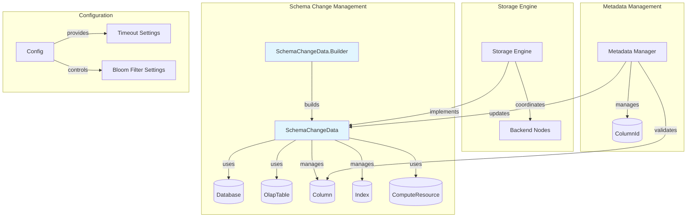
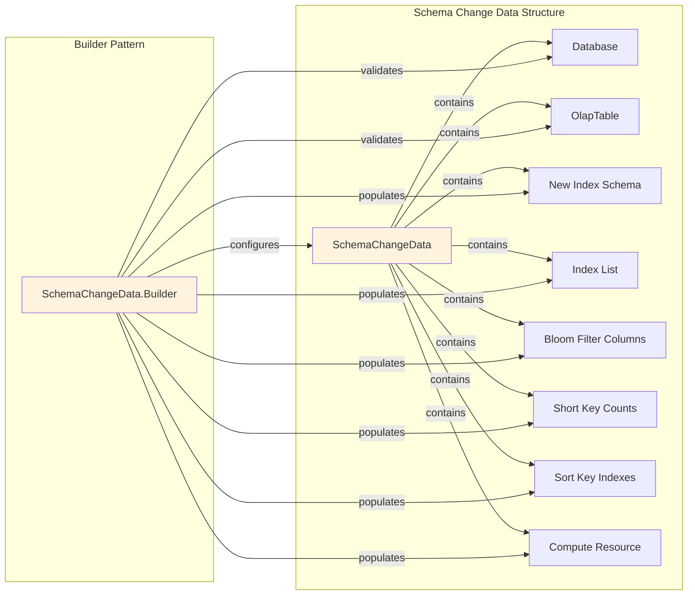
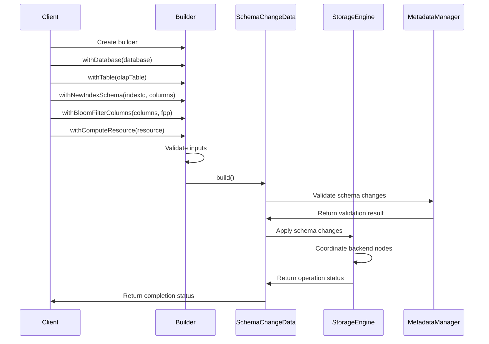
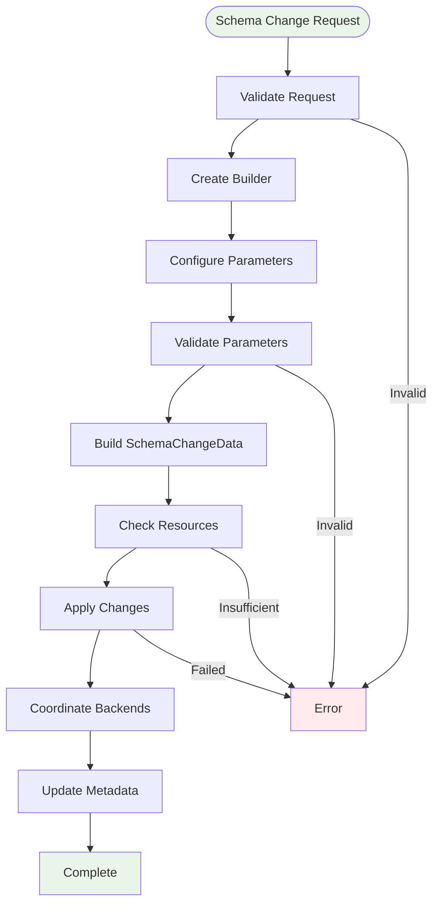

# Schema Change Management Module

## Introduction

The Schema Change Management module is a critical component of StarRocks' alter system that handles the complex process of modifying table schemas while ensuring data integrity and system availability. This module orchestrates schema modifications across distributed storage engines, manages metadata consistency, and coordinates the transition from old to new table structures.

## Core Functionality

The module provides comprehensive schema change capabilities including:

- **Column Operations**: Add, drop, modify, and reorder columns
- **Index Management**: Create, alter, and drop indexes including bloom filters
- **Key Configuration**: Modify short key counts and sort key configurations
- **Storage Optimization**: Control replicated storage settings for GIN indexes
- **Resource Management**: Coordinate compute resources during schema changes
- **Timeout Handling**: Configurable timeouts for long-running operations

## Architecture Overview

## Component Relationships

## Data Flow Architecture

## Key Components

### SchemaChangeData

The core immutable data structure that encapsulates all schema change parameters:

- **Database Context**: Reference to the target database
- **Table Reference**: Target OLAP table for schema changes
- **Schema Definitions**: New column schemas for each index
- **Index Management**: Index definitions and bloom filter configurations
- **Key Configuration**: Short key counts and sort key specifications
- **Resource Allocation**: Compute resource requirements
- **Operational Settings**: Timeout configurations and storage flags

### SchemaChangeData.Builder

Implements the builder pattern for constructing SchemaChangeData instances:

- **Fluent Interface**: Method chaining for configuration
- **Validation**: Input validation during construction
- **Default Values**: Sensible defaults for optional parameters
- **Immutable Result**: Builds immutable SchemaChangeData instances

## Process Flow

## Integration Points

### Storage Engine Integration

The module integrates with the storage engine through:
- [storage_engine.md](storage_engine.md) - Core storage operations
- [schema_and_types.md](schema_and_types.md) - Type system coordination
- [data_structures.md](data_structures.md) - Column and index structures

### Metadata Management

Coordinates with metadata components:
- [catalog.md](catalog.md) - Catalog operations
- [column_management.md](column_management.md) - Column metadata
- [index_management.md](index_management.md) - Index metadata

### Query Processing

Interfaces with query execution:
- [query_execution.md](query_execution.md) - Query planning during schema changes
- [sql_parser_optimizer.md](sql_parser_optimizer.md) - DDL statement processing

## Configuration and Settings

### Timeout Configuration
- Default timeout: `Config.alter_table_timeout_second`
- Configurable per operation
- Handles long-running schema changes

### Bloom Filter Settings
- Column-specific bloom filter configuration
- False positive probability (FPP) control
- Performance optimization for queries

### Storage Configuration
- Replicated storage control for GIN indexes
- Resource allocation for compute-intensive operations
- Warehouse-specific settings

## Error Handling

The module implements comprehensive error handling:

- **Validation Errors**: Invalid schema definitions
- **Resource Errors**: Insufficient compute resources
- **Timeout Errors**: Operation timeout handling
- **Consistency Errors**: Metadata consistency validation
- **Storage Errors**: Backend storage operation failures

## Performance Considerations

### Resource Management
- Compute resource allocation per operation
- Memory usage optimization
- Concurrent operation limits

### Metadata Efficiency
- Minimal metadata locking
- Incremental metadata updates
- Batch operation support

### Storage Optimization
- Efficient backend coordination
- Minimal data movement
- Parallel processing where possible

## Security and Access Control

Schema changes are subject to:
- Database-level permissions
- Table-level alter privileges
- Resource usage quotas
- Administrative controls

## Monitoring and Observability

The module provides:
- Operation progress tracking
- Resource usage metrics
- Error reporting and logging
- Performance monitoring
- Completion status notifications

## Dependencies

### Core Dependencies
- [frontend_server.md](frontend_server.md) - FE coordination
- [storage_engine.md](storage_engine.md) - Storage operations
- [catalog.md](catalog.md) - Metadata management

### Supporting Dependencies
- [configuration_management.md](configuration_management.md) - System settings
- [resource_management.md](resource_management.md) - Resource allocation
- [authentication_authorization.md](authentication_authorization.md) - Access control

This comprehensive schema change management system ensures that table structure modifications are performed safely, efficiently, and with minimal impact on ongoing operations while maintaining data integrity and system availability.