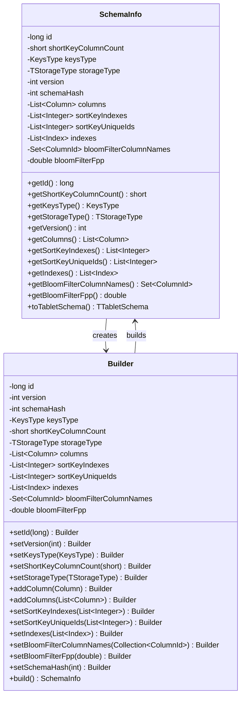
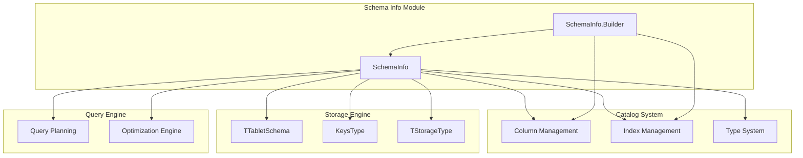
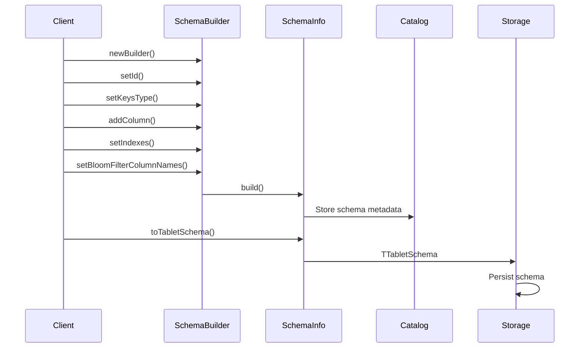

# Schema Info Module Documentation

## Overview

The Schema Info module is a fundamental component of StarRocks' catalog system that manages table schema metadata and structure information. It provides a comprehensive schema representation system that handles column definitions, storage configurations, indexing, and optimization metadata for tables within the database system.

## Purpose and Core Functionality

The Schema Info module serves as the central repository for table schema definitions, providing:

- **Schema Structure Management**: Defines and maintains the complete structure of database tables including columns, data types, and constraints
- **Storage Configuration**: Manages storage-related schema properties such as key types, storage formats, and compression settings
- **Index Management**: Handles table indexes including primary keys, secondary indexes, and specialized indexes like bloom filters
- **Schema Versioning**: Supports schema evolution through version tracking and hash-based schema validation
- **Optimization Metadata**: Maintains sort key information and bloom filter configurations for query optimization

## Architecture

### Core Components



### System Integration



## Component Relationships

### Dependencies

The Schema Info module has the following key dependencies:

- **Column Management**: Utilizes [Column](column_core.md) objects to define table structure
- **Index System**: Integrates with [Index](index_management.md) objects for table indexing
- **Type System**: References the [Type System](fe_type_system.md) for data type definitions
- **Storage Engine**: Converts to [TTabletSchema](storage_engine.md) for storage layer communication

### Dependent Modules

The Schema Info module is used by:

- **Table Management**: Core table operations require schema information
- **Query Planning**: Query optimizer uses schema metadata for plan generation
- **Storage Engine**: Storage layer uses schema for data organization
- **DDL Operations**: Data Definition Language operations modify schema information

## Data Flow



## Key Features

### Schema Builder Pattern

The module implements the Builder pattern for flexible schema construction:

```java
SchemaInfo schema = SchemaInfo.newBuilder()
    .setId(tableId)
    .setKeysType(KeysType.AGG_KEYS)
    .setShortKeyColumnCount((short) 2)
    .setStorageType(TStorageType.COLUMN)
    .addColumns(columns)
    .setIndexes(indexes)
    .setBloomFilterColumnNames(bfColumns)
    .setBloomFilterFpp(0.01)
    .build();
```

### Schema Serialization

The module provides seamless conversion to Thrift structures for cross-service communication:

- **TTabletSchema**: Converts to storage engine format
- **TColumn**: Individual column serialization
- **TOlapTableIndex**: Index serialization

### Optimization Support

Includes metadata for query optimization:

- **Sort Key Information**: Indexes for efficient sorting
- **Bloom Filter Configuration**: Column-level bloom filters for predicate pushdown
- **Schema Hashing**: Version control and validation

## Usage Patterns

### Schema Creation

```java
// Create a new schema for an aggregate table
SchemaInfo aggSchema = SchemaInfo.newBuilder()
    .setId(1001L)
    .setVersion(1)
    .setKeysType(KeysType.AGG_KEYS)
    .setShortKeyColumnCount((short) 3)
    .setStorageType(TStorageType.COLUMN)
    .addColumns(keyColumns)
    .addColumns(valueColumns)
    .setIndexes(primaryIndex)
    .setBloomFilterColumnNames(filterColumns)
    .setBloomFilterFpp(0.005)
    .build();
```

### Schema Evolution

```java
// Update schema version
SchemaInfo newSchema = SchemaInfo.newBuilder()
    .setId(existingSchema.getId())
    .setVersion(existingSchema.getVersion() + 1)
    .setKeysType(existingSchema.getKeysType())
    .setShortKeyColumnCount(existingSchema.getShortKeyColumnCount())
    .setStorageType(existingSchema.getStorageType())
    .addColumns(updatedColumns)
    .setIndexes(updatedIndexes)
    .setSchemaHash(calculateSchemaHash(updatedColumns))
    .build();
```

## Integration with Other Modules

### Table Structure Management

The Schema Info module is a core component of the [Table Structure](table_structure.md) management system, working alongside:

- **Index Management**: Coordinates with index definitions
- **Tablet Management**: Provides schema for tablet organization
- **Scalar Functions**: Supports function metadata in schemas

### Storage Engine Integration

Integrates deeply with the [Storage Engine](storage_engine.md) through:

- **Rowset Management**: Schema information for rowset organization
- **Column Management**: Column-level storage configurations
- **Predicate Evaluation**: Schema-aware predicate processing

## Performance Considerations

### Memory Efficiency

- Immutable schema objects for thread safety
- Lazy initialization of optional fields
- Efficient collection types (ArrayList, HashSet)

### Serialization Performance

- Direct Thrift conversion without intermediate representations
- Cached schema hash calculations
- Minimal object creation during conversion

### Query Optimization

- Pre-computed sort key information
- Bloom filter metadata for predicate pushdown
- Schema hash for quick validation

## Error Handling

The module includes comprehensive validation:

- **Builder Validation**: Ensures required fields are set
- **Type Safety**: Validates column types against storage types
- **Schema Consistency**: Checks for logical schema consistency

## Future Enhancements

Potential areas for improvement:

- **Schema Compression**: Compressed schema representation for large tables
- **Incremental Schema Updates**: Support for partial schema modifications
- **Schema Caching**: Enhanced caching mechanisms for frequently accessed schemas
- **Multi-Version Schema**: Better support for concurrent schema versions