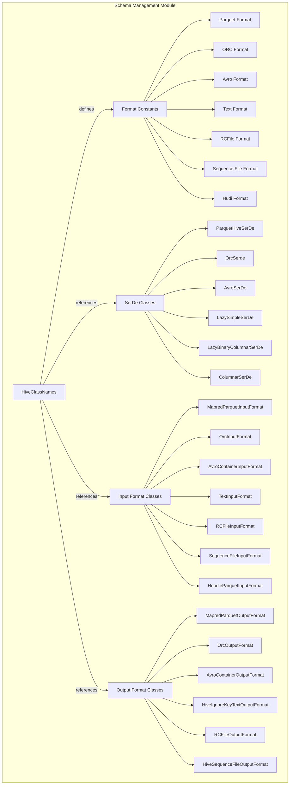
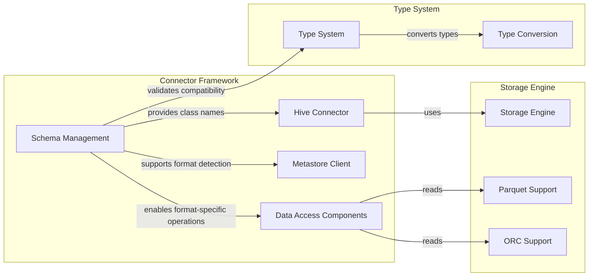
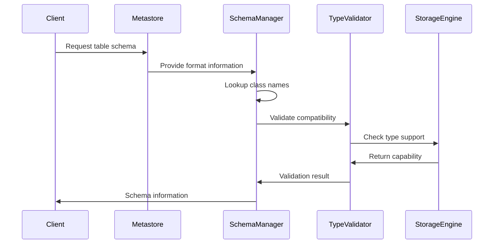
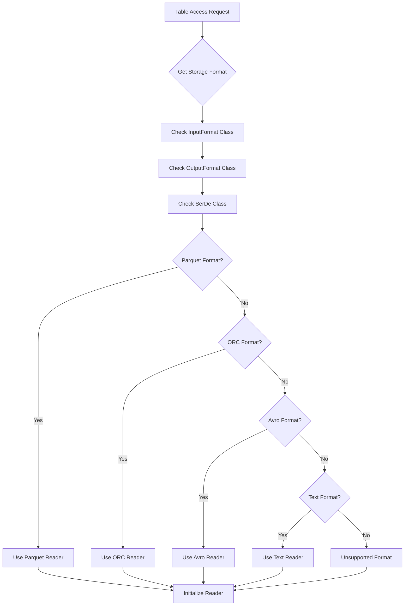

# Schema Management Module

## Introduction

The schema_management module is a core component of the StarRocks connector framework that handles schema-related operations for external table formats, particularly Hive tables. This module provides centralized management of class names, type mappings, and schema validation for various file formats and serialization/deserialization mechanisms used in data lake environments.

## Overview

The schema_management module serves as the central registry for Hive class names and provides the foundation for schema compatibility checking across different storage formats. It acts as a bridge between StarRocks' internal type system and external table formats, ensuring seamless integration with Hive, Parquet, ORC, Avro, and other file formats commonly used in data lake architectures.

## Core Architecture

### Component Structure



### Module Dependencies



## Core Components

### HiveClassNames

The `HiveClassNames` class serves as the central registry for all Hive-related class names used in the StarRocks system. It provides a comprehensive set of constants for:

#### Input Format Classes
- **Text Format**: `org.apache.hadoop.mapred.TextInputFormat`
- **Parquet Format**: `org.apache.hadoop.hive.ql.io.parquet.MapredParquetInputFormat`
- **ORC Format**: `org.apache.hadoop.hive.ql.io.orc.OrcInputFormat`
- **Avro Format**: `org.apache.hadoop.hive.ql.io.avro.AvroContainerInputFormat`
- **RCFile Format**: `org.apache.hadoop.hive.ql.io.RCFileInputFormat`
- **Sequence File Format**: `org.apache.hadoop.mapred.SequenceFileInputFormat`
- **Hudi Format**: `org.apache.hudi.hadoop.HoodieParquetInputFormat`

#### Output Format Classes
- **Text Format**: `org.apache.hadoop.hive.ql.io.HiveIgnoreKeyTextOutputFormat`
- **Parquet Format**: `org.apache.hadoop.hive.ql.io.parquet.MapredParquetOutputFormat`
- **ORC Format**: `org.apache.hadoop.hive.ql.io.orc.OrcOutputFormat`
- **Avro Format**: `org.apache.hadoop.hive.ql.io.avro.AvroContainerOutputFormat`
- **RCFile Format**: `org.apache.hadoop.hive.ql.io.RCFileOutputFormat`
- **Sequence File Format**: `org.apache.hadoop.hive.ql.io.HiveSequenceFileOutputFormat`

#### SerDe Classes
- **Parquet**: `org.apache.hadoop.hive.ql.io.parquet.serde.ParquetHiveSerDe`
- **ORC**: `org.apache.hadoop.hive.ql.io.orc.OrcSerde`
- **Avro**: `org.apache.hadoop.hive.serde2.avro.AvroSerDe`
- **Lazy Simple**: `org.apache.hadoop.hive.serde2.lazy.LazySimpleSerDe`
- **Lazy Binary Columnar**: `org.apache.hadoop.hive.serde2.columnar.LazyBinaryColumnarSerDe`
- **Columnar**: `org.apache.hadoop.hive.serde2.columnar.ColumnarSerDe`

## Data Flow

### Schema Validation Flow



### Format Detection Process



## Integration Points

### Connector Framework Integration

The schema_management module integrates with the broader connector framework through:

1. **Hive Connector**: Provides class name constants for Hive table operations
2. **Metastore Client**: Enables format-specific metadata retrieval
3. **Data Access Components**: Supports format-aware data reading operations

### Storage Engine Integration

The module interfaces with the storage engine through:

1. **Format Readers**: Parquet, ORC, Avro, and text format readers
2. **Type Conversion**: Schema validation and type mapping
3. **Predicate Pushdown**: Format-specific predicate optimization

## Usage Patterns

### Schema Validation

```java
// Example usage in connector validation
String inputFormatClass = table.getInputFormatClass();
if (inputFormatClass.equals(HiveClassNames.MAPRED_PARQUET_INPUT_FORMAT_CLASS)) {
    // Handle Parquet-specific validation
} else if (inputFormatClass.equals(HiveClassNames.ORC_INPUT_FORMAT_CLASS)) {
    // Handle ORC-specific validation
}
```

### Format Detection

```java
// Example usage in format detection
public StorageFormat detectFormat(String serdeClass, String inputFormat) {
    if (serdeClass.equals(HiveClassNames.PARQUET_HIVE_SERDE_CLASS)) {
        return StorageFormat.PARQUET;
    } else if (serdeClass.equals(HiveClassNames.ORC_SERDE_CLASS)) {
        return StorageFormat.ORC;
    }
    // Additional format detection logic
}
```

## Configuration and Extensibility

### Adding New Formats

To add support for new file formats:

1. Add class name constants to `HiveClassNames`
2. Update format detection logic in connectors
3. Implement corresponding readers in the storage engine
4. Add type mapping rules in the type system

### Custom SerDe Support

The module supports custom SerDe implementations through:

1. Configuration-based class name overrides
2. Plugin architecture for custom format handlers
3. Runtime format detection and validation

## Performance Considerations

### Caching Strategy

- Class name constants are statically defined for optimal performance
- Format detection results can be cached at the table level
- Schema validation results are cached to avoid repeated lookups

### Memory Efficiency

- String constants are interned to reduce memory footprint
- Format-specific metadata is lazily loaded
- Validation results are cached with appropriate TTL

## Error Handling

### Schema Mismatch Detection

The module provides comprehensive error handling for:

- Unsupported format combinations
- Missing class definitions
- Type compatibility issues
- SerDe configuration errors

### Recovery Mechanisms

- Fallback to generic readers for unknown formats
- Graceful degradation for partially supported schemas
- Detailed error messages for debugging

## Security Considerations

### Class Loading Security

- All class names are validated before loading
- Custom SerDe classes are loaded in isolated class loaders
- Format-specific security policies are enforced

### Data Validation

- Schema validation prevents injection attacks
- Type checking ensures data integrity
- Format-specific security constraints are applied

## Monitoring and Observability

### Metrics Collection

- Format usage statistics
- Schema validation success/failure rates
- Performance metrics for format detection

### Logging

- Detailed logging for schema operations
- Error context for troubleshooting
- Performance metrics for optimization

## Related Documentation

- [Connector Framework](connector_framework.md) - Overview of the connector architecture
- [Hive Connector](hive_connector.md) - Detailed Hive connector implementation
- [Storage Engine](storage_engine.md) - Storage format support and optimization
- [Type System](type_system.md) - Type conversion and validation mechanisms

## Future Enhancements

### Planned Features

1. **Dynamic Format Registration**: Runtime registration of new formats
2. **Schema Evolution Support**: Enhanced schema change handling
3. **Performance Optimization**: Caching and prefetching improvements
4. **Extended Format Support**: Additional file format integrations

### Architecture Evolution

- Plugin-based format handler architecture
- Unified schema registry across all connectors
- Enhanced metadata caching strategies
- Improved error handling and recovery mechanisms