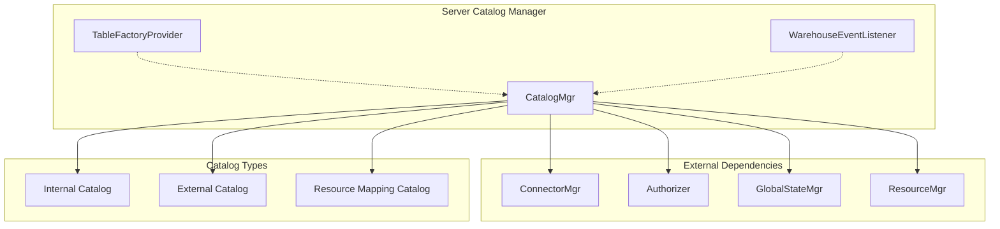
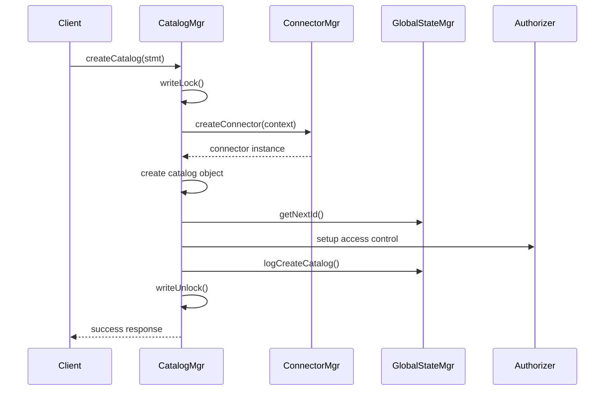

# Server Catalog Manager Module

## Overview

The `server_catalog_mgr` module is a core component of StarRocks that manages the lifecycle and operations of catalogs within the system. It serves as the central hub for catalog management, providing unified interfaces for creating, modifying, and removing catalogs while maintaining consistency between catalog metadata and their associated connectors.

## Purpose and Core Functionality

The primary responsibilities of this module include:

- **Catalog Lifecycle Management**: Creation, modification, and deletion of catalogs
- **Resource Mapping**: Automatic catalog creation from existing resources
- **Connector Coordination**: Synchronization between catalogs and their underlying connectors
- **Metadata Persistence**: Saving and loading catalog configurations
- **Access Control Integration**: Managing authorization contexts for catalogs
- **Catalog Discovery**: Providing catalog information and metadata to other system components

## Architecture Overview

## Core Components

### 1. Catalog Manager (`CatalogMgr`)

The main orchestrator that handles all catalog operations with thread-safe access control using read-write locks.

**Key Responsibilities:**
- Catalog CRUD operations (Create, Read, Update, Delete)
- Connector lifecycle synchronization
- Resource mapping catalog management
- Metadata persistence and recovery
- Catalog validation and existence checking

**Thread Safety:**
- Uses `ReentrantReadWriteLock` for concurrent access control
- All catalog operations are protected by appropriate lock acquisition
- Read operations can proceed concurrently
- Write operations are serialized

**Detailed Documentation:** [Catalog Management System](catalog_management.md)

### 2. Table Factory Provider (`TableFactoryProvider`)

A factory pattern implementation that provides appropriate table factories based on engine types.

**Supported Engines:**
- OLAP (StarRocks native tables)
- FILE (External file-based tables)
- HIVE (Apache Hive integration)
- HUDI (Apache Hudi integration)
- ICEBERG (Apache Iceberg integration)
- JDBC (External JDBC databases)
- MYSQL (MySQL integration)
- ELASTICSEARCH (Elasticsearch integration)

**Detailed Documentation:** [Table Factory System](table_factory_system.md)

### 3. Warehouse Event Listener (`WarehouseEventListener`)

An interface for monitoring warehouse-related events that may impact catalog operations.

**Event Types:**
- Warehouse creation and deletion
- Compute Node Group (CN Group) lifecycle events
- Resource allocation changes

**Detailed Documentation:** [Warehouse Integration](warehouse_integration.md)

## Data Flow Architecture

## Catalog Types and Management

### Internal Catalog
- Default system catalog containing StarRocks-managed tables
- Always available and cannot be dropped
- Managed by the system automatically

### External Catalogs
- User-defined catalogs for external data sources
- Support various connector types (Hive, Iceberg, JDBC, etc.)
- Full lifecycle management capabilities

### Resource Mapping Catalogs
- Automatically created from existing resources
- Used for backward compatibility and resource migration
- Special naming convention with `resource_mapping_inside_catalog_` prefix

## Error Handling and Recovery

The module implements comprehensive error handling:

- **Connector Creation Failures**: Automatic cleanup of partially created resources
- **Validation Errors**: Detailed error messages for configuration issues
- **Runtime Exceptions**: Graceful degradation and resource cleanup
- **Recovery Support**: Replay mechanisms for metadata consistency

## Integration Points

### With Connector Framework
- Coordinates with `ConnectorMgr` for connector lifecycle
- Ensures catalog-connector consistency
- Handles connector-specific configuration validation

### With Authorization System
- Integrates with `Authorizer` for access control
- Manages catalog-level permissions
- Supports fine-grained security policies

### With Global State Management
- Persists catalog metadata through `GlobalStateMgr`
- Participates in checkpoint and recovery processes
- Maintains consistency across system restarts

## Performance Considerations

- **Concurrent Access**: Read-write lock design allows high concurrency for read operations
- **Lazy Loading**: Resource mapping catalogs are loaded on-demand
- **Memory Management**: Efficient catalog storage with concurrent hash maps
- **Metadata Caching**: Integration with system metadata caches

## Related Documentation

- [Connector Framework](connector_framework.md) - For connector management details
- [Catalog System](catalog.md) - For catalog type definitions and structures
- [Authorization System](authentication_authorization.md) - For access control integration
- [Resource Management](resource_management.md) - For resource mapping functionality

## Future Enhancements

- Support for catalog-level caching strategies
- Enhanced monitoring and metrics for catalog operations
- Dynamic catalog configuration updates
- Improved catalog discovery and introspection capabilities