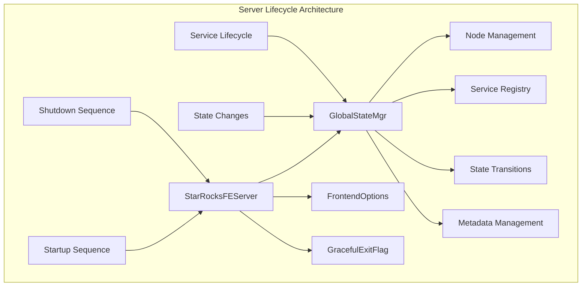
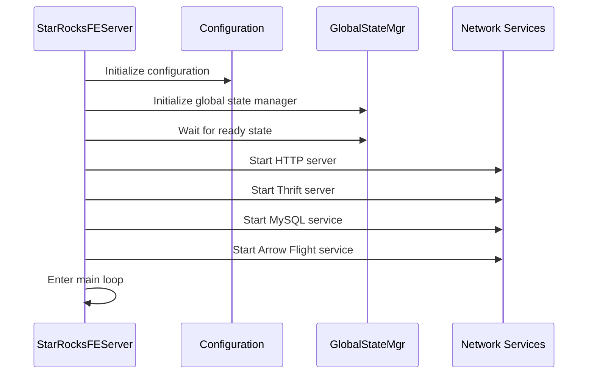
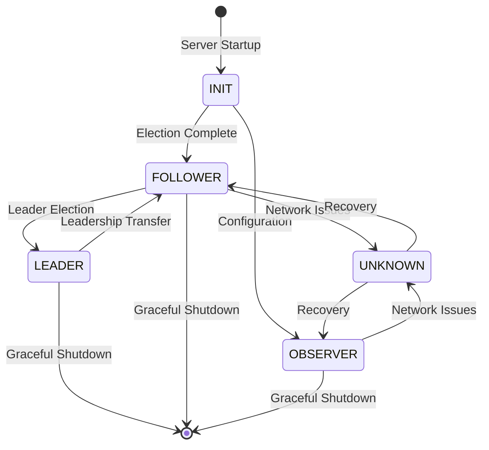
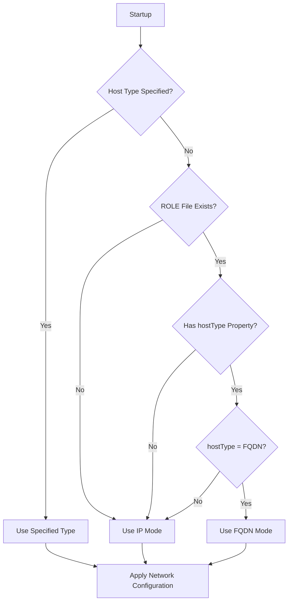

# Server Lifecycle Module Documentation

## Overview

The server_lifecycle module is a critical component of the StarRocks system that manages the complete lifecycle of Frontend (FE) servers. This module orchestrates server startup, initialization, state transitions, graceful shutdown, and provides essential coordination mechanisms for the distributed cluster architecture.

## Purpose and Core Functionality

The server_lifecycle module serves as the central nervous system for FE server management, providing:

- **Server Initialization**: Complete startup sequence including configuration loading, service initialization, and dependency setup
- **State Management**: Coordination of FE node roles (LEADER, FOLLOWER, OBSERVER) and state transitions
- **Graceful Operations**: Controlled startup, shutdown, and failover mechanisms
- **Service Coordination**: Management of multiple concurrent services (HTTP, Thrift, MySQL, Arrow Flight)
- **Cluster Coordination**: Integration with distributed consensus and metadata management

## Architecture Overview

## Core Components

### 1. StarRocksFEServer - Main Entry Point

**Detailed Documentation**: [server_initialization.md](server_initialization.md)

The `StarRocksFEServer` class serves as the primary entry point for the FE server lifecycle. It orchestrates the complete startup and shutdown sequence.

**Key Responsibilities:**
- Process command-line options and configuration initialization
- Coordinate service startup sequence (HTTP, Thrift, MySQL, Arrow Flight)
- Handle graceful shutdown procedures
- Manage PID file locking and process lifecycle
- Implement signal handling for controlled termination

**Startup Sequence:**

### 2. GlobalStateMgr - Central State Coordinator

**Detailed Documentation**: [state_management.md](state_management.md)

The `GlobalStateMgr` class acts as the central coordinator for all FE server operations and state management.

**Key Responsibilities:**
- Manage FE node roles and state transitions (LEADER/FOLLOWER/OBSERVER)
- Coordinate metadata loading and journal replay
- Manage distributed consensus and leader election
- Orchestrate daemon thread lifecycle
- Handle checkpoint operations and image management

**State Management:**

### 3. FrontendOptions - Network Configuration Manager

**Detailed Documentation**: [server_initialization.md](server_initialization.md)

The `FrontendOptions` class manages network configuration and address resolution for the FE server.

**Key Responsibilities:**
- Handle IP vs FQDN address resolution
- Manage priority network configuration
- Support IPv4/IPv6 dual-stack operations
- Coordinate with existing cluster configuration
- Provide network utility functions

**Address Resolution Logic:**

### 4. GracefulExitFlag - Shutdown Coordination

**Detailed Documentation**: [graceful_operations.md](graceful_operations.md)

The `GracefulExitFlag` provides atomic coordination for graceful shutdown procedures.

**Key Responsibilities:**
- Provide thread-safe shutdown signaling
- Coordinate graceful exit across multiple components
- Support timeout-based fallback mechanisms
- Enable clean resource cleanup

## Service Integration

The server_lifecycle module integrates with multiple system services:

### Network Services
- **HTTP/HTTPS Servers**: REST API and web interface
- **Thrift Server**: RPC communication with BE nodes
- **MySQL Protocol Server**: Client connection handling
- **Arrow Flight SQL Server**: High-performance data transfer

### Management Services
- **Journal System**: Metadata persistence and replication
- **Checkpoint Controller**: Periodic state snapshots
- **Heartbeat Manager**: Node health monitoring
- **State Change Executor**: Role transition coordination

## Graceful Operations

### Startup Process
1. **Configuration Validation**: Load and validate system configuration
2. **PID File Management**: Ensure single instance operation
3. **Metadata Initialization**: Load existing metadata or initialize new cluster
4. **Service Startup**: Start network services in dependency order
5. **State Transition**: Transition to appropriate role (LEADER/FOLLOWER/OBSERVER)
6. **Ready State**: Signal system readiness for client connections

### Shutdown Process
1. **Graceful Signal Handling**: Capture shutdown signals (SIGTERM, SIGUSR1)
2. **Connection Draining**: Stop accepting new connections
3. **Query Completion**: Wait for active queries to complete
4. **Leader Transfer**: Transfer leadership if current node is leader
5. **Service Shutdown**: Stop services in reverse dependency order
6. **Resource Cleanup**: Release system resources and cleanup

### Leader Transfer
The module implements sophisticated leader transfer mechanisms:
- **Pre-transfer Validation**: Ensure cluster has sufficient healthy nodes
- **Journal Coordination**: Stop journal writing and close BDB environment
- **Leadership Transition**: Trigger new leader election
- **Post-transfer Verification**: Confirm new leader readiness

## Error Handling and Recovery

### Failure Scenarios
- **Network Partition**: Handle isolation from cluster majority
- **Journal Corruption**: Recovery from metadata inconsistencies
- **Service Failures**: Graceful degradation and restart capabilities
- **Resource Exhaustion**: Memory and connection limit management

### Recovery Mechanisms
- **Automatic Retry**: Configurable retry logic for transient failures
- **Fallback Procedures**: Alternative code paths for degraded operation
- **State Reconciliation**: Automatic state synchronization after recovery
- **Administrative Intervention**: Manual recovery procedures for complex scenarios

## Configuration and Monitoring

### Key Configuration Parameters
- `max_graceful_exit_time_second`: Maximum time for graceful shutdown
- `min_graceful_exit_time_second`: Minimum time before forced shutdown
- `metadata_journal_queue_size`: Journal processing queue capacity
- `enable_safe_mode`: Safe mode operation for maintenance

### Monitoring and Observability
- **Startup Metrics**: Track initialization timing and success rates
- **State Transition Logs**: Detailed logging of role changes
- **Service Health**: Monitor individual service health status
- **Resource Usage**: Track memory, connections, and thread utilization

## Integration with Other Modules

The server_lifecycle module serves as the foundation for the entire StarRocks system, integrating with:

- **[storage_engine](storage_engine.md)**: Coordinates with storage layer for metadata operations
- **[query_execution](query_execution.md)**: Manages query service lifecycle and resource allocation
- **[sql_parser_optimizer](sql_parser_optimizer.md)**: Provides SQL processing services
- **[frontend_server](frontend_server.md)**: Hosts all frontend server components

## Best Practices

### Deployment Considerations
- Ensure proper network configuration for multi-node clusters
- Configure appropriate timeouts for graceful operations
- Set up monitoring and alerting for critical lifecycle events
- Implement proper backup and recovery procedures

### Operational Guidelines
- Use graceful shutdown procedures for maintenance operations
- Monitor cluster health during state transitions
- Plan for rolling upgrades and node replacements
- Maintain consistent configuration across cluster nodes

This documentation provides a comprehensive overview of the server_lifecycle module. For detailed implementation specifics, refer to the individual component documentation and source code.