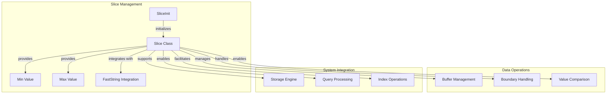

# Slice Management Sub-module

## Overview

The Slice Management sub-module provides efficient memory slice operations and data buffer management. It serves as a fundamental building block for data processing, offering optimized slice operations, boundary value handling, and memory-efficient data manipulation.

## Core Components

### SliceInit Class

The `SliceInit` class ensures proper initialization of slice constants and boundary values:

```cpp
class SliceInit {
public:
    SliceInit() { Slice::init(); }
};

static SliceInit _slice_init;  // Global initializer
```

## Architecture



## Key Features

### 1. Boundary Value Management
- Pre-defined minimum and maximum slice values
- Consistent boundary handling across the system
- Optimized comparison operations
- Memory-efficient boundary representation

### 2. FastString Integration
- Seamless integration with FastString for efficient string operations
- Zero-copy data sharing where possible
- Optimized memory allocation patterns
- Reduced memory copying overhead

### 3. Memory Slice Operations
- Efficient memory slice management
- Optimized slice comparison operations
- Memory-safe slice boundaries
- Cache-friendly data layout

## Implementation Details

### Slice Initialization

```cpp
void Slice::init() {
    // Initialize maximum value slice
    memset(_slice_max_value_data, 0xff, sizeof(_slice_max_value_data));
    _slice_max_value = Slice(_slice_max_value_data, sizeof(_slice_max_value_data));
    
    // Initialize minimum value slice (empty string)
    _slice_min_value = Slice(const_cast<char*>(""), 0);
}
```

### Boundary Values

The sub-module provides two essential boundary values:

1. **Maximum Value**: A slice filled with 0xFF bytes (65535 bytes)
2. **Minimum Value**: An empty string slice (0 bytes)

These boundaries are used for range queries and comparison operations.

### FastString Constructor

```cpp
Slice::Slice(const faststring& s)
    : data((char*)(s.data())),
      size(s.size()) {}
```

This constructor enables efficient conversion from FastString to Slice without data copying.

## Usage Patterns

### Range Query Boundaries
```cpp
// Example: Using slice boundaries for range queries
const Slice& min_key = Slice::min_value();
const Slice& max_key = Slice::max_value();

// Perform range scan from min to max
iterator->Seek(min_key);
while (iterator->Valid() && iterator->key().compare(max_key) <= 0) {
    process_entry(iterator->key(), iterator->value());
    iterator->Next();
}
```

### FastString Integration
```cpp
// Example: Efficient string to slice conversion
faststring buffer;
buffer.append("example data");
Slice slice(buffer);  // Zero-copy conversion

// Use slice for efficient operations
process_slice(slice);
```

### Boundary Comparisons
```cpp
// Example: Boundary value comparisons
Slice key = extract_key(data);
if (key.compare(Slice::min_value()) == 0) {
    // Handle minimum key case
} else if (key.compare(Slice::max_value()) == 0) {
    // Handle maximum key case
}
```

## Performance Characteristics

- **Slice Creation**: O(1) for basic operations
- **Memory Usage**: 16 bytes per Slice object (pointer + size)
- **Comparison Operations**: O(n) where n is the slice length
- **Boundary Access**: O(1) for min/max value retrieval
- **FastString Conversion**: O(1) zero-copy operation

## Memory Layout

```cpp
class Slice {
private:
    char* data;  // 8 bytes (64-bit systems)
    size_t size; // 8 bytes (64-bit systems)
    // Total: 16 bytes per Slice object
};
```

## Thread Safety

- All slice operations are thread-safe for read-only access
- No shared mutable state in slice objects
- Safe for concurrent access to boundary values
- FastString integration maintains thread safety

## Error Handling

- Safe handling of null data pointers
- Proper boundary checking for slice operations
- Graceful handling of empty slices
- Memory-safe slice construction

## Integration with Data Structures

### Storage Engine Integration
Slices are fundamental to the storage engine:
- Key-value pair representation
- Index key management
- Range query operations
- Sorting and comparison operations

### Query Processing
Slices enable efficient query operations:
- Predicate evaluation
- Join key comparison
- Aggregation key handling
- Sort operation optimization

## Optimization Strategies

### Cache-Friendly Design
- Compact 16-byte slice objects
- Cache-line aligned data access
- Minimal memory indirection
- Efficient memory prefetching

### Zero-Copy Operations
- FastString integration without copying
- Direct memory reference usage
- Efficient data sharing
- Reduced memory allocation overhead

## Platform Compatibility

### Cross-Platform Support
- Consistent API across platforms
- Platform-specific optimizations
- Standard C++ compatibility
- Portable memory layout

### Compiler Optimizations
- Inline function definitions
- Template specialization support
- Optimized comparison operations
- Efficient memory access patterns

## Integration Points

The Slice Management sub-module integrates with:
- [Compression](compression.md) for data buffer management
- Storage engine for key-value operations
- Query processing for data comparison
- Index structures for key management

This sub-module provides the essential memory slice operations that enable efficient data processing and storage throughout the StarRocks system.