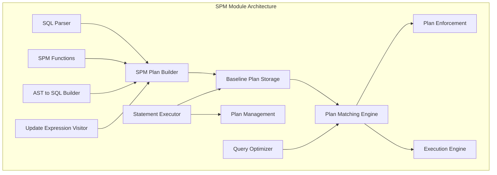
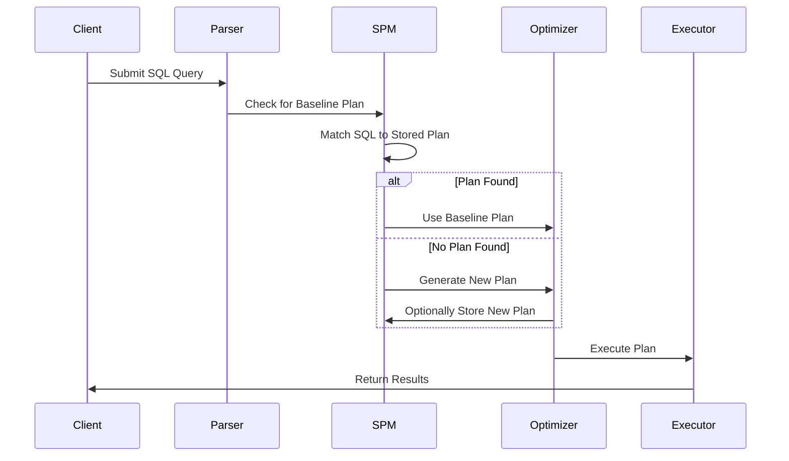
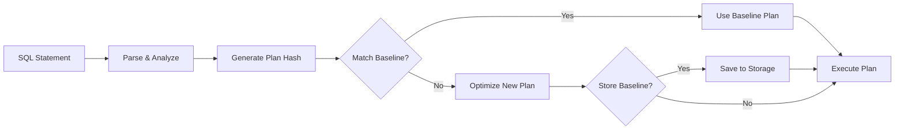

# SPM (SQL Plan Management) Module Documentation

## Overview

The SPM (SQL Plan Management) module is a critical component of StarRocks that provides SQL plan stability and performance management capabilities. It enables database administrators to capture, store, and manage execution plans for SQL statements, ensuring consistent query performance and preventing plan regressions.

## Purpose and Core Functionality

The SPM module serves several key purposes:

1. **Plan Stability**: Ensures that SQL statements use consistent execution plans across different database states and statistics changes
2. **Performance Management**: Allows administrators to lock in optimal execution plans and prevent performance regressions
3. **Plan Evolution**: Provides mechanisms to safely evolve execution plans when better alternatives are discovered
4. **Plan Capture and Storage**: Automatically captures and stores execution plans for future use

## Architecture Overview

## Core Components

### 1. Baseline Plan Management
- **BaselinePlan**: Core data structure representing a stored execution plan
- **SPMPlanBuilder**: Constructs baseline plans from SQL statements
- **Plan Storage**: Persistent storage for baseline plans (both user and global scope)

### 2. SQL Processing and Transformation
- **SPMAst2SQLBuilder**: Converts AST (Abstract Syntax Tree) back to SQL with SPM-specific formatting
- **SPMFunctions**: Special functions for plan parameterization and variable substitution
- **SPMUpdateExprVisitor**: Updates expressions within SQL statements for plan management

### 3. Statement Execution
- **SPMStmtExecutor**: Handles SPM-related SQL statements (CREATE, DROP, SHOW, CONTROL)
- **Plan Matching**: Matches incoming SQL statements with stored baseline plans
- **Plan Enforcement**: Ensures approved plans are used during query execution

## Key Features

### Plan Parameterization
The SPM module uses sophisticated parameterization techniques to create flexible plan templates that can match multiple similar SQL statements while preserving the core execution strategy.

### Plan Hashing and Matching
Implements efficient hashing algorithms to quickly identify matching baseline plans based on SQL structure, table references, and join patterns.

### Global and User-Specific Plans
Supports both global baseline plans (available to all users) and user-specific plans for fine-grained control over query execution.

## Integration with Query Processing

## Sub-modules

The SPM module consists of several specialized sub-modules:

### [Baseline Plan Management](baseline_plan_management.md)
Manages the lifecycle of baseline plans including creation, storage, retrieval, and expiration. This sub-module handles the core data structures and persistence mechanisms for storing execution plans.

### [SQL Processing and Transformation](sql_processing_transformation.md)
Handles the conversion between SQL statements and their parameterized representations for plan matching. Includes specialized functions for plan parameterization and AST manipulation.

### [Statement Execution and Control](statement_execution_control.md)
Provides the execution framework for SPM-related administrative commands and plan enforcement. Manages the execution of CREATE, DROP, SHOW, and CONTROL baseline plan statements.

## Data Flow

## Configuration and Usage

The SPM module integrates with StarRocks' configuration system and can be controlled through:
- System variables for enabling/disabling SPM
- Administrative commands for plan management
- Session-level settings for user-specific behavior

## Performance Considerations

- **Plan Matching Overhead**: Minimal impact on query compilation time through efficient hashing
- **Storage Efficiency**: Compressed plan storage with deduplication
- **Memory Management**: Bounded memory usage for active plan cache

## Related Modules

- [SQL Parser and Optimizer](sql_parser_optimizer.md): Provides the foundation for SQL parsing and plan generation
- [Query Execution](query_execution.md): Executes the plans managed by SPM
- [Frontend Server](frontend_server.md): Hosts the SPM storage and management services

## Future Enhancements

The SPM module is designed to support future enhancements such as:
- Machine learning-based plan recommendation
- Automatic plan evolution based on performance metrics
- Integration with cloud-based plan repositories
- Advanced plan comparison and analysis tools