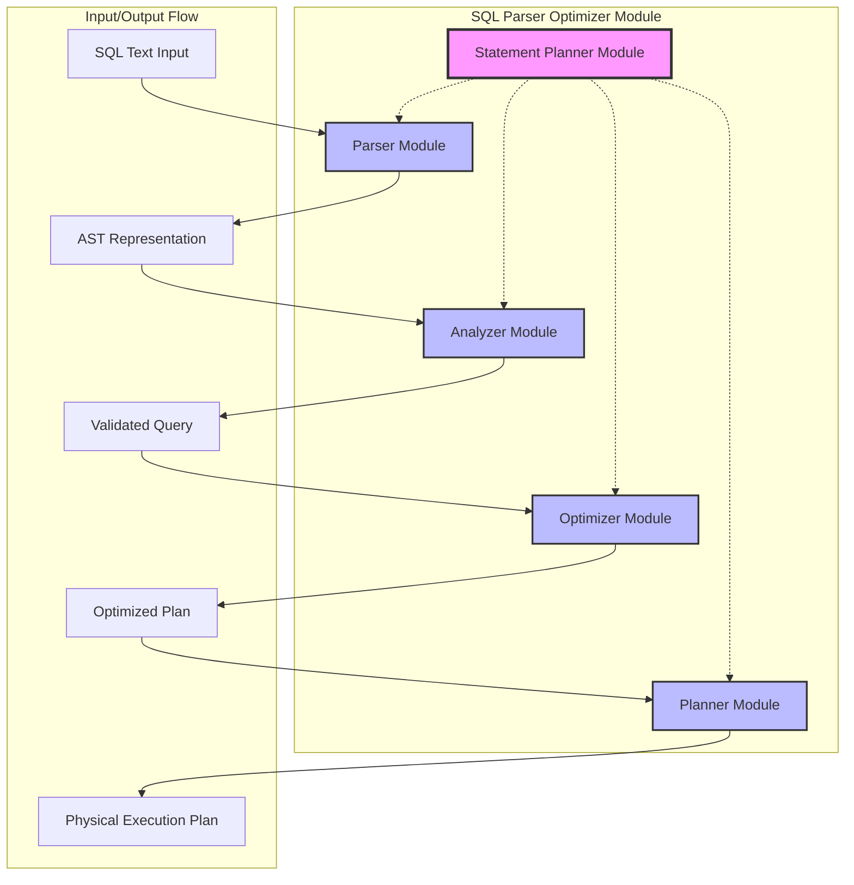
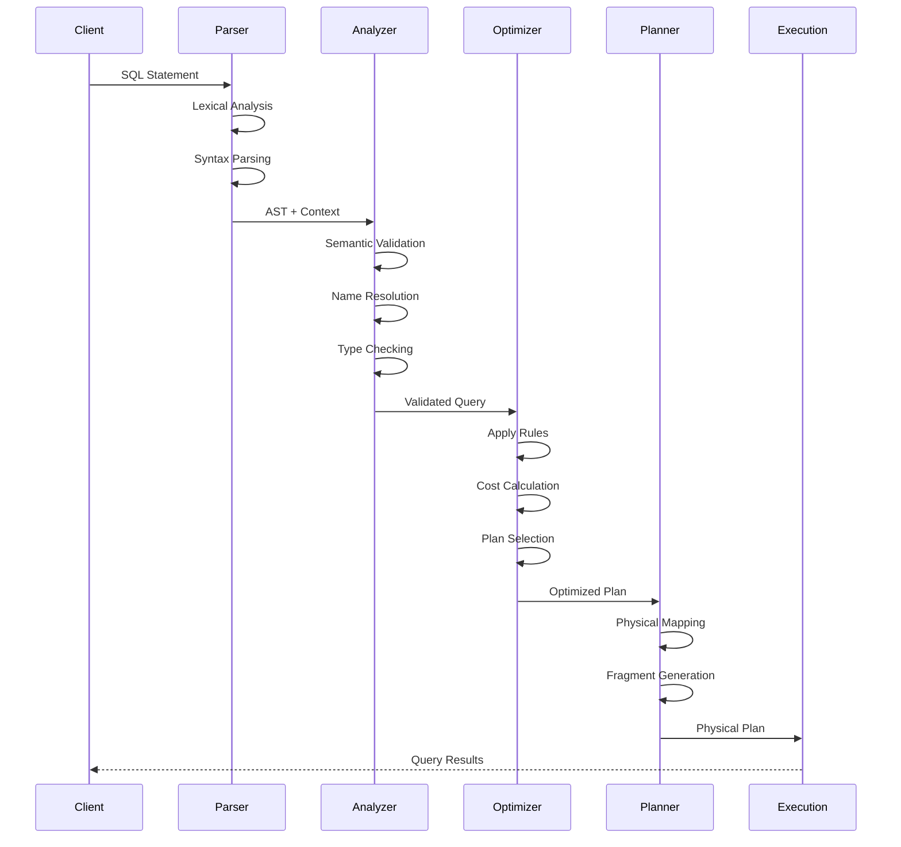

# SQL Parser Optimizer Module Overview

## Purpose

The `sql_parser_optimizer` module is the core SQL processing engine of StarRocks, responsible for transforming raw SQL text into optimized, executable query plans. It serves as the central coordinator that bridges SQL parsing, semantic analysis, query optimization, and physical plan generation, ensuring efficient and correct query execution across the distributed system.

## Architecture

## Core Components

### 1. Parser Module
The entry point that converts SQL text into Abstract Syntax Trees (ASTs):
- **AstBuilderFactory**: Creates AST builders for different SQL statement types
- **HintFactory**: Processes SQL hints for optimization directives
- **SyntaxSugars**: Normalizes complex SQL constructs into fundamental forms

### 2. Analyzer Module
Performs semantic analysis and validation of parsed SQL statements:
- **QueryAnalyzer**: Main entry point for comprehensive statement analysis
- **ExpressionAnalyzer**: Handles type checking and expression validation
- **DMLStmtAnalyzer**: Specialized analyzers for INSERT, UPDATE, DELETE operations
- **DDL Statement Analyzers**: Handle CREATE, ALTER, DROP operations
- **Specialized Analyzers**: Function, aggregate, view, and index analysis

### 3. Optimizer Module
Applies cost-based and rule-based optimization techniques:
- **OptimizerFactory**: Creates appropriate optimizer instances
- **CostModel**: Evaluates execution strategies using statistical information
- **Statistics Engine**: Provides data distribution information for optimization decisions
- **Rule Engine**: Applies transformation rules for plan optimization
- **Materialized View Rewriter**: Automatically rewrites queries using materialized views

### 4. Planner Module
Converts optimized logical plans into executable physical plans:
- **PlanFragmentBuilder**: Transforms logical operators to physical operators
- **ScalarOperatorToExpr**: Converts scalar operators to executable expressions

### 5. Statement Planner Module
Orchestrates the entire planning process with advanced features:
- **StatementPlanner**: Central coordinator for SQL statement planning
- **PrepareStmtPlanner**: Handles prepared statements with plan caching
- **ShortCircuitPlanner**: Implements optimizations for queries that can be answered without full execution
- **ShortCircuitPlannerHybrid**: Advanced hybrid execution strategies

## Key Features

### Comprehensive SQL Support
- Full SQL-92 compliance with extensions
- Support for complex queries including subqueries, joins, and set operations
- Window functions and analytical capabilities
- Common Table Expressions (CTEs)
- User-defined functions (UDFs) and stored procedures

### Advanced Optimization Techniques
- **Cost-based optimization** using sophisticated cost models and statistics
- **Rule-based transformation** with extensive pattern matching
- **Join reordering** for multi-table queries
- **Predicate pushdown** to minimize data movement
- **Partition pruning** for efficient data access
- **Materialized view rewrite** for query acceleration

### Distributed Optimization
- Partition-aware optimization strategies
- Network cost consideration for distributed execution
- Parallel execution planning
- Resource-aware plan generation

### Performance and Scalability
- Plan caching for repeated queries
- Incremental analysis for modified statements
- Parallel processing capabilities
- Memory-efficient algorithms

## Integration Points

### Upstream Dependencies
- **Frontend Server**: Provides metadata, authentication, and coordination services
- **Catalog System**: Supplies table schemas, statistics, and partitioning information
- **Storage Engine**: Offers data layout and access method information

### Downstream Consumers
- **Query Execution Engine**: Executes generated physical plans
- **Backend Services**: Processes distributed plan fragments
- **Connector Framework**: Interfaces with external data sources

## Data Flow

## Configuration and Tuning

### Optimization Levels
- **Rule-based only**: Fast optimization for simple queries
- **Cost-based**: Full optimization with statistics
- **Adaptive**: Runtime feedback integration

### Performance Tuning
- Statistics collection and management
- Cache configuration for plans and metadata
- Parallelism control for complex queries
- Memory limits for optimization processes

## Monitoring and Observability

### Metrics and Monitoring
- Query parsing and optimization latency
- Plan cache hit rates
- Optimization success rates
- Resource usage statistics

### Debugging Support
- Plan visualization and explanation
- Optimization trace logging
- Performance profiling
- Error diagnostics

## References

For detailed documentation of individual components, refer to:
- [Parser Module Documentation](parser.md)
- [Analyzer Module Documentation](analyzer.md)
- [Optimizer Module Documentation](optimizer.md)
- [Planner Module Documentation](planner.md)
- [Statement Planner Module Documentation](statement_planner.md)