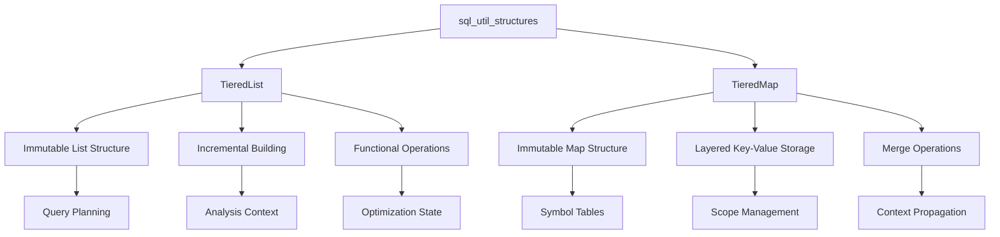

# SQL Utility Structures Module

## Overview

The `sql_util_structures` module provides specialized data structures designed to support SQL query processing and optimization in StarRocks. This module implements tiered collection structures that enable efficient incremental building and immutable operations, which are particularly useful in query planning, analysis, and optimization contexts.

## Architecture

## Core Components

### TieredList<T>

The `TieredList` is an immutable list implementation that supports efficient incremental building through a tiered architecture. It provides:

- **Immutable Operations**: All modification operations return new instances
- **Tiered Structure**: Maintains multiple layers of immutable lists
- **Efficient Concatenation**: Optimized for building lists incrementally
- **Functional Interface**: Supports functional programming patterns

**Key Features:**
- Genesis pattern for empty list creation
- Builder pattern for incremental construction
- Support for both positive and negative indexing
- Pretty printing for debugging and analysis

For detailed implementation details, see [tiered_collections.md](tiered_collections.md).

### TieredMap<K,V>

The `TieredMap` is an immutable map implementation that provides layered key-value storage with:

- **Hierarchical Lookup**: Searches through tiers for key resolution
- **Immutable Updates**: All modifications create new map instances
- **Efficient Merging**: Optimized for combining multiple map layers
- **Collector Support**: Integration with Java Stream API

**Key Features:**
- Layered key resolution with tier precedence
- Support for merging multiple tiered maps
- Builder pattern for construction
- Pretty printing capabilities

For detailed implementation details, see [tiered_collections.md](tiered_collections.md).

## Design Patterns

### Immutable Data Structures
Both `TieredList` and `TieredMap` follow immutable design principles:
- All modification operations throw `UnsupportedOperationException`
- Changes create new instances while preserving original data
- Thread-safe by design due to immutability

### Builder Pattern
Both structures implement the Builder pattern:
- `TieredList.Builder<T>` for list construction
- `TieredMap.Builder<K,V>` for map construction
- Support for sealing builders to prevent further modifications

### Tiered Architecture
The tiered design enables:
- Incremental building without copying large datasets
- Efficient memory usage through structural sharing
- Support for context layering in query processing

## Usage Context

These structures are particularly useful in:

1. **Query Planning**: Building execution plans incrementally
2. **Symbol Resolution**: Managing variable scopes and symbol tables
3. **Analysis Context**: Storing analysis results across query phases
4. **Optimization State**: Maintaining optimization decisions and metadata

## Integration with Other Modules

The sql_util_structures module integrates with:

- **[sql_parser_optimizer](sql_parser_optimizer.md)**: Provides data structures for parse tree representation and optimization state
- **[query_execution](query_execution.md)**: Supports execution context management
- **[frontend_server](frontend_server.md)**: Enables metadata management and session state

## Performance Characteristics

### TieredList
- **Access Time**: O(n) for get operations (where n is number of tiers)
- **Concatenation**: O(1) for tiered concatenation
- **Memory**: Efficient through structural sharing

### TieredMap
- **Lookup Time**: O(n) for get operations (where n is number of tiers)
- **Merge Operations**: O(1) for tiered merging
- **Memory**: Optimized through immutable data sharing

## Thread Safety

All structures in this module are thread-safe due to their immutable nature. Once constructed, they can be safely shared across multiple threads without synchronization.

## Future Enhancements

Potential improvements include:
- Specialized implementations for common use cases
- Performance optimizations for large-scale operations
- Additional utility methods for common operations
- Integration with reactive programming patterns