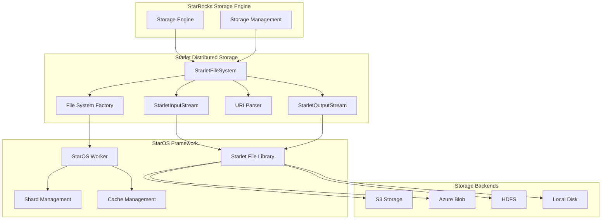
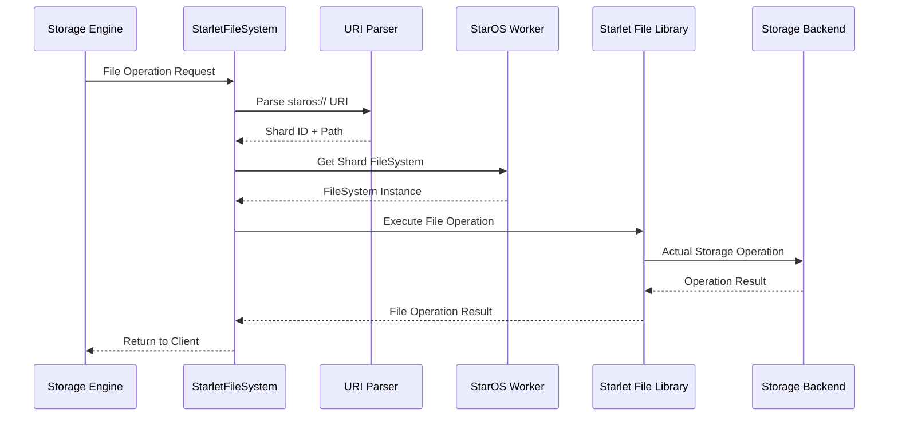
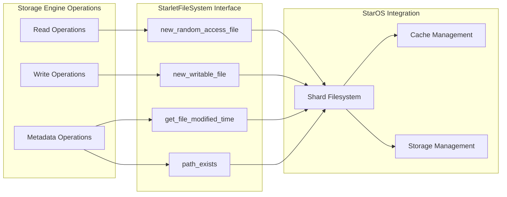

# Starlet Distributed Storage Module

## Introduction

The Starlet Distributed Storage module provides a distributed file system abstraction layer for StarRocks, enabling seamless access to data stored across multiple storage backends through the StarOS framework. This module implements a unified file system interface that supports various storage types including local disk, cloud storage (S3, Azure Blob), and distributed file systems (HDFS).

## Architecture Overview

The Starlet Distributed Storage module serves as a bridge between StarRocks' storage engine and the underlying StarOS distributed storage framework. It provides a consistent API for file operations while handling the complexity of distributed storage management, caching, and data locality optimization.



## Core Components

### StarletFileSystem

The `StarletFileSystem` class is the main implementation of the distributed file system interface. It provides a comprehensive set of file operations including:

- **File Operations**: Create, read, write, delete files
- **Directory Management**: Create, delete, list directories
- **Metadata Operations**: Get file size, modification time, check existence
- **Advanced Features**: Batch file operations, cache management, encryption support

#### Key Features:

1. **URI-based Access**: Uses `staros://shard_id/path` format for addressing files
2. **Shard-aware Operations**: Automatically routes operations to appropriate storage shards
3. **Performance Monitoring**: Integrated I/O statistics and performance metrics
4. **Cache Integration**: Supports both local and remote caching strategies
5. **Encryption Support**: Transparent encryption/decryption for secure storage

### StarletInputStream

The `StarletInputStream` class provides efficient reading capabilities with:

- **Seekable Interface**: Random access to file content
- **Performance Optimization**: Integrated I/O profiling and caching
- **Statistics Collection**: Detailed read performance metrics
- **Cache Touch**: Preemptive cache warming capabilities

### StarletOutputStream

The `StarletOutputStream` class handles write operations with:

- **Atomic Writes**: Ensures data consistency during write operations
- **Performance Tracking**: Write operation metrics and profiling
- **Buffer Management**: Efficient data buffering and flushing
- **Error Handling**: Comprehensive error recovery mechanisms

## Data Flow Architecture



## URI Format and Parsing

The module uses a specialized URI format for addressing files in the distributed storage system:

```
staros://{shard_id}/{path}
```

### URI Parsing Logic:

1. **Validation**: Ensures URI starts with `staros://`
2. **Shard Extraction**: Parses the shard ID from the URI
3. **Path Extraction**: Extracts the relative path within the shard
4. **Error Handling**: Provides detailed error messages for invalid URIs

## Performance Monitoring

The module includes comprehensive performance monitoring through bvar metrics:

```cpp
// I/O Metrics
bvar::Adder<int64_t> g_starlet_io_read;       // Bytes read
bvar::Adder<int64_t> g_starlet_io_write;      // Bytes written
bvar::Adder<int64_t> g_starlet_io_num_reads;  // Read operations
bvar::Adder<int64_t> g_starlet_io_num_writes; // Write operations

// Rate Metrics
bvar::PerSecond<bvar::Adder<int64_t>> g_starlet_read_second;
bvar::PerSecond<bvar::Adder<int64_t>> g_starlet_write_second;
bvar::PerSecond<bvar::Adder<int64_t>> g_starlet_num_reads_second;
bvar::PerSecond<bvar::Adder<int64_t>> g_starlet_num_writes_second;
```

## File Tagging System

The module supports file type tagging for optimized storage management:

```cpp
static const std::string kFileTagType = "type";
static const std::string kFileTagTypeData = "data";
static const std::string kFileTagTypeMeta = "meta";
static const std::string kFileTagTypeTxnLog = "txnlog";
```

This enables:
- **Storage Optimization**: Different storage policies per file type
- **Cache Strategies**: Type-specific caching behavior
- **Lifecycle Management**: Automated data lifecycle based on file type

## Integration with Storage Engine



## Configuration and Tuning

The module supports various configuration options for performance tuning:

- **Cache Control**: `skip_fill_local_cache`, `skip_read_local_cache`
- **Buffer Size**: Configurable buffer sizes for I/O operations
- **Throttling**: Experimental I/O throttling for rate control
- **Encryption**: Optional encryption for data security

## Error Handling and Recovery

The module implements comprehensive error handling:

1. **Status-based Error Reporting**: All operations return detailed status information
2. **Exception Safety**: RAII-based resource management
3. **Retry Logic**: Automatic retry for transient failures
4. **Fallback Mechanisms**: Alternative storage paths for critical operations

## Dependencies

The Starlet Distributed Storage module depends on:

- **StarOS Framework**: Core distributed storage management
- **File System Abstractions**: Standard file system interfaces
- **I/O Profiling**: Performance monitoring and optimization
- **Encryption Support**: Optional data encryption capabilities

## Related Modules

- [storage_engine](storage_engine.md) - Core storage engine functionality
- [file_systems](file_systems.md) - File system implementations
- [lake_storage](lake_storage.md) - Lake storage management
- [io_system](io_system.md) - I/O system utilities

## Performance Characteristics

- **Latency**: Low-latency access through intelligent caching
- **Throughput**: High-throughput I/O with parallel operations
- **Scalability**: Linear scalability with shard-based architecture
- **Reliability**: Built-in redundancy and error recovery

## Future Enhancements

- **Multi-cloud Support**: Enhanced cloud storage integration
- **Intelligent Tiering**: Automated data lifecycle management
- **Advanced Caching**: Machine learning-based cache optimization
- **Compression**: Transparent data compression for storage efficiency