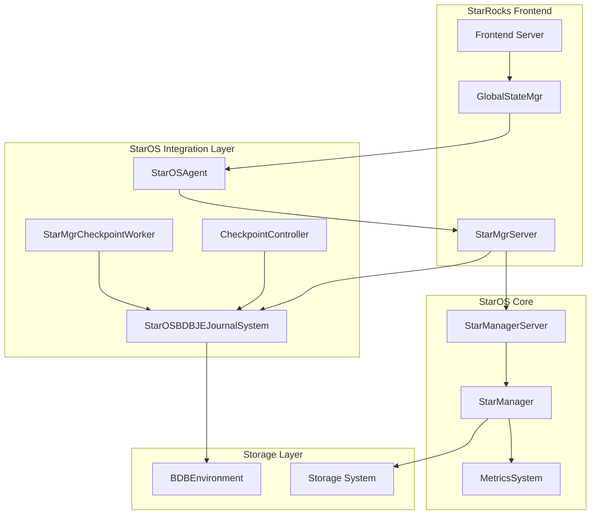
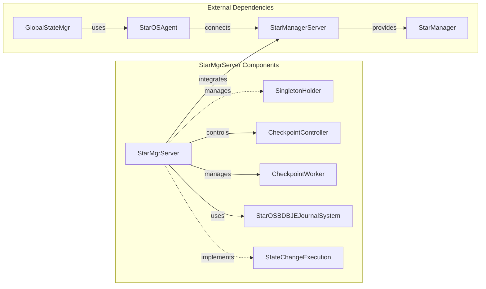
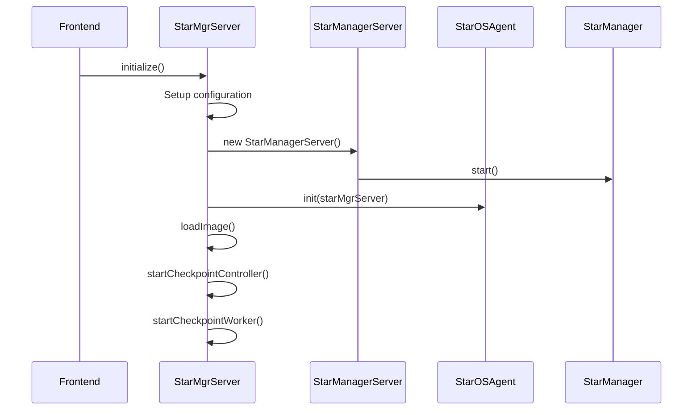
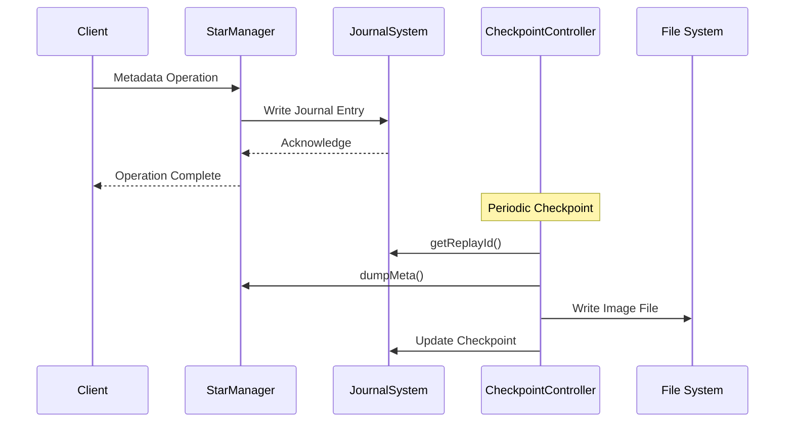
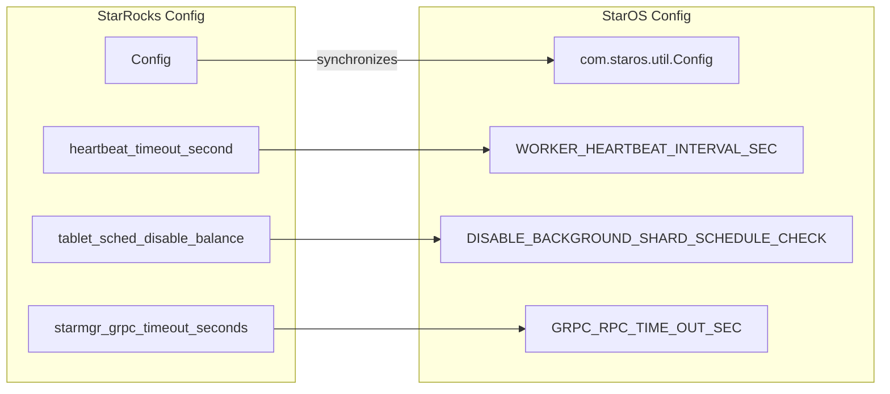
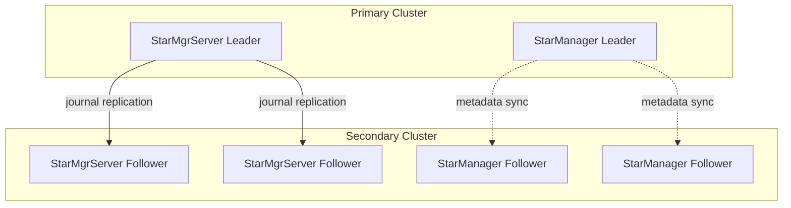

# StarOS Integration Module Documentation

## Overview

The StarOS Integration module serves as the bridge between StarRocks and StarOS (Star Operating System), providing seamless integration for cloud-native storage and metadata management. This module enables StarRocks to leverage StarOS capabilities for distributed storage management, metadata coordination, and resource orchestration in cloud environments.

## Purpose and Core Functionality

The primary purpose of the StarOS Integration module is to:

1. **Provide unified storage management** - Integrate StarOS as the underlying storage layer for StarRocks
2. **Enable cloud-native features** - Support elastic scaling and resource management in cloud environments
3. **Coordinate metadata** - Synchronize metadata between StarRocks and StarOS
4. **Manage resource lifecycle** - Handle worker group provisioning and resource allocation
5. **Ensure high availability** - Provide fault tolerance and recovery mechanisms

## Architecture

### High-Level Architecture



### Component Relationships



## Core Components

### StarMgrServer

The `StarMgrServer` class is the central component that manages the integration between StarRocks and StarOS. It implements a singleton pattern and provides coordination for:

- **Journal Management**: Handles transaction logs and metadata persistence
- **Checkpoint Operations**: Manages periodic snapshots for recovery
- **State Transitions**: Coordinates leader/follower transitions in HA setups
- **Configuration Synchronization**: Keeps StarOS configuration in sync with StarRocks

#### Key Methods:

- `initialize()`: Sets up the StarOS integration with proper configuration
- `becomeLeader()/becomeFollower()`: Handles HA state transitions
- `loadImage()/replayAndGenerateImage()`: Manages metadata persistence
- `getCurrentState()/getServingState()`: Provides access to server instances

### StarOSBDBJEJournalSystem

Manages the journaling system for StarOS metadata using BDB JE (Berkeley DB Java Edition):

- **Transaction Logging**: Records all metadata changes
- **Recovery Support**: Enables crash recovery through journal replay
- **Checkpoint Coordination**: Works with checkpoint workers for image generation

### CheckpointController & CheckpointWorker

Handle the checkpointing process for metadata persistence:

- **Periodic Snapshots**: Create consistent points for recovery
- **Image Management**: Generate and manage metadata images
- **Recovery Support**: Enable fast recovery from checkpoints

## Data Flow

### Initialization Flow



### Metadata Persistence Flow



## Configuration Management

The module synchronizes configuration between StarRocks and StarOS:



## Integration Points

### With GlobalStateMgr

The StarMgrServer integrates with GlobalStateMgr through:

- **StarOSAgent**: Provides the interface for StarOS operations
- **Configuration Sync**: Registers config refresh listeners
- **State Management**: Coordinates with FE state transitions

### With Storage Engine

Integration with the storage engine enables:

- **Lake Storage Support**: Coordinates with lake storage components
- **Metadata Management**: Manages storage metadata through StarOS
- **Resource Allocation**: Handles worker group and shard allocation

## High Availability

### Leader-Follower Architecture



### Checkpoint and Recovery

The module implements a robust checkpoint and recovery mechanism:

1. **Periodic Checkpoints**: Creates consistent snapshots of metadata
2. **Journal Replay**: Enables recovery from the last checkpoint
3. **Image Management**: Maintains multiple checkpoint images
4. **Crash Recovery**: Automatically recovers from failures

## Monitoring and Metrics

Integration with the metrics system provides:

- **Performance Metrics**: Track operation latencies and throughput
- **Resource Usage**: Monitor worker group and shard allocation
- **Health Monitoring**: Track system health and availability
- **Prometheus Integration**: Export metrics for external monitoring

## Dependencies

### Internal Dependencies

- **[GlobalStateMgr](frontend_server.md)**: Coordinates with the main state manager
- **[BDBEnvironment](frontend_server.md)**: Uses BDB JE for journaling
- **[StarOSAgent](frontend_server.md)**: Provides StarOS interface
- **[CheckpointController](frontend_server.md)**: Manages checkpoint operations

### External Dependencies

- **StarOS Core**: The underlying StarOS manager and server components
- **BDB JE**: Berkeley DB Java Edition for transaction logging
- **Metrics System**: For monitoring and observability

## Usage Patterns

### Basic Initialization

```java
// Initialize StarMgrServer
StarMgrServer starMgrServer = StarMgrServer.getServingState();
starMgrServer.initialize(bdbEnvironment, baseImageDir);

// Access StarManager
StarManager starManager = starMgrServer.getStarMgr();
```

### State Management

```java
// Handle state transitions
StateChangeExecution execution = starMgrServer.getStateChangeExecution();
execution.transferToLeader();    // Become leader
execution.transferToNonLeader(FrontendNodeType.FOLLOWER); // Become follower
```

### Checkpoint Operations

```java
// Start checkpoint services
starMgrServer.startCheckpointController();
starMgrServer.startCheckpointWorker();

// Trigger manual checkpoint
starMgrServer.triggerNewImage();
```

## Best Practices

1. **Configuration Synchronization**: Ensure StarOS configuration stays in sync with StarRocks
2. **Monitoring**: Set up proper monitoring for StarOS integration metrics
3. **Backup Strategy**: Implement regular checkpoint backups
4. **Resource Management**: Monitor worker group allocation and balance
5. **Error Handling**: Implement proper error handling for StarOS operations

## Troubleshooting

### Common Issues

1. **Initialization Failures**: Check network connectivity and configuration
2. **Journal Replay Issues**: Verify BDB environment health
3. **Checkpoint Failures**: Check disk space and permissions
4. **State Transition Problems**: Verify HA configuration

### Diagnostic Tools

- **Metrics Collection**: Use built-in metrics for monitoring
- **Log Analysis**: Check StarMgrServer logs for errors
- **Journal Inspection**: Examine BDB journal for transaction issues
- **Image Verification**: Validate checkpoint image integrity

## Future Enhancements

The StarOS Integration module is designed to support:

- **Multi-Cloud Support**: Enhanced cloud provider integration
- **Auto-Scaling**: Dynamic resource allocation based on workload
- **Advanced Monitoring**: Enhanced observability and alerting
- **Performance Optimization**: Improved metadata operation performance
- **Security Enhancements**: Enhanced authentication and authorization