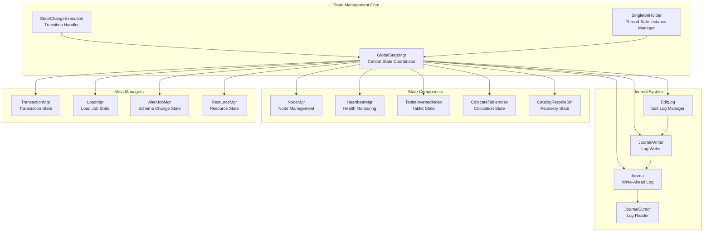
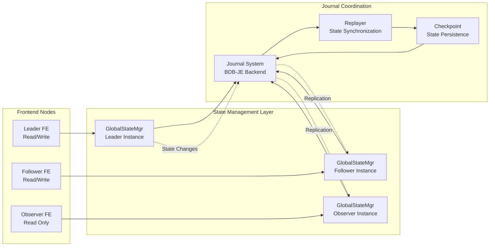
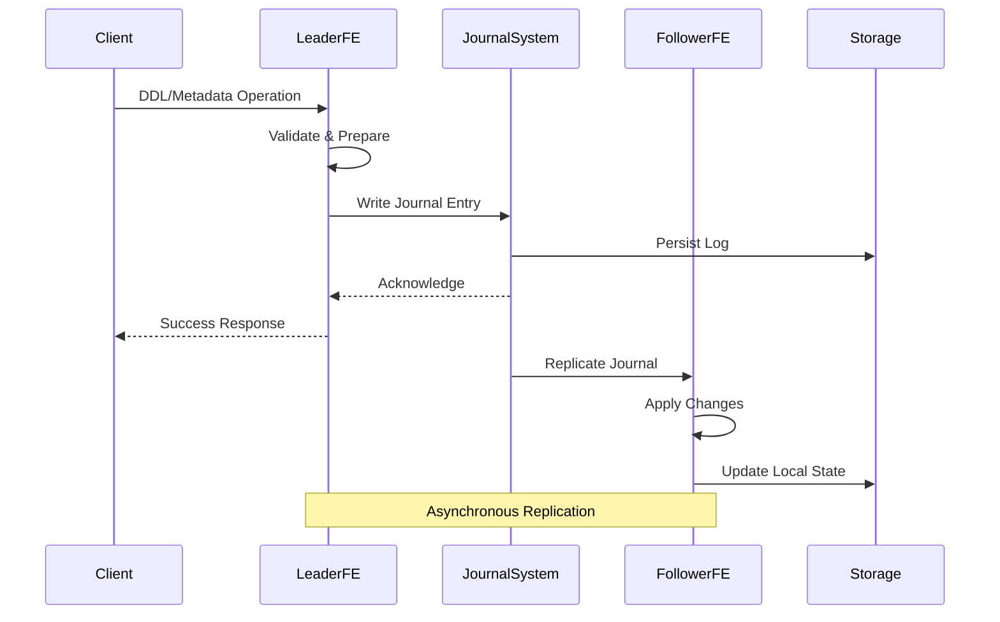
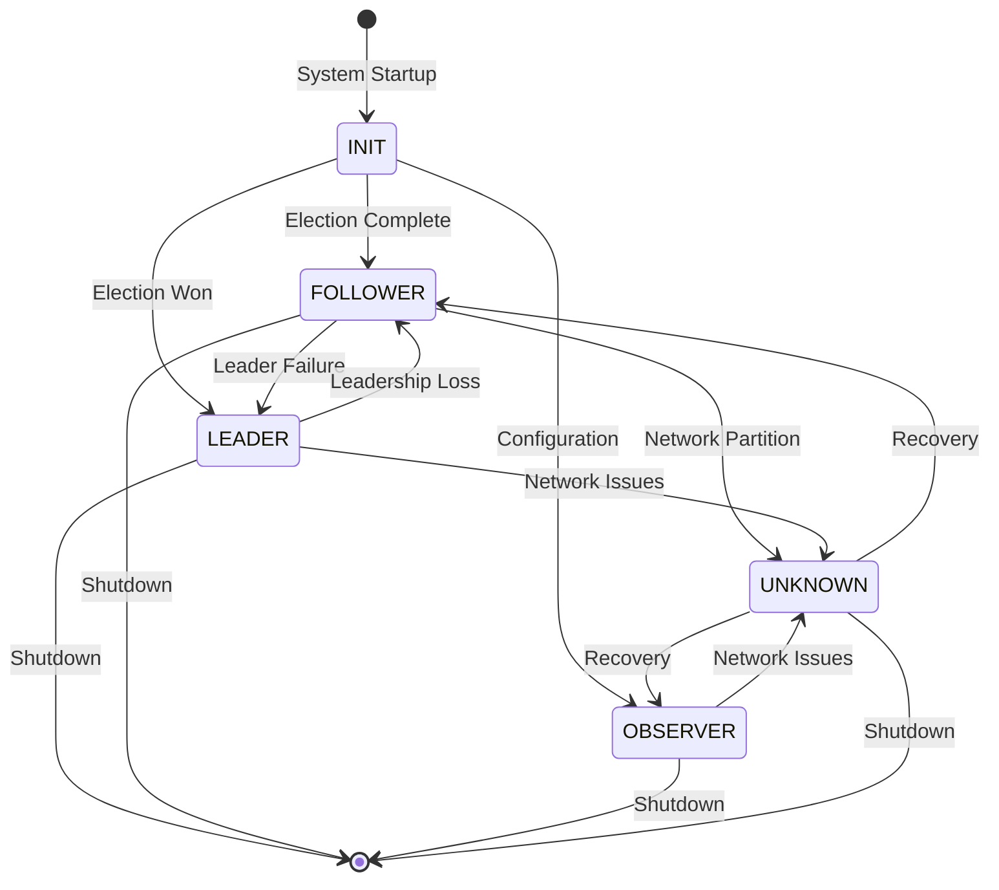
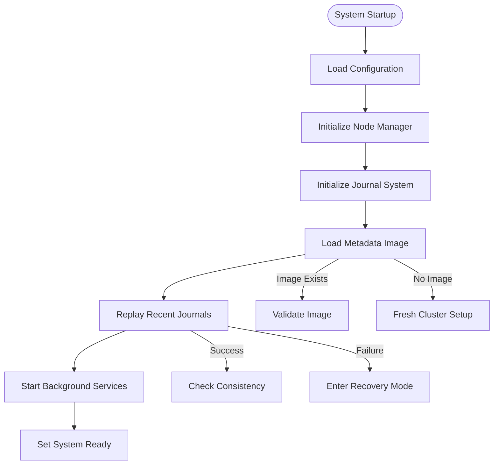
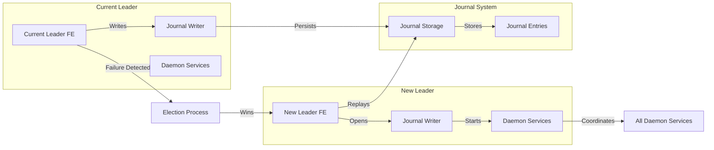
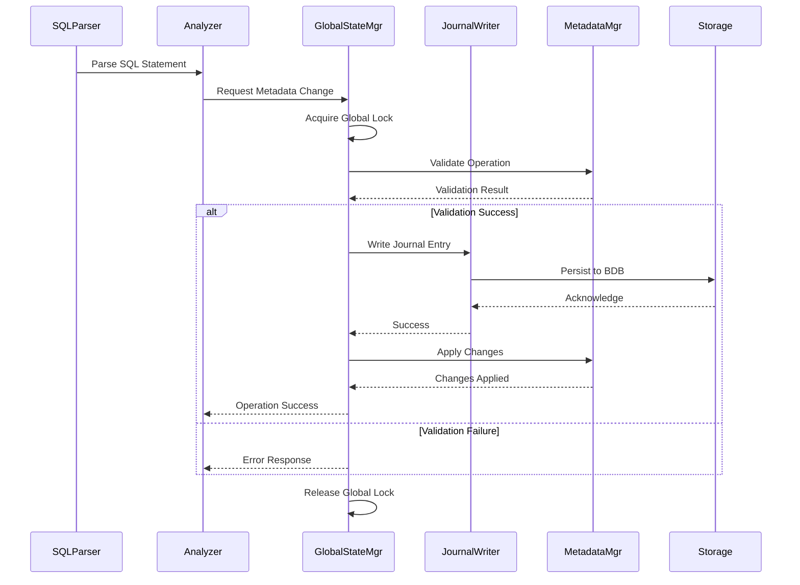
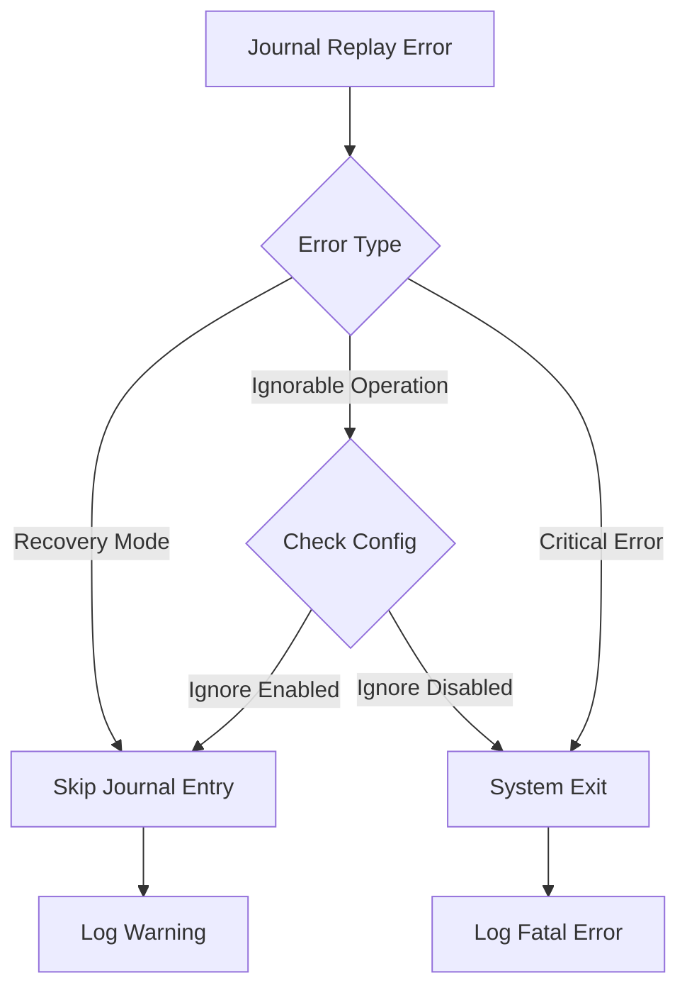

# State Management Module Documentation

## Introduction

The state_management module serves as the central nervous system of StarRocks, providing comprehensive cluster state coordination, metadata management, and system lifecycle control. This module implements a sophisticated distributed state management system that ensures consistency across all Frontend (FE) nodes while maintaining high availability and fault tolerance.

## Core Purpose and Functionality

The state_management module is responsible for:

- **Cluster State Coordination**: Managing the overall state of the StarRocks cluster across multiple FE nodes
- **Metadata Consistency**: Ensuring all metadata operations are consistently applied across the cluster
- **Leader Election and Failover**: Coordinating leader transitions and maintaining service availability
- **Journal Management**: Implementing a reliable write-ahead logging system for state changes
- **System Initialization**: Orchestrating the startup and initialization of all system components
- **State Recovery**: Providing mechanisms for system recovery from failures and inconsistencies

## Architecture Overview

## Component Relationships

## Data Flow Architecture

## Key Components Deep Dive

### GlobalStateMgr - The Central Coordinator

The `GlobalStateMgr` class serves as the primary state management coordinator, implementing a singleton pattern with thread-safe access. It orchestrates all system components and manages the overall cluster lifecycle.

**Key Responsibilities:**
- System initialization and startup coordination
- Component lifecycle management
- State transition handling (INIT → FOLLOWER/OBSERVER → LEADER)
- Journal coordination and checkpoint management
- Metadata consistency enforcement

**Critical Design Patterns:**
- **Singleton Pattern**: Ensures single point of coordination
- **State Machine**: Manages FE node state transitions
- **Observer Pattern**: Coordinates component notifications
- **Factory Pattern**: Creates appropriate manager instances

### Journal System - The Consistency Backbone

The journal system implements a write-ahead logging mechanism ensuring durability and consistency of all metadata operations.

**Components:**
- **Journal**: Abstract interface for log storage backends
- **JournalWriter**: Handles concurrent log writing with queue management
- **EditLog**: Provides high-level edit log operations
- **JournalCursor**: Enables efficient log reading and replay

**Consistency Guarantees:**
- **Durability**: All changes persisted before acknowledgment
- **Ordering**: Strict serial ordering of operations
- **Atomicity**: All-or-nothing operation application
- **Replay Safety**: Idempotent replay of journal entries

### State Transition Management

## Process Flows

### System Initialization Flow

### Leader Election and State Transfer

### Metadata Operation Flow

## Integration with Other Modules

### Storage Engine Integration
The state_management module coordinates closely with the [storage_engine](storage_engine.md) module to maintain consistency between metadata and actual data storage. This includes:
- Tablet state synchronization
- Compaction coordination
- Data loading state management
- Storage volume management

### Query Execution Integration
State management provides the foundation for [query_execution](query_execution.md) by:
- Maintaining cluster topology information
- Coordinating resource allocation
- Managing query scheduling state
- Tracking query execution statistics

### Catalog Management Integration
The module works with [catalog](catalog.md) components to:
- Manage database and table metadata
- Coordinate schema changes
- Handle partition information
- Maintain index metadata

## Error Handling and Recovery

### Journal Replay Failure Handling

### State Inconsistency Detection

The system implements multiple mechanisms to detect and handle state inconsistencies:

1. **Meta Out-of-Date Detection**: Monitors journal replay lag
2. **Consistency Checkers**: Periodic validation of metadata integrity
3. **Lock Timeout Monitoring**: Detects potential deadlocks
4. **Journal Integrity Verification**: Validates journal entry checksums

## Performance Considerations

### Lock Management
- **Global Lock**: Used for atomic metadata operations
- **Database Locks**: Fine-grained locking at database level
- **Table Locks**: Table-level locking for schema changes
- **Deadlock Detection**: Automatic detection and resolution

### Journal Optimization
- **Batch Writing**: Groups multiple operations for efficiency
- **Flow Control**: Prevents overwhelming the journal system
- **Checkpoint Management**: Periodic state snapshots for fast recovery
- **Compression**: Optional journal compression for storage efficiency

### Memory Management
- **Lazy Loading**: Components initialized on-demand
- **Periodic Cleanup**: Automatic cleanup of expired metadata
- **Memory Monitoring**: Tracks memory usage across components
- **Resource Limits**: Configurable limits for various operations

## Configuration and Monitoring

### Key Configuration Parameters

| Parameter | Description | Default |
|-----------|-------------|---------|
| `metadata_journal_queue_size` | Journal write queue size | 10000 |
| `catalog_try_lock_timeout_ms` | Lock acquisition timeout | 5000 |
| `meta_delay_toleration_second` | Maximum metadata lag tolerance | 300 |
| `ignore_meta_check` | Skip metadata consistency checks | false |

### Monitoring Metrics

The module exposes comprehensive metrics for monitoring:
- **Journal Metrics**: Write latency, queue depth, replay lag
- **State Metrics**: FE role distribution, state transition frequency
- **Lock Metrics**: Lock contention, wait times, timeout rates
- **Memory Metrics**: Component memory usage, garbage collection impact

## Security Considerations

### Access Control
- **Authentication Integration**: Coordinates with authentication managers
- **Authorization Enforcement**: Validates permissions for metadata operations
- **Audit Logging**: Comprehensive audit trail for all state changes
- **Encryption Support**: Optional encryption for sensitive metadata

### Data Protection
- **Backup Coordination**: Manages metadata backup processes
- **Disaster Recovery**: Coordinates cross-datacenter replication
- **Data Integrity**: Cryptographic verification of metadata
- **Access Logging**: Detailed access logs for security analysis

## Future Enhancements

### Planned Improvements
- **Distributed Consensus**: Migration to Raft consensus algorithm
- **Incremental Checkpoints**: More efficient state snapshot mechanism
- **Multi-Region Support**: Enhanced cross-region coordination
- **AI-Driven Optimization**: Machine learning for performance tuning

### Scalability Roadmap
- **Horizontal Scaling**: Support for larger FE clusters
- **Partitioned State**: Distributed state management
- **Async Processing**: Enhanced asynchronous operation support
- **Edge Computing**: Support for edge deployment scenarios

## References

- [Storage Engine](storage_engine.md) - Data storage and retrieval systems
- [Query Execution](query_execution.md) - Query processing and optimization
- [Catalog Management](catalog.md) - Metadata and schema management
- [Frontend Server](frontend_server.md) - FE node architecture and services
- [Backend Server](backend_server.md) - BE node coordination and management