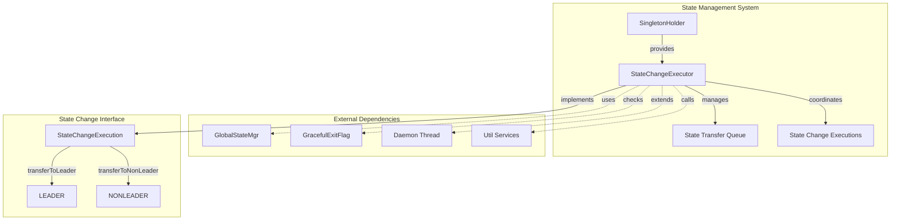
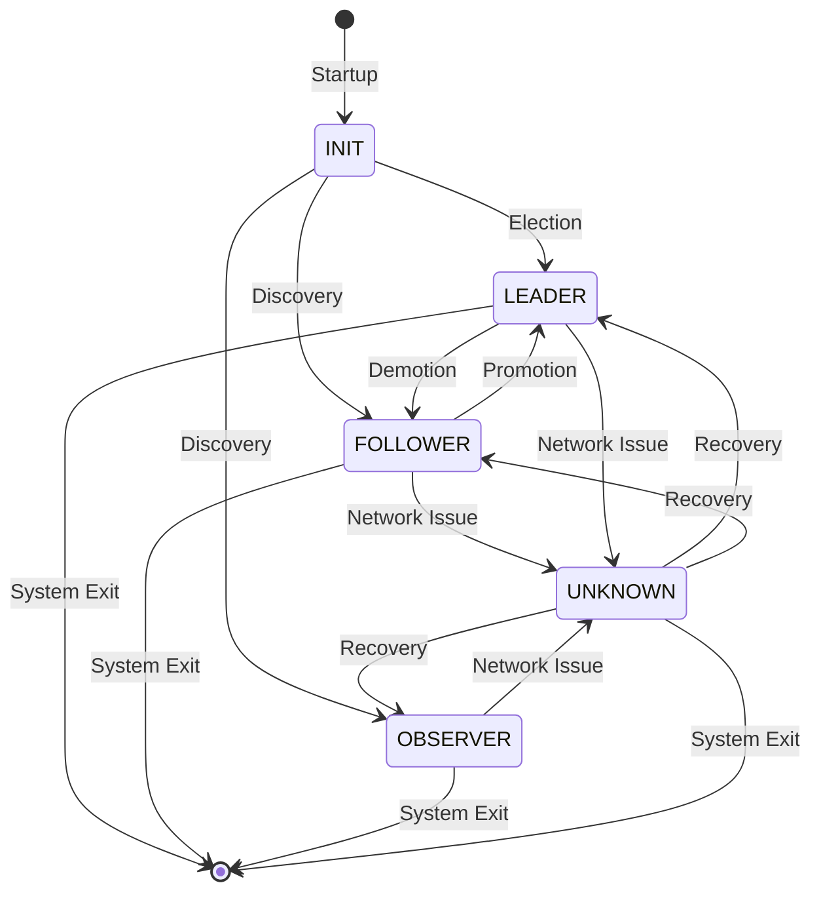
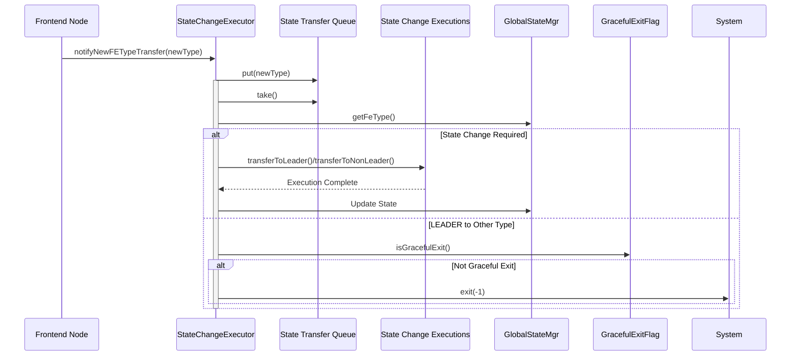

# State Management System

## Introduction

The State Management System is a critical component of StarRocks that manages the lifecycle and state transitions of Frontend (FE) nodes in a distributed cluster environment. This system ensures high availability, fault tolerance, and coordinated state changes across the cluster by orchestrating transitions between different node roles: INIT, LEADER, FOLLOWER, OBSERVER, and UNKNOWN.

The system operates as a centralized state coordinator that handles node role transitions, maintains cluster consistency, and provides graceful handling of leadership changes. It implements a robust state machine that governs how FE nodes transition between different operational states while maintaining system stability and data consistency.

## System Architecture

### Core Architecture Overview



### State Transition Flow



### Component Interaction Diagram



## Core Components

### StateChangeExecutor

The `StateChangeExecutor` is the central component that manages state transitions in the StarRocks cluster. It operates as a daemon thread that continuously monitors and processes state change requests.

**Key Responsibilities:**
- Manages the state transfer queue for asynchronous state change requests
- Coordinates state transitions between different Frontend node types
- Implements the state machine logic for role transitions
- Handles graceful shutdown scenarios
- Provides thread-safe state change coordination

**Core Properties:**
- `STATE_CHANGE_CHECK_INTERVAL_MS`: 100ms polling interval for state changes
- `typeTransferQueue`: Blocking queue for pending state transitions
- `executions`: List of registered state change execution handlers

### SingletonHolder Pattern

The `SingletonHolder` class implements the thread-safe singleton pattern to ensure only one instance of the StateChangeExecutor exists across the JVM. This pattern provides lazy initialization and guarantees thread safety without requiring synchronization overhead.

### State Transfer Queue

A `BlockingQueue<FrontendNodeType>` that manages pending state transition requests. The queue ensures:
- Thread-safe enqueue/dequeue operations
- Blocking behavior for efficient resource utilization
- Order preservation of state change requests
- Backpressure handling during high-frequency transitions

### State Change Execution Interface

The system defines a `StateChangeExecution` interface that allows components to register for state transition notifications:

```java
interface StateChangeExecution {
    void transferToLeader();
    void transferToNonLeader(FrontendNodeType newType);
}
```

## State Management Logic

### State Transition Rules

The system implements a comprehensive state machine with the following transition rules:

#### INIT State Transitions
- **INIT → LEADER**: Node becomes cluster leader through election
- **INIT → FOLLOWER**: Node discovers existing leader and becomes follower
- **INIT → OBSERVER**: Node discovers existing leader and becomes observer

#### UNKNOWN State Transitions
- **UNKNOWN → LEADER**: Node recovers and assumes leadership
- **UNKNOWN → FOLLOWER**: Node recovers and becomes follower
- **UNKNOWN → OBSERVER**: Node recovers and becomes observer

#### FOLLOWER State Transitions
- **FOLLOWER → LEADER**: Node is promoted to leader (failover scenario)
- **FOLLOWER → UNKNOWN**: Network partition or leader loss

#### OBSERVER State Transitions
- **OBSERVER → UNKNOWN**: Network partition or leader loss

#### LEADER State Transitions
- **LEADER → OTHER**: System exit (graceful or forced)

### Error Handling and Recovery

The system implements robust error handling mechanisms:

#### InterruptedException Handling
- Thread interruption is properly handled during queue operations
- System exits with error code -1 on unrecoverable interruptions
- Proper thread state restoration after interruption

#### State Validation
- Null checks ensure state consistency
- Preconditions validate state transition validity
- Graceful exit flag prevents forced shutdowns during maintenance

#### Logging and Monitoring
- Comprehensive logging of all state transitions
- Real-time console output for critical state changes
- Error logging with detailed context information

## Integration with Cluster Components

### GlobalStateMgr Integration

The StateChangeExecutor integrates with the GlobalStateMgr to:
- Query current Frontend node type
- Update global state after successful transitions
- Coordinate with other cluster management components

### Graceful Shutdown Integration

Integration with GracefulExitFlag ensures:
- Controlled shutdown during state transitions
- Prevention of forced exits during maintenance windows
- Proper cleanup of resources during shutdown

### Daemon Thread Management

As a daemon thread, the StateChangeExecutor:
- Runs continuously with 100ms polling intervals
- Provides non-blocking state change processing
- Ensures system responsiveness during transitions
- Implements proper resource cleanup on shutdown

## Performance and Scalability

### Thread Safety
- All operations are thread-safe using concurrent data structures
- Blocking queue provides efficient synchronization
- Singleton pattern ensures single point of coordination

### Resource Efficiency
- Minimal memory footprint with lazy initialization
- Efficient queue-based processing reduces CPU overhead
- Configurable polling interval balances responsiveness and resource usage

### Scalability Considerations
- Stateless design allows horizontal scaling
- Queue-based architecture handles high-frequency transitions
- Non-blocking operations prevent bottlenecks

## Configuration and Monitoring

### System Properties
- `STATE_CHANGE_CHECK_INTERVAL_MS`: Controls polling frequency (default: 100ms)
- Queue capacity can be configured for high-throughput scenarios
- Logging levels can be adjusted for debugging state transitions

### Monitoring Points
- State transition frequency and duration
- Queue depth and processing latency
- Error rates and recovery times
- Leadership change events and causes

### Health Checks
- Daemon thread liveness monitoring
- Queue processing health indicators
- State consistency validation
- Integration with cluster health systems

## Dependencies and Related Systems

### Related Modules
- [ha_coordination](ha_coordination.md) - High availability coordination
- [frontend_server](frontend_server.md) - Frontend server lifecycle management
- [server_lifecycle](server_lifecycle.md) - Server initialization and shutdown

### External Dependencies
- Google Guava for concurrent data structures
- Apache Log4j for logging
- StarRocks common utilities for system operations

## Best Practices and Usage Guidelines

### State Change Registration
Components should register state change handlers early in the initialization process to ensure they receive all relevant state transition notifications.

### Error Handling
Implement robust error handling in state change execution methods to prevent cascading failures during transitions.

### Resource Management
Properly clean up resources during state transitions, especially when transitioning away from leader state.

### Monitoring and Alerting
Set up comprehensive monitoring for state transitions to detect and respond to cluster issues promptly.

## Conclusion

The State Management System provides a robust foundation for managing Frontend node state transitions in StarRocks clusters. Its design ensures high availability, fault tolerance, and consistent state management across distributed deployments. The system's modular architecture allows for easy extension and integration with other cluster management components while maintaining thread safety and performance efficiency.