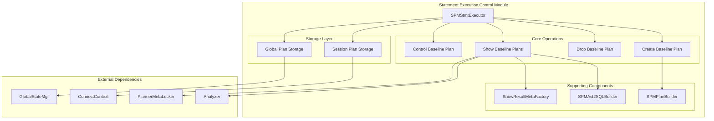
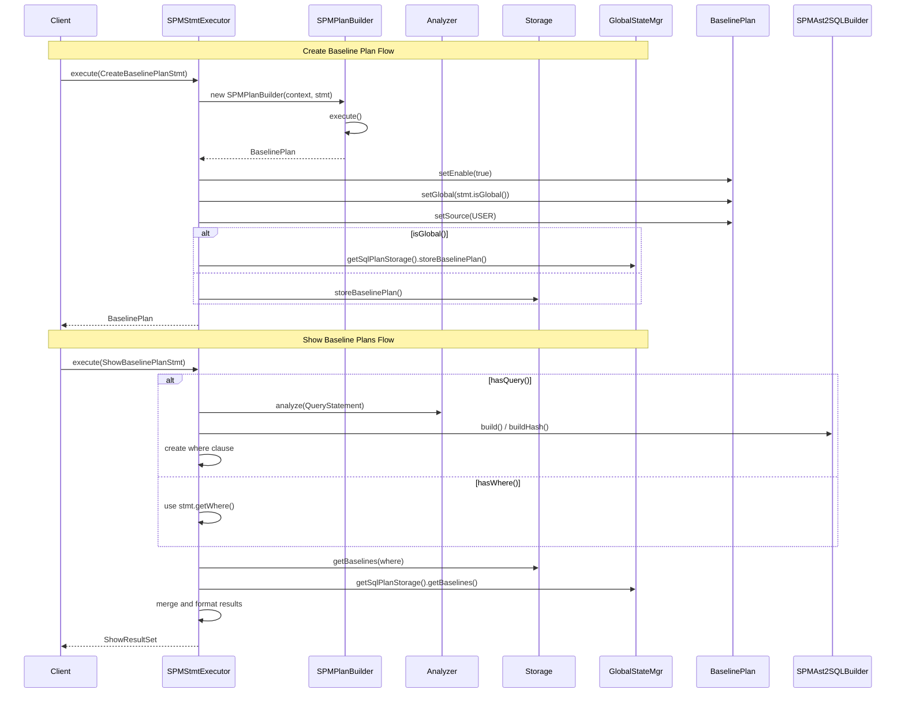
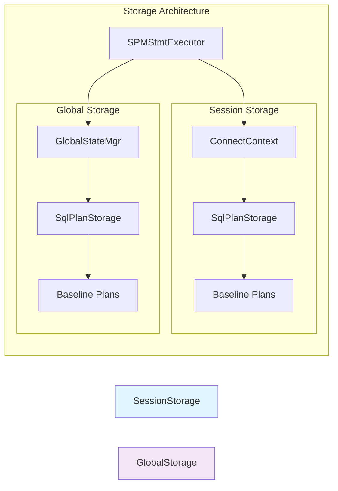
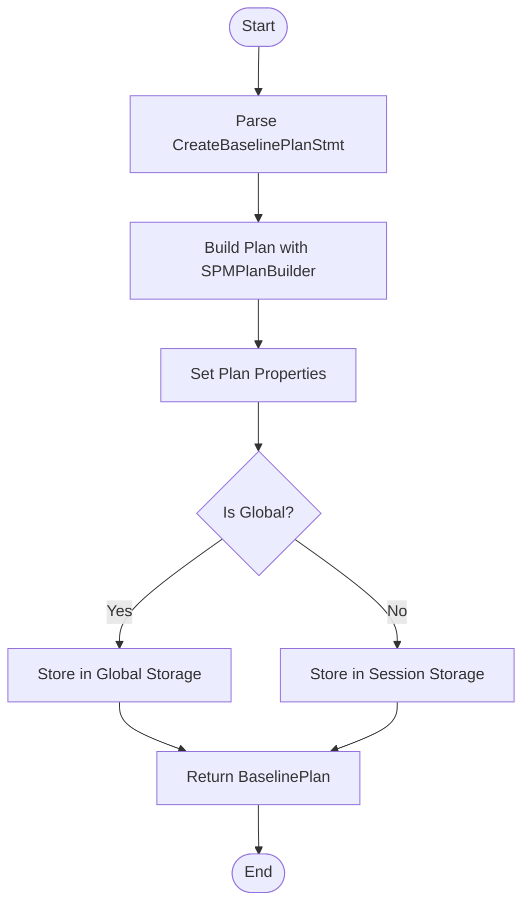
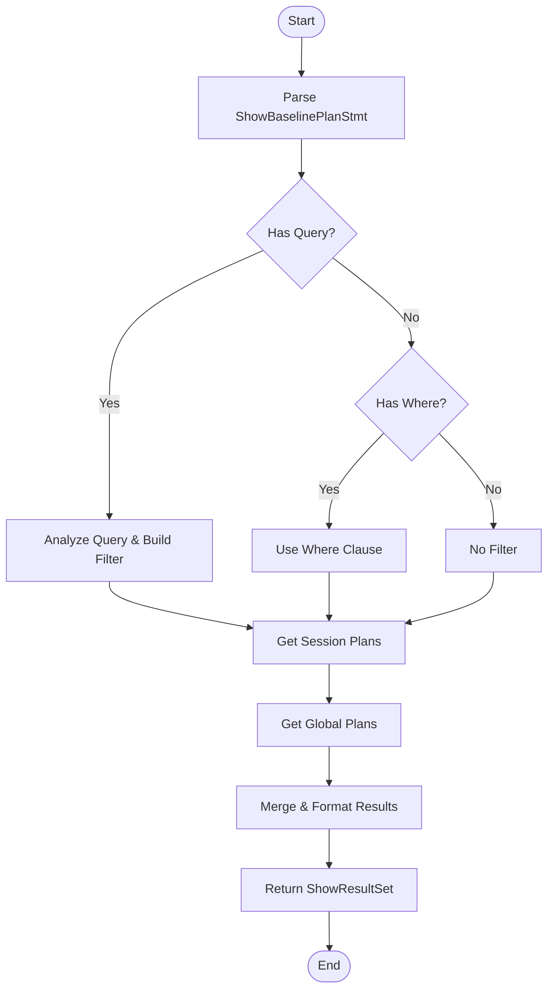

# Statement Execution Control Module

## Overview

The Statement Execution Control module is a critical component of StarRocks' SQL Plan Management (SPM) system that provides fine-grained control over SQL statement execution through baseline plan management. This module enables database administrators and users to create, manage, and control execution plans for SQL statements, ensuring consistent query performance and plan stability.

## Purpose and Core Functionality

The primary purpose of this module is to provide a comprehensive framework for:

- **Baseline Plan Creation**: Creating and storing optimized execution plans for SQL statements
- **Plan Lifecycle Management**: Managing the lifecycle of baseline plans including creation, modification, and deletion
- **Execution Control**: Enabling/disabling specific baseline plans to control which execution plans are used
- **Plan Visibility**: Providing visibility into existing baseline plans and their properties
- **Plan Storage**: Managing both session-level and global-level plan storage

## Architecture

### Component Structure

### Data Flow Architecture

## Core Components

### SPMStmtExecutor

The `SPMStmtExecutor` class is the main entry point for all statement execution control operations. It provides static methods for executing different types of SPM statements:

#### Key Methods

1. **`execute(ConnectContext, CreateBaselinePlanStmt)`**
   - Creates a new baseline plan from the provided statement
   - Uses `SPMPlanBuilder` to construct the plan
   - Stores the plan in either session or global storage based on the `isGlobal()` flag
   - Returns the created `BaselinePlan` object

2. **`execute(ConnectContext, DropBaselinePlanStmt)`**
   - Removes a baseline plan by its ID
   - Attempts deletion from both session and global storage
   - No return value - operation is fire-and-forget

3. **`execute(ConnectContext, ShowBaselinePlanStmt)`**
   - Retrieves and displays baseline plans based on query or where clause
   - Supports filtering by SQL digest and hash when a query is provided
   - Merges results from both session and global storage
   - Returns formatted `ShowResultSet` with plan details

4. **`execute(ConnectContext, ControlBaselinePlanStmt)`**
   - Enables or disables a specific baseline plan
   - Updates both session and global storage
   - Used for plan activation/deactivation

### Supporting Components

#### SPMPlanBuilder
- Responsible for constructing `BaselinePlan` objects from statements
- Handles plan optimization and cost calculation
- Integrates with the query planner for plan generation

#### SPMAst2SQLBuilder
- Converts AST (Abstract Syntax Tree) representations to SQL strings
- Generates SQL digests and hashes for plan identification
- Used for matching queries to existing baseline plans

#### ShowResultMetaFactory
- Creates metadata for result sets returned by SHOW commands
- Defines column structure for baseline plan displays

## Statement Types

### CreateBaselinePlanStmt
Creates new baseline plans with the following properties:
- **Global vs Session**: Can be created as global (system-wide) or session-specific
- **Automatic Enablement**: New plans are enabled by default
- **Source Tracking**: Plans are marked with USER source indicating manual creation
- **Storage**: Global plans stored in GlobalStateMgr, session plans in ConnectContext

### DropBaselinePlanStmt
Removes existing baseline plans:
- **Dual Storage Cleanup**: Attempts removal from both session and global storage
- **ID-based**: Uses baseline ID for identification
- **No Confirmation**: Immediate deletion without confirmation

### ShowBaselinePlanStmt
Displays baseline plan information with flexible filtering:
- **Query-based Filtering**: Can derive filters from a sample query
- **Where Clause Support**: Supports custom WHERE conditions
- **Comprehensive Display**: Shows ID, scope, status, SQL details, costs, and timing
- **Merged Results**: Combines session and global plans in single result set

### ControlBaselinePlanStmt
Controls plan activation state:
- **Enable/Disable**: Toggles plan availability for execution
- **Dual Update**: Updates both session and global storage
- **Immediate Effect**: Changes take effect immediately

## Storage Architecture

### Dual Storage Model

The module implements a dual storage model:

- **Session Storage**: Plan storage specific to the current database session
- **Global Storage**: System-wide plan storage accessible across all sessions
- **Priority**: Session plans can override global plans for the same SQL
- **Lifecycle**: Session plans disappear when session ends, global plans persist

## Integration Points

### Query Planning Integration
- Integrates with the SQL analyzer for query parsing and validation
- Uses the planner for cost estimation and plan generation
- Leverages metadata locking for concurrent access control

### Catalog Integration
- Accesses table and column metadata through the catalog system
- Uses type information for proper SQL generation and validation
- Integrates with authorization for access control

### Execution Engine Integration
- Provides plans to the execution engine for query processing
- Supports plan hints and optimization directives
- Enables plan-based execution control

## Process Flows

### Plan Creation Process

### Plan Display Process

## Error Handling

The module implements comprehensive error handling:

- **Validation Errors**: Invalid statements are rejected with descriptive messages
- **Storage Errors**: Database storage failures are properly propagated
- **Concurrent Access**: Metadata locking prevents race conditions
- **Resource Management**: Proper cleanup of resources and connections

## Performance Considerations

### Optimization Strategies
- **Lazy Loading**: Plans are loaded only when needed
- **Caching**: Frequently accessed plans may be cached
- **Batch Operations**: Multiple operations can be batched for efficiency
- **Index Usage**: Storage layer uses indexes for fast plan retrieval

### Scalability Features
- **Partitioned Storage**: Large plan sets can be partitioned
- **Concurrent Access**: Supports multiple concurrent sessions
- **Memory Management**: Efficient memory usage for large result sets
- **Network Optimization**: Minimal network traffic for plan operations

## Security and Access Control

### Authorization
- Plan creation requires appropriate privileges
- Global plan management requires administrative privileges
- Session plans are controlled by session owner
- Plan visibility follows standard SQL authorization rules

### Audit Trail
- All plan operations are logged for audit purposes
- Plan changes are tracked with timestamps and user information
- Failed operations are logged with error details
- Compliance with enterprise audit requirements

## Monitoring and Observability

### Metrics Collection
- Plan creation/deletion counts
- Plan usage statistics
- Storage size and growth
- Performance impact measurements

### Health Monitoring
- Storage health checks
- Plan consistency validation
- Performance degradation detection
- Resource usage monitoring

## Dependencies

### Internal Dependencies
- **[sql_parser_optimizer](sql_parser_optimizer.md)**: For SQL parsing and analysis
- **[frontend_server](frontend_server.md)**: For global state management and catalog access
- **[query_execution](query_execution.md)**: For plan execution and cost estimation

### External Dependencies
- Java standard library for collections and I/O
- Date/time libraries for timestamp handling
- Logging frameworks for operational monitoring

## Future Enhancements

### Planned Features
- **Automatic Plan Capture**: Automatic baseline plan creation for critical queries
- **Plan Evolution**: Automatic plan updates based on performance metrics
- **Machine Learning Integration**: AI-driven plan optimization and selection
- **Cross-Cluster Plan Sharing**: Plan synchronization across multiple clusters

### Performance Improvements
- **Parallel Plan Processing**: Multi-threaded plan operations
- **Advanced Caching**: Intelligent caching strategies for plan data
- **Compression**: Storage compression for large plan sets
- **Distributed Storage**: Support for distributed plan storage

## Conclusion

The Statement Execution Control module is a sophisticated component that provides essential functionality for SQL plan management in StarRocks. By enabling fine-grained control over execution plans, it helps ensure consistent query performance, facilitates plan stability, and provides the foundation for advanced query optimization features. The module's dual storage model, comprehensive statement support, and robust integration with the broader StarRocks architecture make it a critical component for production database deployments requiring predictable and controllable query execution behavior.