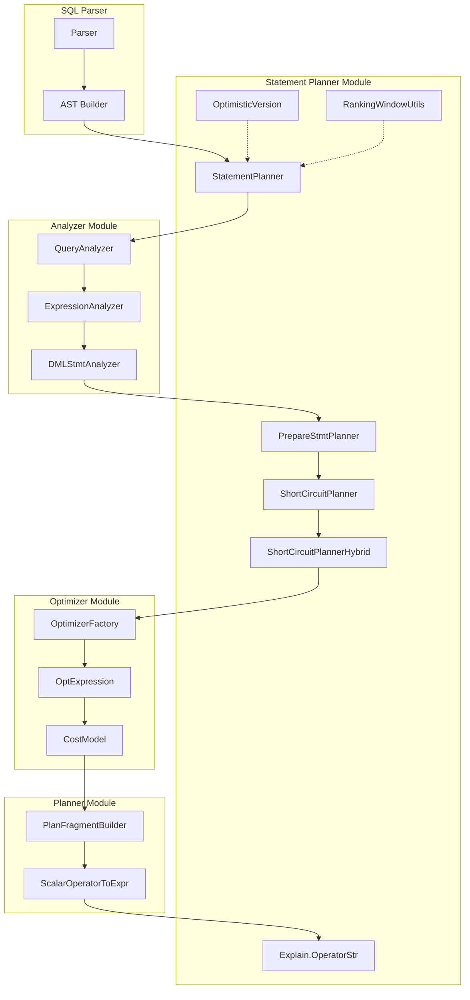
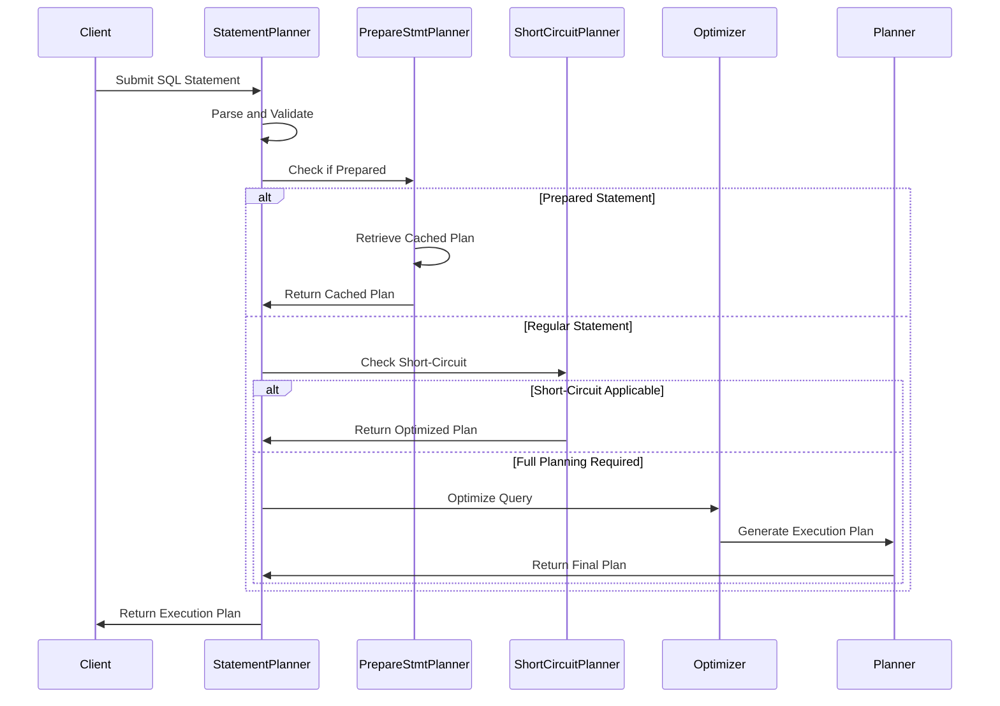
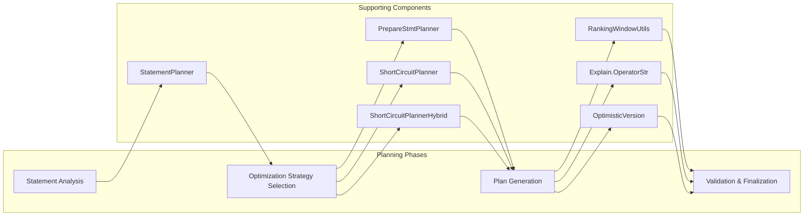

# Statement Planner Module

## Introduction

The Statement Planner module is a critical component of StarRocks' SQL processing engine, responsible for orchestrating the transformation of SQL statements into executable query plans. It serves as the central coordinator that bridges SQL parsing, analysis, and optimization phases, ensuring efficient query execution strategies are generated for diverse SQL statement types.

## Architecture Overview

The Statement Planner module operates as the central hub in StarRocks' query processing pipeline, coordinating between multiple subsystems to produce optimized execution plans. The module's architecture is designed to handle various SQL statement types while maintaining consistency and performance across the entire query lifecycle.

## Core Components

### StatementPlanner

The `StatementPlanner` class serves as the primary entry point for SQL statement planning. It coordinates the entire planning process, from initial statement analysis to final execution plan generation. This component integrates with the analyzer and optimizer modules to ensure comprehensive query processing.

**Key Responsibilities:**
- Statement type identification and routing
- Planning strategy selection based on statement characteristics
- Coordination with analyzer and optimizer components
- Final execution plan assembly and validation

### PrepareStmtPlanner

The `PrepareStmtPlanner` specializes in handling prepared statements, providing efficient plan caching and parameter binding capabilities. This component is essential for applications that execute similar queries repeatedly with different parameter values.

**Key Features:**
- Prepared statement plan caching
- Parameter substitution and binding
- Plan reuse optimization
- Security validation for parameterized queries

### ShortCircuitPlanner

The `ShortCircuitPlanner` implements optimization strategies for queries that can be answered without full execution. It identifies opportunities for early result determination, significantly reducing query processing overhead for simple lookups and aggregations.

**Optimization Strategies:**
- Primary key lookups with single results
- Constant expression evaluation
- Empty result set detection
- Metadata-based result determination

### ShortCircuitPlannerHybrid

The `ShortCircuitPlannerHybrid` extends the base short-circuit planner with hybrid execution strategies. It combines traditional short-circuit optimizations with modern query processing techniques, providing enhanced performance for complex query scenarios.

**Advanced Features:**
- Hybrid execution path selection
- Adaptive optimization based on runtime statistics
- Integration with cost-based optimization
- Fallback mechanisms for complex queries

### Explain.OperatorStr

The `Explain.OperatorStr` component provides query plan visualization and analysis capabilities. It generates human-readable representations of execution plans, enabling developers and administrators to understand query processing strategies and identify optimization opportunities.

**Visualization Features:**
- Operator tree representation
- Cost estimation display
- Predicate pushdown visualization
- Join strategy explanation

### OptimisticVersion

The `OptimisticVersion` component implements version-based concurrency control for query planning. It ensures consistency between planning and execution phases, particularly in environments with concurrent schema changes and data modifications.

**Concurrency Control:**
- Version validation during planning
- Schema change detection
- Plan invalidation mechanisms
- Consistency guarantees

### RankingWindowUtils

The `RankingWindowUtils` provides specialized utilities for ranking and window function processing. It optimizes the execution of analytical queries involving ROW_NUMBER, RANK, DENSE_RANK, and other window functions.

**Window Function Support:**
- Ranking function optimization
- Partition-based processing
- Frame specification handling
- Memory-efficient algorithms

## Data Flow Architecture

## Component Interactions

### Planning Process Flow

### Integration with Query Processing Pipeline

The Statement Planner module integrates seamlessly with other components in the SQL processing pipeline:

1. **Parser Integration**: Receives parsed AST nodes from the SQL parser module
2. **Analyzer Coordination**: Works with query analyzers to validate semantic correctness
3. **Optimizer Collaboration**: Leverages cost-based optimization for plan selection
4. **Planner Synchronization**: Coordinates with execution planners for resource allocation

## Performance Optimization Strategies

### Plan Caching

The module implements sophisticated plan caching mechanisms to avoid redundant planning overhead:

- **Statement Fingerprinting**: Generates unique identifiers for similar queries
- **Parameterized Plan Reuse**: Efficiently handles queries with different parameter values
- **Cache Invalidation**: Maintains consistency with schema changes
- **Memory Management**: Optimizes cache size and eviction policies

### Short-Circuit Evaluation

Multiple optimization strategies are employed to identify queries that can be answered without full execution:

- **Metadata Queries**: Direct answers from system catalogs
- **Primary Key Lookups**: Single-row retrieval optimizations
- **Empty Result Detection**: Early termination for impossible conditions
- **Constant Folding**: Compile-time expression evaluation

### Adaptive Planning

The module adapts planning strategies based on runtime characteristics:

- **Statistics-Based Decisions**: Utilizes table statistics for plan selection
- **Runtime Feedback**: Incorporates execution statistics for future plans
- **Resource Awareness**: Considers system load and available resources
- **Fallback Mechanisms**: Provides alternative plans for edge cases

## Error Handling and Recovery

### Planning Failures

The Statement Planner implements comprehensive error handling for various failure scenarios:

- **Syntax Errors**: Graceful handling of malformed SQL statements
- **Semantic Validation**: Detection of invalid table or column references
- **Resource Constraints**: Handling of memory and CPU limitations
- **Timeout Management**: Prevention of planning process hangs

### Recovery Mechanisms

Multiple recovery strategies ensure system stability:

- **Plan Fallback**: Alternative execution strategies when primary plans fail
- **Retry Logic**: Automatic retry with adjusted parameters
- **Error Propagation**: Clear error messages for debugging
- **Logging Integration**: Comprehensive logging for troubleshooting

## Monitoring and Observability

### Performance Metrics

The module provides extensive monitoring capabilities:

- **Planning Latency**: Time spent in different planning phases
- **Cache Hit Rates**: Effectiveness of plan caching strategies
- **Optimization Success**: Frequency of short-circuit optimizations
- **Resource Utilization**: Memory and CPU usage during planning

### Debugging Support

Comprehensive debugging features assist in troubleshooting:

- **Plan Visualization**: Detailed execution plan representation
- **Decision Logging**: Rationale for optimization choices
- **Performance Profiling**: Bottleneck identification
- **Trace Integration**: End-to-end query execution tracking

## Security Considerations

### Access Control

The Statement Planner enforces security policies during query planning:

- **Privilege Validation**: Verification of user permissions
- **Data Masking**: Application of security policies
- **Audit Trail**: Logging of planning decisions
- **Parameter Sanitization**: Prevention of SQL injection attacks

### Resource Protection

Multiple mechanisms protect against resource exhaustion:

- **Query Complexity Limits**: Prevention of overly complex queries
- **Timeout Controls**: Maximum planning time enforcement
- **Memory Bounds**: Limitation of planning memory usage
- **Concurrency Limits**: Control of parallel planning operations

## Integration with External Systems

### Connector Framework

The module integrates with StarRocks' connector framework for external data sources:

- **Metadata Integration**: Incorporation of external schema information
- **Pushdown Optimization**: Delegation of operations to external systems
- **Statistics Collection**: Gathering of external table statistics
- **Plan Adaptation**: Adjustment of plans for external data characteristics

### Multi-Engine Support

Support for diverse execution engines:

- **Engine Selection**: Optimal engine choice based on query characteristics
- **Plan Translation**: Conversion between different execution formats
- **Resource Coordination**: Management of cross-engine resources
- **Performance Optimization**: Engine-specific optimization strategies

## Future Enhancements

### Machine Learning Integration

Planned enhancements include machine learning capabilities:

- **Predictive Planning**: ML-based plan selection
- **Workload Characterization**: Automatic pattern recognition
- **Adaptive Optimization**: Self-tuning planning strategies
- **Performance Prediction**: Query execution time estimation

### Cloud-Native Features

Cloud-specific optimizations:

- **Elastic Scaling**: Dynamic resource allocation
- **Cost Optimization**: Cloud resource cost awareness
- **Multi-Region Support**: Geographic optimization strategies
- **Serverless Integration**: Function-based execution models

## Related Documentation

- [SQL Parser Module](sql_parser.md) - SQL parsing and AST generation
- [Query Analyzer Module](query_analyzer.md) - Semantic analysis and validation
- [Query Optimizer Module](query_optimizer.md) - Cost-based query optimization
- [Query Planner Module](query_planner.md) - Execution plan generation
- [Storage Engine Module](storage_engine.md) - Data storage and retrieval
- [Frontend Server Module](frontend_server.md) - Coordinator and metadata management

## Conclusion

The Statement Planner module represents a sophisticated orchestration layer in StarRocks' query processing architecture. Through its comprehensive planning strategies, optimization techniques, and integration capabilities, it ensures efficient and reliable query execution across diverse workloads and data sources. The module's design emphasizes performance, scalability, and maintainability, making it a cornerstone of StarRocks' analytical database capabilities.