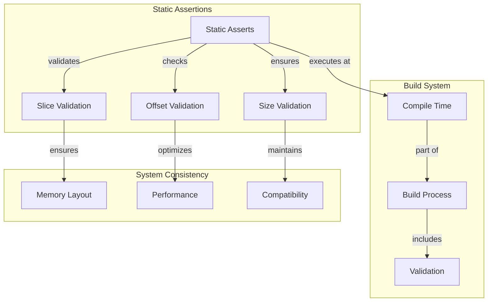

# Static Assertions Sub-module

## Overview

The Static Assertions sub-module provides compile-time validation capabilities that ensure system consistency and catch potential issues during the build process. It serves as a safety net for validating structure sizes, memory layouts, and build-time assumptions across the StarRocks system.

## Core Components

### UnusedClass Structure

The `UnusedClass` contains static assertions that validate critical system properties:

```cpp
class UnusedClass {
private:
    BOOST_STATIC_ASSERT(sizeof(Slice) == 16);
    BOOST_STATIC_ASSERT(offsetof(Slice, size) == 8);
    BOOST_STATIC_ASSERT(sizeof(DateTimeValue) == 16);
};
```

## Architecture



## Key Features

### 1. Structure Size Validation
- Compile-time verification of structure sizes
- Ensures expected memory layout
- Prevents unexpected padding or alignment issues
- Validates cross-platform consistency

### 2. Memory Layout Verification
- Offset validation for structure members
- Memory alignment verification
- Cache-line optimization checks
- Cross-architecture consistency

### 3. Build-Time Safety
- Early detection of structural changes
- Prevention of silent breaking changes
- Documentation of critical assumptions
- Enforcement of system invariants

## Implementation Details

### Current Validations

The sub-module currently validates several critical system properties:

#### Slice Structure Validation
```cpp
BOOST_STATIC_ASSERT(sizeof(Slice) == 16);
BOOST_STATIC_ASSERT(offsetof(Slice, size) == 8);
```

These assertions ensure:
- **Total Size**: Slice objects are exactly 16 bytes
- **Layout**: The size member is at offset 8
- **Performance**: Optimal memory layout for cache efficiency

#### DateTimeValue Validation
```cpp
BOOST_STATIC_ASSERT(sizeof(DateTimeValue) == 16);
```

This ensures:
- **Memory Efficiency**: DateTimeValue fits in 16 bytes
- **SIMD Compatibility**: Potential for vectorized operations
- **Cache Optimization**: Fits within cache lines

## Usage Patterns

### Structure Design Validation
```cpp
// Example: Validating new structure design
struct MyDataStructure {
    uint64_t field1;
    uint32_t field2;
    uint32_t field3;
};

// Add to UnusedClass for validation
BOOST_STATIC_ASSERT(sizeof(MyDataStructure) == 16);
BOOST_STATIC_ASSERT(offsetof(MyDataStructure, field2) == 8);
```

### Cross-Platform Consistency
```cpp
// Example: Ensuring consistent sizes across platforms
BOOST_STATIC_ASSERT(sizeof(int) == 4);  // 32-bit integer assumption
BOOST_STATIC_ASSERT(sizeof(void*) == 8); // 64-bit pointer assumption
```

### Performance Optimization Validation
```cpp
// Example: Cache-line alignment validation
struct alignas(64) CacheLineData {
    char data[64];
};

BOOST_STATIC_ASSERT(sizeof(CacheLineData) == 64);
BOOST_STATIC_ASSERT(alignof(CacheLineData) == 64);
```

## Performance Characteristics

- **Build Time**: Zero runtime overhead
- **Memory Impact**: No memory usage at runtime
- **Compilation**: Minimal compile-time overhead
- **Validation**: Immediate feedback during build

## Benefits

### 1. Early Error Detection
- Catches structural issues at compile time
- Prevents runtime surprises
- Reduces debugging time
- Improves development efficiency

### 2. System Documentation
- Documents critical system assumptions
- Provides build-time documentation
- Maintains system invariants
- Preserves architectural decisions

### 3. Cross-Platform Consistency
- Ensures consistent behavior across platforms
- Validates architecture-specific assumptions
- Prevents platform-specific bugs
- Maintains portability

### 4. Performance Optimization
- Validates memory layout optimizations
- Ensures cache-line alignment
- Confirms SIMD compatibility
- Maintains performance characteristics

## Best Practices

### When to Add Static Assertions

1. **Structure Size Changes**: When modifying critical data structures
2. **Memory Layout Updates**: When changing member ordering
3. **Cross-Platform Code**: When writing platform-specific optimizations
4. **Performance-Critical Code**: When optimizing for cache or SIMD

### How to Add Validations

```cpp
// Example: Adding new static assertion
class UnusedClass {
private:
    // Existing validations
    BOOST_STATIC_ASSERT(sizeof(Slice) == 16);
    BOOST_STATIC_ASSERT(offsetof(Slice, size) == 8);
    BOOST_STATIC_ASSERT(sizeof(DateTimeValue) == 16);
    
    // New validation
    BOOST_STATIC_ASSERT(sizeof(NewStructure) == expected_size);
};
```

## Integration with Build System

### Compiler Integration
- Works with any C++ compiler
- No special build configuration required
- Automatic validation during compilation
- Clear error messages on failure

### Continuous Integration
- Automatic validation in CI/CD pipelines
- Prevents regressions
- Ensures build consistency
- Maintains code quality

## Error Messages

When static assertions fail, they provide clear error messages:

```
error: static assertion failed: "sizeof(Slice) == 16"
```

This helps developers quickly identify and fix structural issues.

## Limitations

### Compile-Time Only
- Cannot validate runtime conditions
- Limited to compile-time constants
- Cannot check dynamic memory allocation
- No runtime size validation

### Platform Dependencies
- May need platform-specific assertions
- Compiler-dependent behavior
- Architecture-specific assumptions
- Cross-compilation considerations

## Integration Points

The Static Assertions sub-module integrates with:
- [Slice Management](slice.md) for memory layout validation
- Build system for compile-time checks
- Development workflow for early error detection
- System architecture for consistency enforcement

This sub-module provides the essential compile-time validation that ensures system consistency and prevents structural issues throughout the StarRocks system.