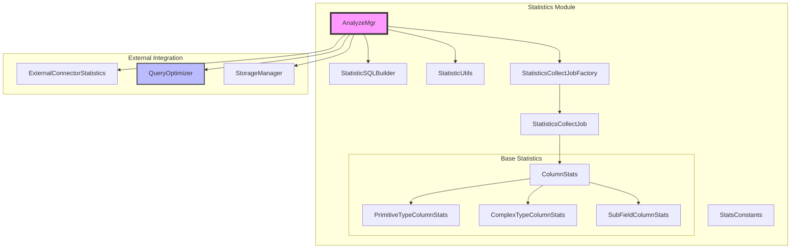
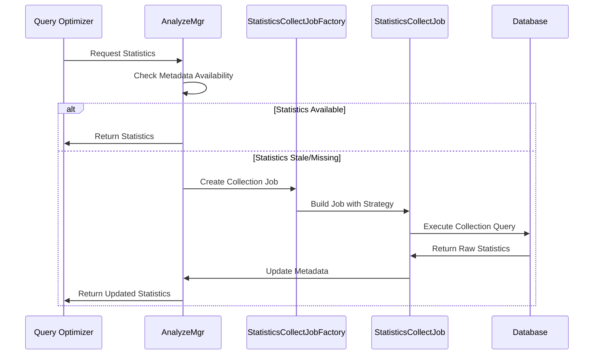

# Statistics Module Documentation

## Overview

The Statistics module is a core component of StarRocks that provides comprehensive statistical information collection, management, and utilization capabilities for query optimization. This module is responsible for gathering table and column statistics, maintaining statistical metadata, and providing statistical data to the query optimizer for cost-based optimization decisions.

## Purpose and Core Functionality

The Statistics module serves as the foundation for StarRocks' cost-based query optimization by:

- **Collecting Statistics**: Gathering statistical information about tables, columns, and partitions including row counts, distinct values, null counts, min/max values, and histograms
- **Managing Metadata**: Maintaining statistical metadata in dedicated system tables and providing APIs for access and updates
- **Supporting Query Optimization**: Providing statistical data to the query optimizer for cardinality estimation and cost calculation
- **Automated Collection**: Implementing automatic statistics collection based on table changes and update patterns
- **Multi-column Statistics**: Supporting combined statistics for multiple columns to improve join estimation accuracy

## Architecture Overview

## Core Components

### 1. AnalyzeMgr
The central management component that orchestrates all statistics collection and maintenance operations. For detailed metadata management, see [Statistics Metadata](statistics_metadata.md).

**Key Responsibilities:**
- Manage analyze jobs and their execution status
- Maintain statistical metadata for tables and columns
- Coordinate statistics collection across different table types (native, external)
- Handle statistics cleanup and expiration
- Provide APIs for statistics access and updates

**Core Features:**
- **Job Management**: Create, update, and remove analyze jobs with different scheduling types
- **Metadata Storage**: Maintain basic stats, histogram stats, and multi-column stats metadata
- **Connection Management**: Track and manage connections for running analyze tasks
- **Automatic Cleanup**: Remove statistics for dropped tables and partitions
- **Load Integration**: Update statistics based on data loading operations

### 2. StatisticSQLBuilder
Generates SQL queries for statistics collection and retrieval operations. For detailed SQL generation patterns, see [Statistics SQL Generation](statistics_sql_generation.md).

**Key Responsibilities:**
- Build SQL templates for different types of statistics collection
- Generate queries for table, partition, and column statistics
- Handle different data types and collection strategies
- Support both internal and external table statistics

**Supported Query Types:**
- Table-level statistics queries
- Partition-level statistics queries  
- Column statistics queries (sample, full, histogram)
- Multi-column combined statistics queries
- External table statistics queries

### 3. StatisticUtils
Utility class providing common functions for statistics operations. For detailed utility functions, see [Statistics Utilities](statistics_utilities.md).

**Key Responsibilities:**
- Build connection contexts for statistics collection
- Validate statistics table states and configurations
- Calculate table update times and partition health
- Support column name resolution for complex types
- Handle statistics table replication management

**Core Utilities:**
- **Connection Management**: Create specialized connections for statistics operations
- **Table Validation**: Check if statistics tables are properly configured
- **Time Calculations**: Determine table and partition update times
- **Column Processing**: Handle complex column types and subfield access
- **Sampling**: Implement partition sampling strategies for large tables

### 4. StatisticsCollectJobFactory
Factory for creating appropriate statistics collection jobs based on table characteristics and requirements. For detailed collection strategies, see [Statistics Collection](statistics_collection.md).

**Key Responsibilities:**
- Determine optimal collection strategy (sample vs full)
- Create jobs for different table types (native, external)
- Handle priority-based job scheduling
- Support both manual and automatic collection modes

**Collection Strategies:**
- **Sample Collection**: For large tables or when approximate statistics are sufficient
- **Full Collection**: For complete and accurate statistics
- **Histogram Collection**: For column distribution analysis
- **Multi-column Collection**: For combined column statistics

### 5. StatisticsCollectJob
Base class for statistics collection jobs with different implementation strategies.

**Key Features:**
- Support for different analyze types (SAMPLE, FULL, HISTOGRAM)
- Priority-based execution ordering
- Retry mechanisms for failed collections
- Integration with query execution framework
- Support for multi-column statistics collection

### 6. Base Statistics Components
Specialized components for handling different data types in statistics collection. For detailed type-specific implementations, see [Base Statistics](base_statistics.md).

**ColumnStats Hierarchy:**
- **PrimitiveTypeColumnStats**: Handles basic data types (int, string, date, etc.)
- **ComplexTypeColumnStats**: Manages complex types (arrays, maps, structs)
- **SubFieldColumnStats**: Supports nested field access in complex types

## Data Flow Architecture

## Integration with Other Modules

### Query Optimizer Integration
The Statistics module provides essential data to the [Query Optimizer](query_optimizer.md) for:
- Cardinality estimation
- Cost calculation for different execution plans
- Join ordering decisions
- Index selection

### Storage Engine Integration
Integrates with the [Storage Engine](storage_engine.md) for:
- Accessing table and partition metadata
- Retrieving data for statistics collection
- Managing statistics storage in system tables

### Connector Framework Integration
Works with the [Connector Framework](connectors.md) to:
- Collect statistics from external data sources
- Handle different table formats (Hive, Iceberg, etc.)
- Manage external table statistics lifecycle

## Configuration and Management

### Key Configuration Parameters
- `statistic_analyze_task_pool_size`: Thread pool size for statistics collection
- `statistic_collect_query_timeout`: Timeout for statistics collection queries
- `statistic_auto_collect_ratio`: Threshold for automatic collection triggering
- `statistic_sample_collect_partition_size`: Number of partitions to sample

### Statistics Tables
The module maintains several system tables in the `_statistics_` database:
- `table_statistic_v1`: Sample statistics for tables
- `column_statistics`: Full column statistics
- `external_column_statistics`: Statistics for external tables
- `histogram_statistics`: Column histogram data
- `multi_column_statistics`: Combined multi-column statistics

## Performance Considerations

### Collection Strategies
- **Incremental Collection**: Only collect statistics for changed partitions
- **Sampling**: Use statistical sampling for large tables
- **Predicate-based Collection**: Focus on columns used in query predicates
- **Resource Management**: Limit concurrent collection tasks and resource usage

### Caching and Refresh
- Statistics are cached in memory for fast access
- Automatic refresh based on table update patterns
- Manual refresh capabilities for immediate updates
- Expiration policies for stale statistics

## Error Handling and Reliability

### Retry Mechanisms
- Automatic retry for transient failures
- Exponential backoff for repeated failures
- Configurable retry limits and timeouts

### Fallback Strategies
- Use basic metadata when detailed statistics are unavailable
- Employ heuristics for cardinality estimation
- Graceful degradation when statistics collection fails

## Monitoring and Observability

### Metrics and Logging
- Collection job success/failure rates
- Statistics staleness metrics
- Resource usage during collection
- Query performance impact metrics

### Administrative Interfaces
- System tables for statistics metadata inspection
- Administrative commands for manual collection
- Status monitoring for ongoing collection jobs

## Future Enhancements

### Planned Improvements
- Machine learning-based statistics estimation
- Adaptive sampling strategies
- Real-time statistics updates
- Enhanced multi-column statistics
- Integration with cloud storage optimizations

This documentation provides a comprehensive overview of the Statistics module. For detailed information about specific sub-modules, refer to their individual documentation files.