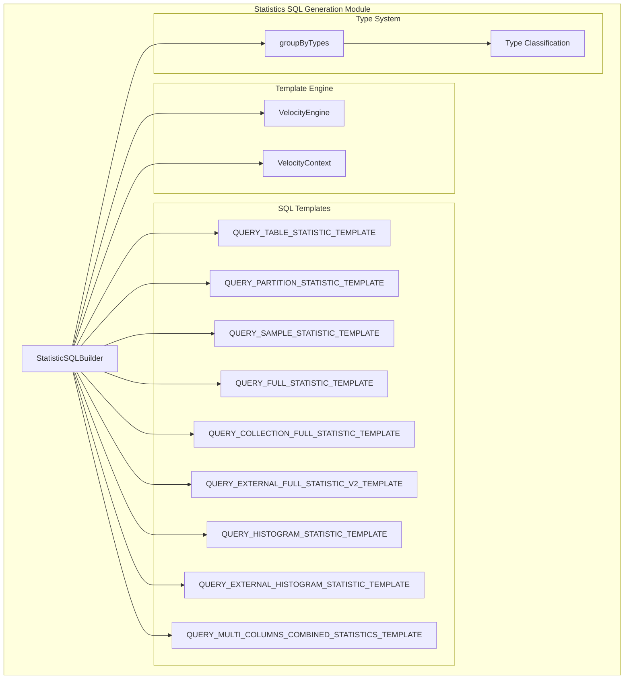
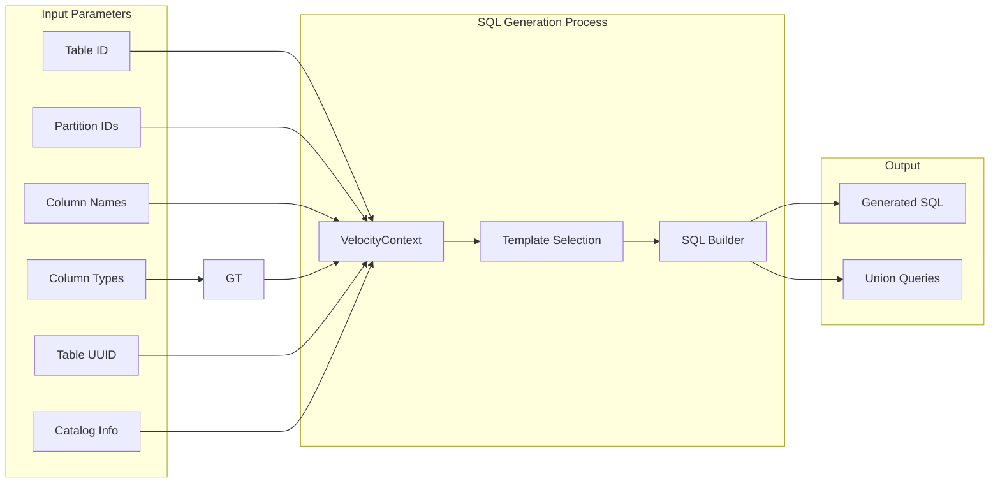
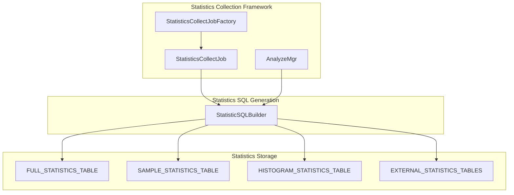
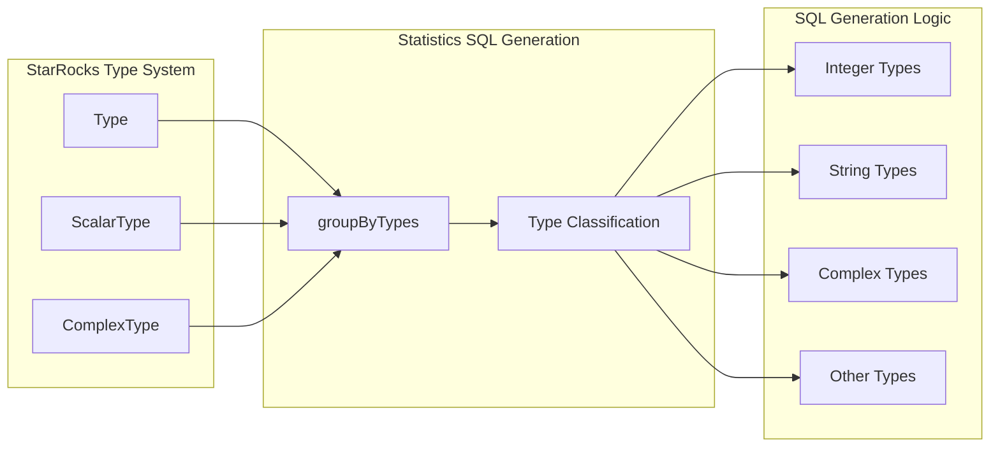
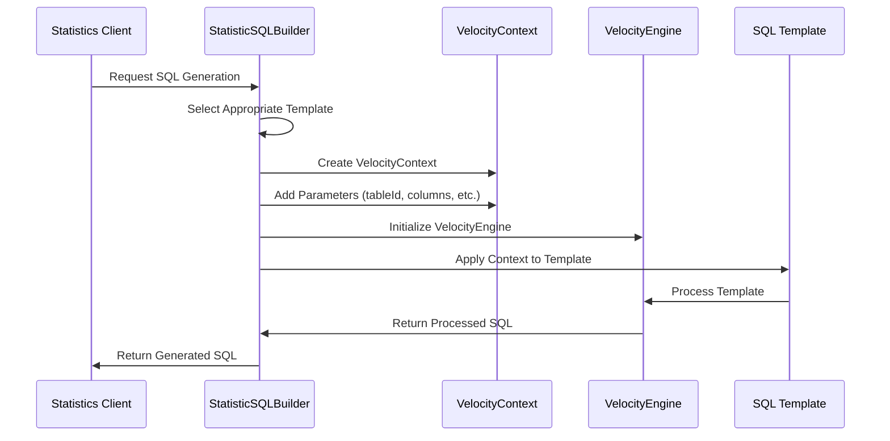
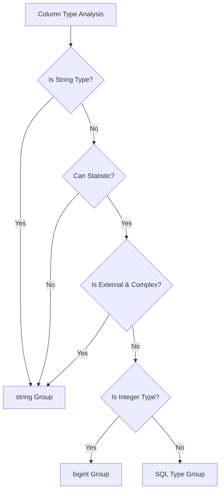

# Statistics SQL Generation Module

## Introduction

The Statistics SQL Generation module is a critical component of StarRocks' statistics management system, responsible for dynamically generating SQL queries used to collect, retrieve, and manage table and column statistics. This module serves as the bridge between the statistics collection framework and the underlying database operations, providing templated SQL generation capabilities that support various types of statistical analysis including full statistics, sample statistics, histograms, and multi-column combined statistics.

## Core Functionality

The module's primary responsibility is to generate optimized SQL queries for statistics operations across different storage layers (internal tables and external tables) and statistical types. It leverages Apache Velocity templating engine to create dynamic SQL statements that can adapt to different table structures, data types, and analysis requirements.

### Key Capabilities

- **Multi-type Statistics Support**: Generates SQL for full statistics, sample statistics, histograms, and multi-column combined statistics
- **Storage Layer Abstraction**: Handles both internal StarRocks tables and external tables (Hive, Iceberg, etc.)
- **Type-aware Query Generation**: Adapts SQL generation based on column data types for optimal performance
- **Template-based Architecture**: Uses Velocity templates for maintainable and flexible SQL generation
- **Predicate Optimization**: Builds efficient WHERE clauses for targeted statistics retrieval

## Architecture

### Component Structure

### Data Flow Architecture

## Component Relationships

### Integration with Statistics Framework

### Type System Integration

## SQL Template System

### Template Categories

The module employs a comprehensive template system with specialized templates for different statistical operations:

#### Table-level Statistics Templates
- **QUERY_TABLE_STATISTIC_TEMPLATE**: Retrieves basic table statistics (row counts) by partition
- **QUERY_PARTITION_STATISTIC_TEMPLATE**: Gathers partition-level column statistics with HLL cardinality calculations

#### Column-level Statistics Templates
- **QUERY_SAMPLE_STATISTIC_TEMPLATE**: Retrieves sample-based column statistics
- **QUERY_FULL_STATISTIC_TEMPLATE**: Generates comprehensive full statistics queries with aggregation
- **QUERY_COLLECTION_FULL_STATISTIC_TEMPLATE**: Specialized template for collection types (arrays, maps)

#### External Table Templates
- **QUERY_EXTERNAL_FULL_STATISTIC_V2_TEMPLATE**: Handles external table statistics with UUID-based identification

#### Histogram Templates
- **QUERY_HISTOGRAM_STATISTIC_TEMPLATE**: Retrieves histogram data for internal tables
- **QUERY_EXTERNAL_HISTOGRAM_STATISTIC_TEMPLATE**: Handles histogram data for external tables

#### Multi-column Statistics Template
- **QUERY_MULTI_COLUMNS_COMBINED_STATISTICS_TEMPLATE**: Generates queries for multi-column combined statistics

### Template Processing Flow

## Type-aware Query Generation

### Type Classification System

The module implements sophisticated type-aware query generation through the `groupByTypes` method, which classifies columns based on their data types:

### Type-based Optimization

The type classification enables several optimizations:

- **Integer Types**: Uses `bigint` for efficient numeric operations
- **String Types**: Applies string-specific functions and comparisons
- **Complex Types**: Handles arrays, maps, and JSON with specialized templates
- **External Tables**: Adapts queries for external storage characteristics

## External Table Support

### External Statistics Management

The module provides comprehensive support for external tables through:

- **UUID-based Identification**: Uses table UUIDs for external table identification
- **Catalog-aware Queries**: Incorporates catalog, database, and table name information
- **Type Adaptation**: Handles external table type mappings and conversions
- **Cross-platform Compatibility**: Supports various external storage systems (Hive, Iceberg, etc.)

### External Query Templates

External table queries are optimized for:
- **Performance**: Minimizes data transfer and processing overhead
- **Accuracy**: Maintains statistical accuracy across different storage systems
- **Consistency**: Ensures consistent statistical representation across platforms

## Integration Points

### Statistics Collection Integration

The module integrates with the broader statistics collection framework:

- **StatisticsCollectJobFactory**: Provides SQL generation for collection jobs
- **AnalyzeMgr**: Supports analysis operations with appropriate SQL queries
- **Statistics Utilities**: Works with [statistic_utils.md](statistic_utils.md) for statistical calculations

### Storage Layer Integration

Integration with storage components:
- **Internal Tables**: Direct access to StarRocks internal statistics tables
- **External Tables**: Coordinates with connector framework for external statistics
- **Metadata Management**: Works with [statistics_metadata.md](statistics_metadata.md) for metadata operations

## Performance Considerations

### Query Optimization Strategies

1. **Predicate Pushdown**: Generates efficient WHERE clauses to minimize data scanning
2. **Aggregation Optimization**: Uses appropriate aggregation functions (HLL for cardinality)
3. **Union All Strategy**: Combines multiple queries efficiently for different data types
4. **Template Caching**: Reuses compiled templates for better performance

### Scalability Features

- **Batch Processing**: Supports batch operations for multiple tables/partitions
- **Parallel Execution**: Enables parallel statistics collection through query design
- **Memory Efficiency**: Optimizes queries for minimal memory footprint
- **Incremental Updates**: Supports incremental statistics updates

## Error Handling and Validation

### Input Validation

The module implements comprehensive input validation:
- **Parameter Validation**: Validates table IDs, column names, and partition information
- **Type Checking**: Ensures type compatibility between columns and operations
- **Template Validation**: Validates template parameters before execution

### Error Recovery

- **Graceful Degradation**: Falls back to alternative query strategies when needed
- **Logging Integration**: Provides detailed logging for debugging and monitoring
- **Exception Handling**: Handles database and template processing exceptions

## Usage Patterns

### Common Use Cases

1. **Full Statistics Collection**: Generating comprehensive statistics for query optimization
2. **Sample Statistics**: Creating lightweight statistical summaries for large tables
3. **Histogram Generation**: Building distribution histograms for better cardinality estimation
4. **Multi-column Analysis**: Analyzing column correlations and combined statistics
5. **External Table Statistics**: Managing statistics for federated query scenarios

### API Usage Examples

The module provides static methods for different statistical operations:

- **Table Statistics**: `buildQueryTableStatisticsSQL(tableId, partitionIds)`
- **Column Statistics**: `buildQueryFullStatisticsSQL(tableId, columnNames, columnTypes)`
- **External Statistics**: `buildQueryExternalFullStatisticsSQL(tableUUID, columnNames, columnTypes)`
- **Histogram Queries**: `buildQueryHistogramStatisticsSQL(tableId, columnNames)`

## Future Enhancements

### Potential Improvements

1. **Machine Learning Integration**: Incorporating ML-based statistics prediction
2. **Real-time Statistics**: Supporting streaming statistics updates
3. **Advanced Analytics**: Adding more sophisticated statistical functions
4. **Cross-platform Optimization**: Enhanced optimization for diverse storage systems
5. **Automated Tuning**: Self-tuning statistics collection based on query patterns

### Extension Points

The template-based architecture allows for easy extension:
- **New Template Types**: Adding templates for new statistical operations
- **Custom Type Handlers**: Extending type classification and handling
- **External System Integration**: Adding support for new external storage systems
- **Performance Optimizations**: Implementing query-specific optimizations

## Related Documentation

- [Statistics Collection](statistics_collection.md) - Overview of statistics collection framework
- [Statistics Metadata](statistics_metadata.md) - Metadata management for statistics
- [Statistics Utilities](statistic_utils.md) - Utility functions for statistical operations
- [Connector Framework](connector_framework.md) - External table integration
- [Type System](type_system.md) - Data type handling and classification